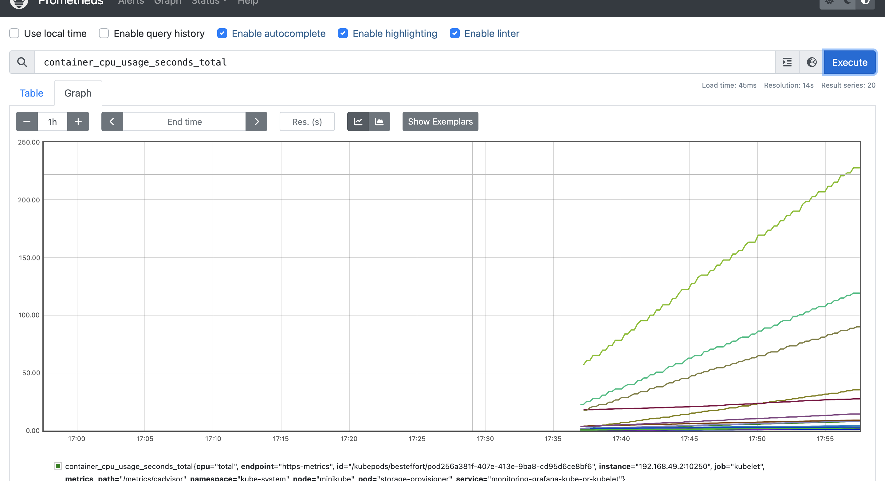
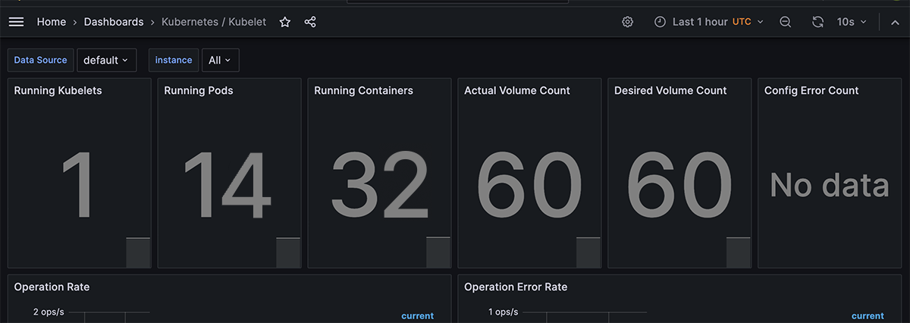
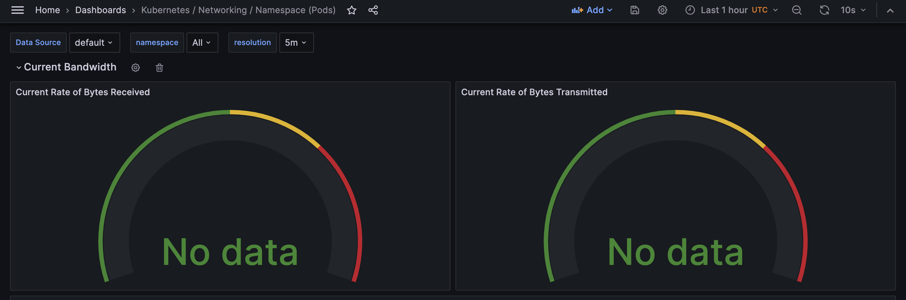
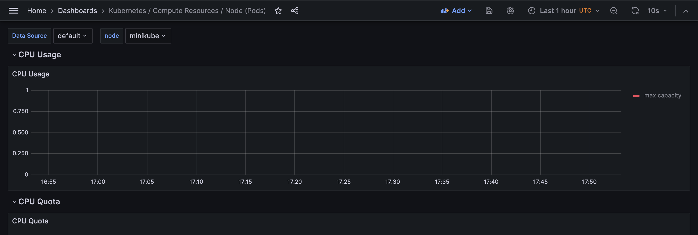
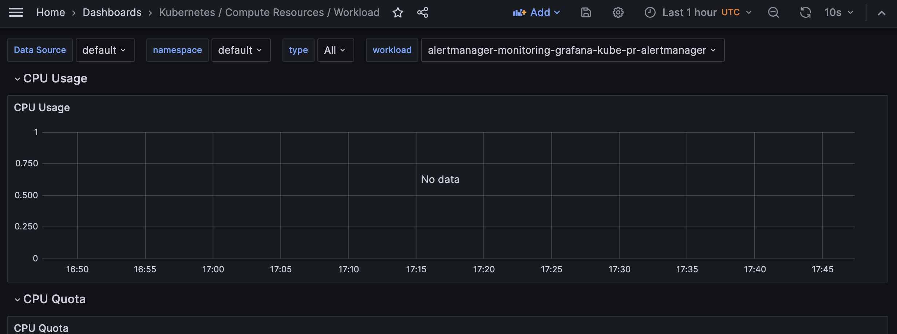

# Kubernetes Monitoring and Init Containers

## Task 1

### Describe Components

The Kube Prometheus Stack is a collection of tools and components used for monitoring and observability in Kubernetes 
environments. It enables administrators and developers to gain insights into the performance, health, and resource 
utilization:

* Prometheus: Open-source monitoring system that collects and stores time-series data from Kubernetes targets.
* Alertmanager: Manages and dispatches alerts generated by Prometheus, applying rules for deduplication and routing.
* Grafana: Visualization and dashboarding tool that connects to Prometheus as a data source for creating customizable dashboards.
* kube-state-metrics: Exposes Kubernetes-specific metrics related to the state of objects like pods, deployments, and services.
* node-exporter: Prometheus exporter for collecting system-level metrics from Kubernetes nodes.
* kubelet: Manages nodes and containers in Kubernetes, exposing metrics for container monitoring.
* Prometheus Operator: Kubernetes operator that simplifies the deployment and configuration of Prometheus and related components.

`helm repo add prometheus-community https://prometheus-community.github.io/helm-charts`

### Install Helm Charts

`helm install kube-prometheus-stack prometheus-community/kube-prometheus-stack`

```
NAME: kube-prometheus-stack
LAST DEPLOYED: Wed Dec  6 06:02:17 2023
NAMESPACE: default
STATUS: deployed
REVISION: 1
NOTES:
kube-prometheus-stack has been installed. Check its status by running:
  kubectl --namespace default get pods -l "release=kube-prometheus-stack"

Visit https://github.com/prometheus-operator/kube-prometheus for instructions on how to create & configure Alertmanager and Prometheus instances using the Operator.
```

`helm install app . --values values.yaml`

`kubectl get po,sts,svc,pvc,cm`

```
pod/alertmanager-kube-prometheus-stack-alertmanager-0           2/2     Running    2 (3m42s ago)   18m
pod/kube-prometheus-stack-grafana-56bf765f49-m5fxn              3/3     Running    0               18m
pod/kube-prometheus-stack-kube-state-metrics-5c68dd7f45-pd64z   1/1     Running    3 (9m49s ago)   18m
pod/kube-prometheus-stack-operator-7db8f987bb-sx52d             1/1     Running    0               18m
pod/kube-prometheus-stack-prometheus-node-exporter-8p5p4        1/1     Running    3 (3m41s ago)   18m
pod/prometheus-kube-prometheus-stack-prometheus-0               2/2     Running    2 (16s ago)     18m
pod/python-helm-python-0                                        0/2     Init:0/1   1               6d23h
pod/vault-0                                                     1/1     Running    3 (43m ago)     20d
pod/vault-agent-injector-5cd8b87c6c-f85fb                       1/1     Running    7 (3m42s ago)   20d

NAME                                                               READY   AGE
statefulset.apps/alertmanager-kube-prometheus-stack-alertmanager   1/1     18m
statefulset.apps/prometheus-kube-prometheus-stack-prometheus       1/1     18m
statefulset.apps/python-helm-python                                0/1     6d23h
statefulset.apps/vault                                             1/1     20d

NAME                                                     TYPE        CLUSTER-IP       EXTERNAL-IP   PORT(S)                      AGE
service/alertmanager-operated                            ClusterIP   None             <none>        9093/TCP,9094/TCP,9094/UDP   18m
service/kube-prometheus-stack-alertmanager               ClusterIP   10.109.89.130    <none>        9093/TCP,8080/TCP            18m
service/kube-prometheus-stack-grafana                    ClusterIP   10.102.71.106    <none>        80/TCP                       18m
service/kube-prometheus-stack-kube-state-metrics         ClusterIP   10.96.23.64      <none>        8080/TCP                     18m
service/kube-prometheus-stack-operator                   ClusterIP   10.105.94.255    <none>        443/TCP                      18m
service/kube-prometheus-stack-prometheus                 ClusterIP   10.108.218.131   <none>        9090/TCP,8080/TCP            18m
service/kube-prometheus-stack-prometheus-node-exporter   ClusterIP   10.104.7.125     <none>        9100/TCP                     18m
service/kubernetes                                       ClusterIP   10.96.0.1        <none>        443/TCP                      27d
service/prometheus-operated                              ClusterIP   None             <none>        9090/TCP                     18m
service/python-helm-python                               ClusterIP   10.98.192.232    <none>        5000/TCP                     20d
service/vault                                            ClusterIP   10.109.86.202    <none>        8200/TCP,8201/TCP            20d
service/vault-agent-injector-svc                         ClusterIP   10.108.173.66    <none>        443/TCP                      20d
service/vault-internal                                   ClusterIP   None             <none>        8200/TCP,8201/TCP            20d

NAME                                                                STATUS   VOLUME                                     CAPACITY   ACCESS MODES   STORAGECLASS   AGE
persistentvolumeclaim/python-stateful-volume-python-helm-python-0   Bound    pvc-e4ac0317-5bd5-4802-8948-d6db05a9d70a   50Mi       RWO            standard       6d23h

NAME                                                                DATA   AGE
configmap/configmap                                                 1      6d23h
configmap/env-configmap                                             1      6d23h
configmap/kube-prometheus-stack-alertmanager-overview               1      18m
configmap/kube-prometheus-stack-apiserver                           1      18m
configmap/kube-prometheus-stack-cluster-total                       1      18m
configmap/kube-prometheus-stack-controller-manager                  1      18m
configmap/kube-prometheus-stack-etcd                                1      18m
configmap/kube-prometheus-stack-grafana                             1      18m
configmap/kube-prometheus-stack-grafana-config-dashboards           1      18m
configmap/kube-prometheus-stack-grafana-datasource                  1      18m
configmap/kube-prometheus-stack-grafana-overview                    1      18m
configmap/kube-prometheus-stack-k8s-coredns                         1      18m
configmap/kube-prometheus-stack-k8s-resources-cluster               1      18m
configmap/kube-prometheus-stack-k8s-resources-multicluster          1      18m
configmap/kube-prometheus-stack-k8s-resources-namespace             1      18m
configmap/kube-prometheus-stack-k8s-resources-node                  1      18m
configmap/kube-prometheus-stack-k8s-resources-pod                   1      18m
configmap/kube-prometheus-stack-k8s-resources-workload              1      18m
configmap/kube-prometheus-stack-k8s-resources-workloads-namespace   1      18m
configmap/kube-prometheus-stack-kubelet                             1      18m
configmap/kube-prometheus-stack-namespace-by-pod                    1      18m
configmap/kube-prometheus-stack-namespace-by-workload               1      18m
configmap/kube-prometheus-stack-node-cluster-rsrc-use               1      18m
configmap/kube-prometheus-stack-node-rsrc-use                       1      18m
configmap/kube-prometheus-stack-nodes                               1      18m
configmap/kube-prometheus-stack-nodes-darwin                        1      18m
configmap/kube-prometheus-stack-persistentvolumesusage              1      18m
configmap/kube-prometheus-stack-pod-total                           1      18m
configmap/kube-prometheus-stack-prometheus                          1      18m
configmap/kube-prometheus-stack-proxy                               1      18m
configmap/kube-prometheus-stack-scheduler                           1      18m
configmap/kube-prometheus-stack-workload-total                      1      18m
configmap/kube-root-ca.crt                                          1      34d
configmap/prometheus-kube-prometheus-stack-prometheus-rulefiles-0   34     18m
```

Pods: 
- AlertManager - `pod/alertmanager-kube-prometheus-stack-alertmanager-0`
- Grafana - `pod/kube-prometheus-stack-grafana-56bf765f49-m5fxn`
- Prometheus Operator - `pod/kube-prometheus-stack-operator-7db8f987bb-sx52d`
- kube-state-metrics - `pod/kube-prometheus-stack-kube-state-metrics-5c68dd7f45-pd64z`
- node-exporter - `pod/kube-prometheus-stack-prometheus-node-exporter-8p5p4`
- Prometheus - `pod/prometheus-kube-prometheus-stack-prometheus-0`

StatefulSets (improve reliability):
- AlertManager - `statefulset.apps/alertmanager-kube-prometheus-stack-alertmanager`
- Prometheus - `statefulset.apps/prometheus-kube-prometheus-stack-prometheus`

Services listed above represent the components used in the stack.

Configmaps manage the internal processes of the kube-prometheus-stack.

### Screenshots









## Task 2

Multiple init containers were implemented for downloading the html page.

`kubectl logs python-helm-python-0 -c install -f`

```
Connecting to info.cern.ch (188.184.100.182:80)
index.html           100% |*******************************|   646   0:00:00 ETA
```

`kubectl exec -it python-helm-python-0  -- cat /init-files/index-0.html`

```
<html><head></head><body><header>
<title>http://info.cern.ch</title>
</header>
<h1>http://info.cern.ch - home of the first website</h1>
<p>From here you can:</p>
<ul>
<li><a href="http://info.cern.ch/hypertext/WWW/TheProject.html">Browse the first website</a></li>
<li><a href="http://line-mode.cern.ch/www/hypertext/WWW/TheProject.html">Browse the first website using the line-mode browser simulator</a></li>
<li><a href="http://home.web.cern.ch/topics/birth-web">Learn about the birth of the web</a></li>
<li><a href="http://home.web.cern.ch/about">Learn about CERN, the physics laboratory where the web was born</a></li>
</ul>
</body></html>
```