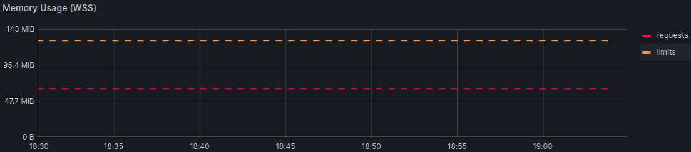
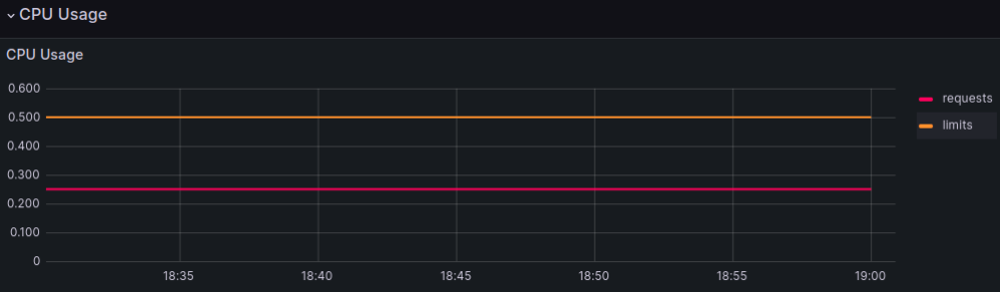
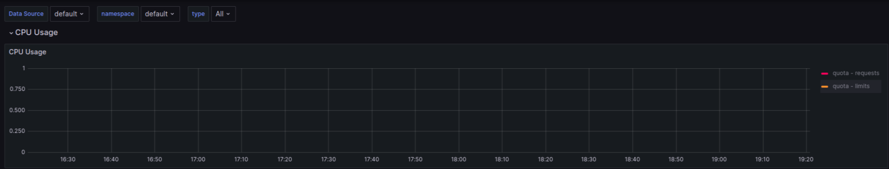
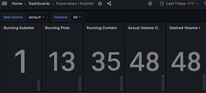
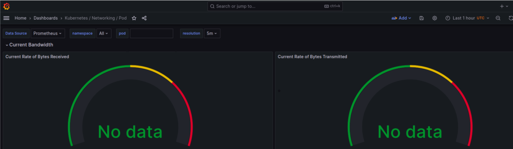
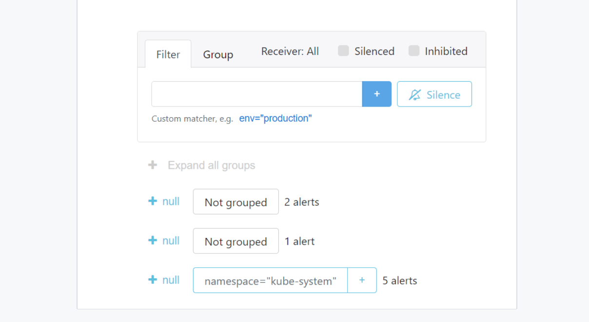

## Components description

- **The Prometheus Operator** simplifies the setup of a monitoring stack for Kubernetes clusters.
- **The Prometheus** maintains a time series database with metrics and allows event monitoring and alerting.
- **Alertmanager** sends notifications in case of fulfillment or non-fulfillment of the conditions set by the configuration.
- **Prometheus node-exporter** collects metrics of the server's operating system.
- **Prometheus Adapter for Kubernetes Metrics APIs** complements Kubernetes Custom Metrics API with metrics provided by Prometheus.
- **kube-state-metrics** listens to the Kubernetes API and generates metrics about the state of objects such as jobs and pods.
- **Grafana** allows to create dashboards with panels, each of which displays certain parameters for a set period of time.

## Helm chart installation

Output of the command: ```kubectl get po```

```
NAME                                                         READY   STATUS    RESTARTS   AGE
pod/alertmanager-monitoring-kube-prometheus-alertmanager-0   2/2     Running   0          10m
pod/monitoring-grafana-8hdj2812d-xu73h                       3/3     Running   0          10m
pod/monitoring-kube-prometheus-operator-p0eld94ks-p18ze      1/1     Running   0          11m
pod/monitoring-kube-state-metrics-e7sj1op2i1-dkw95           1/1     Running   0          11m
pod/monitoring-prometheus-node-exporter-i2lz7                1/1     Running   0          11m
pod/my-app-0                                                 1/1     Running   0          4m24s
pod/my-app-1                                                 1/1     Running   0          4m29s
pod/my-app-2                                                 1/1     Running   0          4m35s
pod/prometheus-monitoring-kube-prometheus-prometheus-0       2/2     Running   0          11m
```

Explanation:
- `pod/alertmanager-monitoring-kube-prometheus-alertmanager-0`

    pod with alertmanager in 2 replicas

- `pod/monitoring-grafana-8hdj2812d-xu73h`
    
    pod with graphana in 3 replicas

- `pod/monitoring-kube-prometheus-operator-p0eld94ks-p18ze`
    
    pod with prometheus operator

- `pod/monitoring-kube-state-metrics-e7sj1op2i1-dkw95`

    pod with kube-state-metrics

- `pod/monitoring-prometheus-node-exporter-i2lz7 `

    pod with prometheus node exporter

- `pod/my-app-0`
  `pod/my-app-1` 
  `pod/my-app-2`
  
    pods with my app

- `pod/prometheus-monitoring-kube-prometheus-prometheus-0`

    pod with prometheus in 2 replicas


Output of the command ```kubectl get sts```

```
NAME                                                                    READY   AGE
statefulset.apps/alertmanager-monitoring-kube-prometheus-alertmanager   1/1     4m02s
statefulset.apps/my-app                                                 3/3     7m12s
statefulset.apps/prometheus-monitoring-kube-prometheus-prometheus       1/1     4m03s
```

Explanation 

- `statefulset.apps/alertmanager-monitoring-kube-prometheus-alertmanager`

    Stateful set of alertmanager

- `statefulset.apps/my-app`

    Stateful set of my app with 3 replicas

- `statefulset.apps/prometheus-monitoring-kube-prometheus-prometheus`

    Stateful set of prometheus

Output of the command ```kubectl get svc```

```
NAME                                              TYPE        CLUSTER-IP       EXTERNAL-IP   PORT(S)                      AGE
service/alertmanager-operated                     ClusterIP   None             <none>        9093/TCP,9094/TCP,9094/UDP   2m54s
service/kubernetes                                ClusterIP   10.96.0.1        <none>        443/TCP                      17m
service/monitoring-grafana                        ClusterIP   10.108.70.104    <none>        80/TCP                       3m53s
service/monitoring-kube-prometheus-alertmanager   ClusterIP   10.109.211.65    <none>        9093/TCP,8080/TCP            3m53s
service/monitoring-kube-prometheus-operator       ClusterIP   10.110.173.67    <none>        443/TCP                      3m53s
service/monitoring-kube-prometheus-prometheus     ClusterIP   10.96.234.19     <none>        9090/TCP,8080/TCP            3m53s
service/monitoring-kube-state-metrics             ClusterIP   10.103.156.149   <none>        8080/TCP                     3m53s
service/monitoring-prometheus-node-exporter       ClusterIP   10.105.218.103   <none>        9100/TCP                     3m53s
service/my-app                                    NodePort    10.109.143.125   <pending>     5000:30637/TCP               5m58s
service/prometheus-operated                       ClusterIP   None             <none>        9090/TCP                     3m17s
```

Explanation

Services include prometheus stack, kubernetes and my application

Output of the command ```kubectl get cm```

```
NAME                                                                     DATA   AGE
configmap/kube-root-ca.crt                                               1      5m12s
configmap/monitoring-grafana                                             1      4m28s
configmap/monitoring-grafana-config-dashboards                           1      4m28s
configmap/monitoring-kube-prometheus-alertmanager-overview               1      4m28s
configmap/monitoring-kube-prometheus-apiserver                           1      4m28s
configmap/monitoring-kube-prometheus-cluster-total                       1      4m28s
configmap/monitoring-kube-prometheus-controller-manager                  1      4m28s
configmap/monitoring-kube-prometheus-etcd                                1      4m28s
configmap/monitoring-kube-prometheus-grafana-datasource                  1      4m28s
configmap/monitoring-kube-prometheus-grafana-overview                    1      4m28s
configmap/monitoring-kube-prometheus-k8s-coredns                         1      4m28s
configmap/monitoring-kube-prometheus-k8s-resources-cluster               1      4m28s
configmap/monitoring-kube-prometheus-k8s-resources-multicluster          1      4m28s
configmap/monitoring-kube-prometheus-k8s-resources-namespace             1      4m28s
configmap/monitoring-kube-prometheus-k8s-resources-node                  1      4m28s
configmap/monitoring-kube-prometheus-k8s-resources-pod                   1      4m28s
configmap/monitoring-kube-prometheus-k8s-resources-workload              1      4m28s
configmap/monitoring-kube-prometheus-k8s-resources-workloads-namespace   1      4m28s
configmap/monitoring-kube-prometheus-kubelet                             1      4m28s
configmap/monitoring-kube-prometheus-namespace-by-pod                    1      4m28s
configmap/monitoring-kube-prometheus-namespace-by-workload               1      4m28s
configmap/monitoring-kube-prometheus-node-cluster-rsrc-use               1      4m28s
configmap/monitoring-kube-prometheus-node-rsrc-use                       1      4m28s
configmap/monitoring-kube-prometheus-nodes                               1      4m28s
configmap/monitoring-kube-prometheus-nodes-darwin                        1      4m28s
configmap/monitoring-kube-prometheus-persistentvolumesusage              1      4m28s
configmap/monitoring-kube-prometheus-pod-total                           1      4m28s
configmap/monitoring-kube-prometheus-prometheus                          1      4m28s
configmap/monitoring-kube-prometheus-proxy                               1      4m28s
configmap/monitoring-kube-prometheus-scheduler                           1      4m28s
configmap/monitoring-kube-prometheus-workload-total                      1      4m28s
configmap/prometheus-monitoring-kube-prometheus-prometheus-rulefiles-0   34     4m09s
```

Explanation:

Configmaps that correspond to prometheus stack

## Grafana information

- Memory consumption



- CPU consumption



- Pods with higher and lower CPU usage



- Number of pods and containers



- Network



- The number of active alerts

  
## Init container
The output of the command
```
kubectl exec pod/init-demo -- cat /usr/share/nginx/html/index.html
```

```
Defaulted container "nginx" out of: nginx, install (init)
<html><head></head><body><header>
<title>http://info.cern.ch</title>
</header>

<h1>http://info.cern.ch - home of the first website</h1>
<p>From here you can:</p>
<ul>
<li><a href="http://info.cern.ch/hypertext/WWW/TheProject.html">Browse the first website</a></li>
<li><a href="http://line-mode.cern.ch/www/hypertext/WWW/TheProject.html">Browse the first website using the line-mode browser simulator</a></li>
<li><a href="http://home.web.cern.ch/topics/birth-web">Learn about the birth of the web</a></li>
<li><a href="http://home.web.cern.ch/about">Learn about CERN, the physics laboratory where the web was born</a></li>
</ul>
</body></html>
```