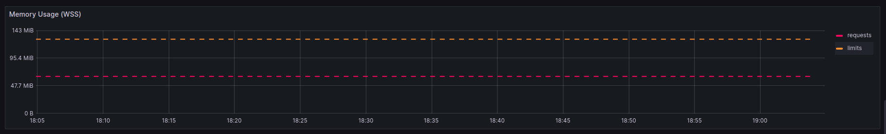
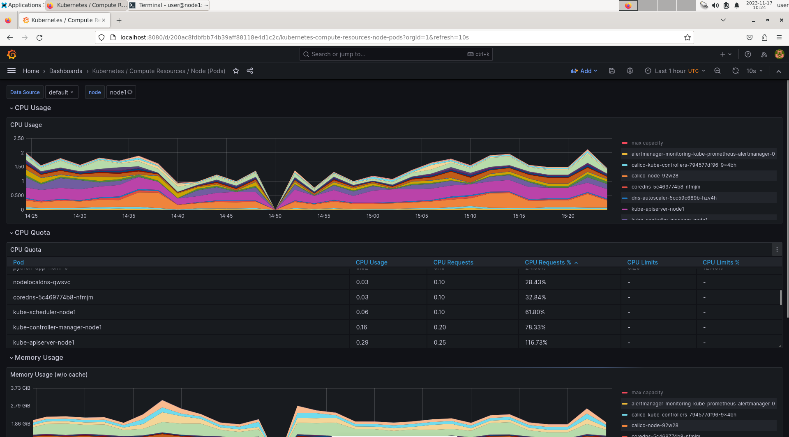
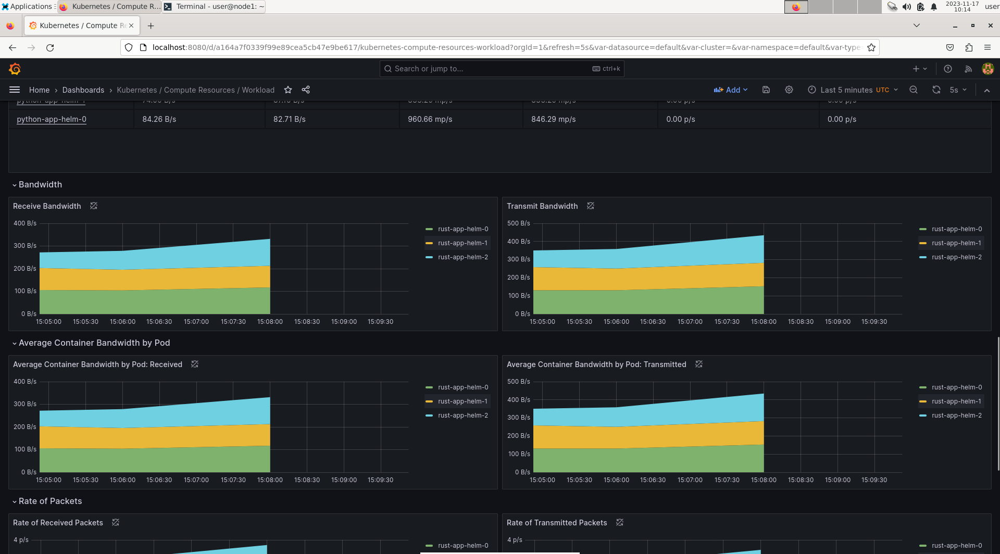
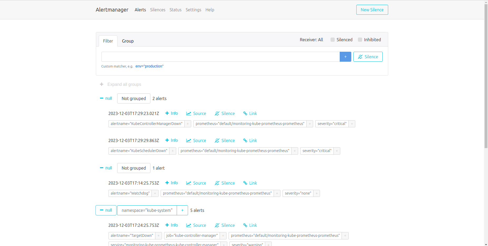

# Kubernetes Monitoring and Init Containers

## Task 1

### Overview of kube-prometheus-stack

1. Prometheus: Prometheus is a free monitoring system. It uses a unique way of organizing data, a flexible language for asking questions, a speedy database for tracking time-related data, and a modern approach to sending alerts.

2. Grafana: Grafana is a well-liked free tool for analyzing and visualizing data on the web. When connected to supported sources like Prometheus, it displays information through charts, graphs, and alerts.

3. Alertmanager: Alertmanager is a part of Prometheus that manages alerts from applications like the Prometheus server. It makes sure alerts are handled properly by removing duplicates, grouping them, and sending them to the right channels like email, PagerDuty, or OpsGenie.

4. Kube State Metrics: This service is crucial for gathering metrics about the state of a cluster. It gets this information from the Kubernetes API server.

5. Prometheus Operator: The Prometheus Operator makes it easier to set up and customize Prometheus, Alertmanager, and other monitoring tools.


### Deploying

```bash
>>> helm install mon prometheus-community/kube-prometheus-stack
NAME: mon
LAST DEPLOYED: Fri Dec  1 19:01:34 2023
NAMESPACE: default
STATUS: deployed
REVISION: 1
NOTES:
kube-prometheus-stack has been installed. Check its status by running:
  kubectl --namespace default get pods -l "release=mon"

Visit https://github.com/prometheus-operator/kube-prometheus for instructions on how to create & configure Alertmanager and Prometheus instances using the Operator.
```

```bash
kubectl get po,sts,svc,pvc,cm
NAME                                                         READY   STATUS    RESTARTS      AGE
pod/alertmanager-mon-kube-prometheus-stack-alertmanager-0    2/2     Running   0             3m45s
pod/mon-grafana-699fc8c54d-8ntxn                             3/3     Running   0             4m13s
pod/mon-kube-prometheus-stack-operator-866c6c5ddb-k8zbc      1/1     Running   0             4m13s
pod/mon-kube-state-metrics-7664788db5-mgpnl                  1/1     Running   0             4m13s
pod/mon-prometheus-node-exporter-wkk25                       1/1     Running   0             4m13s
pod/prometheus-mon-kube-prometheus-stack-prometheus-0        2/2     Running   0             3m44s
pod/python-helm-app-0                                        1/1     Running   0             5m
pod/python-helm-app-1                                        1/1     Running   0             5m
pod/python-helm-app-2                                        1/1     Running   0             5m
pod/typescript-helm-app-0                                    1/1     Running   0             6m
pod/typescript-helm-app-1                                    1/1     Running   0             6m
pod/typescript-helm-app-2                                    1/1     Running   0             6m

NAME                                                                    READY   AGE
statefulset.apps/alertmanager-mon-kube-prometheus-stack-alertmanager    1/1     3m45s
statefulset.apps/prometheus-mon-kube-prometheus-stack-prometheus        1/1     3m44s
statefulset.apps/python-helm-app                                        3/3     5m
statefulset.apps/rust-helm-app                                          3/3     6m

NAME                                              TYPE           CLUSTER-IP       EXTERNAL-IP   PORT(S)                      AGE
service/alertmanager-operated                     ClusterIP      None             <none>        9093/TCP,9094/TCP,9094/UDP   3m45s
service/kubernetes                                ClusterIP      10.96.0.1        <none>        443/TCP                      17m
service/mon-grafana                               ClusterIP      10.98.133.157    <none>        80/TCP                       4m13s
service/mon-kube-prometheus-stack-alertmanager    ClusterIP      10.109.51.233    <none>        9093/TCP,8080/TCP            4m13s
service/mon-kube-prometheus-stack-operator        ClusterIP      10.104.3.232     <none>        443/TCP                      4m13s
service/mon-kube-prometheus-stack-prometheus      ClusterIP      10.110.84.8      <none>        9090/TCP,8080/TCP            4m13s
service/mon-kube-state-metrics                    ClusterIP      10.101.77.10     <none>        8080/TCP                     4m13s
service/mon-prometheus-node-exporter              ClusterIP      10.107.39.40     <none>        9100/TCP                     4m13s
service/prometheus-operated                       ClusterIP      None             <none>        9090/TCP                     3m44s
service/python-helm-app                           LoadBalancer   10.103.132.246   <pending>     8080:31410/TCP               8m
service/typescript-helm-app                       LoadBalancer   10.108.183.129   <pending>     8080:30073/TCP               9m

NAME                                                                STATUS   VOLUME                                     CAPACITY   ACCESS MODES   STORAGECLASS   AGE
persistentvolumeclaim/visits-python-python-helm-app-0               Bound    pvc-ab34d4d5-2f78-4930-b271-3ef9d0c0d5ed   1Mi        RWO            standard       8m
persistentvolumeclaim/visits-python-python-helm-app-1               Bound    pvc-2e3e0880-d2f7-47e5-89d6-818fb3b7b618   1Mi        RWO            standard       8m
persistentvolumeclaim/visits-python-python-helm-app-2               Bound    pvc-23e51f90-0749-46d2-ab78-8be6459ccbed   1Mi        RWO            standard       8m
persistentvolumeclaim/visits-typescript-typescript-helm-app-0       Bound    pvc-a419d488-bc8a-419a-8591-923881a85b96   1Mi        RWO            standard       9m
persistentvolumeclaim/visits-typescript-typescript-helm-app-1       Bound    pvc-f394d50b-b074-4a9c-82ec-999a096bebc0   1Mi        RWO            standard       9m
persistentvolumeclaim/visits-typescript-typescript-helm-app-2       Bound    pvc-cae31292-d7a0-4bc2-9145-d8df8ed8ad26   1Mi        RWO            standard       9m

NAME                                                                    DATA   AGE
configmap/kube-root-ca.crt                                              1      17m
configmap/mon-grafana                                                   1      4m13s
configmap/mon-grafana-config-dashboards                                 1      4m13s
configmap/mon-kube-prometheus-stack-alertmanager-overview               1      4m13s
configmap/mon-kube-prometheus-stack-apiserver                           1      4m13s
configmap/mon-kube-prometheus-stack-cluster-total                       1      4m13s
configmap/mon-kube-prometheus-stack-controller-manager                  1      4m13s
configmap/mon-kube-prometheus-stack-etcd                                1      4m13s
configmap/mon-kube-prometheus-stack-grafana-datasource                  1      4m13s
configmap/mon-kube-prometheus-stack-grafana-overview                    1      4m13s
configmap/mon-kube-prometheus-stack-k8s-coredns                         1      4m13s
configmap/mon-kube-prometheus-stack-k8s-resources-cluster               1      4m13s
configmap/mon-kube-prometheus-stack-k8s-resources-multicluster          1      4m13s
configmap/mon-kube-prometheus-stack-k8s-resources-namespace             1      4m13s
configmap/mon-kube-prometheus-stack-k8s-resources-node                  1      4m13s
configmap/mon-kube-prometheus-stack-k8s-resources-pod                   1      4m13s
configmap/mon-kube-prometheus-stack-k8s-resources-workload              1      4m13s
configmap/mon-kube-prometheus-stack-k8s-resources-workloads-namespace   1      4m13s
configmap/mon-kube-prometheus-stack-kubelet                             1      4m13s
configmap/mon-kube-prometheus-stack-namespace-by-pod                    1      4m13s
configmap/mon-kube-prometheus-stack-namespace-by-workload               1      4m13s
configmap/mon-kube-prometheus-stack-node-cluster-rsrc-use               1      4m13s
configmap/mon-kube-prometheus-stack-node-rsrc-use                       1      4m13s
configmap/mon-kube-prometheus-stack-nodes                               1      4m13s
configmap/mon-kube-prometheus-stack-nodes-darwin                        1      4m13s
configmap/mon-kube-prometheus-stack-persistentvolumesusage              1      4m13s
configmap/mon-kube-prometheus-stack-pod-total                           1      4m13s
configmap/mon-kube-prometheus-stack-prometheus                          1      4m13s
configmap/mon-kube-prometheus-stack-proxy                               1      4m13s
configmap/mon-kube-prometheus-stack-scheduler                           1      4m13s
configmap/mon-kube-prometheus-stack-workload-total                      1      4m13s
configmap/prometheus-mon-kube-prometheus-stack-prometheus-rulefiles-0   34     3m45s
```

Time to get information from metrics:

```bash
>>> minikube service mon-grafana
|-----------|-------------|-------------|--------------|
| NAMESPACE |    NAME     | TARGET PORT |     URL      |
|-----------|-------------|-------------|--------------|
| default   | mon-grafana |             | No node port |
|-----------|-------------|-------------|--------------|
😿  service default/mon-grafana has no node port
🏃  Starting tunnel for service mon-grafana.
|-----------|-------------|-------------|------------------------|
| NAMESPACE |    NAME     | TARGET PORT |          URL           |
|-----------|-------------|-------------|------------------------|
| default   | mon-grafana |             | http://127.0.0.1:46347 |
|-----------|-------------|-------------|------------------------|
🎉  Opening service default/mon-grafana in default browser...
👉  http://127.0.0.1:46347
❗  Because you are using a Docker driver on linux, the terminal needs to be open to run it.
```

1. Check CPU and Memory consumption of your StatefulSet.

Python CPU:


Typescript CPU:


Python memory:


Typescript memory:




2. Identify Pods with higher and lower CPU usage in the default namespace.




3. Monitor node memory usage in percentage and megabytes.


Everything is work as expected.

4. Count the number of pods and containers managed by the Kubelet service.


5. Evaluate network usage of Pods in the default namespace.

Python network:




6. Determine the number of active alert.




### Grafana

## Task 2

I have created new volume in web app (default nginx):

```bash
>>> kubectl logs web-helm-app-0 -c install -f
Connecting to info.cern.ch (188.184.100.182:80)
index.html           100% |*******************************|   646   0:00:00 ETA

>>> kubectl exec -it web-helm-app-0 -- cat /init/index.html
Defaulted container "helm-app" out of: helm-app, install (init)
<html><head></head><body><header>
<title>http://info.cern.ch</title>
</header>

<h1>http://info.cern.ch - home of the first website</h1>
<p>From here you can:</p>
<ul>
<li><a href="http://info.cern.ch/hypertext/WWW/TheProject.html">Browse the first website</a></li>
<li><a href="http://line-mode.cern.ch/www/hypertext/WWW/TheProject.html">Browse the first website using the line-mode browser simulator</a></li>
<li><a href="http://home.web.cern.ch/topics/birth-web">Learn about the birth of the web</a></li>
<li><a href="http://home.web.cern.ch/about">Learn about CERN, the physics laboratory where the web was born</a></li>
</ul>
</body></html>
```

## Bonus

### Metrics from apps

ServiceMonitor created via `values.yaml` in kube-prometheus-stack chart.


### Three init

```yaml
      initContainers:
        - name: install-1
          image: busybox:1.28
          command: ['sh', '-c', 'echo 1 >> /init/file']
          {{- with .Values.volumeMounts }}
          volumeMounts:
            {{- toYaml . | nindent 12 }}
          {{- end }}
        - name: install-2
          image: busybox:1.28
          command: ['sh', '-c', 'echo 2 >> /init/file']
          {{- with .Values.volumeMounts }}
          volumeMounts:
            {{- toYaml . | nindent 12 }}
          {{- end }}
        - name: install-3
          image: busybox:1.28
          command: ['sh', '-c', 'echo 3 >> /init/file']
          {{- with .Values.volumeMounts }}
          volumeMounts:
            {{- toYaml . | nindent 12 }}
          {{- end }}
```

```bash
>>> kubectl exec -it web-helm-app-0  -- cat /init/file
Defaulted container "helm-app" out of: helm-app, install-1 (init), install-2 (init), install-3 (init)
1
2
3
```
