# Lab 14: Kubernetes Monitoring and Init Containers

## Task 1

A monitoring system called the Kube Prometheus Stack is frequently employed to monitor Kubernetes clusters. It encompasses various crucial elements that collaborate to offer a complete monitoring solution. Each of these components works together to provide a comprehensive overview, and here is a concise summary of each:

The main element of the Kube Prometheus Stack is Prometheus, which is an open-source monitoring system that has a dimensional data model, a flexible query language, an efficient time series database, and a modern alerting approach.

The Prometheus Operator streamlines the process of setting up and arranging Prometheus, Alertmanager, and other associated monitoring elements.

An indispensable service called Kube State Metrics gathers cluster state metrics by accessing the Kubernetes API server.

The Prometheus component known as Alertmanager is responsible for managing alerts that are received from client applications like the Prometheus server. Its duties include eliminating duplicates, categorizing them, and directing them to the appropriate integrations for delivery via email, PagerDuty, or OpsGenie.

The Kube Prometheus Stack also includes Grafana, a widely-used web application for analytics and interactive visualization. When linked to compatible data sources, such as Prometheus, Grafana can display charts, graphs, and notifications.

```bash
egor@egor-Swift-SF314-43:~/InnoSubjects/F23/DevOps/devops-core-course-labs$ helm repo add prometheus-community https://prometheus-community.github.io/helm-charts
egor@egor-Swift-SF314-43:~/InnoSubjects/F23/DevOps/devops-core-course-labs$ helm repo update
egor@egor-Swift-SF314-43:~/InnoSubjects/F23/DevOps/devops-core-course-labs$ helm install monitoring  prometheus-community/kube-prometheus-stack
NAME: monitoring
LAST DEPLOYED: Mon Dec  4 21:47:38 2023
NAMESPACE: default
STATUS: deployed
REVISION: 1
NOTES:
kube-prometheus-stack has been installed. Check its status by running:
  kubectl --namespace default get pods -l "release=monitoring"

Visit https://github.com/prometheus-operator/kube-prometheus for instructions on how to create & configure Alertmanager and Prometheus instances using the Operator.
```


```bash
egor@egor-Swift-SF314-43:~/InnoSubjects/F23/DevOps/devops-core-course-labs$ kubectl get po,sts,svc,pvc,cm
NAME                                                         READY   STATUS      RESTARTS        AGE
pod/alertmanager-monitoring-kube-prometheus-alertmanager-0   2/2     Running     2 (4m23s ago)   8m52s
pod/monitoring-grafana-6f8d546676-mw9qj                      3/3     Running     3 (4m22s ago)   9m18s
pod/monitoring-kube-prometheus-operator-5fbb66b4b-hr5xv      1/1     Running     2 (17s ago)     9m18s
pod/monitoring-kube-state-metrics-74f4d8858f-cchns           0/1     Running     1 (4m23s ago)   9m18s
pod/monitoring-prometheus-node-exporter-9vgtc                1/1     Running     1 (4m23s ago)   9m18s
pod/prometheus-helm-kube-prome-admission-create-9swgf        0/1     Completed   0               12m
pod/prometheus-monitoring-kube-prometheus-prometheus-0       2/2     Running     2 (4m23s ago)   8m52s
pod/vault-0                                                  1/1     Running     4 (4m23s ago)   20d
pod/vault-agent-injector-5cd8b87c6c-nbhwg                    0/1     Running     5 (4m23s ago)   20d

NAME                                                                    READY   AGE
statefulset.apps/alertmanager-monitoring-kube-prometheus-alertmanager   1/1     8m52s
statefulset.apps/prometheus-monitoring-kube-prometheus-prometheus       1/1     8m52s
statefulset.apps/vault                                                  1/1     20d

NAME                                              TYPE        CLUSTER-IP       EXTERNAL-IP   PORT(S)                      AGE
service/alertmanager-operated                     ClusterIP   None             <none>        9093/TCP,9094/TCP,9094/UDP   8m52s
service/kubernetes                                ClusterIP   10.96.0.1        <none>        443/TCP                      34d
service/monitoring-grafana                        ClusterIP   10.107.76.54     <none>        80/TCP                       9m18s
service/monitoring-kube-prometheus-alertmanager   ClusterIP   10.105.116.42    <none>        9093/TCP,8080/TCP            9m18s
service/monitoring-kube-prometheus-operator       ClusterIP   10.109.57.28     <none>        443/TCP                      9m18s
service/monitoring-kube-prometheus-prometheus     ClusterIP   10.103.143.9     <none>        9090/TCP,8080/TCP            9m18s
service/monitoring-kube-state-metrics             ClusterIP   10.102.98.185    <none>        8080/TCP                     9m18s
service/monitoring-prometheus-node-exporter       ClusterIP   10.106.102.255   <none>        9100/TCP                     9m18s
service/prometheus-operated                       ClusterIP   None             <none>        9090/TCP                     8m52s
service/vault                                     ClusterIP   10.104.51.46     <none>        8200/TCP,8201/TCP            20d
service/vault-agent-injector-svc                  ClusterIP   10.104.116.78    <none>        443/TCP                      20d
service/vault-internal                            ClusterIP   None             <none>        8200/TCP,8201/TCP            20d

NAME                                                                     DATA   AGE
configmap/kube-root-ca.crt                                               1      34d
configmap/monitoring-grafana                                             1      9m18s
configmap/monitoring-grafana-config-dashboards                           1      9m18s
configmap/monitoring-kube-prometheus-alertmanager-overview               1      9m18s
configmap/monitoring-kube-prometheus-apiserver                           1      9m18s
configmap/monitoring-kube-prometheus-cluster-total                       1      9m18s
configmap/monitoring-kube-prometheus-controller-manager                  1      9m18s
configmap/monitoring-kube-prometheus-etcd                                1      9m18s
configmap/monitoring-kube-prometheus-grafana-datasource                  1      9m18s
configmap/monitoring-kube-prometheus-grafana-overview                    1      9m18s
configmap/monitoring-kube-prometheus-k8s-coredns                         1      9m18s
configmap/monitoring-kube-prometheus-k8s-resources-cluster               1      9m18s
configmap/monitoring-kube-prometheus-k8s-resources-multicluster          1      9m18s
configmap/monitoring-kube-prometheus-k8s-resources-namespace             1      9m18s
configmap/monitoring-kube-prometheus-k8s-resources-node                  1      9m18s
configmap/monitoring-kube-prometheus-k8s-resources-pod                   1      9m18s
configmap/monitoring-kube-prometheus-k8s-resources-workload              1      9m18s
configmap/monitoring-kube-prometheus-k8s-resources-workloads-namespace   1      9m18s
configmap/monitoring-kube-prometheus-kubelet                             1      9m18s
configmap/monitoring-kube-prometheus-namespace-by-pod                    1      9m18s
configmap/monitoring-kube-prometheus-namespace-by-workload               1      9m18s
configmap/monitoring-kube-prometheus-node-cluster-rsrc-use               1      9m18s
configmap/monitoring-kube-prometheus-node-rsrc-use                       1      9m18s
configmap/monitoring-kube-prometheus-nodes                               1      9m18s
configmap/monitoring-kube-prometheus-nodes-darwin                        1      9m18s
configmap/monitoring-kube-prometheus-persistentvolumesusage              1      9m18s
configmap/monitoring-kube-prometheus-pod-total                           1      9m18s
configmap/monitoring-kube-prometheus-prometheus                          1      9m18s
configmap/monitoring-kube-prometheus-proxy                               1      9m18s
configmap/monitoring-kube-prometheus-scheduler                           1      9m18s
configmap/monitoring-kube-prometheus-workload-total                      1      9m18s
configmap/prometheus-monitoring-kube-prometheus-prometheus-rulefiles-0   34     8m52s
```
The kubectl get po,sts,svc,pvc,cm command is used to retrieve information about multiple types of Kubernetes resources in a single command. The output of this command provides details about the Pods, StatefulSets, Services, PersistentVolumeClaims, and ConfigMaps in the current namespace.
Here's a breakdown of the output:

1. Pods (po): The first section of the output lists the Pods in the namespace. Each line represents a Pod and includes the Pod's name, the number of containers ready out of the total number of containers in the Pod (READY), the status of the Pod (STATUS), the number of times the Pod has restarted (RESTARTS), and the age of the Pod (AGE). 

2. StatefulSets (sts): The second section of the output lists the StatefulSets in the namespace. Each line represents a StatefulSet and includes the StatefulSet's name, the number of replicas ready out of the total number of replicas (READY), and the age of the StatefulSet (AGE).

3. Services (svc): The third section of the output lists the Services in the namespace. Each line represents a Service and includes the Service's name, the type of the Service (TYPE), the ClusterIP of the Service (CLUSTER-IP), the ExternalIP of the Service (EXTERNAL-IP), the ports exposed by the Service (PORT(S)), and the age of the Service (AGE).

4. PersistentVolumeClaims (pvc): The fourth section of the output lists the PersistentVolumeClaims in the namespace. PersistentVolumeClaims (PVCs) in Kubernetes are used to request storage resources from a PersistentVolume (PV). A PersistentVolume is a piece of storage in the cluster that has been provisioned by an administrator or dynamically provisioned using StorageClasses. 

5. ConfigMaps (cm): The fifth and final section of the output lists the ConfigMaps in the namespace. ConfigMaps listed with their names, the number of data items they contain, and their age (how long ago they were created or modified). Each ConfigMap is associated with a specific purpose, such as storing certificates, dashboard configurations, monitoring data for various components (e.g., kube-prometheus), and rule files for Prometheus monitoring.


```bash
egor@egor-Swift-SF314-43:~/InnoSubjects/F23/DevOps/devops-core-course-labs$ kubectl port-forward svc/monitoring-grafana 8088:80
Forwarding from 127.0.0.1:8088 -> 3000
Forwarding from [::1]:8088 -> 3000
Handling connection for 8088
Handling connection for 8088
Handling connection for 8088
Handling connection for 8088
Handling connection for 8088
Handling connection for 8088
Handling connection for 8088
Handling connection for 8088
Handling connection for 8088
Handling connection for 8088
Handling connection for 8088
Handling connection for 8088
Handling connection for 8088
Handling connection for 8088
```

### Grafana
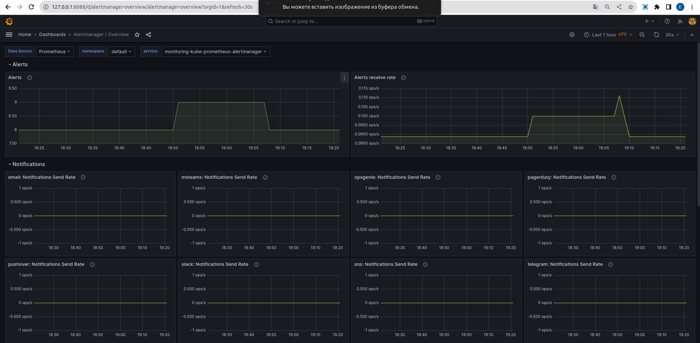
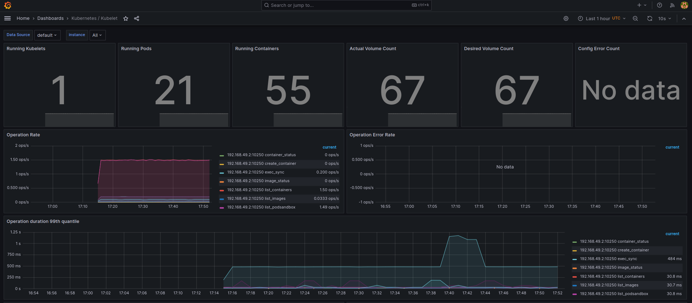 
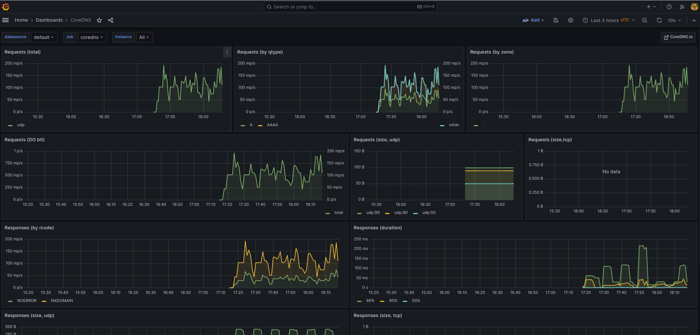 
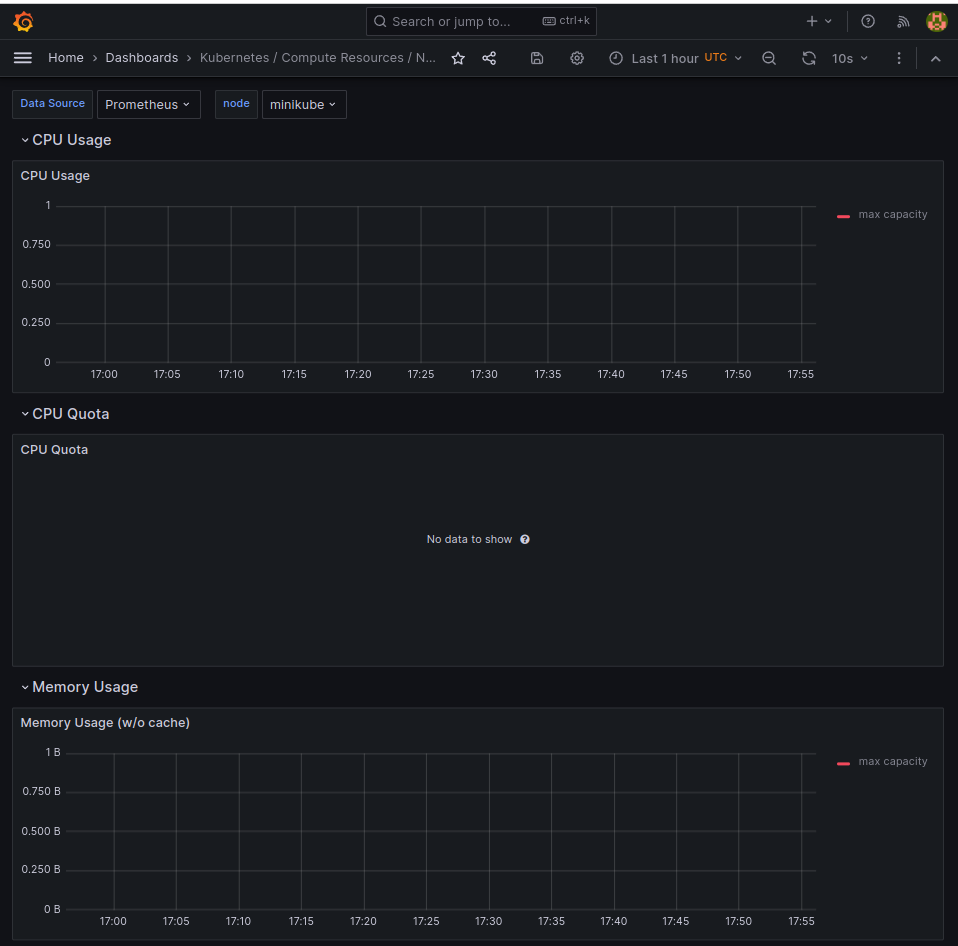 
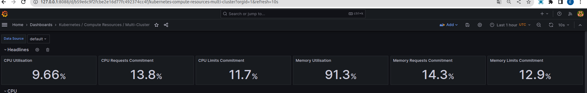 
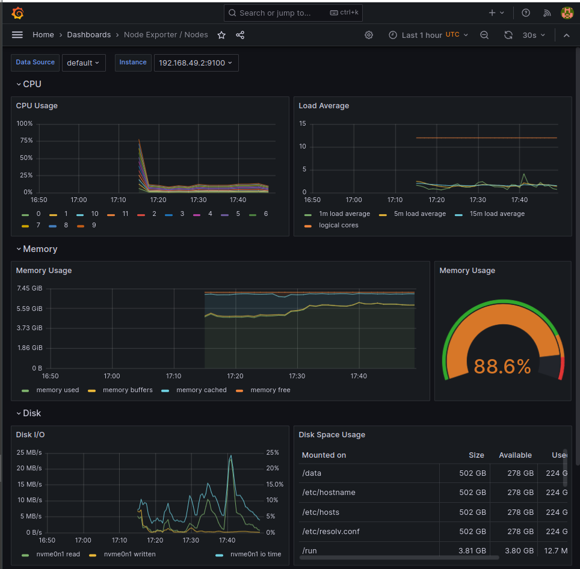 
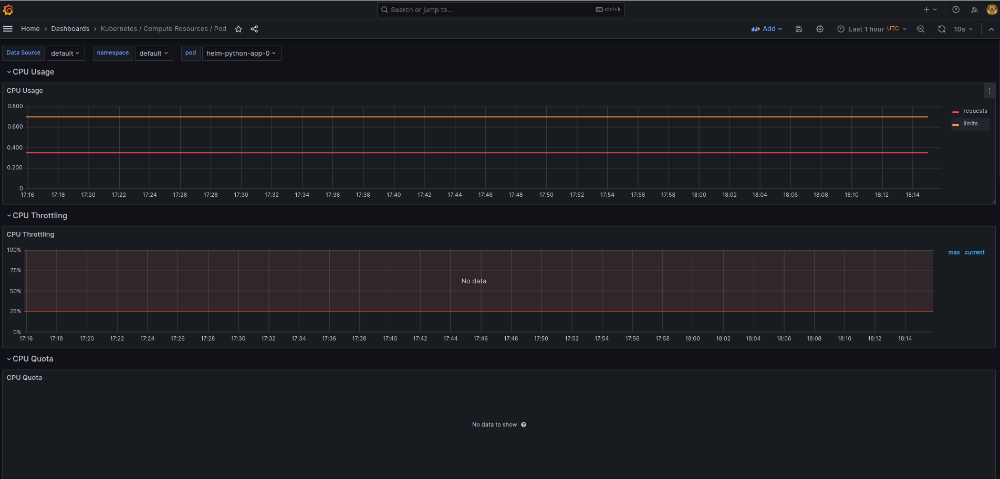 
 
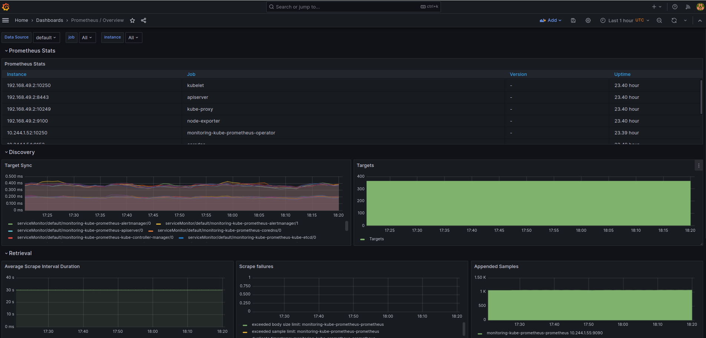 
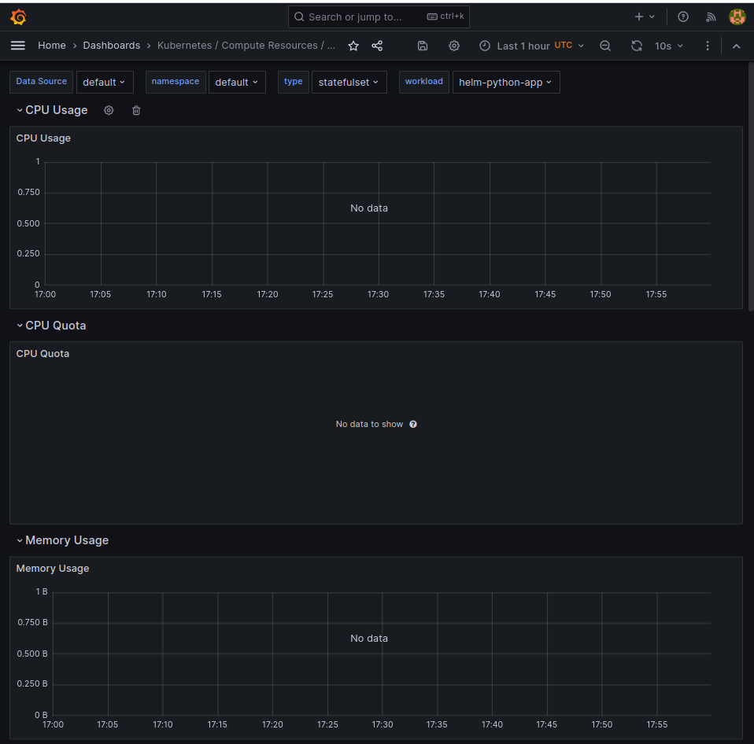 
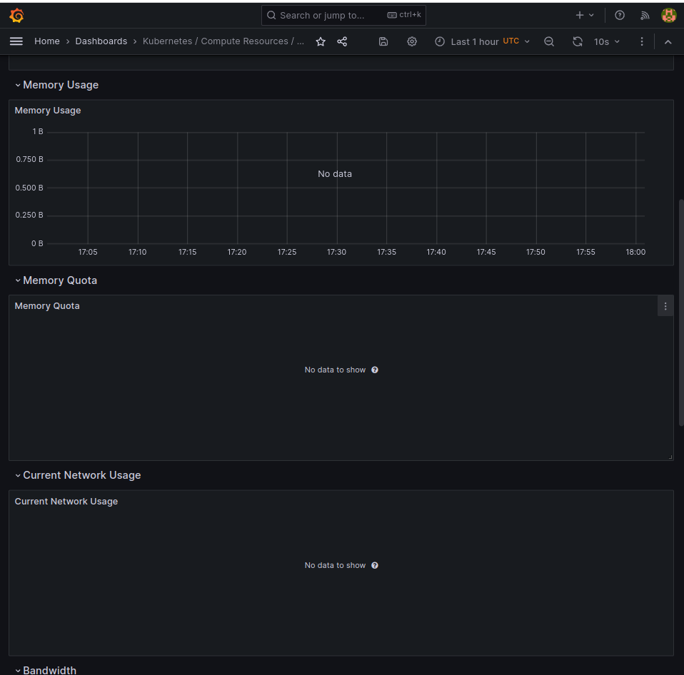 
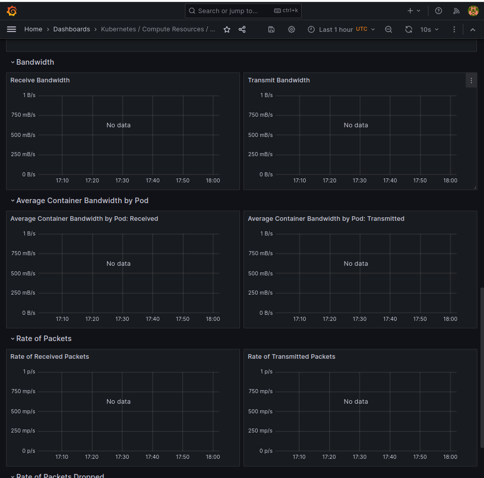 
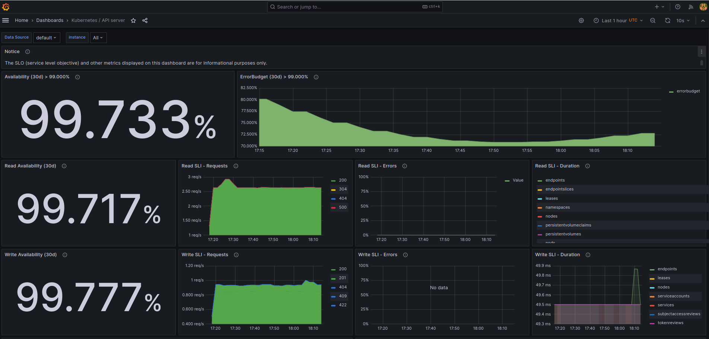


### Prometheus
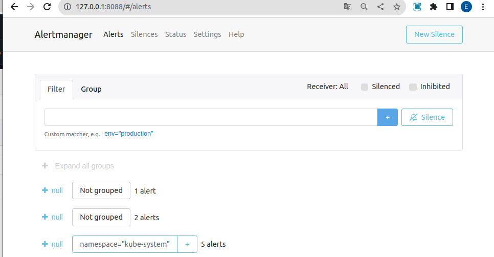 

## Task 2

```bash
egor@egor-Swift-SF314-43:~/InnoSubjects/F23/DevOps/devops-core-course-labs/k8s/monitoring$ kubectl exec pod/helm-python-app-0 -it /bin/sh
kubectl exec [POD] [COMMAND] is DEPRECATED and will be removed in a future version. Use kubectl exec [POD] -- [COMMAND] instead.
Defaulted container "helm-python-app" out of: helm-python-app, install (init), init-0 (init), init-1 (init), init-2 (init), init-3 (init)
# ls
init_data  main.py  requirements.txt  volume
# cd init_data
# ls
file  index.html
# cat file 
first
second
third
# cat index.html
<html><head></head><body><header>
<title>http://info.cern.ch</title>
</header>

<h1>http://info.cern.ch - home of the first website</h1>
<p>From here you can:</p>
<ul>
<li><a href="http://info.cern.ch/hypertext/WWW/TheProject.html">Browse the first website</a></li>
<li><a href="http://line-mode.cern.ch/www/hypertext/WWW/TheProject.html">Browse the first website using the line-mode browser simulator</a></li>
<li><a href="http://home.web.cern.ch/topics/birth-web">Learn about the birth of the web</a></li>
<li><a href="http://home.web.cern.ch/about">Learn about CERN, the physics laboratory where the web was born</a></li>
</ul>
</body></html>
# exit
```


### Init Containers

I added new config file to set up targets in helm prometheus
```k8s/monitoring/values.yaml```

```bash
egor@egor-Swift-SF314-43:~/InnoSubjects/F23/DevOps/devops-core-course-labs/k8s/monitoring$ helm list
NAME            NAMESPACE       REVISION        UPDATED                                 STATUS          CHART                           APP VERSION
helm-python-app default         1               2023-12-05 22:45:10.139900621 +0300 MSK deployed        helm-python-app-0.1.0           1.16.0     
monitoring      default         1               2023-12-05 23:28:10.588481502 +0300 MSK deployed        kube-prometheus-stack-55.0.0    v0.70.0    
vault           default         1               2023-11-14 02:00:55.939015332 +0300 MSK deployed        vault-0.26.1                    1.15.1     
egor@egor-Swift-SF314-43:~/InnoSubjects/F23/DevOps/devops-core-course-labs/k8s/monitoring$ helm delete monitoring
release "monitoring" uninstalled
egor@egor-Swift-SF314-43:~/InnoSubjects/F23/DevOps/devops-core-course-labs/k8s/monitoring$ helm install monitoring prometheus-community/kube-prometheus-stack -f
 values.yaml
NAME: monitoring
LAST DEPLOYED: Tue Dec  5 23:31:47 2023
NAMESPACE: default
STATUS: deployed
REVISION: 1
NOTES:
kube-prometheus-stack has been installed. Check its status by running:
  kubectl --namespace default get pods -l "release=monitoring"

Visit https://github.com/prometheus-operator/kube-prometheus for instructions on how to create & configure Alertmanager and Prometheus instances using the Operator.
```

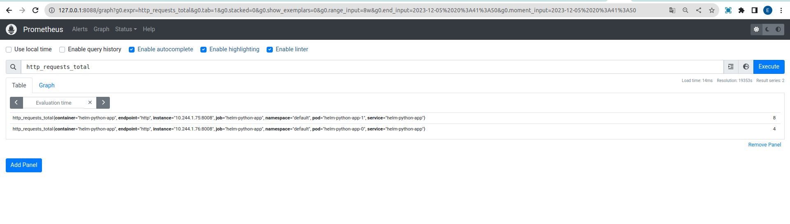 
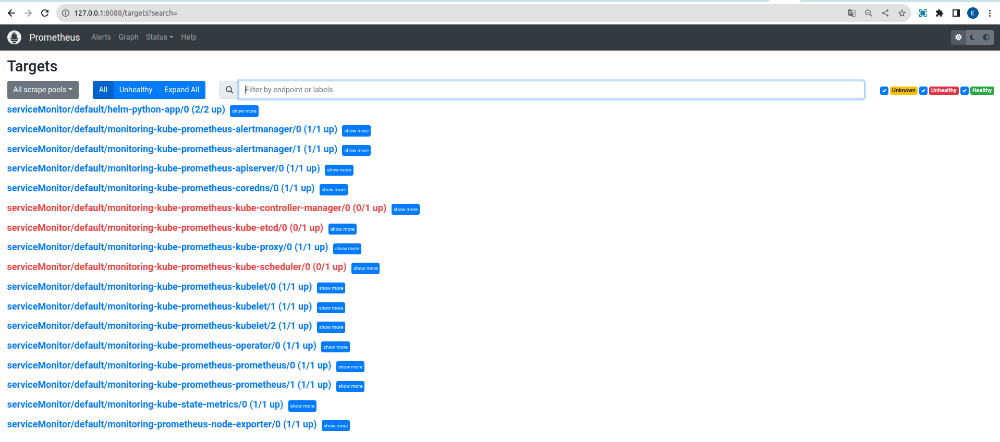 