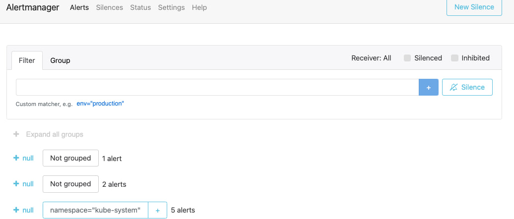
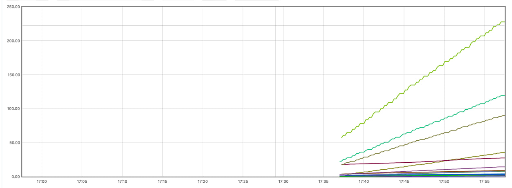
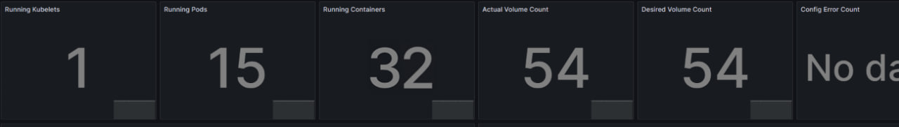
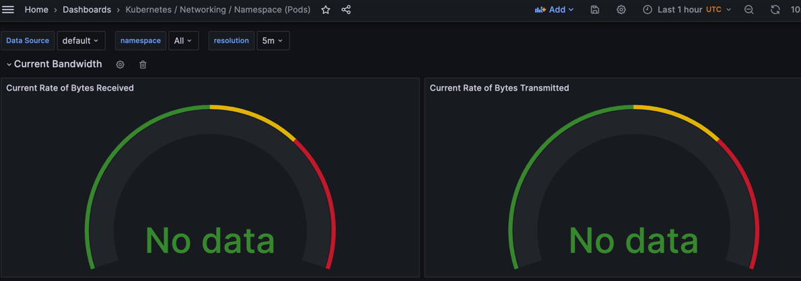
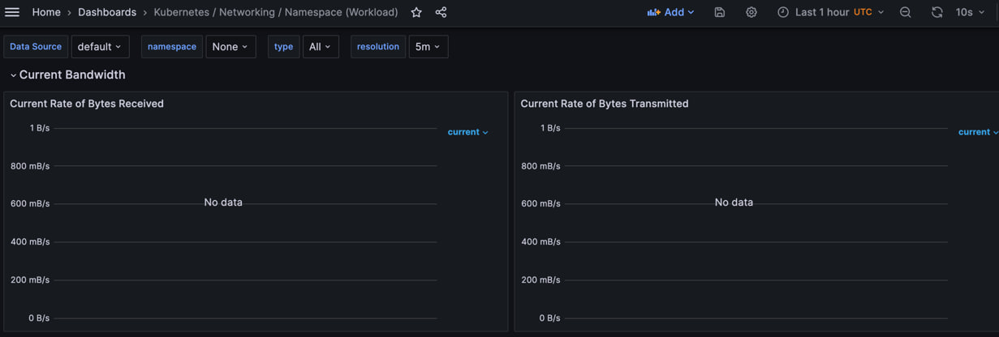
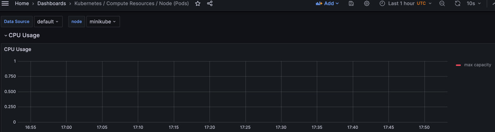
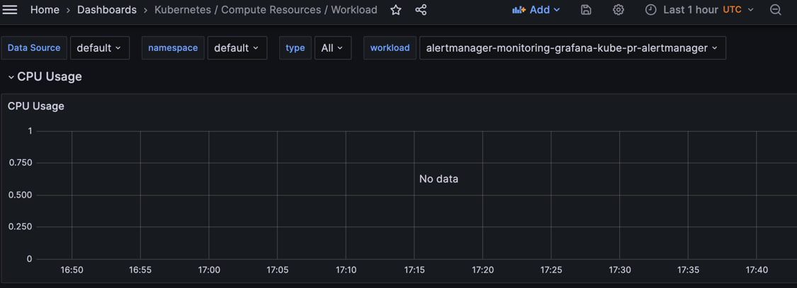

# Kubernetes Monitoring and Init Containers

## Task 1: Kubernetes Cluster Monitoring with Prometheus

### Describe Components

The Kube Prometheus Stack is a set of tools and components used in Kubernetes settings for monitoring and observability. It provides administrators and developers with insights about performance, health, and resource utilization:


* Prometheus: An open-source monitoring solution for Kubernetes targets that captures and saves time-series data.
* Alertmanager: Manages and delivers Prometheus-generated alerts, using deduplication and routing rules.
* Grafana: A visualization and dashboarding application that uses Prometheus as a data source to build configurable dashboards.
* kube-state-metrics: Displays Kubernetes-specific metrics on the state of objects such as pods, deployments, and services.
* node-exporter: A Prometheus exporter that gathers system-level metrics from Kubernetes nodes.
* kubelet: Manages Kubernetes nodes and containers, delivering metrics for container monitoring.
* Prometheus Operator: A Kubernetes operator that makes deployment and setup easier.

### Helm Charts Installation

`helm install kube-prometheus-stack prometheus-community/kube-prometheus-stack`

```
NAME: kube-prometheus-stack
LAST DEPLOYED: Tue Dec 12 02:22:13 2023
NAMESPACE: default
STATUS: deployed
REVISION: 1
NOTES:
kube-prometheus-stack has been installed. Check its status by running:
  kubectl --namespace default get pods -l "release=kube-prometheus-stack"
Visit https://github.com/prometheus-operator/kube-prometheus for instructions on how to create & configure Alertmanager and Prometheus instances using the Operator.
```

`helm install app . --values values.yaml`

`kubectl get po,sts,svc,pvc,cm`

```
pod/alertmanager-kube-prometheus-stack-alertmanager-0               2/2     Running    2 (2m36s ago)   9m
pod/kube-prometheus-stack-grafana-75bf4566f9-nf5xm                  3/3     Running    0               9m
pod/kube-prometheus-stack-kube-state-metrics-7655fdcd48-dp46z       1/1     Running    3 (9m49s ago)   9m
pod/kube-prometheus-stack-operator-bf7b878bd9-s5x2d                 1/1     Running    0               9m
pod/kube-prometheus-stack-prometheus-node-exporter-p584p            1/1     Running    3 (2m35s ago)   9m
pod/prometheus-kube-prometheus-stack-prometheus-0                   2/2     Running    2 (12s ago)     9m
pod/python-helm-app-python-0                                        0/2     Init:0/1   1               5d18h
pod/vault-0                                                         1/1     Running    3 (43m ago)     15d
pod/vault-agent-injector-58d4b87dñ4-8bf5f                           1/1     Running    7 (1m27s ago)   15d
NAME                                                                   READY   AGE
statefulset.apps/alertmanager-kube-prometheus-stack-alertmanager       1/1     9m
statefulset.apps/prometheus-kube-prometheus-stack-prometheus           1/1     9m
statefulset.apps/python-helm-app-python                                0/1     5d18h
statefulset.apps/vault                                                 1/1     15d
NAME                                                         TYPE        CLUSTER-IP       EXTERNAL-IP   PORT(S)                      AGE
service/alertmanager-operated                                ClusterIP   None             <none>        9093/TCP,9094/TCP,9094/UDP   9m
service/kube-prometheus-stack-alertmanager                   ClusterIP   10.107.83.126    <none>        9093/TCP,8080/TCP            9m
service/kube-prometheus-stack-grafana                        ClusterIP   10.104.71.115    <none>        80/TCP                       9m
service/kube-prometheus-stack-kube-state-metrics             ClusterIP   10.96.23.64      <none>        8080/TCP                     9m
service/kube-prometheus-stack-operator                       ClusterIP   10.105.94.255    <none>        443/TCP                      9m
service/kube-prometheus-stack-prometheus                     ClusterIP   10.108.218.131   <none>        9090/TCP,8080/TCP            9m
service/kube-prometheus-stack-prometheus-node-exporter       ClusterIP   10.102.7.104     <none>        9100/TCP                     9m
service/kubernetes                                           ClusterIP   10.96.0.1        <none>        443/TCP                      15d
service/prometheus-operated                                  ClusterIP   None             <none>        9090/TCP                     9m
service/python-helm-app-python                               ClusterIP   10.94.192.223    <none>        5000/TCP                     15d
service/vault                                                ClusterIP   10.109.86.202    <none>        8200/TCP,8201/TCP            15d
service/vault-agent-injector-svc                             ClusterIP   10.108.169.66    <none>        443/TCP                      15d
service/vault-internal                                       ClusterIP   None             <none>        8200/TCP,8201/TCP            15d
NAME                                                                    STATUS   VOLUME                                     CAPACITY   ACCESS MODES   STORAGECLASS   AGE
persistentvolumeclaim/python-stateful-volume-python-helm-app-python-0   Bound    pvc-e4ac0317-5bd5-4802-8948-d6db05a9d70a   50Mi       RWO            standard       6d23h
NAME                                                                DATA   AGE
configmap/configmap                                                 1      8m50s
configmap/env-configmap                                             1      8m50s
configmap/kube-prometheus-stack-alertmanager-overview               1      8m50s
configmap/kube-prometheus-stack-apiserver                           1      8m50s
configmap/kube-prometheus-stack-cluster-total                       1      9m
configmap/kube-prometheus-stack-controller-manager                  1      9m
configmap/kube-prometheus-stack-etcd                                1      9m
configmap/kube-prometheus-stack-grafana                             1      9m
configmap/kube-prometheus-stack-grafana-config-dashboards           1      9m
configmap/kube-prometheus-stack-grafana-datasource                  1      9m
configmap/kube-prometheus-stack-grafana-overview                    1      9m
configmap/kube-prometheus-stack-k8s-coredns                         1      9m
configmap/kube-prometheus-stack-k8s-resources-cluster               1      9m
configmap/kube-prometheus-stack-k8s-resources-multicluster          1      9m
configmap/kube-prometheus-stack-k8s-resources-namespace             1      9m
configmap/kube-prometheus-stack-k8s-resources-node                  1      9m
configmap/kube-prometheus-stack-k8s-resources-pod                   1      9m
configmap/kube-prometheus-stack-k8s-resources-workload              1      9m
configmap/kube-prometheus-stack-k8s-resources-workloads-namespace   1      9m
configmap/kube-prometheus-stack-kubelet                             1      9m
configmap/kube-prometheus-stack-namespace-by-pod                    1      9m
configmap/kube-prometheus-stack-namespace-by-workload               1      9m
configmap/kube-prometheus-stack-node-cluster-rsrc-use               1      9m
configmap/kube-prometheus-stack-node-rsrc-use                       1      9m
configmap/kube-prometheus-stack-nodes                               1      9m
configmap/kube-prometheus-stack-nodes-darwin                        1      9m
configmap/kube-prometheus-stack-persistentvolumesusage              1      9m
configmap/kube-prometheus-stack-pod-total                           1      9m
configmap/kube-prometheus-stack-prometheus                          1      9m
configmap/kube-prometheus-stack-proxy                               1      9m
configmap/kube-prometheus-stack-scheduler                           1      9m
configmap/kube-prometheus-stack-workload-total                      1      9m
configmap/kube-root-ca.crt                                          1      28d
configmap/prometheus-kube-prometheus-stack-prometheus-rulefiles-0   34     9m
```

### Screenshots









## Task 2

`kubectl logs python-helm-app-python-0 -c install -f`

```
Connecting to info.cern.ch (188.184.100.182:80)
index.html           100% |*******************************|   646   0:00:00 ETA
```

`kubectl exec -it python-helm-app-python-0  -- cat /init-files/index-0.html`

```
<html><head></head><body><header>
<title>http://info.cern.ch</title>
</header>
<h1>http://info.cern.ch - home of the first website</h1>
<p>From here you can:</p>
<ul>
<li><a href="http://info.cern.ch/hypertext/WWW/TheProject.html">Browse the first website</a></li>
<li><a href="http://line-mode.cern.ch/www/hypertext/WWW/TheProject.html">Browse the first website using the line-mode browser simulator</a></li>
<li><a href="http://home.web.cern.ch/topics/birth-web">Learn about the birth of the web</a></li>
<li><a href="http://home.web.cern.ch/about">Learn about CERN, the physics laboratory where the web was born</a></li>
</ul>
</body></html>
```