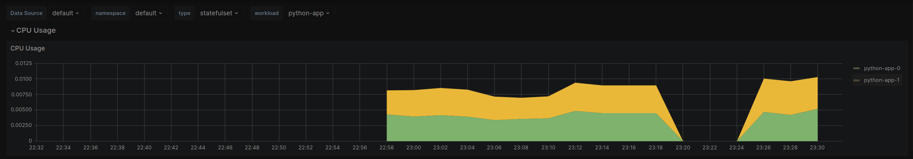
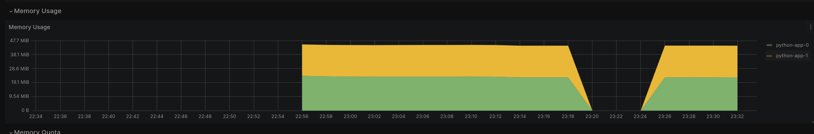
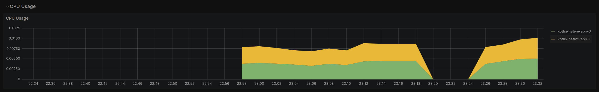
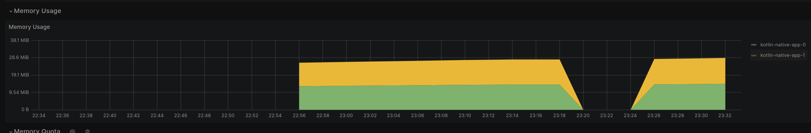
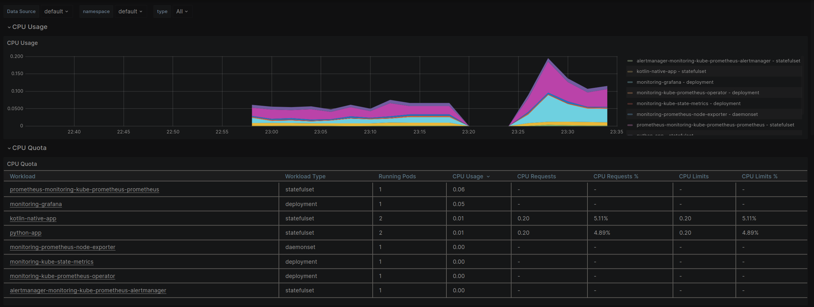
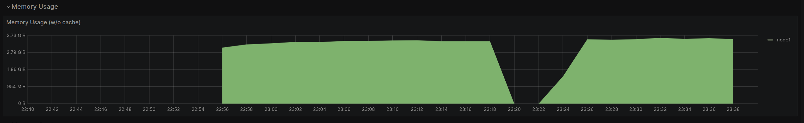
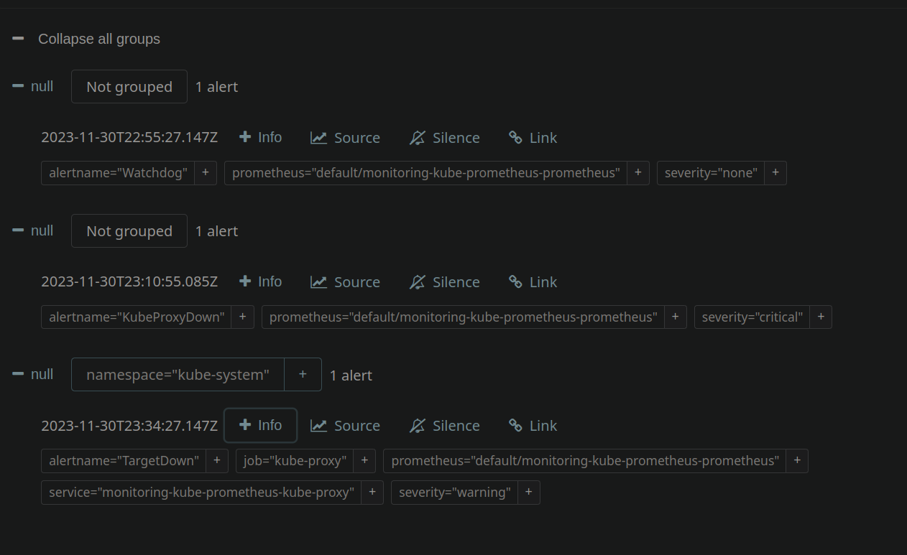
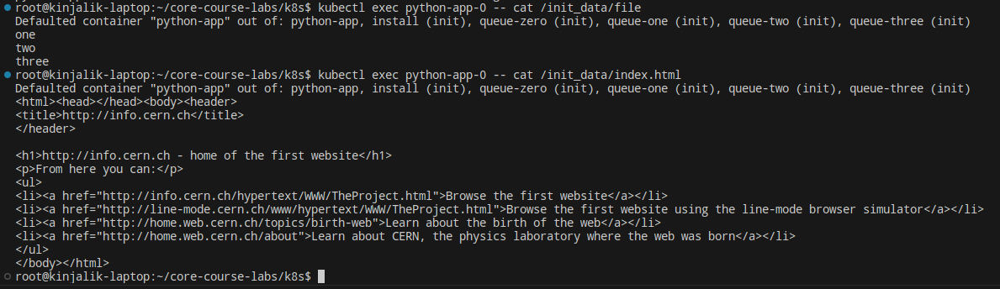
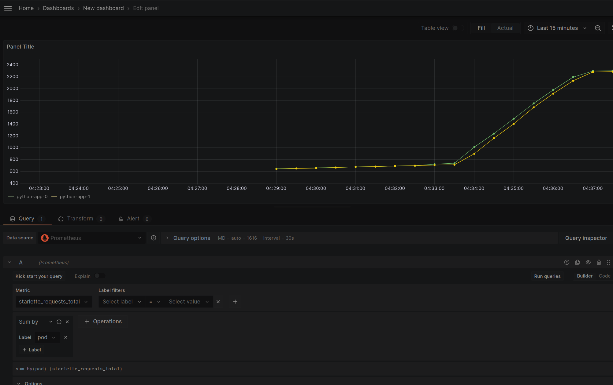

# Lab 14
## Kube Prometheus Stack
- Prometheus - monitoring tool
- Alertmanager - entry point for alert reporting, forwards alerts to desired destination (email, chat, etc)
- Node Exporter - collect metrics from machine (everything reported by OS, including hardware metrics)
- Prometheus operator - adapts prometheus to k8s
- kube-state-metrics - metric agent, collects data on cluster itself
- Graphana - dashboards

## List of everyting
```bash
[kinjalik@kinjalik-laptop k8s]$ kubectl get po,sts,svc,pvc,cm
NAME                                                         READY   STATUS    RESTARTS      AGE
pod/alertmanager-monitoring-kube-prometheus-alertmanager-0   2/2     Running   0             10m
pod/kotlin-native-app-0                                      1/1     Running   1 (20m ago)   32h
pod/kotlin-native-app-1                                      1/1     Running   1 (20m ago)   32h
pod/monitoring-grafana-7ddcc79db4-9xw8x                      3/3     Running   0             11m
pod/monitoring-kube-prometheus-operator-74864f475d-5hxsq     1/1     Running   0             11m
pod/monitoring-kube-state-metrics-74f4d8858f-tmsxg           1/1     Running   0             11m
pod/monitoring-prometheus-node-exporter-d2k2v                1/1     Running   0             11m
pod/prometheus-monitoring-kube-prometheus-prometheus-0       2/2     Running   0             10m
pod/python-app-0                                             1/1     Running   1 (31h ago)   32h
pod/python-app-1                                             1/1     Running   1 (31h ago)   32h

NAME                                                                    READY   AGE
statefulset.apps/alertmanager-monitoring-kube-prometheus-alertmanager   1/1     10m
statefulset.apps/kotlin-native-app                                      2/2     32h
statefulset.apps/prometheus-monitoring-kube-prometheus-prometheus       1/1     10m
statefulset.apps/python-app                                             2/2     32h

NAME                                              TYPE        CLUSTER-IP       EXTERNAL-IP   PORT(S)                      AGE
service/alertmanager-operated                     ClusterIP   None             <none>        9093/TCP,9094/TCP,9094/UDP   10m
service/kotlin-native-app                         NodePort    10.101.188.208   <none>        8080:30866/TCP               32h
service/kubernetes                                ClusterIP   10.96.0.1        <none>        443/TCP                      32h
service/monitoring-grafana                        ClusterIP   10.101.162.81    <none>        80/TCP                       11m
service/monitoring-kube-prometheus-alertmanager   ClusterIP   10.101.101.224   <none>        9093/TCP,8080/TCP            11m
service/monitoring-kube-prometheus-operator       ClusterIP   10.98.78.209     <none>        443/TCP                      11m
service/monitoring-kube-prometheus-prometheus     ClusterIP   10.107.109.223   <none>        9090/TCP,8080/TCP            11m
service/monitoring-kube-state-metrics             ClusterIP   10.106.144.253   <none>        8080/TCP                     11m
service/monitoring-prometheus-node-exporter       ClusterIP   10.105.170.110   <none>        9100/TCP                     11m
service/prometheus-operated                       ClusterIP   None             <none>        9090/TCP                     10m
service/python-app                                NodePort    10.106.196.242   <none>        8000:31166/TCP               32h

NAME                                                        STATUS   VOLUME                                     CAPACITY   ACCESS MODES   STORAGECLASS   AGE
persistentvolumeclaim/counter-data-kn-kotlin-native-app-0   Bound    pvc-8dd637ed-9837-4459-a7ed-e6aec0b2dfc2   10Mi       RWO            standard       32h
persistentvolumeclaim/counter-data-kn-kotlin-native-app-1   Bound    pvc-4a8bf3a8-ceb5-4978-883e-1fd20ea00b16   10Mi       RWO            standard       32h
persistentvolumeclaim/counter-data-py-python-app-0          Bound    pvc-91a79863-39d2-4a7b-801c-5371b3191e61   10Mi       RWO            standard       32h
persistentvolumeclaim/counter-data-py-python-app-1          Bound    pvc-4920dbba-a3b0-45ef-a682-ae906be4eab0   10Mi       RWO            standard       32h

NAME                                                                     DATA   AGE
configmap/config-map-entity-kn                                           2      32h
configmap/config-map-entity-py                                           2      32h
configmap/kube-root-ca.crt                                               1      32h
configmap/monitoring-grafana                                             1      11m
configmap/monitoring-grafana-config-dashboards                           1      11m
configmap/monitoring-kube-prometheus-alertmanager-overview               1      11m
configmap/monitoring-kube-prometheus-apiserver                           1      11m
configmap/monitoring-kube-prometheus-cluster-total                       1      11m
configmap/monitoring-kube-prometheus-controller-manager                  1      11m
configmap/monitoring-kube-prometheus-etcd                                1      11m
configmap/monitoring-kube-prometheus-grafana-datasource                  1      11m
configmap/monitoring-kube-prometheus-grafana-overview                    1      11m
configmap/monitoring-kube-prometheus-k8s-coredns                         1      11m
configmap/monitoring-kube-prometheus-k8s-resources-cluster               1      11m
configmap/monitoring-kube-prometheus-k8s-resources-multicluster          1      11m
configmap/monitoring-kube-prometheus-k8s-resources-namespace             1      11m
configmap/monitoring-kube-prometheus-k8s-resources-node                  1      11m
configmap/monitoring-kube-prometheus-k8s-resources-pod                   1      11m
configmap/monitoring-kube-prometheus-k8s-resources-workload              1      11m
configmap/monitoring-kube-prometheus-k8s-resources-workloads-namespace   1      11m
configmap/monitoring-kube-prometheus-kubelet                             1      11m
configmap/monitoring-kube-prometheus-namespace-by-pod                    1      11m
configmap/monitoring-kube-prometheus-namespace-by-workload               1      11m
configmap/monitoring-kube-prometheus-node-cluster-rsrc-use               1      11m
configmap/monitoring-kube-prometheus-node-rsrc-use                       1      11m
configmap/monitoring-kube-prometheus-nodes                               1      11m
configmap/monitoring-kube-prometheus-nodes-darwin                        1      11m
configmap/monitoring-kube-prometheus-persistentvolumesusage              1      11m
configmap/monitoring-kube-prometheus-pod-total                           1      11m
configmap/monitoring-kube-prometheus-prometheus                          1      11m
configmap/monitoring-kube-prometheus-proxy                               1      11m
configmap/monitoring-kube-prometheus-scheduler                           1      11m
configmap/monitoring-kube-prometheus-workload-total                      1      11m
configmap/prometheus-monitoring-kube-prometheus-prometheus-rulefiles-0   34     10m
```

Pods: 
- `pod/alertmanager-monitoring-kube-prometheus-alertmanager-0` - alert manager
- `pod/kotlin-native-app-{0,1}` - extra application pods
- `pod/monitoring-grafana-7ddcc79db4-9xw8x` - pod with graphana (explained above)
- `pod/monitoring-kube-prometheus-operator-74864f475d-5hxsq` - pod with prometheus operator (explained above)
- `pod/monitoring-kube-state-metrics-74f4d8858f-tmsxg` - pod with kube-state-metrics (explained above)
- `pod/monitoring-prometheus-node-exporter-d2k2v` - pod with node-exporter (explained above)
- `pod/prometheus-monitoring-kube-prometheus-prometheus-0` - pod with prometheus itself, in two replicas
- `pod/python-app-{0,1}` - pods with application

Stateful sets:
- `statefulset.apps/alertmanager-monitoring-kube-prometheus-alertmanager` - statefulset of AlertManager (for reliability)
- `statefulset.apps/prometheus-monitoring-kube-prometheus-prometheus` - statefulset of Prometheus (for reliability)
- `statefulset.apps/kotlin-native-app` and `statefulset.apps/python-app` - my apps

Service list corresponds with involved elements of stack.

Persistent volumes are created in previous lab. Kube prometheus stack does not add anything.

Configmaps are used for internal affairs of kube prometheus stack

## Data from graphana
Minikube doesn't allow to access the `ClusterIP` services using `minikube service`. Therefore, it was decided to use `kubectl port-forward`:
```bash
kubectl port-forward services/monitoring-grafana 1337:80
```

Also default password for grafana is `prom-operator`.
- Consumption of statefulset
    
    
    
    
    Seems like Kotlin Native leeeeaks
- Pods top by CPU. The most CPU consuming - prometheus. The least - prometheus-operator
    
- Memory consumption by node
    
- Kubelet statistics
    
- Network usage
    
- Active alers: 3
    
    

## Init containers (for bonus also!)


## Metrics from app (for bonus)
