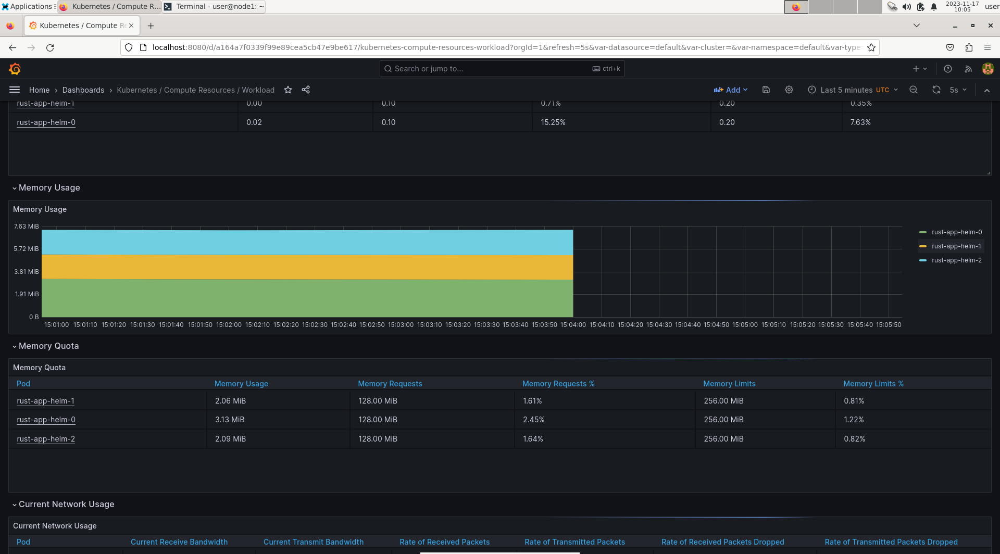
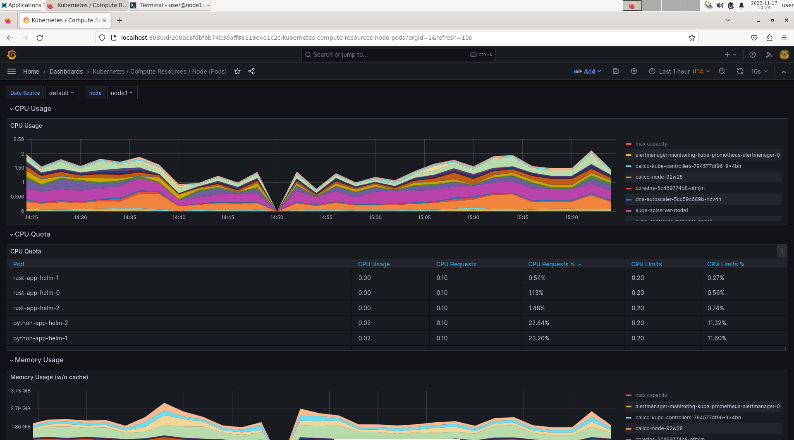
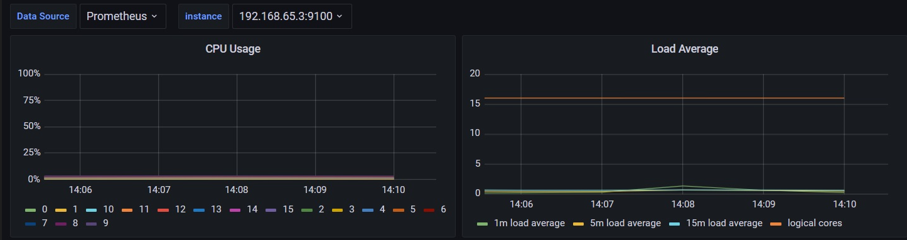
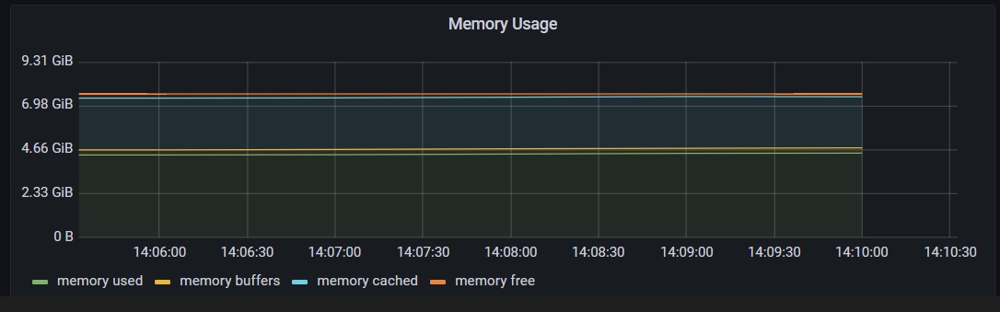
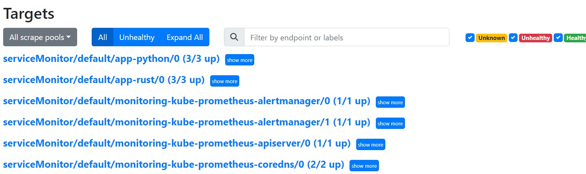

# Kubernetes Monitoring and Init Containers

## Task 1

### Overview of kube-prometheus-stack

- Prometheus: Prometheus is a free monitoring system that keeps an eye on your data. It's unique because it organizes information in a special way, uses a language that's easy to ask questions in, tracks time-related data quickly, and uses a modern method to send alerts.

- Prometheus Operator: The Prometheus Operator makes it simple to set up and personalize Prometheus, Alertmanager, and other monitoring tools.

- Grafana: Grafana is a popular free tool for looking at and showing data on the internet. When it's connected to supported sources like Prometheus, it shows information using charts, graphs, and alerts.

- Kube State Metrics: This service is important for collecting information about the condition of a cluster. It gets this data from the Kubernetes API server.

- Alertmanager: Alertmanager is part of Prometheus, and its job is to handle alerts from applications like the Prometheus server. It ensures that alerts are managed properly by removing duplicates, grouping them, and sending them to the right channels, like email, PagerDuty, or OpsGenie.


### Deploying

```bash
helm install monitoring prometheus-community/kube-prometheus-stack

NAME: monitoring
LAST DEPLOYED: Mon Dec  4 19:17:02 2023
NAMESPACE: default
STATUS: deployed
REVISION: 1
NOTES:
kube-prometheus-stack has been installed. Check its status by running:
  kubectl --namespace default get pods -l "release=monitoring"

Visit https://github.com/prometheus-operator/kube-prometheus for instructions on how to create & configure Alertmanager and Prometheus instances using the Operator.
```

```bash
kubectl get po,sts,svc,pvc,cm

NAME                                                          READY   STATUS    RESTARTS      AGE
pod/alertmanager-monitoring-kube-prometheus-alertmanager-0    2/2     Running   0             3m18s
pod/monitoring-grafana-6f8d546676-rdxxj                       3/3     Running   1 (80s ago)   3m50s
pod/monitoring-kube-prometheus-operator-5fbb66b4b-dcdc5       1/1     Running   0             3m50s
pod/monitoring-kube-state-metrics-74f4d8858f-94vwt            1/1     Running   0             3m50s
pod/monitoring-prometheus-node-exporter-cx2kv                 1/1     Running   0             3m50s
pod/nginx-app-69ccf856dd-cxlq7                                1/1     Running   4 (5d21h ago) 31d
pod/prometheus-monitoring-kube-prometheus-prometheus-0        2/2     Running   0             3m17s
pod/python-mywebapps-0                                        1/1     Running   0             5m
pod/python-mywebapps-1                                        1/1     Running   0             5m
pod/python-mywebapps-2                                        1/1     Running   0             5m
pod/typescript-mywebapps-0                                    1/1     Running   0             6m
pod/typescript-mywebapps-1                                    1/1     Running   0             6m
pod/typescript-mywebapps-2                                    1/1     Running   0             6m

NAME                                                                     READY   AGE
statefulset.apps/alertmanager-monitoring-kube-prometheus-alertmanager    1/1     3m18s
statefulset.apps/prometheus-monitoring-kube-prometheus-prometheus        1/1     3m18s
statefulset.apps/python-mywebapps                                        3/3     5m
statefulset.apps/typescript-mywebapps                                    3/3     6m

NAME                                              TYPE           CLUSTER-IP       EXTERNAL-IP   PORT(S)                      AGE
service/alertmanager-operated                     ClusterIP      None             <none>        9093/TCP,9094/TCP,9094/UDP   3m18s
service/kubernetes                                ClusterIP      10.96.0.1        <none>        443/TCP                      36d
service/monitoring-grafana                        ClusterIP      10.107.136.101   <none>        80/TCP                       3m51s
service/monitoring-kube-prometheus-alertmanager   ClusterIP      10.109.48.200    <none>        9093/TCP,8080/TCP            3m51s
service/monitoring-kube-prometheus-operator       ClusterIP      10.109.154.102   <none>        443/TCP                      3m51s
service/monitoring-kube-prometheus-prometheus     ClusterIP      10.102.66.146    <none>        9090/TCP,8080/TCP            3m51s
service/monitoring-kube-state-metrics             ClusterIP      10.98.117.161    <none>        8080/TCP                     3m51s
service/monitoring-prometheus-node-exporter       ClusterIP      10.102.3.238     <none>        9100/TCP                     3m51s
service/nginx-app-svc                             LoadBalancer   10.105.86.19     <pending>     80:30275/TCP                 31d
service/prometheus-operated                       ClusterIP      None             <none>        9090/TCP                     3m18s
service/python-app-service                        LoadBalancer   10.101.30.109    <pending>     8000:30273/TCP               31d
service/typescript-app-service                    LoadBalancer   10.96.84.8       <pending>     8080:31986/TCP               31d

NAME                                                                 STATUS   VOLUME                                     CAPACITY   ACCESS MODES   STORAGECLASS   AGE
persistentvolumeclaim/visits-python-python-mywebapps-0               Bound    pvc-ab34d4d5-2f78-4930-b271-3ef9d0c0d5ed   1Mi        RWO            standard       8m
persistentvolumeclaim/visits-python-python-mywebapps-1               Bound    pvc-2e3e0880-d2f7-47e5-89d6-818fb3b7b618   1Mi        RWO            standard       8m
persistentvolumeclaim/visits-python-python-mywebapps-2               Bound    pvc-23e51f90-0749-46d2-ab78-8be6459ccbed   1Mi        RWO            standard       8m
persistentvolumeclaim/visits-typescript-typescript-mywebapps-0       Bound    pvc-a419d488-bc8a-419a-8591-923881a85b96   1Mi        RWO            standard       9m
persistentvolumeclaim/visits-typescript-typescript-mywebapps-1       Bound    pvc-f394d50b-b074-4a9c-82ec-999a096bebc0   1Mi        RWO            standard       9m
persistentvolumeclaim/visits-typescript-typescript-mywebapps-2       Bound    pvc-cae31292-d7a0-4bc2-9145-d8df8ed8ad26   1Mi        RWO            standard       9m


NAME                                                                     DATA   AGE
configmap/kube-root-ca.crt                                               1      36d
configmap/monitoring-grafana                                             1      3m51s
configmap/monitoring-grafana-config-dashboards                           1      3m51s
configmap/monitoring-kube-prometheus-alertmanager-overview               1      3m51s
configmap/monitoring-kube-prometheus-apiserver                           1      3m51s
configmap/monitoring-kube-prometheus-cluster-total                       1      3m51s
configmap/monitoring-kube-prometheus-controller-manager                  1      3m51s
configmap/monitoring-kube-prometheus-etcd                                1      3m51s
configmap/monitoring-kube-prometheus-grafana-datasource                  1      3m51s
configmap/monitoring-kube-prometheus-grafana-overview                    1      3m51s
configmap/monitoring-kube-prometheus-k8s-coredns                         1      3m51s
configmap/monitoring-kube-prometheus-k8s-resources-cluster               1      3m51s
configmap/monitoring-kube-prometheus-k8s-resources-multicluster          1      3m51s
configmap/monitoring-kube-prometheus-k8s-resources-namespace             1      3m51s
configmap/monitoring-kube-prometheus-k8s-resources-node                  1      3m51s
configmap/monitoring-kube-prometheus-k8s-resources-pod                   1      3m51s
configmap/monitoring-kube-prometheus-k8s-resources-workload              1      3m51s
configmap/monitoring-kube-prometheus-k8s-resources-workloads-namespace   1      3m51s
configmap/monitoring-kube-prometheus-kubelet                             1      3m51s
configmap/monitoring-kube-prometheus-namespace-by-pod                    1      3m51s
configmap/monitoring-kube-prometheus-namespace-by-workload               1      3m51s
configmap/monitoring-kube-prometheus-node-cluster-rsrc-use               1      3m51s
configmap/monitoring-kube-prometheus-node-rsrc-use                       1      3m51s
configmap/monitoring-kube-prometheus-nodes                               1      3m51s
configmap/monitoring-kube-prometheus-nodes-darwin                        1      3m51s
configmap/monitoring-kube-prometheus-persistentvolumesusage              1      3m51s
configmap/monitoring-kube-prometheus-pod-total                           1      3m51s
configmap/monitoring-kube-prometheus-prometheus                          1      3m51s
configmap/monitoring-kube-prometheus-proxy                               1      3m51s
configmap/monitoring-kube-prometheus-scheduler                           1      3m51s
configmap/monitoring-kube-prometheus-workload-total                      1      3m51s
configmap/prometheus-monitoring-kube-prometheus-prometheus-rulefiles-0   34     3m18s
```

Time to get information from metrics:

```bash
minikube service mon-grafana

|-----------|--------------------|-------------|--------------|
| NAMESPACE |        NAME        | TARGET PORT |     URL      |
|-----------|--------------------|-------------|--------------|
| default   | monitoring-grafana |             | No node port |
|-----------|--------------------|-------------|--------------|
😿  service default/monitoring-grafana has no node port
🏃  Starting tunnel for service monitoring-grafana.
|-----------|--------------------|-------------|------------------------|
| NAMESPACE |        NAME        | TARGET PORT |          URL           |
|-----------|--------------------|-------------|------------------------|
| default   | monitoring-grafana |             | http://127.0.0.1:38137 |
|-----------|--------------------|-------------|------------------------|
🎉  Opening service default/monitoring-grafana in default browser...
👉  http://127.0.0.1:38137
❗  Because you are using a Docker driver on linux, the terminal needs to be open to run it.

```

To get default password for login to grafana dashboard
```
kubectl get secret --namespace default monitoring-grafana -o jsonpath="{.data.admin-password}" | base64 --decode ; echo

prom-operator
```

1. Check CPU and Memory consumption of your StatefulSet.

Python CPU:


Typescript CPU:


Python memory:


Typescript memory:




2. Identify Pods with higher and lower CPU usage in the default namespace.




3. Monitor node memory usage in percentage and megabytes.





4. Count the number of pods and containers managed by the Kubelet service.


5. Evaluate network usage of Pods in the default namespace.


6. Determine the number of active alert.


### Grafana

## Task 2

```bash
kubectl logs web-mywebapps-0 -c install -f

Connecting to info.cern.ch (188.184.100.162:80)
index.html           100% |*******************************|   646   0:00:00 ETA

kubectl exec -it web-mywebapps-0 -- cat /init/index.html

Defaulted container "mywebapps" out of: mywebapps, install (init)
<html><head></head><body><header>
<title>http://info.cern.ch</title>
</header>
```

## Bonus

bonus app running:


### Metrics from apps

ServiceMonitor created via `values.yaml` in kube-prometheus-stack chart.




### Three init

in `statefulset.yaml`

```yaml
initContainers:
- name: install-1
    image: busybox:1.28
    command: ['sh', '-c', 'echo 1 >> /init/file']
    {{- with .Values.volumeMounts }}
    volumeMounts:
    {{- toYaml . | nindent 12 }}
    {{- end }}
- name: install-2
    image: busybox:1.28
    command: ['sh', '-c', 'echo 2 >> /init/file']
    {{- with .Values.volumeMounts }}
    volumeMounts:
    {{- toYaml . | nindent 12 }}
    {{- end }}
- name: install-3
    image: busybox:1.28
    command: ['sh', '-c', 'echo 3 >> /init/file']
    {{- with .Values.volumeMounts }}
    volumeMounts:
    {{- toYaml . | nindent 12 }}
    {{- end }}
```

```bash
kubectl exec -it web-mywebapps-0  -- cat /init/file

Defaulted container "mywebapps" out of: mywebapps, install-1 (init), install-2 (init), install-3 (init)
1
2
3
```