# Kubernetes Monitoring and Init Containers
## Components 
* Prometheus operator - simplifies and automates the setup of Prometheus and related monitoring components in Kubernetes cluster
* Prometheus - an open-source systems monitoring and alerting toolkit
* Alertmanager - manages alerts from client applications by deduplicating, grouping, and routing them to appropriate integrations (email, PagerDuty, etc)
* Prometheus node-exporter - collects and sends hardware and OS metrics to Prometheus.
* Prometheus Adapter for Kubernetes Metrics APIs - allows to collect metrics from kubernetes 
* kube-state-metrics - service that listens to the Kubernetes API server and generates application metrics.
* Grafana -  open-source platform for data visualization and monitoring

## Installation 
```
% helm repo add prometheus-community https://prometheus-community.github.io/helm-charts
"prometheus-community" has been added to your repositories

% helm repo update
Hang tight while we grab the latest from your chart repositories...
...Unable to get an update from the "hashicorp" chart repository (https://helm.releases.hashicorp.com):
	failed to fetch https://helm.releases.hashicorp.com/index.yaml : 403 Forbidden
...Successfully got an update from the "prometheus-community" chart repository
...Successfully got an update from the "bitnami" chart repository
Update Complete. ⎈Happy Helming!⎈

% helm install monitoring prometheus-community/kube-prometheus-stack
NAME: monitoring
LAST DEPLOYED: Tue Dec  5 12:41:31 2023
NAMESPACE: default
STATUS: deployed
REVISION: 1
NOTES:
kube-prometheus-stack has been installed. Check its status by running:
  kubectl --namespace default get pods -l "release=monitoring"

Visit https://github.com/prometheus-operator/kube-prometheus for instructions on how to create & configure Alertmanager and Prometheus instances using the Operator.

```
## Verifying 
```
% kubectl get po,sts,svc,pvc,cm
NAME                                                         READY   STATUS    RESTARTS        AGE
pod/alertmanager-monitoring-kube-prometheus-alertmanager-0   2/2     Running   0               100s
pod/app-go-0                                                 1/1     Running   1 (5d2h ago)    6d21h
pod/app-go-1                                                 1/1     Running   1 (4m39s ago)   6d21h
pod/app-go-2                                                 1/1     Running   1 (5d2h ago)    6d21h
pod/app-python-0                                             1/1     Running   3 (5d2h ago)    6d21h
pod/app-python-1                                             1/1     Running   2 (5d2h ago)    6d21h
pod/app-python-2                                             1/1     Running   3 (5d2h ago)    6d21h
pod/monitoring-grafana-6f8d546676-25bd8                      3/3     Running   0               2m41s
pod/monitoring-kube-prometheus-operator-5fbb66b4b-t9rtv      1/1     Running   0               2m41s
pod/monitoring-kube-state-metrics-74f4d8858f-2ntqx           1/1     Running   0               2m41s
pod/monitoring-prometheus-node-exporter-4dhgq                1/1     Running   0               2m41s
pod/prometheus-monitoring-kube-prometheus-prometheus-0       2/2     Running   0               99s

NAME                                                                    READY   AGE
statefulset.apps/alertmanager-monitoring-kube-prometheus-alertmanager   1/1     100s
statefulset.apps/app-go                                                 3/3     6d21h
statefulset.apps/app-python                                             3/3     6d21h
statefulset.apps/prometheus-monitoring-kube-prometheus-prometheus       1/1     99s

NAME                                              TYPE        CLUSTER-IP       EXTERNAL-IP   PORT(S)                      AGE
service/alertmanager-operated                     ClusterIP   None             <none>        9093/TCP,9094/TCP,9094/UDP   100s
service/app-go                                    NodePort    10.96.189.138    <none>        8081:31091/TCP               6d21h
service/app-python                                NodePort    10.109.92.62     <none>        8080:31201/TCP               6d21h
service/kubernetes                                ClusterIP   10.96.0.1        <none>        443/TCP                      27d
service/monitoring-grafana                        ClusterIP   10.99.56.65      <none>        80/TCP                       2m42s
service/monitoring-kube-prometheus-alertmanager   ClusterIP   10.97.198.216    <none>        9093/TCP,8080/TCP            2m42s
service/monitoring-kube-prometheus-operator       ClusterIP   10.109.65.94     <none>        443/TCP                      2m42s
service/monitoring-kube-prometheus-prometheus     ClusterIP   10.110.43.174    <none>        9090/TCP,8080/TCP            2m42s
service/monitoring-kube-state-metrics             ClusterIP   10.99.88.8       <none>        8080/TCP                     2m42s
service/monitoring-prometheus-node-exporter       ClusterIP   10.105.36.126    <none>        9100/TCP                     2m42s
service/prometheus-operated                       ClusterIP   None             <none>        9090/TCP                     99s

NAME                                                     STATUS   VOLUME                                     CAPACITY   ACCESS MODES   STORAGECLASS   AGE
persistentvolumeclaim/go-counter-data-app-go-0           Bound    pvc-4eea25e9-4abd-479f-ac26-0cc10d7a77a1   62Mi       RWO            standard       7d1h
persistentvolumeclaim/go-counter-data-app-go-1           Bound    pvc-5be3f7fe-0a4e-4e80-ae4d-4c08b623e455   62Mi       RWO            standard       7d1h
persistentvolumeclaim/go-counter-data-app-go-2           Bound    pvc-f8dca3a6-edfa-40f4-9c9d-60cbf6c0ffba   62Mi       RWO            standard       7d1h
persistentvolumeclaim/python-counter-data-app-python-0   Bound    pvc-352798dd-8cda-42b2-a5bd-c664bfa20024   62Mi       RWO            standard       7d1h
persistentvolumeclaim/python-counter-data-app-python-1   Bound    pvc-8e7264fe-9509-4789-92d8-6570991a6e15   62Mi       RWO            standard       7d1h
persistentvolumeclaim/python-counter-data-app-python-2   Bound    pvc-26304890-6ed3-47b3-a26a-c2e346507b63   62Mi       RWO            standard       7d1h

NAME                                                                     DATA   AGE
configmap/go-config-map                                                  1      6d21h
configmap/kube-root-ca.crt                                               1      36d
configmap/monitoring-grafana                                             1      2m43s
configmap/monitoring-grafana-config-dashboards                           1      2m43s
configmap/monitoring-kube-prometheus-alertmanager-overview               1      2m43s
configmap/monitoring-kube-prometheus-apiserver                           1      2m42s
configmap/monitoring-kube-prometheus-cluster-total                       1      2m42s
configmap/monitoring-kube-prometheus-controller-manager                  1      2m43s
configmap/monitoring-kube-prometheus-etcd                                1      2m43s
configmap/monitoring-kube-prometheus-grafana-datasource                  1      2m43s
configmap/monitoring-kube-prometheus-grafana-overview                    1      2m43s
configmap/monitoring-kube-prometheus-k8s-coredns                         1      2m43s
configmap/monitoring-kube-prometheus-k8s-resources-cluster               1      2m43s
configmap/monitoring-kube-prometheus-k8s-resources-multicluster          1      2m43s
configmap/monitoring-kube-prometheus-k8s-resources-namespace             1      2m42s
configmap/monitoring-kube-prometheus-k8s-resources-node                  1      2m43s
configmap/monitoring-kube-prometheus-k8s-resources-pod                   1      2m43s
configmap/monitoring-kube-prometheus-k8s-resources-workload              1      2m43s
configmap/monitoring-kube-prometheus-k8s-resources-workloads-namespace   1      2m43s
configmap/monitoring-kube-prometheus-kubelet                             1      2m43s
configmap/monitoring-kube-prometheus-namespace-by-pod                    1      2m43s
configmap/monitoring-kube-prometheus-namespace-by-workload               1      2m43s
configmap/monitoring-kube-prometheus-node-cluster-rsrc-use               1      2m43s
configmap/monitoring-kube-prometheus-node-rsrc-use                       1      2m42s
configmap/monitoring-kube-prometheus-nodes                               1      2m43s
configmap/monitoring-kube-prometheus-nodes-darwin                        1      2m42s
configmap/monitoring-kube-prometheus-persistentvolumesusage              1      2m42s
configmap/monitoring-kube-prometheus-pod-total                           1      2m43s
configmap/monitoring-kube-prometheus-prometheus                          1      2m42s
configmap/monitoring-kube-prometheus-proxy                               1      2m42s
configmap/monitoring-kube-prometheus-scheduler                           1      2m42s
configmap/monitoring-kube-prometheus-workload-total                      1      2m43s
configmap/prometheus-monitoring-kube-prometheus-prometheus-rulefiles-0   34     99s
configmap/python-config-map                         
```
## Explanation
### Pods
* `pod/alertmanager-monitoring-kube-prometheus-alertmanager-0` - alert manager 
* `pod/app-go-{0,2}` - extra app pods                                                 
* `pod/app-python-{0,2}` - python app pods                   
* `pod/monitoring-grafana-6f8d546676-25bd8` - grafana                     
* `pod/monitoring-kube-prometheus-operator-5fbb66b4b-t9rtv` - prometheus operator      
* `pod/monitoring-kube-state-metrics-74f4d8858f-2ntqx`  -  kube-state-metrics 
* `pod/monitoring-prometheus-node-exporter-4dhgq` - node-exporter                
* `pod/prometheus-monitoring-kube-prometheus-prometheus-0` - prometheus 

### StatefulSets
* `statefulset.apps/alertmanager-monitoring-kube-prometheus-alertmanager`  - statefulset of AlertManager (for reliability)
* `statefulset.apps/app-go`     - statefulset of extra app                                          
* `statefulset.apps/app-python`   - statefulset of python app                                    
* `statefulset.apps/prometheus-monitoring-kube-prometheus-prometheus` - statefulset of Prometheus (for reliability)
### Services 
List of services corresponds to components of kube-prometheus-stack, including my both applications and service for kubernetes itself.

### Persistent volume claims
List of Persistent volume claims consist of volumes for my apps created at the last lab 
### Config maps 
There are configmaps for both of my applications, others represent configuration for kube-prometheus-stack


## Data from grafana 
### CPU and Memory 
I've launched the minikube as recommended in the course chat, but still ran into the same problem with the "missing data" on the dashboards.
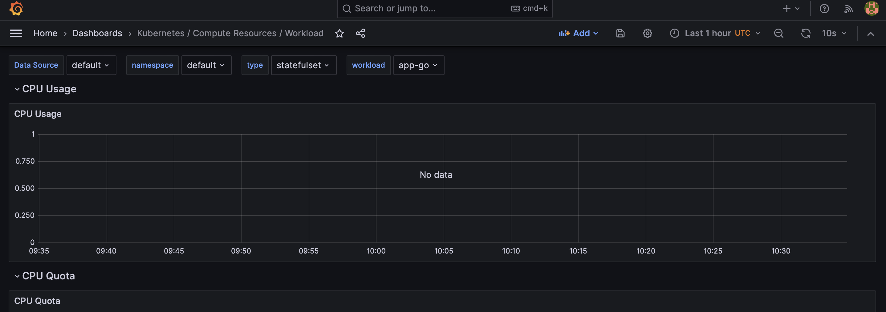
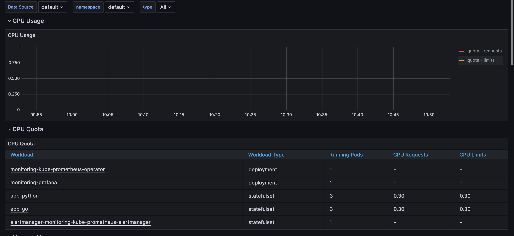
But if i look into prometheus data, i can see some information
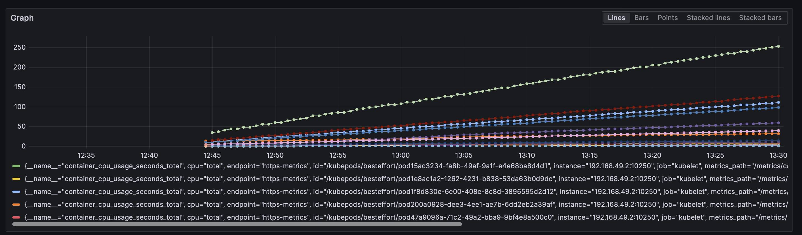
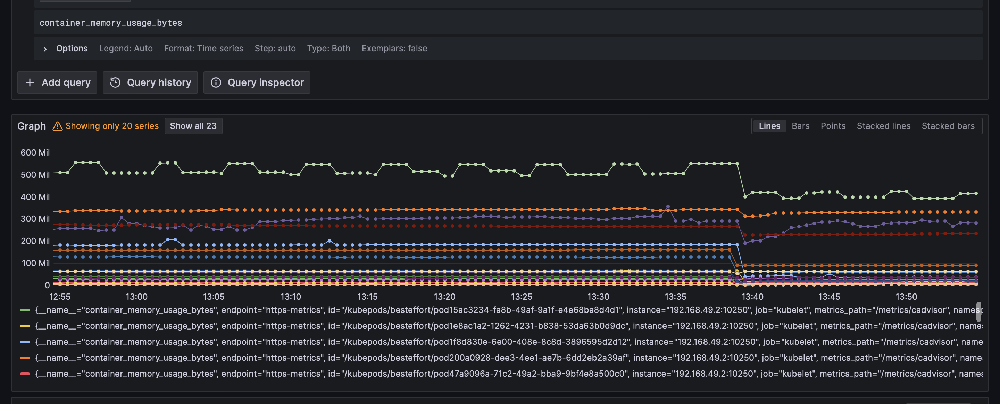
From these screenshots I can say that kubelet has the highest cpu usage

### Node memory usage
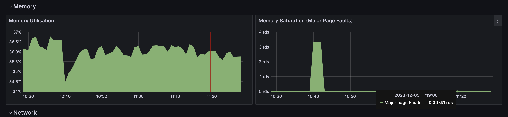

### Number of pods and containers managed by the Kubelet service
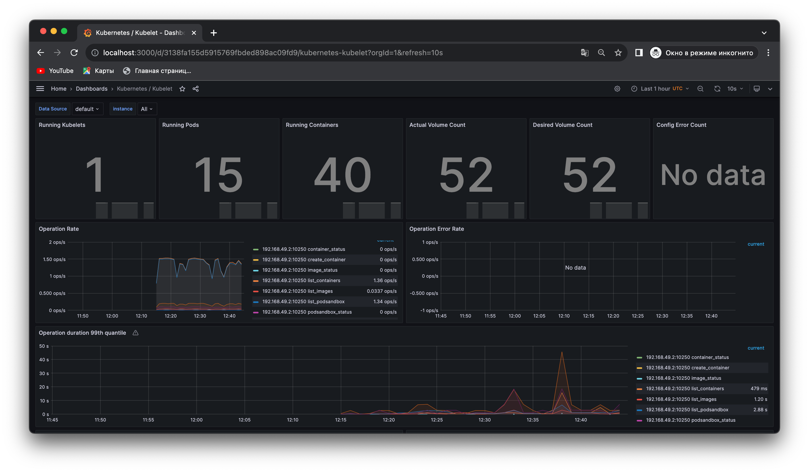

### Network usage of Pods
Dashboard still do not show any information 
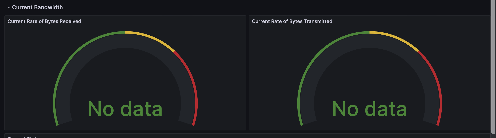
Prometheus:
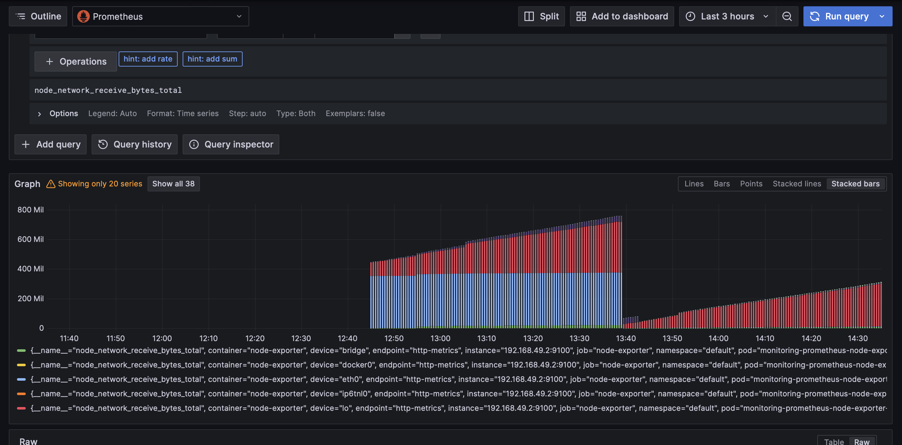
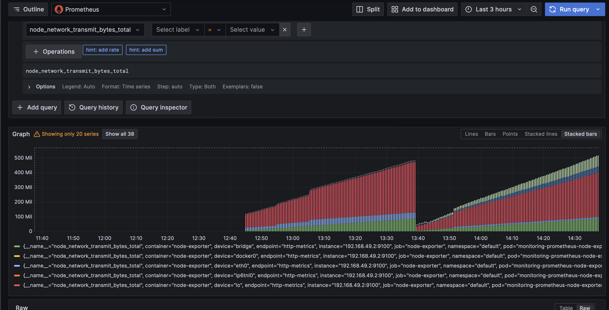

### Active alerts
Number of active alerts is 5 

Web Ui

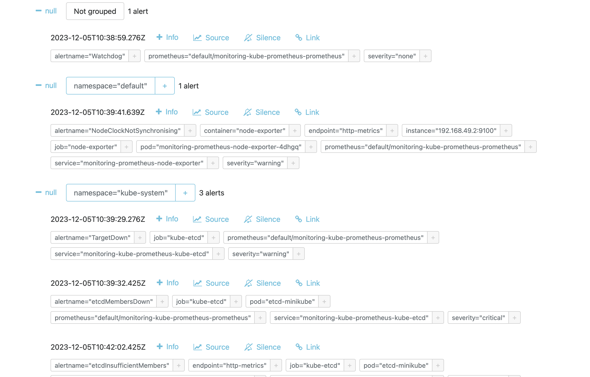

## Init containers
### Getting index.html
```
% kubectl exec app-python-0 -- cat /init_data/index.html
Defaulted container "app-python" out of: app-python, install (init)
<html><head></head><body><header>
<title>http://info.cern.ch</title>
</header>

<h1>http://info.cern.ch - home of the first website</h1>
<p>From here you can:</p>
<ul>
<li><a href="http://info.cern.ch/hypertext/WWW/TheProject.html">Browse the first website</a></li>
<li><a href="http://line-mode.cern.ch/www/hypertext/WWW/TheProject.html">Browse the first website using the line-mode browser simulator</a></li>
<li><a href="http://home.web.cern.ch/topics/birth-web">Learn about the birth of the web</a></li>
<li><a href="http://home.web.cern.ch/about">Learn about CERN, the physics laboratory where the web was born</a></li>
</ul>
</body></html>
```
### Bonus task:
```
% kubectl exec app-python-0 -- cat /init_data/text.txt  
Defaulted container "app-python" out of: app-python, install (init), append-line-1 (init), append-line-2 (init), append-line-3 (init)
this
is
lab 14
```

## Metrics 
I have created `prometheus/values.yaml` file to override configurations
```
helm install -f prometheus/values.yaml monitoring prometheus-community/kube-prometheus-stack
```
Getting metrics for python app:
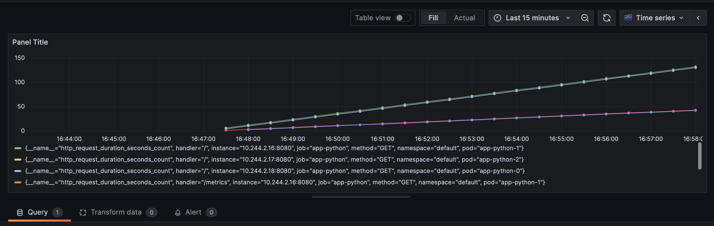
