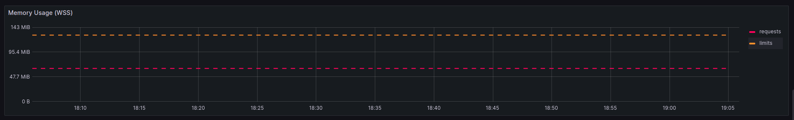
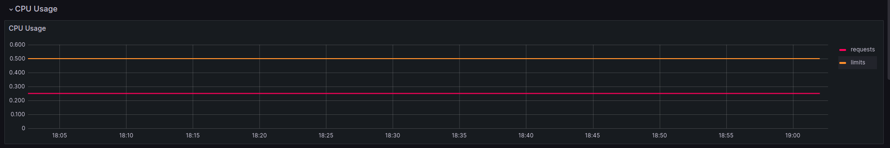
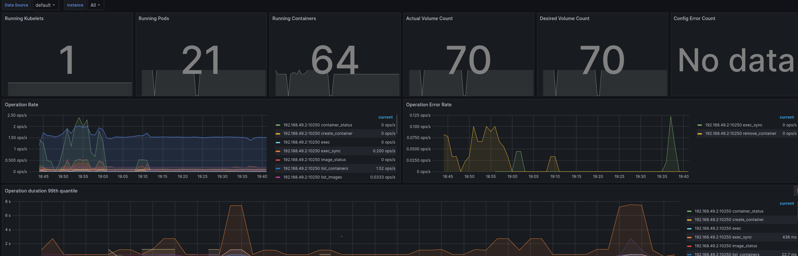
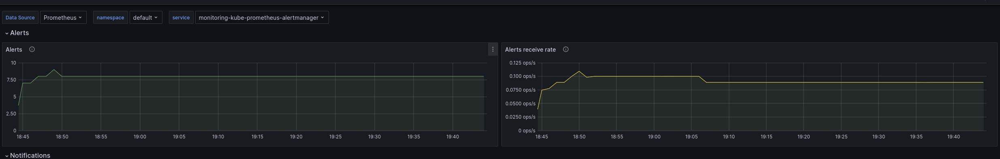
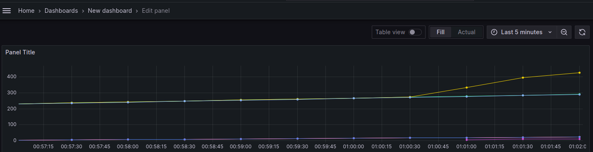

# Task 1

### Installation

```bash
helm repo add prometheus-community https://prometheus-community.github.io/helm-charts
helm repo update
```
output
```bash
ublunta@lenovo:~/Projects/core-course-labs/k8s$ helm repo add prometheus-community https://prometheus-community.github.io/helm-charts
"prometheus-community" has been added to your repositories
ublunta@lenovo:~/Projects/core-course-labs/k8s$ helm repo update
Hang tight while we grab the latest from your chart repositories...
...Successfully got an update from the "hashicorp" chart repository
...Successfully got an update from the "prometheus-community" chart repository
Update Complete. ⎈Happy Helming!⎈
```

```bash
helm install monitoring prometheus-community/kube-prometheus-stack
```

```bash
ublunta@lenovo:~/Projects/core-course-labs/k8s$ kubectl get po,sts,svc,pvc,cm
NAME                                                         READY   STATUS              RESTARTS      AGE
pod/alertmanager-monitoring-kube-prometheus-alertmanager-0   0/2     PodInitializing     0             3m29s
pod/monitoring-grafana-6f8d546676-ddrzf                      0/3     ContainerCreating   0             4m23s
pod/monitoring-kube-prometheus-operator-5fbb66b4b-bksv2      1/1     Running             0             4m23s
pod/monitoring-kube-state-metrics-74f4d8858f-dkrg7           1/1     Running             0             4m23s
pod/monitoring-prometheus-node-exporter-8m2k2                1/1     Running             0             4m23s
pod/prometheus-monitoring-kube-prometheus-prometheus-0       0/2     PodInitializing     0             3m29s
pod/python-app-python-0                                      1/1     Running             1 (12m ago)   6d22h
pod/python-app-python-1                                      1/1     Running             1 (12m ago)   6d22h
pod/python-app-python-2                                      1/1     Running             1 (12m ago)   6d22h
pod/vault-0                                                  1/1     Running             1 (12m ago)   6d22h

NAME                                                                    READY   AGE
statefulset.apps/alertmanager-monitoring-kube-prometheus-alertmanager   0/1     3m29s
statefulset.apps/prometheus-monitoring-kube-prometheus-prometheus       0/1     3m29s
statefulset.apps/python-app-python                                      3/3     6d22h
statefulset.apps/vault                                                  1/1     22d

NAME                                              TYPE           CLUSTER-IP       EXTERNAL-IP   PORT(S)                      AGE
service/alertmanager-operated                     ClusterIP      None             <none>        9093/TCP,9094/TCP,9094/UDP   3m29s
service/kubernetes                                ClusterIP      10.96.0.1        <none>        443/TCP                      6d22h
service/monitoring-grafana                        ClusterIP      10.105.254.129   <none>        80/TCP                       4m24s
service/monitoring-kube-prometheus-alertmanager   ClusterIP      10.101.153.225   <none>        9093/TCP,8080/TCP            4m24s
service/monitoring-kube-prometheus-operator       ClusterIP      10.100.15.53     <none>        443/TCP                      4m24s
service/monitoring-kube-prometheus-prometheus     ClusterIP      10.106.171.106   <none>        9090/TCP,8080/TCP            4m24s
service/monitoring-kube-state-metrics             ClusterIP      10.108.198.64    <none>        8080/TCP                     4m24s
service/monitoring-prometheus-node-exporter       ClusterIP      10.110.240.229   <none>        9100/TCP                     4m24s
service/prometheus-operated                       ClusterIP      None             <none>        9090/TCP                     3m29s
service/python-app-python                         LoadBalancer   10.99.129.178    <pending>     8000:31777/TCP               6d22h

NAME                                                        STATUS   VOLUME                                     CAPACITY   ACCESS MODES   STORAGECLASS   AGE
persistentvolumeclaim/counter-data-py-python-app-python-0   Bound    pvc-61dbaeb2-7b4b-485a-9807-efbc2be588a2   10Mi       RWO            standard       6d22h
persistentvolumeclaim/counter-data-py-python-app-python-1   Bound    pvc-f280e565-8107-428f-bae1-4b4940d03113   10Mi       RWO            standard       6d22h
persistentvolumeclaim/counter-data-py-python-app-python-2   Bound    pvc-94faed66-aa7a-49f5-af34-4eea2ed95d26   10Mi       RWO            standard       6d22h

NAME                                                                     DATA   AGE
configmap/config-map-entity-py                                           2      6d22h
configmap/kube-root-ca.crt                                               1      34d
configmap/monitoring-grafana                                             1      4m24s
configmap/monitoring-grafana-config-dashboards                           1      4m24s
configmap/monitoring-kube-prometheus-alertmanager-overview               1      4m24s
configmap/monitoring-kube-prometheus-apiserver                           1      4m24s
configmap/monitoring-kube-prometheus-cluster-total                       1      4m24s
configmap/monitoring-kube-prometheus-controller-manager                  1      4m24s
configmap/monitoring-kube-prometheus-etcd                                1      4m24s
configmap/monitoring-kube-prometheus-grafana-datasource                  1      4m24s
configmap/monitoring-kube-prometheus-grafana-overview                    1      4m24s
configmap/monitoring-kube-prometheus-k8s-coredns                         1      4m24s
configmap/monitoring-kube-prometheus-k8s-resources-cluster               1      4m24s
configmap/monitoring-kube-prometheus-k8s-resources-multicluster          1      4m24s
configmap/monitoring-kube-prometheus-k8s-resources-namespace             1      4m24s
configmap/monitoring-kube-prometheus-k8s-resources-node                  1      4m24s
configmap/monitoring-kube-prometheus-k8s-resources-pod                   1      4m24s
configmap/monitoring-kube-prometheus-k8s-resources-workload              1      4m24s
configmap/monitoring-kube-prometheus-k8s-resources-workloads-namespace   1      4m24s
configmap/monitoring-kube-prometheus-kubelet                             1      4m24s
configmap/monitoring-kube-prometheus-namespace-by-pod                    1      4m24s
configmap/monitoring-kube-prometheus-namespace-by-workload               1      4m24s
configmap/monitoring-kube-prometheus-node-cluster-rsrc-use               1      4m24s
configmap/monitoring-kube-prometheus-node-rsrc-use                       1      4m24s
configmap/monitoring-kube-prometheus-nodes                               1      4m24s
configmap/monitoring-kube-prometheus-nodes-darwin                        1      4m24s
configmap/monitoring-kube-prometheus-persistentvolumesusage              1      4m24s
configmap/monitoring-kube-prometheus-pod-total                           1      4m24s
configmap/monitoring-kube-prometheus-prometheus                          1      4m24s
configmap/monitoring-kube-prometheus-proxy                               1      4m24s
configmap/monitoring-kube-prometheus-scheduler                           1      4m24s
configmap/monitoring-kube-prometheus-workload-total                      1      4m24s
configmap/prometheus-monitoring-kube-prometheus-prometheus-rulefiles-0   34     3m29s
```

### Pods
pod/alertmanager-monitoring-kube-prometheus-alertmanager-0   0/2     PodInitializing     0             3m29s - pod for alert manager
pod/monitoring-grafana-6f8d546676-ddrzf                      0/3     ContainerCreating   0             4m23s - pod of grafana for visualing and other functions
pod/monitoring-kube-prometheus-operator-5fbb66b4b-bksv2      1/1     Running             0             4m23s - pod prometheus operator
pod/monitoring-kube-state-metrics-74f4d8858f-dkrg7           1/1     Running             0             4m23s - pod that generates metrics from k8s
pod/monitoring-prometheus-node-exporter-8m2k2                1/1     Running             0             4m23s - node exporter for prometheus
pod/prometheus-monitoring-kube-prometheus-prometheus-0       0/2     PodInitializing     0             3m29s - pod with prometheus
pod/python-app-python-0                                      1/1     Running             1 (12m ago)   6d22h - pod of my appliaction
pod/vault-0                                                  1/1     Running             1 (12m ago)   6d22h - pod of vault

### PersistentVolumeClaims
persistentvolumeclaim is created for every instance of my application

### ConfigMaps
There is  `configmap/config-map-entity-py` for my python application.  Others are for configuration of kube-prometheus-stack.

### Statefulsets
statefulset.apps/alertmanager-monitoring-kube-prometheus-alertmanager   0/1     3m29s - alert manager
statefulset.apps/prometheus-monitoring-kube-prometheus-prometheus       0/1     3m29s -  prometheus
statefulset.apps/python-app-python                                      3/3     6d22h - statefulsets for my application
statefulset.apps/vault                                                  1/1     22d - vault

The utilization of statefulset by Alert Manager and Prometheus is essential due to the requirement of these applications to persistently preserve their state and configuration data throughout pod restarts and scaling activities.

### Services
Services corresponds my applications and kubernets and for kube-prometheus-stack.

## Graphana
Minikube doesn't allow to access the `ClusterIP` services. I will use `port forwarding`:

```bash
kubectl port-forward svc/monitoring-grafana 8008:80
```

### CPU and Memory
Python app memory usage
 

Python app cpu usage


### Pods


### Alerts


## Init containers (for bonus also!)
```bash
kubectl exec python-app-python-0 -- cat /init_data/file
```

```bash
Defaulted container "app-python" out of: app-python, install (init), queue-0 (init), queue-1 (init), queue-2 (init)
big
brother
```

```bash
kubectl exec python-app-python-0 -- cat /init_data/index.html
```

```bash
Defaulted container "app-python" out of: app-python, install (init), queue-0 (init), queue-1 (init), queue-2 (init)
<html><head></head><body><header>
<title>http://info.cern.ch</title>
</header>

<h1>http://info.cern.ch - home of the first website</h1>
<p>From here you can:</p>
<ul>
<li><a href="http://info.cern.ch/hypertext/WWW/TheProject.html">Browse the first website</a></li>
<li><a href="http://line-mode.cern.ch/www/hypertext/WWW/TheProject.html">Browse the first website using the line-mode browser simulator</a></li>
<li><a href="http://home.web.cern.ch/topics/birth-web">Learn about the birth of the web</a></li>
<li><a href="http://home.web.cern.ch/about">Learn about CERN, the physics laboratory where the web was born</a></li>
</ul>
</body></html>
```

## Metrics from app

According to [guide](https://helm.sh/docs/intro/using_helm/#customizing-the-chart-before-installing) and
[list](https://github.com/prometheus-community/helm-charts/blob/main/charts/kube-prometheus-stack/values.yaml)

```shell
helm install -f prometheus/values.yaml monitoring prometheus-community/kube-prometheus-stack
```

