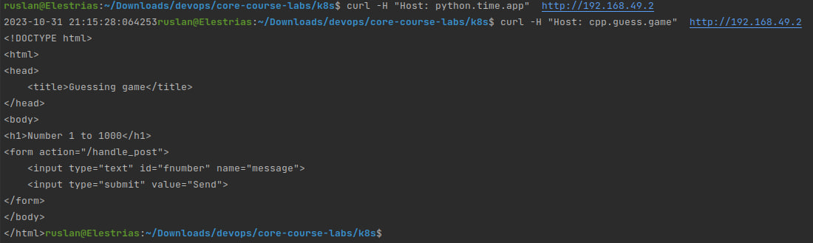
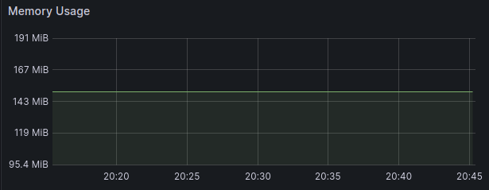
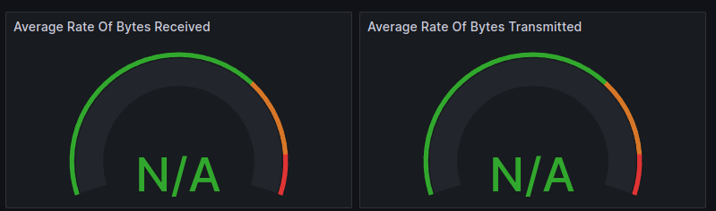
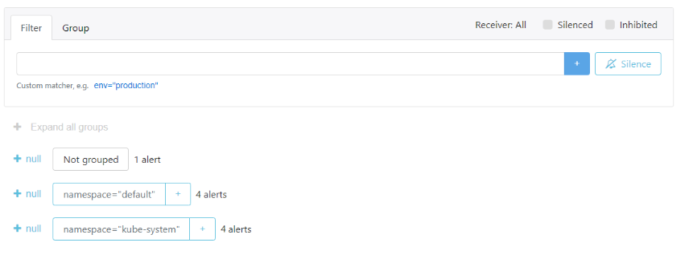

# Components

- The Prometheus Operator: it automates Prometheus based monitoring. It offers management Prometheus and associated monitoring components, and Kubernetes deployment.
- Prometheus: a program for alerting and monitoring events
- Alertmanager: it manages notifications that are sent by client programs like Prometheus.
- Prometheus node-exporter: it gathers every hardware and operating system level metric that are exposed by the kernel.
- Prometheus Adapter for Kubernetes Metrics APIs: it regularly collects available metrics from Prometheus and then provides only metrics that match a certain form.
- kube-state-metrics: a service that listens to the Kubernetes and generates metrics about the state of health of the objects inside Kubernetes components.
- Grafana: data visualization system that collects data from monitoring applications, it allows to configure charts, graphs, and alerts.

# Commands output

- ```kubectl get po,sts,svc,pvc,cm```
  ```
  NAME                                                         READY   STATUS    RESTARTS   AGE
  pod/alertmanager-monitoring-kube-prometheus-alertmanager-0   2/2     Running   0          2m45s
  pod/lab10chart-0                                             1/1     Running   0          5m44s
  pod/lab10chart-1                                             1/1     Running   0          5m44s
  pod/lab10chart-2                                             1/1     Running   0          5m44s
  pod/monitoring-grafana-b45а84378-glmqb                       3/3     Running   0          4m21s
  pod/monitoring-kube-prometheus-operator-k4ufv2c6-p39bv       1/1     Running   0          4m21s
  pod/monitoring-kube-state-metrics-84657fd9k5-4fjvd           1/1     Running   0          4m21s
  pod/monitoring-prometheus-node-exporter-k6c4n                1/1     Running   0          4m21s
  pod/prometheus-monitoring-kube-prometheus-prometheus-0       2/2     Running   0          2m45s
  
  NAME                                                                    READY   AGE
  statefulset.apps/alertmanager-monitoring-kube-prometheus-alertmanager   1/1     2m45s
  statefulset.apps/lab10chart                                             3/3     5m44s
  statefulset.apps/prometheus-prometheus-kube-prometheus-prometheus       1/1     3m19s
  
  NAME                                              TYPE        CLUSTER-IP       EXTERNAL-IP   PORT(S)                      AGE
  service/alertmanager-operated                     ClusterIP   None             <none>        9093/TCP,9094/TCP,9094/UDP   2m45s
  service/kubernetes                                ClusterIP   10.96.0.1        <none>        443/TCP                      6m37s
  service/lab10chart                                ClusterIP   10.104.48.72     <none>        5000/TCP                     5m44s
  service/monitoring-grafana                        ClusterIP   10.98.143.77     <none>        80/TCP                       4m21s
  service/monitoring-kube-prometheus-alertmanager   ClusterIP   10.132.67.121    <none>        9093/TCP,8080/TCP            4m21s
  service/monitoring-kube-prometheus-operator       ClusterIP   10.110.84.24     <none>        443/TCP                      4m21s
  service/monitoring-kube-prometheus-prometheus     ClusterIP   10.108.177.38    <none>        9090/TCP,8080/TCP            4m21s
  service/monitoring-kube-state-metrics             ClusterIP   10.103.129.8     <none>        8080/TCP                     4m21s
  service/prometheus-operated                       ClusterIP   None             <none>        9090/TCP                     3m19s
  service/monitoring-prometheus-node-exporter       ClusterIP   10.85.173.63     <none>        9100/TCP                     4m21s
  
  NAME                                                                     DATA   AGE
  configmap/configmap                                                      1      5m44s
  configmap/kube-root-ca.crt                                               1      6m37s
  configmap/monitoring-grafana                                             1      4m21s
  configmap/monitoring-grafana-config-dashboards                           1      4m21s
  configmap/monitoring-kube-prometheus-alertmanager-overview               1      4m21s
  configmap/monitoring-kube-prometheus-apiserver                           1      4m21s
  configmap/monitoring-kube-prometheus-cluster-total                       1      4m21s
  configmap/monitoring-kube-prometheus-controller-manager                  1      4m21s
  configmap/monitoring-kube-prometheus-etcd                                1      4m21s
  configmap/monitoring-kube-prometheus-grafana-datasource                  1      4m21s
  configmap/monitoring-kube-prometheus-grafana-overview                    1      4m21s
  configmap/monitoring-kube-prometheus-k8s-coredns                         1      4m21s
  configmap/monitoring-kube-prometheus-k8s-resources-cluster               1      4m21s
  configmap/monitoring-kube-prometheus-k8s-resources-multicluster          1      4m21s
  configmap/monitoring-kube-prometheus-k8s-resources-namespace             1      4m21s
  configmap/monitoring-kube-prometheus-k8s-resources-node                  1      4m21s
  configmap/monitoring-kube-prometheus-k8s-resources-pod                   1      4m21s
  configmap/monitoring-kube-prometheus-k8s-resources-workload              1      4m21s
  configmap/monitoring-kube-prometheus-k8s-resources-workloads-namespace   1      4m21s
  configmap/monitoring-kube-prometheus-kubelet                             1      4m21s
  configmap/monitoring-kube-prometheus-namespace-by-pod                    1      4m21s
  configmap/monitoring-kube-prometheus-namespace-by-workload               1      4m21s
  configmap/monitoring-kube-prometheus-node-cluster-rsrc-use               1      4m21s
  configmap/monitoring-kube-prometheus-node-rsrc-use                       1      4m21s
  configmap/monitoring-kube-prometheus-nodes                               1      4m21s
  configmap/monitoring-kube-prometheus-nodes-darwin                        1      4m21s
  configmap/monitoring-kube-prometheus-persistentvolumesusage              1      4m21s
  configmap/monitoring-kube-prometheus-pod-total                           1      4m21s
  configmap/monitoring-kube-prometheus-prometheus                          1      4m21s
  configmap/monitoring-kube-prometheus-proxy                               1      4m21s
  configmap/monitoring-kube-prometheus-scheduler                           1      4m21s
  configmap/monitoring-kube-prometheus-workload-total                      1      4m21s
  configmap/prometheus-monitoring-kube-prometheus-prometheus-rulefiles-0   34     2m45s
  ```
  
## Explanation of each part

- pods - here we can pay attention to the new pods:
  - alertmanager-monitoring-kube-prometheus-alertmanager - pod for alert manager
  - monitoring-grafana - pod for grafana
  - monitoring-kube-prometheus-operator - pod for prometheus operator
  - monitoring-kube-state-metrics - pod for kube-state-metrics
  - monitoring-prometheus-node-exporter - pod for node exporter
  - prometheus-monitoring-kube-prometheus-prometheus - pod for prometheus
- statefulsets - here we can pay attention to the new statefulsets:
  - alertmanager-monitoring-kube-prometheus-alertmanager - statefulset for alertmanager
  - prometheus-prometheus-kube-prometheus-prometheus - statefulset for prometheus
- services - here we can pay attention to the new services:
  - alertmanager-operated - alertmanager-operated service
  - monitoring-grafana - grafana service       
  - monitoring-kube-prometheus-alertmanager - prometheus-alertmanager service
  - monitoring-kube-prometheus-operator - prometheus-operator service       
  - monitoring-kube-prometheus-prometheus - prometheus service     
  - monitoring-kube-state-metrics - kube-state-metrics service             
  - prometheus-operated - prometheus-operated service                       
  - monitoring-prometheus-node-exporter - node exporter service
- configmap - configmaps for the Kube Prometheus Stack configuration
  
# Explore existing dashboards to find information about your cluster

- CPU and Memory usage
  - 
  - 
- Pods and containers
  - 
- Network usage
  - 
- Alerts
  - 