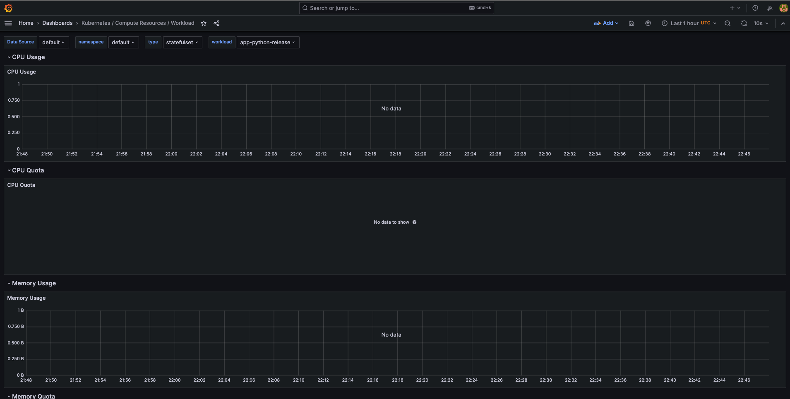
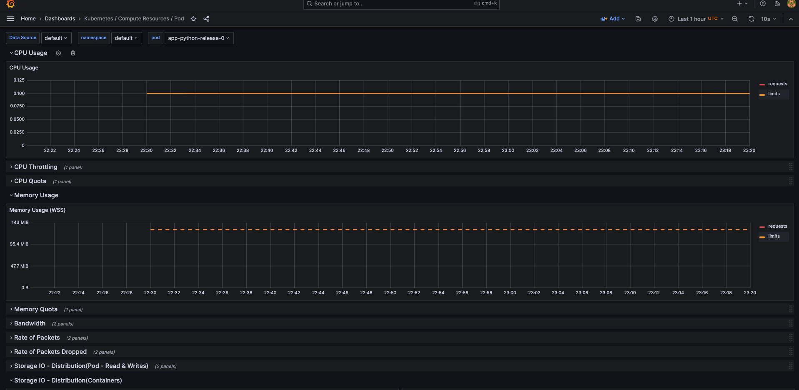
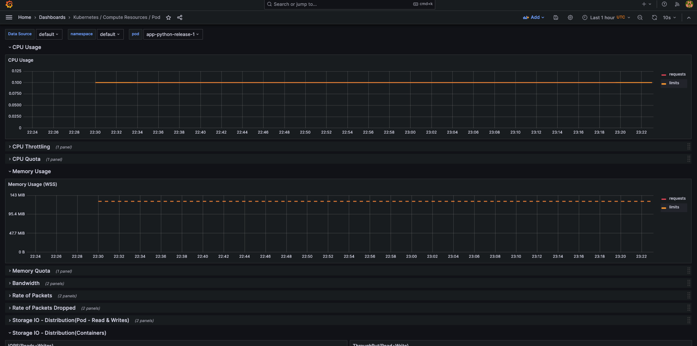
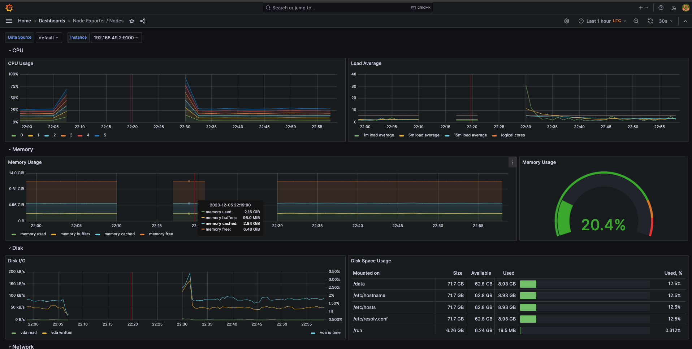
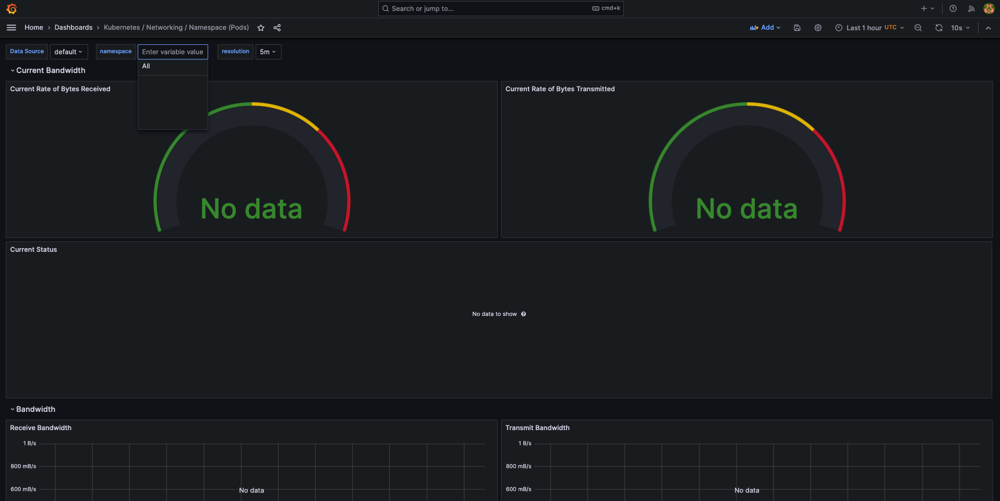
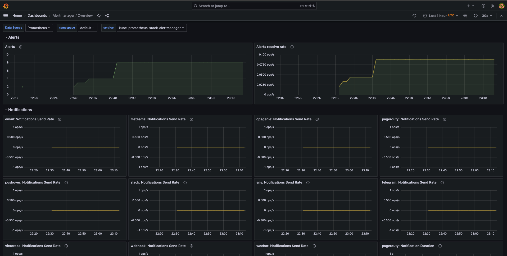
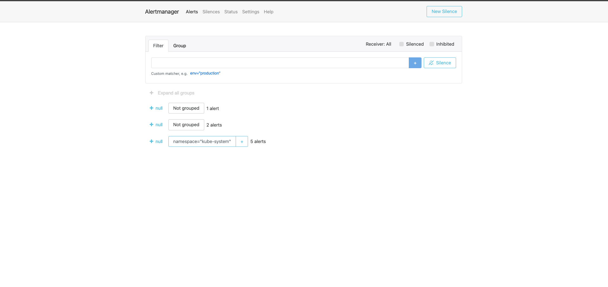
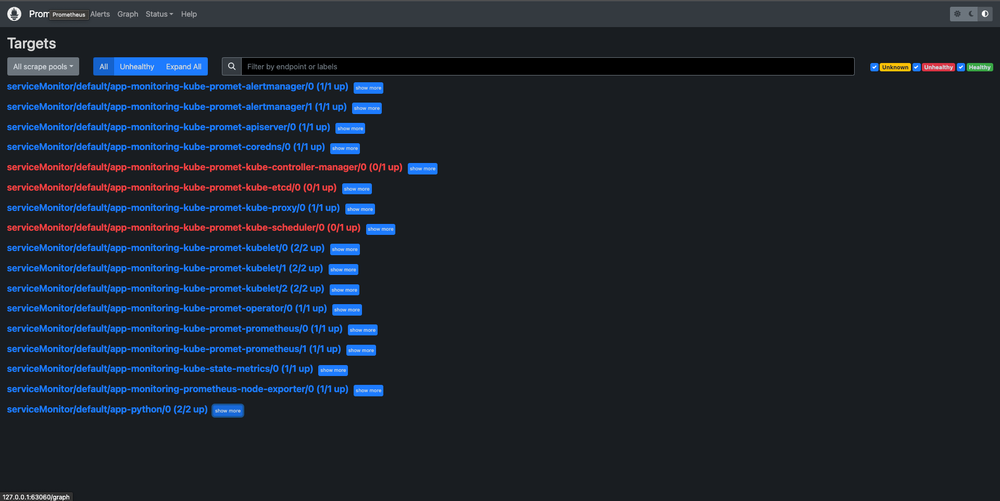
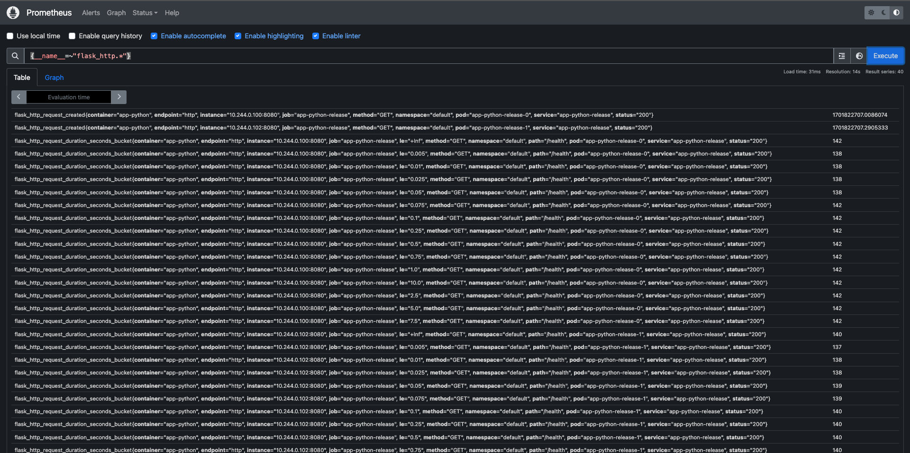

# Kubernetes Monitoring and Init Containers

In this lab I have used `kube-prometheus-stack` for monitoring **k8s**.
### Components of `kube-prometheus-stack`

1. **Graphana** - dashboards for monitoring
2. **Prometheus** - monitoring system
3. **Prometheus operator** - provides Kubernetes native deployment 
4. **Alertmanager** - handles alerts sent by client applications
5. **Node Exporter** - monitor the host system
6. **`kube-state-metrics`** - collects data on cluster itself

---

# Monitoring

1. ```shell
    helm install kube-prometheus-stack prometheus-community/kube-prometheus-stack
   ```
2. ```shell
   helm secrets install app-python-release app-python -f ./secrets.yaml
   ```
3. ```shell
   kubectl get po,sts,svc,pvc,cm
   ```
   <u>Ouput:</u>
    ```text
    NAME                                                            READY   STATUS    RESTARTS        AGE
    pod/alertmanager-kube-prometheus-stack-alertmanager-0           2/2     Running   0               155m
    pod/app-python-release-0                                        1/1     Running   0               151m
    pod/app-python-release-1                                        1/1     Running   0               151m
    pod/kube-prometheus-stack-grafana-56bf765f49-gphlx              3/3     Running   0               158m
    pod/kube-prometheus-stack-kube-state-metrics-5c68dd7f45-vcnp6   1/1     Running   0               158m
    pod/kube-prometheus-stack-operator-7db8f987bb-6qfmx             1/1     Running   0               158m
    pod/kube-prometheus-stack-prometheus-node-exporter-xtdn8        1/1     Running   0               158m
    pod/prometheus-kube-prometheus-stack-prometheus-0               2/2     Running   0               155m
    pod/vault-0                                                     1/1     Running   1 (6d22h ago)   7d1h
    pod/vault-agent-injector-5cd8b87c6c-98r7s                       1/1     Running   1 (6d22h ago)   7d1h

    NAME                                                               READY   AGE
    statefulset.apps/alertmanager-kube-prometheus-stack-alertmanager   1/1     155m
    statefulset.apps/app-python-release                                2/2     151m
    statefulset.apps/prometheus-kube-prometheus-stack-prometheus       1/1     155m
    statefulset.apps/vault                                             1/1     7d1h

    NAME                                                     TYPE        CLUSTER-IP       EXTERNAL-IP   PORT(S)                      AGE
    service/alertmanager-operated                            ClusterIP   None             <none>        9093/TCP,9094/TCP,9094/UDP   155m
    service/app-python-release                               ClusterIP   10.106.232.95    <none>        8080/TCP                     151m
    service/kube-prometheus-stack-alertmanager               ClusterIP   10.98.192.198    <none>        9093/TCP,8080/TCP            158m
    service/kube-prometheus-stack-grafana                    ClusterIP   10.104.217.185   <none>        80/TCP                       158m
    service/kube-prometheus-stack-kube-state-metrics         ClusterIP   10.102.169.216   <none>        8080/TCP                     158m
    service/kube-prometheus-stack-operator                   ClusterIP   10.111.188.28    <none>        443/TCP                      158m
    service/kube-prometheus-stack-prometheus                 ClusterIP   10.107.76.168    <none>        9090/TCP,8080/TCP            158m
    service/kube-prometheus-stack-prometheus-node-exporter   ClusterIP   10.96.87.60      <none>        9100/TCP                     158m
    service/kubernetes                                       ClusterIP   10.96.0.1        <none>        443/TCP                      15d
    service/prometheus-operated                              ClusterIP   None             <none>        9090/TCP                     155m
    service/vault                                            ClusterIP   10.111.176.177   <none>        8200/TCP,8201/TCP            7d1h
    service/vault-agent-injector-svc                         ClusterIP   10.100.254.217   <none>        443/TCP                      7d1h
    service/vault-internal                                   ClusterIP   None             <none>        8200/TCP,8201/TCP            7d1h

    NAME                                                STATUS   VOLUME                                     CAPACITY   ACCESS MODES   STORAGECLASS   AGE
    persistentvolumeclaim/data-vault-0                  Bound    pvc-26ef7146-07d1-4265-be8e-98c6d5987215   10Gi       RWO            standard       7d1h
    persistentvolumeclaim/visits-app-kotlin-release-0   Bound    pvc-e8a3a24e-d674-4e07-b643-0ce7dd391629   1Mi        RWO            standard       7d1h
    persistentvolumeclaim/visits-app-kotlin-release-1   Bound    pvc-87461b41-3f53-481c-a808-e7694c89772e   1Mi        RWO            standard       7d1h
    persistentvolumeclaim/visits-app-python-release-0   Bound    pvc-5dcc7221-be50-4c5e-b09e-896540ffc20b   1Mi        RWO            standard       7d3h
    persistentvolumeclaim/visits-app-python-release-1   Bound    pvc-19a61356-a4c0-4dc5-9a53-25e7179d6c9d   1Mi        RWO            standard       7d2h

    NAME                                                                DATA   AGE
    configmap/configmap                                                 1      151m
    configmap/kube-prometheus-stack-alertmanager-overview               1      158m
    configmap/kube-prometheus-stack-apiserver                           1      158m
    configmap/kube-prometheus-stack-cluster-total                       1      158m
    configmap/kube-prometheus-stack-controller-manager                  1      158m
    configmap/kube-prometheus-stack-etcd                                1      158m
    configmap/kube-prometheus-stack-grafana                             1      158m
    configmap/kube-prometheus-stack-grafana-config-dashboards           1      158m
    configmap/kube-prometheus-stack-grafana-datasource                  1      158m
    configmap/kube-prometheus-stack-grafana-overview                    1      158m
    configmap/kube-prometheus-stack-k8s-coredns                         1      158m
    configmap/kube-prometheus-stack-k8s-resources-cluster               1      158m
    configmap/kube-prometheus-stack-k8s-resources-multicluster          1      158m
    configmap/kube-prometheus-stack-k8s-resources-namespace             1      158m
    configmap/kube-prometheus-stack-k8s-resources-node                  1      158m
    configmap/kube-prometheus-stack-k8s-resources-pod                   1      158m
    configmap/kube-prometheus-stack-k8s-resources-workload              1      158m
    configmap/kube-prometheus-stack-k8s-resources-workloads-namespace   1      158m
    configmap/kube-prometheus-stack-kubelet                             1      158m
    configmap/kube-prometheus-stack-namespace-by-pod                    1      158m
    configmap/kube-prometheus-stack-namespace-by-workload               1      158m
    configmap/kube-prometheus-stack-node-cluster-rsrc-use               1      158m
    configmap/kube-prometheus-stack-node-rsrc-use                       1      158m
    configmap/kube-prometheus-stack-nodes                               1      158m
    configmap/kube-prometheus-stack-nodes-darwin                        1      158m
    configmap/kube-prometheus-stack-persistentvolumesusage              1      158m
    configmap/kube-prometheus-stack-pod-total                           1      158m
    configmap/kube-prometheus-stack-prometheus                          1      158m
    configmap/kube-prometheus-stack-proxy                               1      158m
    configmap/kube-prometheus-stack-scheduler                           1      158m
    configmap/kube-prometheus-stack-workload-total                      1      158m
    configmap/kube-root-ca.crt                                          1      15d
    configmap/prometheus-kube-prometheus-stack-prometheus-rulefiles-0   34     155m
    ```
    **Explanation:**

    <u>Pods:</u>
    * The pod `alertmanager-kube-prometheus-stack-alertmanager-0` functions as the alert manager.
    * `kube-prometheus-stack-grafana-56bf765f49-gphlx` is a pod equipped with **Grafana**.
    * `kube-prometheus-stack-kube-state-metrics-5c68dd7f45-vcnp6` is a pod that contains `kube-state-metrics`.
    * The pod `pod/kube-prometheus-stack-operator-7db8f987bb-6qfmx ` operates with the **Prometheus Operator**.
    * `kube-prometheus-stack-prometheus-node-exporter-xtdn8` is a pod featuring the `node-exporter`.
    * The pod `prometheus-kube-prometheus-stack-prometheus-0` houses **Prometheus** itself.

    <u>StatefulSets:</u>
    * The stateful set `alertmanager-kube-prometheus-stack-alertmanager` improves the reliability of AlertManager.
    * `prometheus-kube-prometheus-stack-prometheus` is a stateful set of Prometheus designed for reliability.

    <u>Services</u> correspond to components of the stack that are engaged in these processes.

    <u>Volumes</u>, which were established in the previous lab, remain.

    <u>ConfigMaps</u>, used for the internal processes of the Kube Prometheus Stack, can be seen.

4. ```shell
   minikube service kube-prometheus-stack-grafana
   ```
   <u>Output:</u>
   ```text
    | NAMESPACE |             NAME              | TARGET PORT |     URL      |
    |-----------|-------------------------------|-------------|--------------|
    | default   | kube-prometheus-stack-grafana |             | No node port |
    |-----------|-------------------------------|-------------|--------------|
    😿  service default/kube-prometheus-stack-grafana has no node port
    🏃  Starting tunnel for service kube-prometheus-stack-grafana.
    |-----------|-------------------------------|-------------|------------------------|
    | NAMESPACE |             NAME              | TARGET PORT |          URL           |
    |-----------|-------------------------------|-------------|------------------------|
    | default   | kube-prometheus-stack-grafana |             | http://127.0.0.1:55126 |
    |-----------|-------------------------------|-------------|------------------------|
    🎉  Opening service default/kube-prometheus-stack-grafana in default browser...
    ❗  Because you are using a Docker driver on darwin, the terminal needs to be open to run it.
   ```

## Results
* CPU and Memory consumption of application StatefulSet
  
* Pods with higher and lower CPU usage in the default namespace
  * Application Pod-0
    
  * Application Pod-1
    
  Here we can see there is not enough data to compare resources usage.
* Node memory usage in percentage and megabytes 
  
* The number of pods and containers managed by the Kubelet service
  
* Network usage of Pods in the default namespace
  
* The number of active alerts in **Grafana**
  
* **AlertManager** Web UI page
  

# Init Containers
I have implemented 3 init container which download the same html page into 4 different files and save to main container into directory `/init-files`.
* `index-0.html`
* `index-1.html`
* `index-2.html`
* `index-3.html`

Let's check:
* ```shell
  kubectl get po
  ```
  <u>Output:</u>
  ```text
  NAME                                                        READY   STATUS    RESTARTS       AGE
  alertmanager-kube-prometheus-stack-alertmanager-0           2/2     Running   0              139m
  app-python-release-0                                        1/1     Running   0              6m7s
  app-python-release-1                                        1/1     Running   0              6m7s
  kube-prometheus-stack-grafana-56bf765f49-pb4nt              3/3     Running   0              139m
  kube-prometheus-stack-kube-state-metrics-5c68dd7f45-ftqnf   1/1     Running   0              139m
  kube-prometheus-stack-operator-7db8f987bb-rjhk6             1/1     Running   0              139m
  kube-prometheus-stack-prometheus-node-exporter-p24mm        1/1     Running   0              139m
  prometheus-kube-prometheus-stack-prometheus-0               2/2     Running   0              138m
  vault-0                                                     1/1     Running   1 (7d ago)     7d4h
  vault-agent-injector-5cd8b87c6c-98r7s                       1/1     Running   2 (103m ago)   7d4h
  ```
* ```shell
  kubectl exec app-python-release-0 -- ls /init-files
  ```
  <u>Output:</u>
  ```text
  index-0.html
  index-1.html
  index-2.html
  index-3.html
  ```
* ```shell
  kubectl exec app-python-release-0 -- cat /init-files/index-0.html
  ```
  <u>Output:</u>
  ```html
  <html><head></head><body><header>
  <title>http://info.cern.ch</title>
  </header>

  <h1>http://info.cern.ch - home of the first website</h1>
  <p>From here you can:</p>
  <ul>
  <li><a href="http://info.cern.ch/hypertext/WWW/TheProject.html">Browse the first website</a></li>
  <li><a href="http://line-mode.cern.ch/www/hypertext/WWW/TheProject.html">Browse the first website using the line-mode browser simulator</a></li>
  <li><a href="http://home.web.cern.ch/topics/birth-web">Learn about the birth of the web</a></li>
  <li><a href="http://home.web.cern.ch/about">Learn about CERN, the physics laboratory where the web was born</a></li>
  </ul>
  </body></html>
  ```

The contents of other files are the same.

# Application metrics fetching
I have created custom `k8s/metrics/values.yaml` for `prometheus-community/kube-prometheus-stack` chart and installed it.

* ```shell
  helm install app-monitoring prometheus-community/kube-prometheus-stack -f metrics/values.yaml
  ```

### Results:

