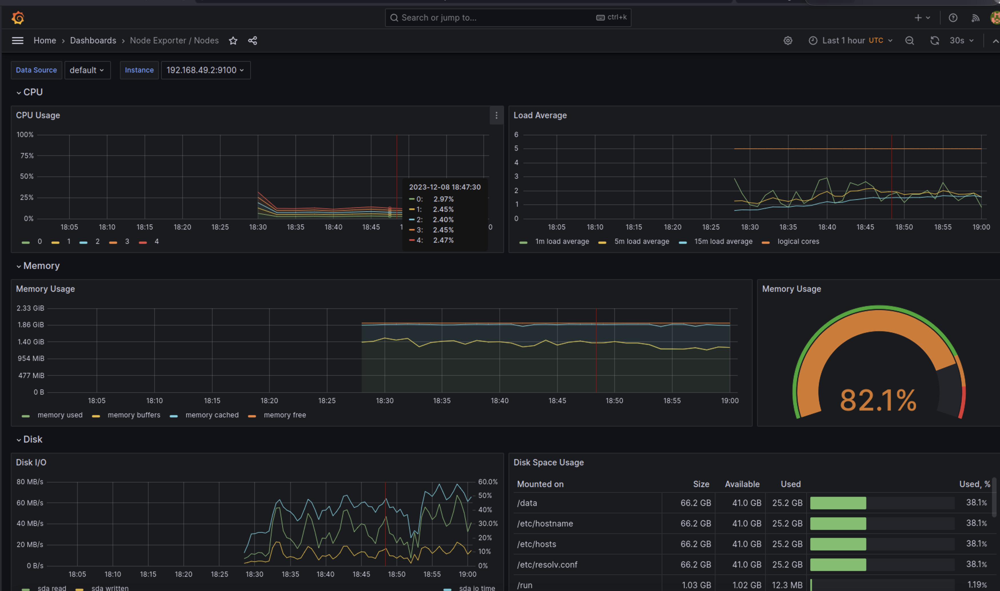
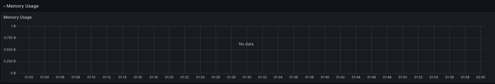
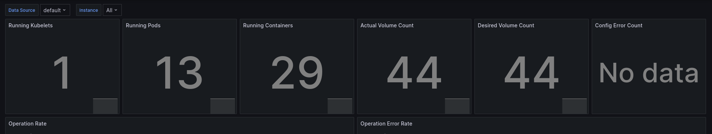
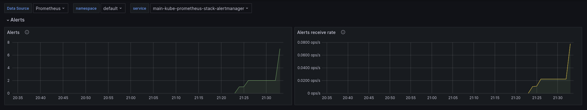

##  Kube Prometheus Stack

- Prometheus - collects and stores metrics from all services
- Alertmanager - entry point for alert reporting
- Node Exporter - collects metrics from system itself
- Prometheus operator - manages Prometheus and Alertmanager
- kube-state-metrics - collects metrics
- Graphana - visualizes metrics

```
NAME                                                         READY   STATUS              RESTARTS   AGE
pod/alertmanager-main-kube-prometheus-stack-alertmanager-0   0/2     Init:0/1            0          27s
pod/main-grafana-7779684f7c-jjt7f                            0/3     ContainerCreating   0          52s
pod/main-kube-prometheus-stack-operator-7d4fdd4cbd-rg7kf     1/1     Running             0          52s
pod/main-kube-state-metrics-649c85486f-b47nn                 0/1     ContainerCreating   0          52s
pod/main-prometheus-node-exporter-8snpq                      1/1     Running             0          52s
pod/postinstall-hook                                         0/1     Completed           0          6d22h
pod/preinstall-hook                                          0/1     Completed           0          6d22h
pod/prometheus-main-kube-prometheus-stack-prometheus-0       0/2     Init:0/1            0          26s

NAME                                                                    READY   AGE
statefulset.apps/alertmanager-main-kube-prometheus-stack-alertmanager   0/1     27s
statefulset.apps/prometheus-main-kube-prometheus-stack-prometheus       0/1     26s

NAME                                              TYPE        CLUSTER-IP      EXTERNAL-IP   PORT(S)                      AGE
service/alertmanager-operated                     ClusterIP   None            <none>        9093/TCP,9094/TCP,9094/UDP   27s
service/kubernetes                                ClusterIP   10.96.0.1       <none>        443/TCP                      20d
service/main-grafana                              ClusterIP   10.107.211.77   <none>        80/TCP                       52s
service/main-kube-prometheus-stack-alertmanager   ClusterIP   10.109.67.101   <none>        9093/TCP,8080/TCP            52s
service/main-kube-prometheus-stack-operator       ClusterIP   10.98.179.13    <none>        443/TCP                      52s
service/main-kube-prometheus-stack-prometheus     ClusterIP   10.108.55.122   <none>        9090/TCP,8080/TCP            52s
service/main-kube-state-metrics                   ClusterIP   10.107.184.67   <none>        8080/TCP                     52s
service/main-prometheus-node-exporter             ClusterIP   10.99.136.46    <none>        9100/TCP                     52s
service/prometheus-operated                       ClusterIP   None            <none>        9090/TCP                     26s

NAME                                                 STATUS   VOLUME                                     CAPACITY   ACCESS MODES   STORAGECLASS   AGE
persistentvolumeclaim/app-python-data-python-app-0   Bound    pvc-51dec323-94df-4c23-8c4f-96d748e21a74   10Mi       RWO            standard       7d

NAME                                                                     DATA   AGE
configmap/kube-root-ca.crt                                               1      20d
configmap/main-grafana                                                   1      52s
configmap/main-grafana-config-dashboards                                 1      52s
configmap/main-kube-prometheus-stack-alertmanager-overview               1      52s
configmap/main-kube-prometheus-stack-apiserver                           1      52s
configmap/main-kube-prometheus-stack-cluster-total                       1      52s
configmap/main-kube-prometheus-stack-controller-manager                  1      52s
configmap/main-kube-prometheus-stack-etcd                                1      52s
configmap/main-kube-prometheus-stack-grafana-datasource                  1      52s
configmap/main-kube-prometheus-stack-grafana-overview                    1      52s
configmap/main-kube-prometheus-stack-k8s-coredns                         1      52s
configmap/main-kube-prometheus-stack-k8s-resources-cluster               1      52s
configmap/main-kube-prometheus-stack-k8s-resources-multicluster          1      52s
configmap/main-kube-prometheus-stack-k8s-resources-namespace             1      52s
configmap/main-kube-prometheus-stack-k8s-resources-node                  1      52s
configmap/main-kube-prometheus-stack-k8s-resources-pod                   1      52s
configmap/main-kube-prometheus-stack-k8s-resources-workload              1      52s
configmap/main-kube-prometheus-stack-k8s-resources-workloads-namespace   1      52s
configmap/main-kube-prometheus-stack-kubelet                             1      52s
configmap/main-kube-prometheus-stack-namespace-by-pod                    1      52s
configmap/main-kube-prometheus-stack-namespace-by-workload               1      52s
configmap/main-kube-prometheus-stack-node-cluster-rsrc-use               1      52s
configmap/main-kube-prometheus-stack-node-rsrc-use                       1      52s
configmap/main-kube-prometheus-stack-nodes                               1      52s
configmap/main-kube-prometheus-stack-nodes-darwin                        1      52s
configmap/main-kube-prometheus-stack-persistentvolumesusage              1      52s
configmap/main-kube-prometheus-stack-pod-total                           1      52s
configmap/main-kube-prometheus-stack-prometheus                          1      52s
configmap/main-kube-prometheus-stack-proxy                               1      52s
configmap/main-kube-prometheus-stack-scheduler                           1      52s
configmap/main-kube-prometheus-stack-workload-total                      1      52s
configmap/prometheus-main-kube-prometheus-stack-prometheus-rulefiles-0   34     27s
```

### Pods

- `pod/alertmanager-main-kube-prometheus-stack-alertmanager-0` - Alertmanager pod
- `pod/main-grafana-7779684f7c-jjt7f` - Grafana pod
- `pod/main-kube-prometheus-stack-operator-7d4fdd4cbd-rg7kf` - Prometheus operator pod
- `pod/main-kube-state-metrics-649c85486f-b47nn` - kube-state-metrics pod
- `pod/main-prometheus-node-exporter-8snpq` - node-exporter pod
- `pod/prometheus-main-kube-prometheus-stack-prometheus-0` - Prometheus pod

### Statefulsets

- `statefulset.apps/alertmanager-main-kube-prometheus-stack-alertmanager` - Alertmanager statefulset
- `statefulset.apps/prometheus-main-kube-prometheus-stack-prometheus` - Prometheus statefulset

### Persistent volume claims

`persistentvolumeclaim/app-python-data-python-app-0` - for python-app pod

### Configmaps

Used for configuration of Prometheus, Alertmanager and Grafana

## Grafana Dashboards

### CPU and Memory

There are no information:




### Pods with higher and lower CPU usage and Node memory usage in percentage 

There are no inforamation as in the previous stage

### Number of pods and containers



### Network usage


### Number of active alerts

#### Grafana



#### Alertamanager

