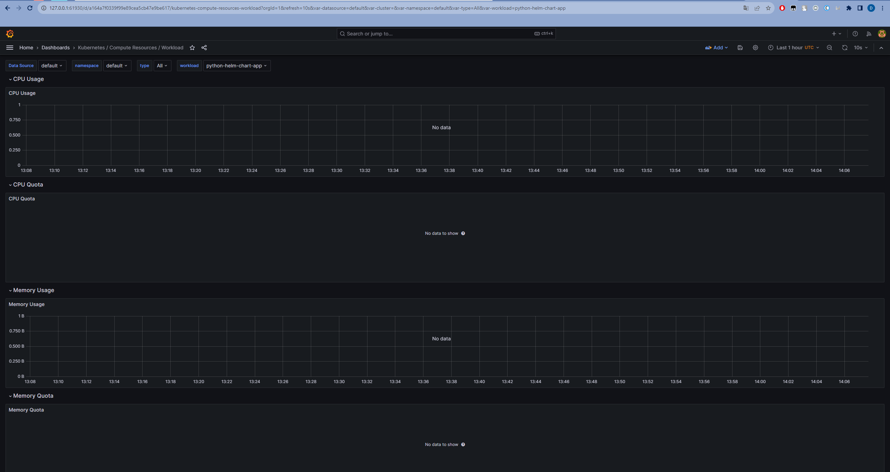
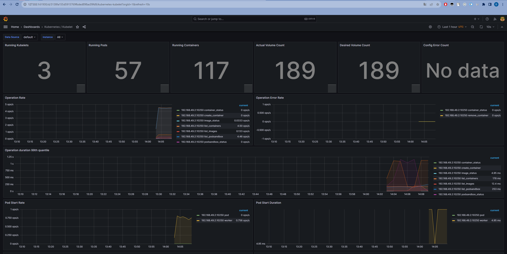
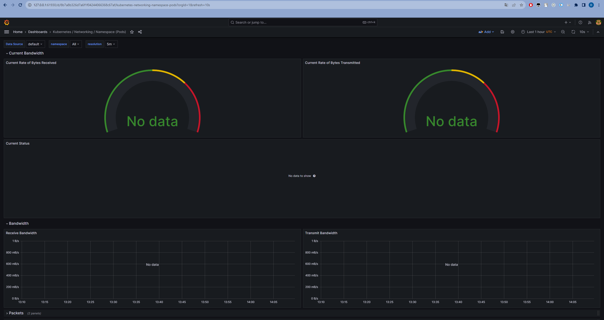
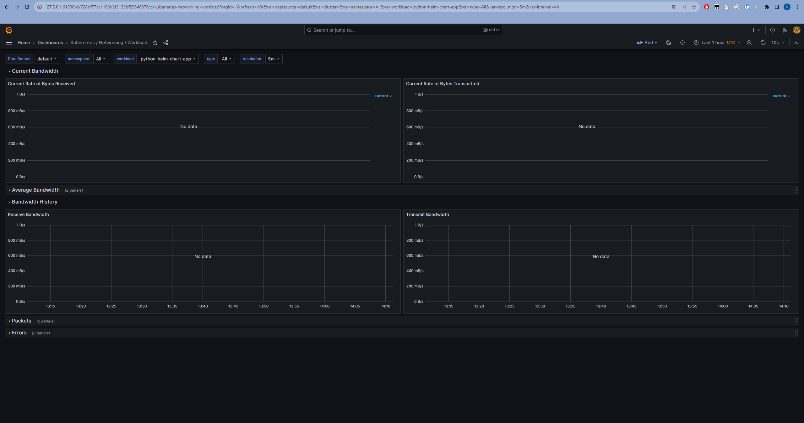
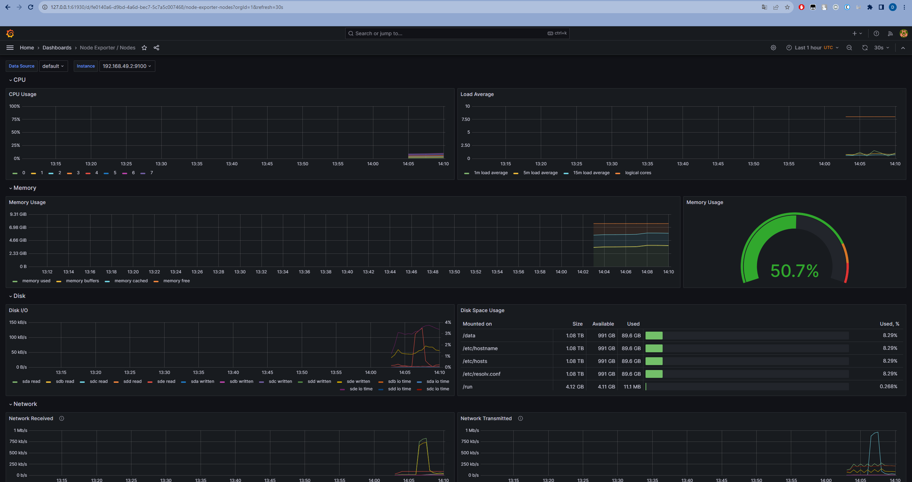
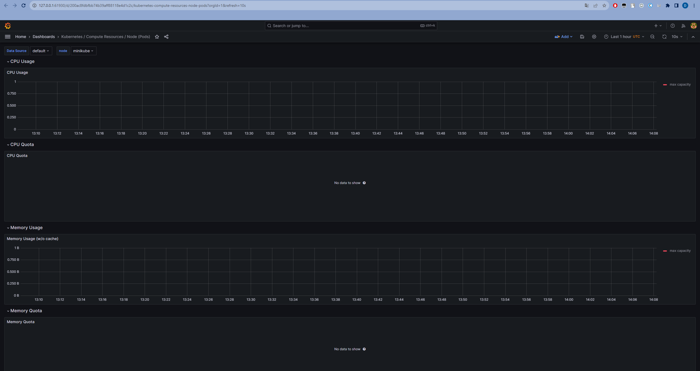
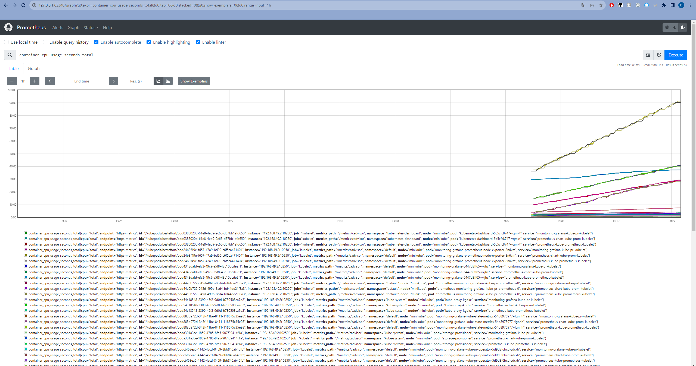
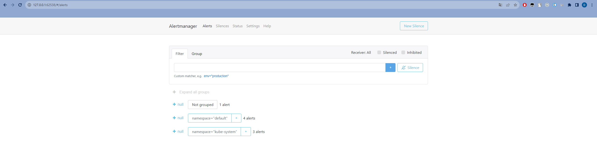

# Kubernetes Monitoring and Init Containers

## Task 1

### kube-prometheus-stack Components


### Install Helm Charts

`helm repo add prometheus-community https://prometheus-community.github.io/helm-charts`

```
"prometheus-community" has been added to your repositories
```

`helm repo update`

```
Hang tight while we grab the latest from your chart repositories...
...Successfully got an update from the "hashicorp" chart repository
...Successfully got an update from the "prometheus-community" chart repository
Update Complete. ⎈Happy Helming!⎈
```

`helm install monitoring-grafana prometheus-community/kube-prometheus-stack`

```
NAME: monitoring-grafana
LAST DEPLOYED: Tue Dec  5 16:58:32 2023
NAMESPACE: default
STATUS: deployed
REVISION: 1
NOTES:
kube-prometheus-stack has been installed. Check its status by running:
  kubectl --namespace default get pods -l "release=monitoring-grafana"

Visit https://github.com/prometheus-operator/kube-prometheus for instructions on how to create & configure Alertmanager and Prometheus instances using the Operator.
```

`helm install python . --values values.python.yaml`

```
NAME: python
LAST DEPLOYED: Tue Dec  5 16:59:22 2023
NAMESPACE: default
STATUS: deployed
REVISION: 1
NOTES:
1. Get the application URL by running these commands:
     NOTE: It may take a few minutes for the LoadBalancer IP to be available.
           You can watch the status of by running 'kubectl get --namespace default svc -w python-helm-chart-app'
  export SERVICE_IP=$(kubectl get svc --namespace default python-helm-chart-app --template "{{ range (index .status.loadBalancer.ingress 0) }}{{.}}{{ end }}")
  echo http://$SERVICE_IP:8000
```

`kubectl get po,sts,svc,pvc,cm`

```
NAME                                                         READY   STATUS    RESTARTS   AGE
pod/alertmanager-monitoring-grafana-kube-pr-alertmanager-0   2/2     Running   0          2m49s
pod/monitoring-grafana-5447d8ff65-vkjhc                      3/3     Running   0          2m54s
pod/monitoring-grafana-kube-pr-operator-5d9d8f6bcd-sdcxb     1/1     Running   0          2m54s
pod/monitoring-grafana-kube-state-metrics-54d8975977-4gnhh   1/1     Running   0          2m54s
pod/monitoring-grafana-prometheus-node-exporter-8n6vm        1/1     Running   0          2m54s
pod/prometheus-monitoring-grafana-kube-pr-prometheus-0       2/2     Running   0          2m49s
pod/python-helm-chart-app-0                                  1/1     Running   0          118s
pod/python-helm-chart-app-1                                  1/1     Running   0          118s
pod/python-helm-chart-app-2                                  1/1     Running   0          118s

NAME                                                                    READY   AGE
statefulset.apps/alertmanager-monitoring-grafana-kube-pr-alertmanager   1/1     2m49s
statefulset.apps/prometheus-monitoring-grafana-kube-pr-prometheus       1/1     2m49s
statefulset.apps/python-helm-chart-app                                  3/3     118s

NAME                                                  TYPE           CLUSTER-IP       EXTERNAL-IP   PORT(S)                         AGE
service/alertmanager-operated                         ClusterIP      None             <none>        9093/TCP,9094/TCP,9094/UDP      2m49s
service/kubernetes                                    ClusterIP      10.96.0.1        <none>        443/TCP                         22d
service/monitoring-grafana                            ClusterIP      10.98.156.34     <none>        80/TCP                          2m55s
service/monitoring-grafana-kube-pr-alertmanager       ClusterIP      10.103.26.128    <none>        9093/TCP,8080/TCP               2m55s
service/monitoring-grafana-kube-pr-operator           ClusterIP      10.102.107.226   <none>        443/TCP                         2m55s
service/monitoring-grafana-kube-pr-prometheus         ClusterIP      10.108.107.147   <none>        9090/TCP,8080/TCP               2m55s
service/monitoring-grafana-kube-state-metrics         ClusterIP      10.99.129.83     <none>        8080/TCP                        2m55s
service/monitoring-grafana-prometheus-node-exporter   ClusterIP      10.109.234.160   <none>        9100/TCP                        2m55s
service/prometheus-operated                           ClusterIP      None             <none>        9090/TCP                        2m49s
service/python-helm-chart-app                         LoadBalancer   10.109.91.70     <pending>     8000:30624/TCP                  118s

NAME                                                              STATUS   VOLUME                                     CAPACITY   ACCESS MODES   STORAGECLASS   AGE
persistentvolumeclaim/data-vault-0                                Bound    pvc-2cc9b3ae-3a33-44b2-93ed-c95029f53efc   10Gi       RWO            standard       21d
persistentvolumeclaim/storage-monitoring-grafana-alertmanager-0   Bound    pvc-bc5b02db-7306-4236-bbac-84ad4f22dfb8   2Gi        RWO            standard       22h
persistentvolumeclaim/visits-python-helm-chart-app-0              Bound    pvc-46ed3d72-4fc2-48ea-be4a-dbfc181c721a   1Mi        RWO            standard       8d
persistentvolumeclaim/visits-python-helm-chart-app-1              Bound    pvc-92eaa227-89bc-4d22-8133-1a1b74268356   1Mi        RWO            standard       8d
persistentvolumeclaim/visits-python-helm-chart-app-2              Bound    pvc-210b5345-50b2-4bb4-ac78-34d681874037   1Mi        RWO            standard       8d
persistentvolumeclaim/visits-sharp-helm-chart-app-0               Bound    pvc-92a03396-9dae-4ce5-bf56-3adf87d55705   1Mi        RWO            standard       8d
persistentvolumeclaim/visits-sharp-helm-chart-app-1               Bound    pvc-4593bb89-85e6-4d68-a7d6-a88702553793   1Mi        RWO            standard       8d
persistentvolumeclaim/visits-sharp-helm-chart-app-2               Bound    pvc-8c866300-769a-498a-a049-582ed8dde391   1Mi        RWO            standard       8d

NAME                                                                     DATA   AGE
configmap/kube-root-ca.crt                                               1      35d
configmap/monitoring-grafana                                             1      2m55s
configmap/monitoring-grafana-config-dashboards                           1      2m55s
configmap/monitoring-grafana-kube-pr-alertmanager-overview               1      2m55s
configmap/monitoring-grafana-kube-pr-apiserver                           1      2m55s
configmap/monitoring-grafana-kube-pr-cluster-total                       1      2m55s
configmap/monitoring-grafana-kube-pr-controller-manager                  1      2m55s
configmap/monitoring-grafana-kube-pr-etcd                                1      2m55s
configmap/monitoring-grafana-kube-pr-grafana-datasource                  1      2m55s
configmap/monitoring-grafana-kube-pr-grafana-overview                    1      2m55s
configmap/monitoring-grafana-kube-pr-k8s-coredns                         1      2m55s
configmap/monitoring-grafana-kube-pr-k8s-resources-cluster               1      2m55s
configmap/monitoring-grafana-kube-pr-k8s-resources-multicluster          1      2m55s
configmap/monitoring-grafana-kube-pr-k8s-resources-namespace             1      2m55s
configmap/monitoring-grafana-kube-pr-k8s-resources-node                  1      2m55s
configmap/monitoring-grafana-kube-pr-k8s-resources-pod                   1      2m55s
configmap/monitoring-grafana-kube-pr-k8s-resources-workload              1      2m55s
configmap/monitoring-grafana-kube-pr-k8s-resources-workloads-namespace   1      2m55s
configmap/monitoring-grafana-kube-pr-kubelet                             1      2m55s
configmap/monitoring-grafana-kube-pr-namespace-by-pod                    1      2m55s
configmap/monitoring-grafana-kube-pr-namespace-by-workload               1      2m55s
configmap/monitoring-grafana-kube-pr-node-cluster-rsrc-use               1      2m55s
configmap/monitoring-grafana-kube-pr-node-rsrc-use                       1      2m55s
configmap/monitoring-grafana-kube-pr-nodes                               1      2m55s
configmap/monitoring-grafana-kube-pr-nodes-darwin                        1      2m55s
configmap/monitoring-grafana-kube-pr-persistentvolumesusage              1      2m55s
configmap/monitoring-grafana-kube-pr-pod-total                           1      2m55s
configmap/monitoring-grafana-kube-pr-prometheus                          1      2m55s
configmap/monitoring-grafana-kube-pr-proxy                               1      2m55s
configmap/monitoring-grafana-kube-pr-scheduler                           1      2m55s
configmap/monitoring-grafana-kube-pr-workload-total                      1      2m55s
configmap/my-configmap                                                   1      118s
configmap/my-env-configmap                                               1      118s
configmap/prometheus-monitoring-grafana-kube-pr-prometheus-rulefiles-0   34     2m42s
```

Pods: 
- `pod/alertmanager-monitoring-grafana-kube-pr-alertmanager-0` - alert manager
- `pod/monitoring-grafana-5447d8ff65-vkjhc` - pod with graphana
- `pod/monitoring-grafana-kube-pr-operator-5d9d8f6bcd-sdcxb` - pod with prometheus operator
- `pod/monitoring-grafana-kube-state-metrics-54d8975977-4gnhh` - pod with kube-state-metrics
- `pod/monitoring-grafana-prometheus-node-exporter-8n6vm` - pod with node-exporter
- `pod/prometheus-monitoring-grafana-kube-pr-prometheus-0` - pod with prometheus itself, in two replicas
- `pod/python-helm-chart-app-*` - pods with application

Stateful sets:
- `statefulset.apps/alertmanager-monitoring-grafana-kube-pr-alertmanager` - statefulset of AlertManager (for reliability)
- `statefulset.apps/prometheus-monitoring-grafana-kube-pr-prometheus` - statefulset of Prometheus (for reliability)
- `statefulset.apps/python-helm-chart-app` - my python app

Service list corresponds with involved elements of stack.

Persistent volumes are created in previous lab. Kube prometheus stack add `storage-monitoring-grafana-alertmanager-0`.

Configmaps are used for internal affairs of kube prometheus stack. Also we can se configmaps for previous labs.

### Utilize Grafana Dashboards









Alerts manager:




## Task 2

`kubectl logs python-helm-chart-app-0 -c install -f`

```
Connecting to info.cern.ch (188.184.100.182:80)
index.html           100% |*******************************|   646   0:00:00 ETA
```

`kubectl exec -it python-helm-chart-app-0 -- cat /init/index.html`

```
Defaulted container "helm-chart-app" out of: helm-chart-app, install (init)
<html><head></head><body><header>
<title>http://info.cern.ch</title>
</header>

<h1>http://info.cern.ch - home of the first website</h1>
<p>From here you can:</p>
<ul>
<li><a href="http://info.cern.ch/hypertext/WWW/TheProject.html">Browse the first website</a></li>
<li><a href="http://line-mode.cern.ch/www/hypertext/WWW/TheProject.html">Browse the first website using the line-mode browser simulator</a></li>
<li><a href="http://home.web.cern.ch/topics/birth-web">Learn about the birth of the web</a></li>
<li><a href="http://home.web.cern.ch/about">Learn about CERN, the physics laboratory where the web was born</a></li>
</ul>
</body></html>
```