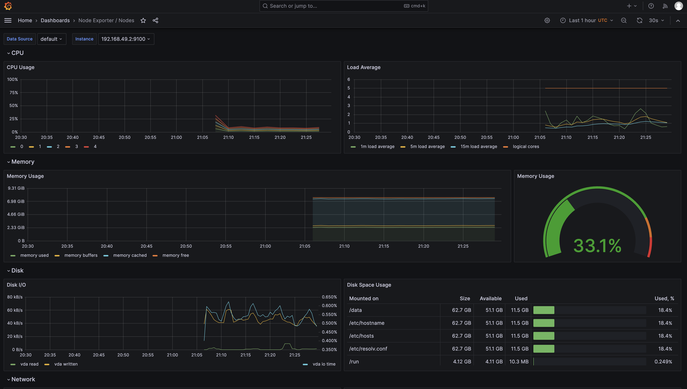
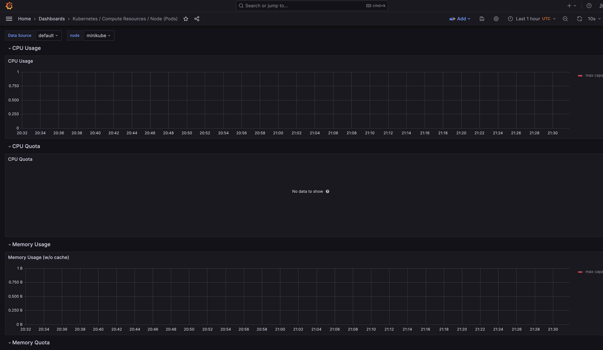
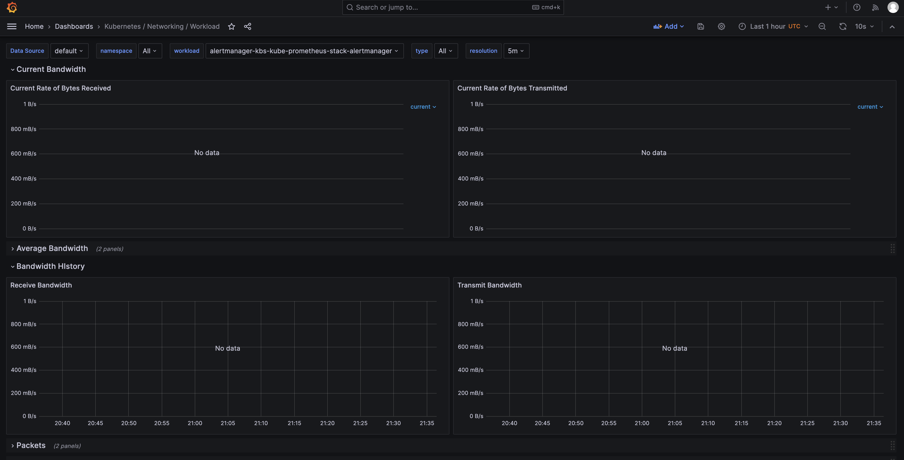

Kube Prometheus Stack components:
1. Prometheus - service for metrics collection and calculation
2. Alertmanager - prometheus' alerts listener & handler
3. Graphana - UI-service for investigating metrics
4. Prometheus node-exported - service for collecting system metrics
5. Prometheus kube-state-metrics - service for collecting kubernetes object state

```
linkstaple@MacBook-Pro-Michael k8s % kubectl get po
NAME                                                    READY   STATUS    RESTARTS   AGE
alertmanager-kbs-kube-prometheus-stack-alertmanager-0   2/2     Running   0          39s
kbs-grafana-6d9f687f69-d6wl5                            3/3     Running   0          41s
kbs-kube-prometheus-stack-operator-84c8d996b4-4dhmb     1/1     Running   0          41s
kbs-kube-state-metrics-f98987fbc-5mlvr                  1/1     Running   0          41s
kbs-prometheus-node-exporter-2wj7m                      1/1     Running   0          41s
prometheus-kbs-kube-prometheus-stack-prometheus-0       2/2     Running   0          38s
```

```
linkstaple@MacBook-Pro-Michael k8s % kubectl get sts
NAME                                                  READY   AGE
alertmanager-kbs-kube-prometheus-stack-alertmanager   1/1     107s
app-chart                                             0/1     2m35s
prometheus-kbs-kube-prometheus-stack-prometheus       1/1     106s
```

```
linkstaple@MacBook-Pro-Michael k8s % kubectl get svc
NAME                                     TYPE        CLUSTER-IP       EXTERNAL-IP   PORT(S)                      AGE
alertmanager-operated                    ClusterIP   None             <none>        9093/TCP,9094/TCP,9094/UDP   2m8s
app-chart                                NodePort    10.111.199.92    <none>        5555:32544/TCP               2m56s
kbs-grafana                              ClusterIP   10.98.198.195    <none>        80/TCP                       2m11s
kbs-kube-prometheus-stack-alertmanager   ClusterIP   10.99.136.45     <none>        9093/TCP,8080/TCP            2m11s
kbs-kube-prometheus-stack-operator       ClusterIP   10.110.33.172    <none>        443/TCP                      2m11s
kbs-kube-prometheus-stack-prometheus     ClusterIP   10.100.91.178    <none>        9090/TCP,8080/TCP            2m11s
kbs-kube-state-metrics                   ClusterIP   10.105.243.157   <none>        8080/TCP                     2m11s
kbs-prometheus-node-exporter             ClusterIP   10.99.140.248    <none>        9100/TCP                     2m11s
kubernetes                               ClusterIP   10.96.0.1        <none>        443/TCP                      24h
prometheus-operated                      ClusterIP   None             <none>        9090/TCP                     2m7s
```

```
linkstaple@MacBook-Pro-Michael k8s % kubectl get pvc
NAME                    STATUS   VOLUME                                     CAPACITY   ACCESS MODES   STORAGECLASS   AGE
app-chart-app-chart-0   Bound    pvc-1d77f1cb-b597-4af1-9f0d-eb42ba27e7d7   10Mi       RWO            standard       3m15s
```

```
linkstaple@MacBook-Pro-Michael k8s % kubectl get cm
NAME                                                          DATA   AGE
kbs-grafana                                                   1      2m40s
kbs-grafana-config-dashboards                                 1      2m40s
kbs-kube-prometheus-stack-alertmanager-overview               1      2m40s
kbs-kube-prometheus-stack-apiserver                           1      2m40s
kbs-kube-prometheus-stack-cluster-total                       1      2m40s
kbs-kube-prometheus-stack-controller-manager                  1      2m40s
kbs-kube-prometheus-stack-etcd                                1      2m40s
kbs-kube-prometheus-stack-grafana-datasource                  1      2m40s
kbs-kube-prometheus-stack-grafana-overview                    1      2m40s
kbs-kube-prometheus-stack-k8s-coredns                         1      2m40s
kbs-kube-prometheus-stack-k8s-resources-cluster               1      2m40s
kbs-kube-prometheus-stack-k8s-resources-multicluster          1      2m40s
kbs-kube-prometheus-stack-k8s-resources-namespace             1      2m40s
kbs-kube-prometheus-stack-k8s-resources-node                  1      2m40s
kbs-kube-prometheus-stack-k8s-resources-pod                   1      2m40s
kbs-kube-prometheus-stack-k8s-resources-workload              1      2m40s
kbs-kube-prometheus-stack-k8s-resources-workloads-namespace   1      2m40s
kbs-kube-prometheus-stack-kubelet                             1      2m40s
kbs-kube-prometheus-stack-namespace-by-pod                    1      2m40s
kbs-kube-prometheus-stack-namespace-by-workload               1      2m40s
kbs-kube-prometheus-stack-node-cluster-rsrc-use               1      2m40s
kbs-kube-prometheus-stack-node-rsrc-use                       1      2m40s
kbs-kube-prometheus-stack-nodes                               1      2m40s
kbs-kube-prometheus-stack-nodes-darwin                        1      2m40s
kbs-kube-prometheus-stack-persistentvolumesusage              1      2m40s
kbs-kube-prometheus-stack-pod-total                           1      2m40s
kbs-kube-prometheus-stack-prometheus                          1      2m40s
kbs-kube-prometheus-stack-proxy                               1      2m40s
kbs-kube-prometheus-stack-scheduler                           1      2m40s
kbs-kube-prometheus-stack-workload-total                      1      2m40s
kube-root-ca.crt                                              1      33h
prometheus-kbs-kube-prometheus-stack-prometheus-rulefiles-0   34     2m36s
```







