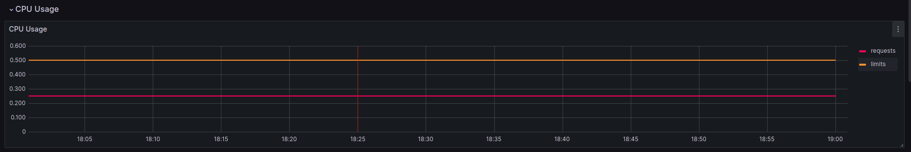
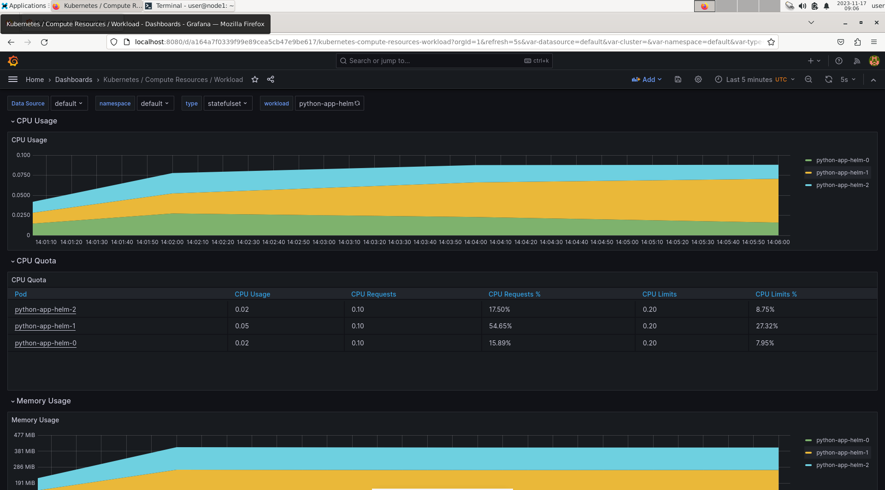
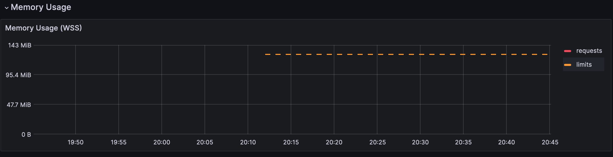
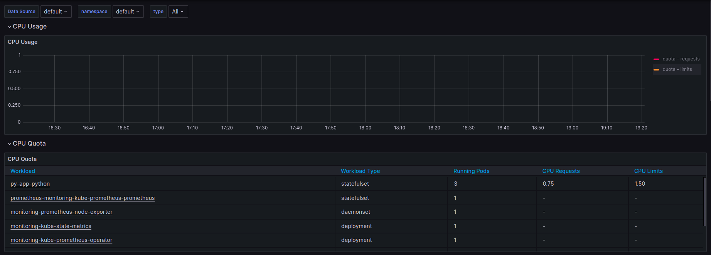
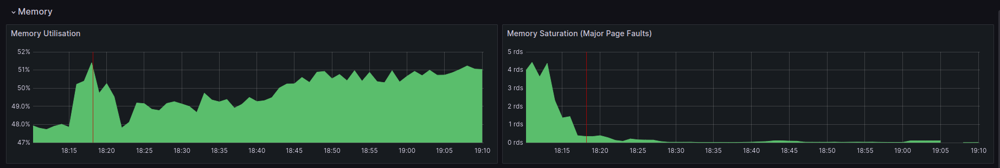
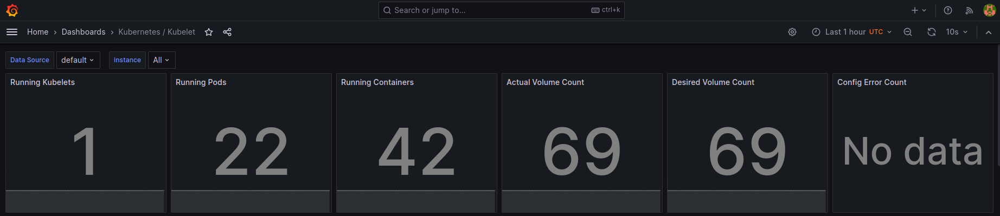
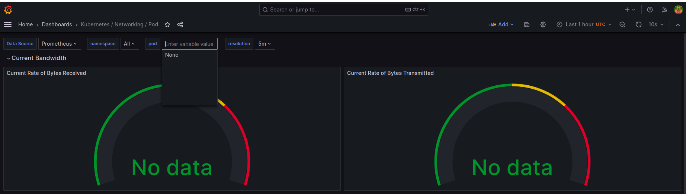
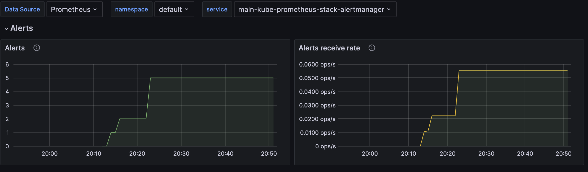
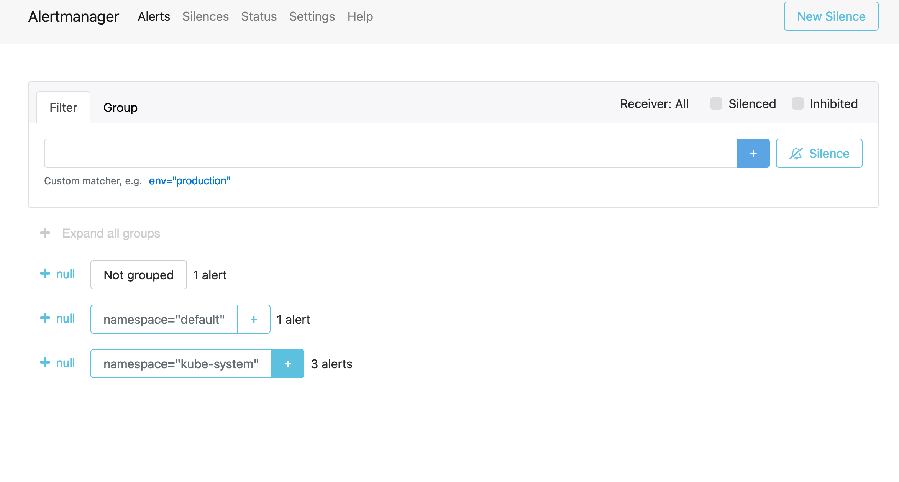

# Kubernetes Monitoring and Init Containers

## Kube Prometheus Stack

### Components

- **Prometheus Operator**: simplify the deployment and configuration of Prometheus components to k8s.
- **Prometheus**: monitoring and alerting toolkit.
- **Alertmanager**: handles alerts from other applications such as Prometheus Server. Sends alerts via email, tg message, etc.
- **node-exporter**: collects and sends metrics (hardware and OS metrics) to Prometheus.
- **Adapter for Kubernetes Metrics APIs**: allows to collect metrics from k8s.
- **kube-state-metrics**: listens to the Kubernetes API server and generates application metrics.
- **Grafana**: dashboards for user-friendly visualization.

### Installation

```shell
helm repo add prometheus-community https://prometheus-community.github.io/helm-charts
helm repo update

helm install monitoring prometheus-community/kube-prometheus-stack
```

Outputs for report:

```shell
kubectl get po,sts,svc,pvc,cm
```
```text
NAME                                                         READY   STATUS    RESTARTS   AGE
pod/alertmanager-monitoring-kube-prometheus-alertmanager-0   2/2     Running   0          7m14s
pod/go-app-golang-0                                          1/1     Running   0          70s
pod/go-app-golang-1                                          1/1     Running   0          70s
pod/go-app-golang-2                                          1/1     Running   0          70s
pod/monitoring-grafana-6f8d546676-wd85k                      3/3     Running   0          7m38s
pod/monitoring-kube-prometheus-operator-5fbb66b4b-jr46r      1/1     Running   0          7m38s
pod/monitoring-kube-state-metrics-74f4d8858f-vs2mr           1/1     Running   0          7m38s
pod/monitoring-prometheus-node-exporter-8nmd7                1/1     Running   0          7m38s
pod/prometheus-monitoring-kube-prometheus-prometheus-0       2/2     Running   0          7m13s
pod/py-app-python-0                                          1/1     Running   0          84s
pod/py-app-python-1                                          1/1     Running   0          84s
pod/py-app-python-2                                          1/1     Running   0          84s

NAME                                                                    READY   AGE
statefulset.apps/alertmanager-monitoring-kube-prometheus-alertmanager   1/1     7m14s
statefulset.apps/go-app-golang                                          3/3     70s
statefulset.apps/prometheus-monitoring-kube-prometheus-prometheus       1/1     7m13s
statefulset.apps/py-app-python                                          3/3     84s

NAME                                              TYPE           CLUSTER-IP       EXTERNAL-IP   PORT(S)                      AGE
service/alertmanager-operated                     ClusterIP      None             <none>        9093/TCP,9094/TCP,9094/UDP   7m14s
service/go-app-golang                             LoadBalancer   10.97.28.176     <pending>     8000:31377/TCP               70s
service/kubernetes                                ClusterIP      10.96.0.1        <none>        443/TCP                      42d
service/monitoring-grafana                        ClusterIP      10.103.95.232    <none>        80/TCP                       7m38s
service/monitoring-kube-prometheus-alertmanager   ClusterIP      10.96.39.174     <none>        9093/TCP,8080/TCP            7m38s
service/monitoring-kube-prometheus-operator       ClusterIP      10.99.91.63      <none>        443/TCP                      7m38s
service/monitoring-kube-prometheus-prometheus     ClusterIP      10.104.61.138    <none>        9090/TCP,8080/TCP            7m38s
service/monitoring-kube-state-metrics             ClusterIP      10.108.52.202    <none>        8080/TCP                     7m38s
service/monitoring-prometheus-node-exporter       ClusterIP      10.107.1.202     <none>        9100/TCP                     7m38s
service/prometheus-operated                       ClusterIP      None             <none>        9090/TCP                     7m13s
service/py-app-python                             LoadBalancer   10.106.217.199   <pending>     8000:32643/TCP               85s

NAME                                                        STATUS   VOLUME                                     CAPACITY   ACCESS MODES   STORAGECLASS   AGE
persistentvolumeclaim/app-golang-data-go-app-golang-0       Bound    pvc-18523acb-f660-4292-ad01-c37a0a7fcbde   10Mi       RWO            standard       4d21h
persistentvolumeclaim/app-golang-data-go-app-golang-1       Bound    pvc-74ed6dc7-297b-468c-9136-18ac79465a59   10Mi       RWO            standard       4d21h
persistentvolumeclaim/app-golang-data-go-app-golang-2       Bound    pvc-43c88ffb-95e5-4029-8e7c-c542a43b7116   10Mi       RWO            standard       4d21h
persistentvolumeclaim/app-python-data-py-app-python-0       Bound    pvc-716f34c2-dc7e-45b6-beb1-9c8f971726d3   10Mi       RWO            standard       4d22h
persistentvolumeclaim/app-python-data-py-app-python-1       Bound    pvc-6f7fe783-e51c-4698-8f67-cb0adeab022a   10Mi       RWO            standard       4d22h
persistentvolumeclaim/app-python-data-py-app-python-2       Bound    pvc-0ea9a36f-da81-43d1-abee-cd9617c8193c   10Mi       RWO            standard       4d22h
persistentvolumeclaim/app-python-data-python-app-python-0   Bound    pvc-79016ca4-a8e5-4d31-909f-1bcb1adb5eac   10Mi       RWO            standard       4d22h
persistentvolumeclaim/app-python-data-python-app-python-1   Bound    pvc-242864d8-4328-470f-9c30-1f79f1940055   10Mi       RWO            standard       4d22h
persistentvolumeclaim/app-python-data-python-app-python-2   Bound    pvc-14002072-9e84-4470-99a4-64df05caf11a   10Mi       RWO            standard       4d22h
persistentvolumeclaim/data-hashicorp-vault-0                Bound    pvc-c5837e92-b14f-4c82-8ffa-f1ef0c2fe5aa   10Gi       RWO            standard       21d

NAME                                                                     DATA   AGE
configmap/app-python-configmap                                           2      85s
configmap/kube-root-ca.crt                                               1      42d
configmap/monitoring-grafana                                             1      7m39s
configmap/monitoring-grafana-config-dashboards                           1      7m39s
configmap/monitoring-kube-prometheus-alertmanager-overview               1      7m39s
configmap/monitoring-kube-prometheus-apiserver                           1      7m39s
configmap/monitoring-kube-prometheus-cluster-total                       1      7m39s
configmap/monitoring-kube-prometheus-controller-manager                  1      7m39s
configmap/monitoring-kube-prometheus-etcd                                1      7m39s
configmap/monitoring-kube-prometheus-grafana-datasource                  1      7m39s
configmap/monitoring-kube-prometheus-grafana-overview                    1      7m39s
configmap/monitoring-kube-prometheus-k8s-coredns                         1      7m39s
configmap/monitoring-kube-prometheus-k8s-resources-cluster               1      7m39s
configmap/monitoring-kube-prometheus-k8s-resources-multicluster          1      7m39s
configmap/monitoring-kube-prometheus-k8s-resources-namespace             1      7m39s
configmap/monitoring-kube-prometheus-k8s-resources-node                  1      7m39s
configmap/monitoring-kube-prometheus-k8s-resources-pod                   1      7m39s
configmap/monitoring-kube-prometheus-k8s-resources-workload              1      7m39s
configmap/monitoring-kube-prometheus-k8s-resources-workloads-namespace   1      7m39s
configmap/monitoring-kube-prometheus-kubelet                             1      7m39s
configmap/monitoring-kube-prometheus-namespace-by-pod                    1      7m39s
configmap/monitoring-kube-prometheus-namespace-by-workload               1      7m39s
configmap/monitoring-kube-prometheus-node-cluster-rsrc-use               1      7m39s
configmap/monitoring-kube-prometheus-node-rsrc-use                       1      7m39s
configmap/monitoring-kube-prometheus-nodes                               1      7m39s
configmap/monitoring-kube-prometheus-nodes-darwin                        1      7m39s
configmap/monitoring-kube-prometheus-persistentvolumesusage              1      7m39s
configmap/monitoring-kube-prometheus-pod-total                           1      7m39s
configmap/monitoring-kube-prometheus-prometheus                          1      7m39s
configmap/monitoring-kube-prometheus-proxy                               1      7m39s
configmap/monitoring-kube-prometheus-scheduler                           1      7m39s
configmap/monitoring-kube-prometheus-workload-total                      1      7m39s
configmap/prometheus-monitoring-kube-prometheus-prometheus-rulefiles-0   34     7m14s
```

#### Pods

- **pod/go-app-golang-{0-2}** and **pod/py-app-python-{0-2}**: pods of both applications
- **pod/alertmanager-monitoring-kube-prometheus-alertmanager-0**: pod for alert manager
- **pod/monitoring-grafana-6f8d546676-wd85k**: grafana (dashboards, query visualization, etc.)
- **pod/monitoring-kube-prometheus-operator-5fbb66b4b-jr46r**: prometheus operator
- **pod/monitoring-kube-state-metrics-74f4d8858f-vs2mr**: pod that generates metrics from k8s (*kube-state-metrics*)
- **pod/monitoring-prometheus-node-exporter-8nmd7**: node exporter for prometheus
- **pod/prometheus-monitoring-kube-prometheus-prometheus-0**: pod with prometheus

#### StatefulSets

- **statefulset.apps/go-app-golang** and **statefulset.apps/py-app-python**: statefulsets for both applications
- **statefulset.apps/alertmanager-monitoring-kube-prometheus-alertmanager**: alert manager
- **statefulset.apps/prometheus-monitoring-kube-prometheus-prometheus**: prometheus

Alert manager and Prometheus uses statefulset because these applications need to maintain their state
and configuration data across pod restarts and scaling operations.

#### Services

Services corresponds to elements of kube-prometheus-stack, including my both applications and service for kubernetes itself.

#### PersistentVolumeClaims

PVCs are created for each pod of my applications (for python app there is data PVC) and Vault.

#### ConfigMaps

There is only 1 configmap for python application, others represents configuration for kube-prometheus-stack.

### Grafana Dashboards

Minikube doesn't allow to access service monitoring-grafana, let's use port-forward:

```shell
kubectl port-forward svc/monitoring-grafana 8008:80
```

According to [values.yaml](https://github.com/prometheus-community/helm-charts/blob/main/charts/kube-prometheus-stack/values.yaml)
file of kube-prometheus-stack, the password is `adminPassword: prom-operator`.

#### CPU and Memory consumption of StatefulSets

Golang application CPU usage:


Golang application Memory usage:


Python application CPU usage:


Python application Memory usage:


#### Pods with higher and lower CPU usage

Cannot determine pods with higher and lower CPU usage because prometheus doesn't provide such metrics!
Maybe there is a bug, but searching the problem didn't provide expected result.



#### Node memory usage



#### Kubelet service

The number of pods and containers managed by the Kubelet service:
- Pods = 22
- Containers = 42



#### Network usage of Pods



#### Active alerts

Active alerts = 8



Access UI:
```shell
kubectl port-forward svc/monitoring-kube-prometheus-alertmanager 8009:9093
```


