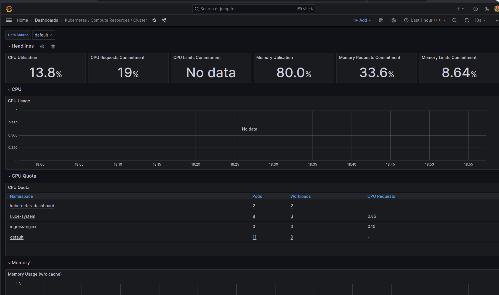
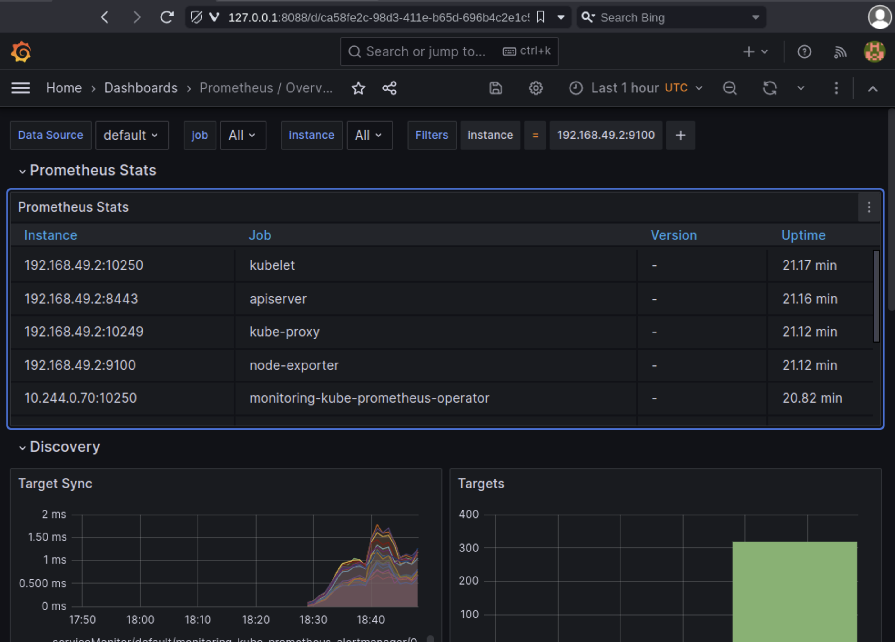
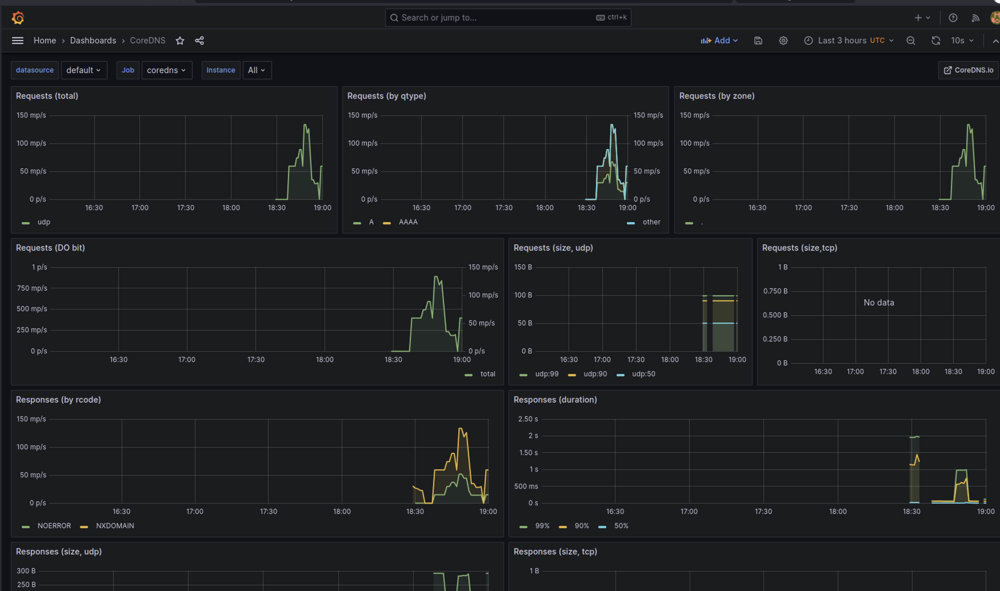

# Kubernetes Monitoring

## Task 1

Follow the intallation guide to install the Kube Prometheus Stack to your Kubernetes cluster.

```bash
helm repo add prometheus-community https://prometheus-community.github.io/helm-charts
helm repo update
helm install monitoring prometheus-community/kube-prometheus-stack
``` 

Results of `kubectl get po,sts,svc,pvc,cm`:

```bash
NAME                                                         READY   STATUS      RESTARTS      AGE
pod/alertmanager-monitoring-kube-prometheus-alertmanager-0   2/2     Running     0             4m38s
pod/helm-hooks-helm-python-app-6bd66d5d86-m7ztw              1/1     Running     5 (4m ago)    30d
pod/helm-python-app-555bccd949-kcbkz                         1/1     Running     2 (4m ago)    10d
pod/monitoring-grafana-6f8d546676-5p9wf                      3/3     Running     2 (4m ago)    4m51s
pod/monitoring-kube-prometheus-operator-6f66c8c5b4-v94x8     1/1     Running     2 (35s ago)   4m51s
pod/monitoring-kube-state-metrics-74f4d8858f-hdzjd           0/1     Running     2 (29s ago)   4m51s
pod/monitoring-prometheus-node-exporter-7ghlh                1/1     Running     1 (4m ago)    4m51s
pod/postinstall-hook                                         0/1     Completed   0             15d
pod/preinstall-hook                                          0/1     Completed   0             15d
pod/prometheus-monitoring-kube-prometheus-prometheus-0       2/2     Running     0             4m38s
pod/python-app-5bbbc8bf6d-kwkrd                              1/1     Running     5 (4m ago)    32d

NAME                                                                    READY   AGE
statefulset.apps/alertmanager-monitoring-kube-prometheus-alertmanager   1/1     4m38s
statefulset.apps/prometheus-monitoring-kube-prometheus-prometheus       1/1     4m38s

NAME                                              TYPE           CLUSTER-IP       EXTERNAL-IP   PORT(S)                      AGE
service/alertmanager-operated                     ClusterIP      None             <none>        9093/TCP,9094/TCP,9094/UDP   4m38s
service/helm-hooks-helm-python-app                NodePort       10.100.151.178   <none>        80:31618/TCP                 30d
service/helm-python-app                           NodePort       10.102.114.245   <none>        80:31494/TCP                 15d
service/kubernetes                                ClusterIP      10.96.0.1        <none>        443/TCP                      32d
service/monitoring-grafana                        ClusterIP      10.97.96.133     <none>        80/TCP                       4m51s
service/monitoring-kube-prometheus-alertmanager   ClusterIP      10.103.103.211   <none>        9093/TCP,8080/TCP            4m51s
service/monitoring-kube-prometheus-operator       ClusterIP      10.97.139.94     <none>        443/TCP                      4m51s
service/monitoring-kube-prometheus-prometheus     ClusterIP      10.97.199.235    <none>        9090/TCP,8080/TCP            4m51s
service/monitoring-kube-state-metrics             ClusterIP      10.108.253.132   <none>        8080/TCP                     4m51s
service/monitoring-prometheus-node-exporter       ClusterIP      10.105.194.246   <none>        9100/TCP                     4m51s
service/prometheus-operated                       ClusterIP      None             <none>        9090/TCP                     4m38s
service/python-app                                NodePort       10.101.192.34    <none>        80:32455/TCP                 32d
service/python-app-svc                            LoadBalancer   10.105.161.21    <pending>     80:31156/TCP                 32d

NAME                                                                     DATA   AGE
configmap/env-configmap                                                  1      10d
configmap/kube-root-ca.crt                                               1      32d
configmap/monitoring-grafana                                             1      4m51s
configmap/monitoring-grafana-config-dashboards                           1      4m51s
configmap/monitoring-kube-prometheus-alertmanager-overview               1      4m51s
configmap/monitoring-kube-prometheus-apiserver                           1      4m51s
configmap/monitoring-kube-prometheus-cluster-total                       1      4m51s
configmap/monitoring-kube-prometheus-controller-manager                  1      4m51s
configmap/monitoring-kube-prometheus-etcd                                1      4m51s
configmap/monitoring-kube-prometheus-grafana-datasource                  1      4m51s
configmap/monitoring-kube-prometheus-grafana-overview                    1      4m51s
configmap/monitoring-kube-prometheus-k8s-coredns                         1      4m51s
configmap/monitoring-kube-prometheus-k8s-resources-cluster               1      4m51s
configmap/monitoring-kube-prometheus-k8s-resources-multicluster          1      4m51s
configmap/monitoring-kube-prometheus-k8s-resources-namespace             1      4m51s
configmap/monitoring-kube-prometheus-k8s-resources-node                  1      4m51s
configmap/monitoring-kube-prometheus-k8s-resources-pod                   1      4m51s
configmap/monitoring-kube-prometheus-k8s-resources-workload              1      4m51s
configmap/monitoring-kube-prometheus-k8s-resources-workloads-namespace   1      4m51s
configmap/monitoring-kube-prometheus-kubelet                             1      4m51s
configmap/monitoring-kube-prometheus-namespace-by-pod                    1      4m51s
configmap/monitoring-kube-prometheus-namespace-by-workload               1      4m51s
configmap/monitoring-kube-prometheus-node-cluster-rsrc-use               1      4m51s
configmap/monitoring-kube-prometheus-node-rsrc-use                       1      4m51s
configmap/monitoring-kube-prometheus-nodes                               1      4m51s
configmap/monitoring-kube-prometheus-nodes-darwin                        1      4m51s
configmap/monitoring-kube-prometheus-persistentvolumesusage              1      4m51s
configmap/monitoring-kube-prometheus-pod-total                           1      4m51s
configmap/monitoring-kube-prometheus-prometheus                          1      4m51s
configmap/monitoring-kube-prometheus-proxy                               1      4m51s
configmap/monitoring-kube-prometheus-scheduler                           1      4m51s
configmap/monitoring-kube-prometheus-workload-total                      1      4m51s
configmap/my-configmap                                                   1      10d
```

### The output of `kubectl get po,sts,svc,pvc,cm` command in the report and explain each part:

- Pods: Displays information about the pods in the cluster. The output includes the name of the pod, the namespace it belongs to, and its status.

- StatefulSets: Displays information about the statefulsets in the cluster. The output includes the name of the statefulset, the namespace it belongs to, and its status.

- Services: Displays information about the services in the cluster. The output includes the name of the service, the namespace it belongs to, and its status.

- PersistentVolumeClaims: Displays information about the persistent volume claims in the cluster. The output includes the name of the persistent volume claim, the namespace it belongs to, and its status.

- ConfigMaps: Displays information about the configmaps in the cluster. The output includes the name of the configmap, the namespace it belongs to, and its status.


Screenshots of Grafana dashboards:








Kube Prometheus Stack - system for monitoring Kubernetes clusters. It contains a set of tools for monitoring and alerting. The main components are:

- Prometheus - one of the most popular open-source monitoring systems, which collects metrics from monitored targets by scraping metrics HTTP endpoints on these targets.

- Alertmanager - an alerting system that handles alerts sent by client applications such as the Prometheus server. It takes care of deduplicating, grouping, and routing them to the correct receiver integration such as email, PagerDuty, or OpsGenie. It also takes care of silencing and inhibition of alerts.

- Grafana - a multi-platform open source analytics and interactive visualization web application. It provides charts, graphs, and alerts for the web when connected to supported data sources.

- Prometheus Operator - a Kubernetes native solution for managing Prometheus servers and configurations. It provides a set of Kubernetes custom resources, which allow you to declaratively describe the Prometheus installation.

- Kube State Metrics - service which gathers metrics from Kubernetes API server and makes them available for Prometheus to scrape.

