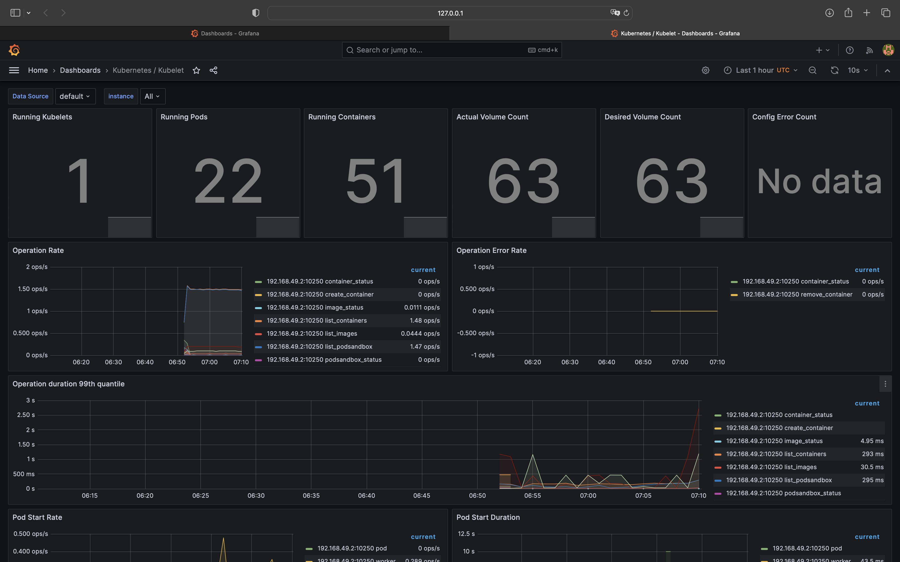
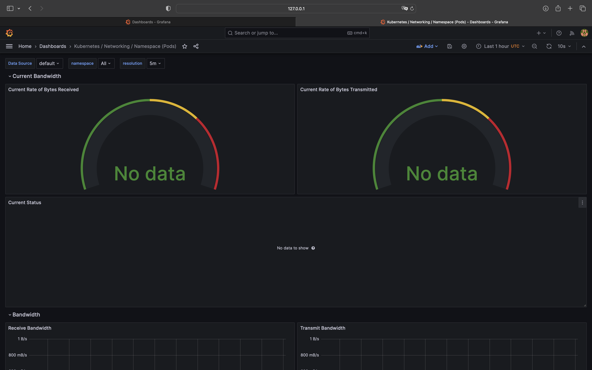
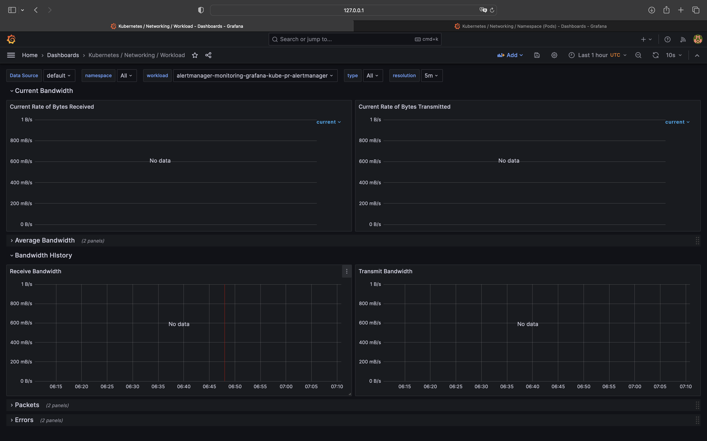
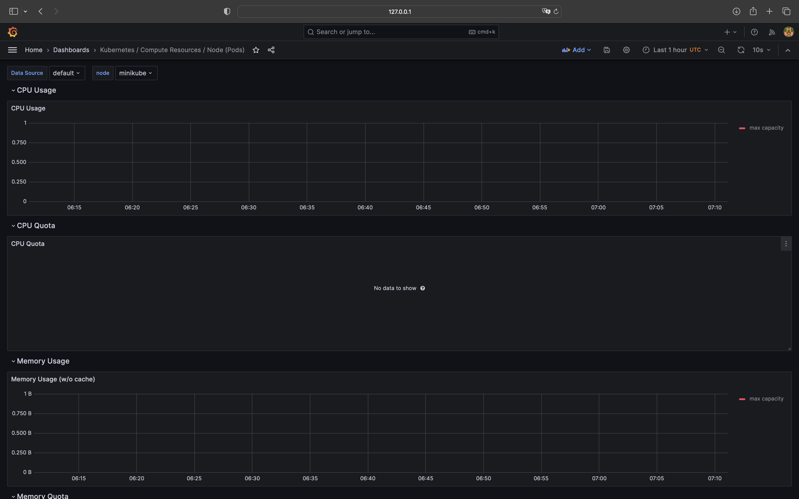
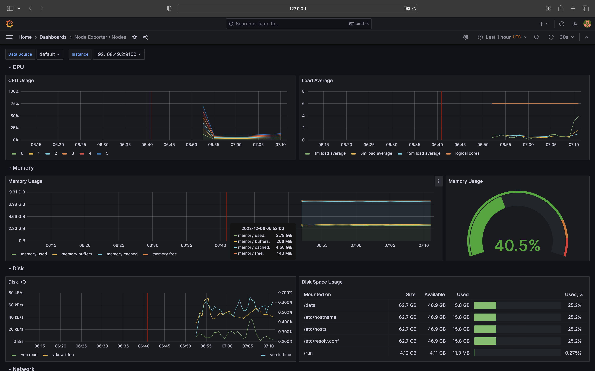
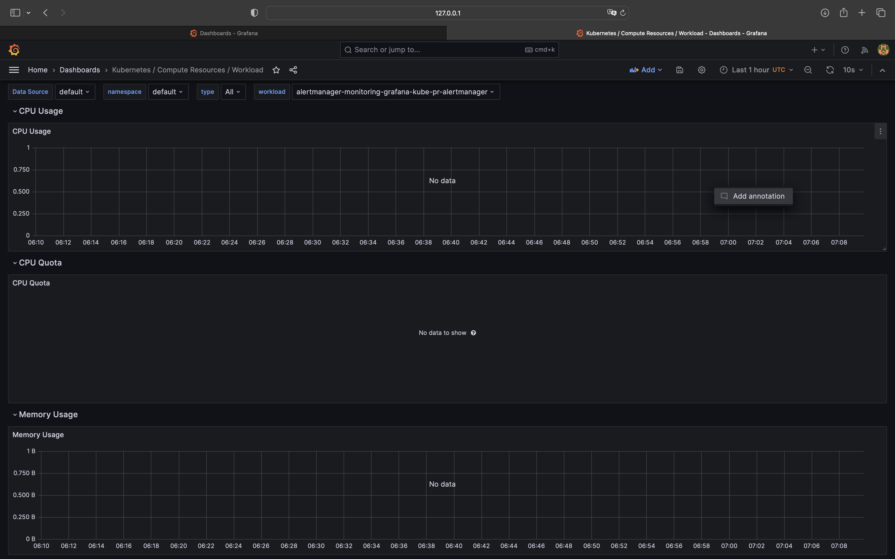

# Kubernetes Monitoring and Init Containers

## Task 1

### Kube Prometheus Stack components

1. **Graphana** - dashboards for monitoring
2. **Prometheus** - monitoring and alerting system
3. **Prometheus operator** - automates the deployment and management of Prometheus instances within the cluster
4. **Alertmanager** - handles and manages alerts generated by Prometheus 
5. **Node Exporter** - collects hardware utilization and limits metrics
6. **kube-state-metrics** - collects data on cluster itself

### Helm Charts

```
helm repo add prometheus-community https://prometheus-community.github.io/helm-charts
```

```
"prometheus-community" has been added to your repositories
```
---
```
helm repo update
```

```
Hang tight while we grab the latest from your chart repositories...
...Successfully got an update from the "hashicorp" chart repository
...Successfully got an update from the "prometheus-community" chart repository
Update Complete. ⎈Happy Helming!⎈
```
---
```
helm install monitoring-grafana prometheus-community/kube-prometheus-stack
```

```
NAME: monitoring-grafana
LAST DEPLOYED: Wed Dec  6 09:47:32 2023
NAMESPACE: default
STATUS: deployed
REVISION: 1
NOTES:
kube-prometheus-stack has been installed. Check its status by running:
  kubectl --namespace default get pods -l "release=monitoring-grafana"

Visit https://github.com/prometheus-operator/kube-prometheus for instructions on how to create & configure Alertmanager and Prometheus instances using the Operator.
```
---
```
helm install pyapp . --values values.python.yaml
```

```
NAME: pyapp
LAST DEPLOYED: Wed Dec  6 09:49:04 2023
NAMESPACE: default
STATUS: deployed
REVISION: 1
NOTES:
1. Get the application URL by running these commands:
     NOTE: It may take a few minutes for the LoadBalancer IP to be available.
           You can watch the status of by running 'kubectl get --namespace default svc -w pyapp-helm-app'
  export SERVICE_IP=$(kubectl get svc --namespace default pyapp-helm-app --template "{{ range (index .status.loadBalancer.ingress 0) }}{{.}}{{ end }}")
  echo http://$SERVICE_IP:8000
```
---
```
helm ls
```

```
NAME              	NAMESPACE	REVISION	UPDATED                             	STATUS  	CHART                       	APP VERSION
monitoring-grafana	default  	1       	2023-12-06 09:47:32.890296 +0300 MSK	deployed	kube-prometheus-stack-55.0.0	v0.70.0
pyapp             	default  	1       	2023-12-06 09:49:04.592762 +0300 MSK	deployed	helm-app-0.1.0              	1.16.0
```
---
```
kubectl get po,sts,svc,pvc,cm
```

```
NAME                                                         READY   STATUS    RESTARTS      AGE
pod/alertmanager-monitoring-grafana-kube-pr-alertmanager-0   2/2     Running   0             3m45s
pod/app-python-dbfc8f6b4-5gsbm                               1/1     Running   6 (23m ago)   35d
pod/go-app-58b7c44d98-6dl5n                                  1/1     Running   6 (23m ago)   35d
pod/go-app-58b7c44d98-g5rl9                                  1/1     Running   6 (23m ago)   35d
pod/go-app-58b7c44d98-tvwhs                                  1/1     Running   6 (23m ago)   35d
pod/monitoring-grafana-5447d8ff65-5flcd                      3/3     Running   0             4m27s
pod/monitoring-grafana-kube-pr-operator-5d9d8f6bcd-x6ph7     1/1     Running   0             4m27s
pod/monitoring-grafana-kube-state-metrics-54d8975977-29kwv   1/1     Running   0             4m27s
pod/monitoring-grafana-prometheus-node-exporter-kl5s7        1/1     Running   0             4m27s
pod/prometheus-monitoring-grafana-kube-pr-prometheus-0       2/2     Running   0             3m45s
pod/pyapp-helm-app-0                                         1/1     Running   0             2m54s
pod/pyapp-helm-app-1                                         1/1     Running   0             54s
pod/python-app-84c9748db8-btxx8                              1/1     Running   6 (23m ago)   35d
pod/python-app-84c9748db8-f2k6v                              1/1     Running   6 (23m ago)   35d
pod/python-app-84c9748db8-nptck                              1/1     Running   6 (23m ago)   35d

NAME                                                                    READY   AGE
statefulset.apps/alertmanager-monitoring-grafana-kube-pr-alertmanager   1/1     3m45s
statefulset.apps/prometheus-monitoring-grafana-kube-pr-prometheus       1/1     3m45s
statefulset.apps/pyapp-helm-app                                         2/2     2m54s

NAME                                                  TYPE           CLUSTER-IP       EXTERNAL-IP   PORT(S)                      AGE
service/alertmanager-operated                         ClusterIP      None             <none>        9093/TCP,9094/TCP,9094/UDP   3m45s
service/go-app                                        NodePort       10.108.176.231   <none>        9000:32732/TCP               35d
service/kubernetes                                    ClusterIP      10.96.0.1        <none>        443/TCP                      35d
service/monitoring-grafana                            ClusterIP      10.101.139.131   <none>        80/TCP                       4m27s
service/monitoring-grafana-kube-pr-alertmanager       ClusterIP      10.102.219.115   <none>        9093/TCP,8080/TCP            4m27s
service/monitoring-grafana-kube-pr-operator           ClusterIP      10.100.234.6     <none>        443/TCP                      4m27s
service/monitoring-grafana-kube-pr-prometheus         ClusterIP      10.108.69.180    <none>        9090/TCP,8080/TCP            4m27s
service/monitoring-grafana-kube-state-metrics         ClusterIP      10.104.122.29    <none>        8080/TCP                     4m27s
service/monitoring-grafana-prometheus-node-exporter   ClusterIP      10.109.57.37     <none>        9100/TCP                     4m27s
service/prometheus-operated                           ClusterIP      None             <none>        9090/TCP                     3m45s
service/pyapp-helm-app                                LoadBalancer   10.109.181.42    <pending>     8000:32317/TCP               2m54s
service/python-app                                    NodePort       10.96.121.224    <none>        8000:32713/TCP               35d

NAME                                             STATUS   VOLUME                                     CAPACITY   ACCESS MODES   STORAGECLASS   AGE
persistentvolumeclaim/visits-pyapp-helm-app-0    Bound    pvc-eaf42721-b735-4462-8248-69c5809dbb62   1Mi        RWO            standard       7d19h
persistentvolumeclaim/visits-pyapp-helm-app-1    Bound    pvc-59a53545-8943-4a86-84fa-e21b97b6d7ac   1Mi        RWO            standard       7d9h
persistentvolumeclaim/visits-python-helm-app-0   Bound    pvc-40a805e8-0063-42bf-a7f3-6bbc7501f285   1Mi        RWO            standard       7d19h

NAME                                                                     DATA   AGE
configmap/kube-root-ca.crt                                               1      35d
configmap/monitoring-grafana                                             1      4m27s
configmap/monitoring-grafana-config-dashboards                           1      4m27s
configmap/monitoring-grafana-kube-pr-alertmanager-overview               1      4m27s
configmap/monitoring-grafana-kube-pr-apiserver                           1      4m27s
configmap/monitoring-grafana-kube-pr-cluster-total                       1      4m27s
configmap/monitoring-grafana-kube-pr-controller-manager                  1      4m27s
configmap/monitoring-grafana-kube-pr-etcd                                1      4m27s
configmap/monitoring-grafana-kube-pr-grafana-datasource                  1      4m27s
configmap/monitoring-grafana-kube-pr-grafana-overview                    1      4m27s
configmap/monitoring-grafana-kube-pr-k8s-coredns                         1      4m27s
configmap/monitoring-grafana-kube-pr-k8s-resources-cluster               1      4m27s
configmap/monitoring-grafana-kube-pr-k8s-resources-multicluster          1      4m27s
configmap/monitoring-grafana-kube-pr-k8s-resources-namespace             1      4m27s
configmap/monitoring-grafana-kube-pr-k8s-resources-node                  1      4m27s
configmap/monitoring-grafana-kube-pr-k8s-resources-pod                   1      4m27s
configmap/monitoring-grafana-kube-pr-k8s-resources-workload              1      4m27s
configmap/monitoring-grafana-kube-pr-k8s-resources-workloads-namespace   1      4m27s
configmap/monitoring-grafana-kube-pr-kubelet                             1      4m27s
configmap/monitoring-grafana-kube-pr-namespace-by-pod                    1      4m27s
configmap/monitoring-grafana-kube-pr-namespace-by-workload               1      4m27s
configmap/monitoring-grafana-kube-pr-node-cluster-rsrc-use               1      4m27s
configmap/monitoring-grafana-kube-pr-node-rsrc-use                       1      4m27s
configmap/monitoring-grafana-kube-pr-nodes                               1      4m27s
configmap/monitoring-grafana-kube-pr-nodes-darwin                        1      4m27s
configmap/monitoring-grafana-kube-pr-persistentvolumesusage              1      4m27s
configmap/monitoring-grafana-kube-pr-pod-total                           1      4m27s
configmap/monitoring-grafana-kube-pr-prometheus                          1      4m27s
configmap/monitoring-grafana-kube-pr-proxy                               1      4m27s
configmap/monitoring-grafana-kube-pr-scheduler                           1      4m27s
configmap/monitoring-grafana-kube-pr-workload-total                      1      4m27s
configmap/my-configmap                                                   1      2m54s
configmap/my-env-configmap                                               1      2m54s
configmap/prometheus-monitoring-grafana-kube-pr-prometheus-rulefiles-0   34     3m45s
```

#### Explanation
`Pods:`
* `alertmanager-monitoring-grafana-kube-pr-alertmanager-0` is a pod that functions as the alert manager.
* `monitoring-grafana-5447d8ff65-5flcd` is a pod equipped with Grafana.
* `monitoring-grafana-kube-state-metrics-54d8975977-29kwv` is a pod that contains kube-state-metrics.
* `monitoring-grafana-kube-pr-operator-5d9d8f6bcd-x6ph7` is a pod that operates with the Prometheus Operator.
* `monitoring-grafana-prometheus-node-exporter-kl5s7` is a pod featuring the node-exporter.
* `prometheus-monitoring-grafana-kube-pr-prometheus-0` is a pod that houses Prometheus itself.
* `pyapp-helm-app-(0|1)` - pods with app.

`StatefulSets:`
* The stateful set `alertmanager-monitoring-grafana-kube-pr-alertmanager` - statefulset of AlertManager (for reliability).
* `prometheus-monitoring-grafana-kube-pr-prometheus` - statefulset of Prometheus (for reliability).

`Services` correspond to components of the stack that are engaged in these processes.

`Volumes`, which were created in the previous lab.

`ConfigMaps`, used for the internal processes of the Kube Prometheus Stack.

### Grafana Dashboards

```
minikube service monitoring-grafana
```

```
|-----------|--------------------|-------------|--------------|
| NAMESPACE |        NAME        | TARGET PORT |     URL      |
|-----------|--------------------|-------------|--------------|
| default   | monitoring-grafana |             | No node port |
|-----------|--------------------|-------------|--------------|
😿  service default/monitoring-grafana has no node port
🏃  Starting tunnel for service monitoring-grafana.
|-----------|--------------------|-------------|------------------------|
| NAMESPACE |        NAME        | TARGET PORT |          URL           |
|-----------|--------------------|-------------|------------------------|
| default   | monitoring-grafana |             | http://127.0.0.1:57715 |
|-----------|--------------------|-------------|------------------------|
🎉  Opening service default/monitoring-grafana in default browser...
❗  Because you are using a Docker driver on darwin, the terminal needs to be open to run it.
```









## Task 2

### Init Containers

```
kubectl logs pyapp-helm-app-0 -c install -f
```

```
Connecting to info.cern.ch (188.184.100.182:80)
index.html           100% |*******************************|   646   0:00:00 ETA
```

---

```
kubectl exec -it pyapp-helm-app-0 -- cat /init/index.html
```

```
Defaulted container "helm-app" out of: helm-app, install (init), install-queue-1 (init), install-queue-2 (init), install-queue-3 (init)
<html><head></head><body><header>
<title>http://info.cern.ch</title>
</header>

<h1>http://info.cern.ch - home of the first website</h1>
<p>From here you can:</p>
<ul>
<li><a href="http://info.cern.ch/hypertext/WWW/TheProject.html">Browse the first website</a></li>
<li><a href="http://line-mode.cern.ch/www/hypertext/WWW/TheProject.html">Browse the first website using the line-mode browser simulator</a></li>
<li><a href="http://home.web.cern.ch/topics/birth-web">Learn about the birth of the web</a></li>
<li><a href="http://home.web.cern.ch/about">Learn about CERN, the physics laboratory where the web was born</a></li>
</ul>
</body></html>
```

## Bonus

```
helm install app-monitoring prometheus-community/kube-prometheus-stack -f metrics/values.yaml
```

```
NAME: app-monitoring
LAST DEPLOYED: Wed Dec  6 10:34:25 2023
NAMESPACE: default
STATUS: deployed
REVISION: 1
NOTES:
kube-prometheus-stack has been installed. Check its status by running:
  kubectl --namespace default get pods -l "release=app-monitoring"

Visit https://github.com/prometheus-operator/kube-prometheus for instructions on how to create & configure Alertmanager and Prometheus instances using the Operator.
```
---
```
kubectl exec -it pyapp-helm-app-0 -- cat /init/file
```

```
Defaulted container "helm-app" out of: helm-app, install (init), install-queue-1 (init), install-queue-2 (init), install-queue-3 (init)
1
2
3
```