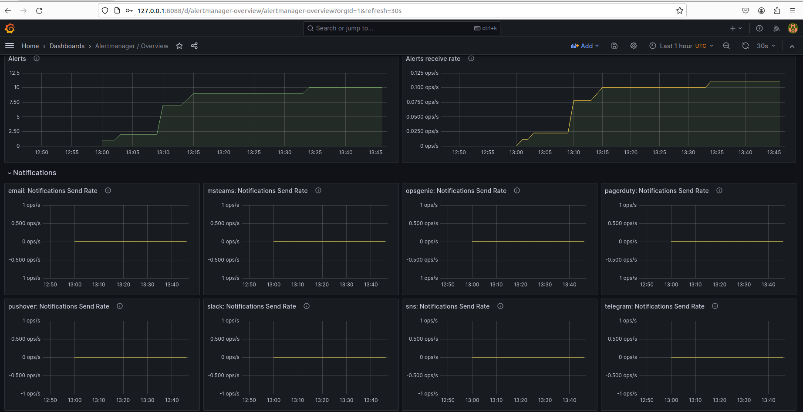
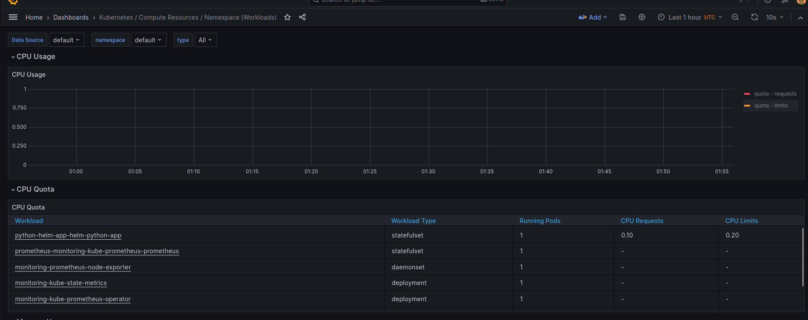

# Lab 14: Kubernetes Monitoring and Init Containers

## Task 1

The Kube Prometheus Stack is a commonly utilized monitoring system for overseeing Kubernetes clusters, incorporating essential components that collaborate to deliver a comprehensive monitoring solution. Here's a brief overview of each component:

Prometheus, at the heart of the Kube Prometheus Stack, is an open-source monitoring system featuring a dimensional data model, a flexible query language, an efficient time series database, and a modern alerting approach.

Simplifying the configuration process for Prometheus, Alertmanager, and other related monitoring elements, the Prometheus Operator streamlines setup and organization.

Kube State Metrics, a crucial service, collects cluster state metrics by accessing the Kubernetes API server.

The Alertmanager component of Prometheus manages alerts received from client applications, eliminating duplicates, categorizing alerts, and directing them to appropriate integrations for delivery via email, PagerDuty, or OpsGenie.

Grafana, an extensively used web application for analytics and interactive visualization within the Kube Prometheus Stack, can display charts, graphs, and notifications when connected to compatible data sources like Prometheus.

```bash
acceptasis@Acceptasis:~/devops/core-course-labs$ helm repo add prometheus-community https://prometheus-community.github.io/helm-charts
"prometheus-community" has been added to your repositories
acceptasis@Acceptasis:~/devops/core-course-labs$ helm repo update
Hang tight while we grab the latest from your chart repositories...
...Successfully got an update from the "prometheus-community" chart repository
Update Complete. ⎈Happy Helming!⎈
acceptasis@Acceptasis:~/devops/core-course-labs$ helm install monitoring prometheus-community/kube-prometheus-stack
NAME: monitoring
LAST DEPLOYED: Wed Jan 17 22:19:12 2024
NAMESPACE: default
STATUS: deployed
REVISION: 1
NOTES:
kube-prometheus-stack has been installed. Check its status by running:
  kubectl --namespace default get pods -l "release=monitoring"

Visit https://github.com/prometheus-operator/kube-prometheus for instructions on how to create & configure Alertmanager and Prometheus instances using the Operator.
```

```bash
NAME                                                         READY   STATUS    RESTARTS      AGE
pod/alertmanager-monitoring-kube-prometheus-alertmanager-0   2/2     Running   0             14m
pod/monitoring-grafana-77f58545c-ch5wp                       3/3     Running   0             15m
pod/monitoring-kube-prometheus-operator-6c998d9779-fbxxn     1/1     Running   0             15m
pod/monitoring-kube-state-metrics-59c7c8b996-j2qr4           1/1     Running   0             15m
pod/monitoring-prometheus-node-exporter-jwfrx                1/1     Running   0             15m
pod/prometheus-monitoring-kube-prometheus-prometheus-0       2/2     Running   0             14m
pod/python-helm-app-helm-python-app-0                        1/1     Running   1 (22m ago)   13h

NAME                                                                    READY   AGE
statefulset.apps/alertmanager-monitoring-kube-prometheus-alertmanager   1/1     14m
statefulset.apps/prometheus-monitoring-kube-prometheus-prometheus       1/1     14m
statefulset.apps/python-helm-app-helm-python-app                        1/1     13h

NAME                                              TYPE           CLUSTER-IP       EXTERNAL-IP   PORT(S)                      AGE
service/alertmanager-operated                     ClusterIP      None             <none>        9093/TCP,9094/TCP,9094/UDP   14m
service/kubernetes                                ClusterIP      10.96.0.1        <none>        443/TCP                      4d
service/monitoring-grafana                        ClusterIP      10.97.197.47     <none>        80/TCP                       15m
service/monitoring-kube-prometheus-alertmanager   ClusterIP      10.96.200.75     <none>        9093/TCP,8080/TCP            15m
service/monitoring-kube-prometheus-operator       ClusterIP      10.100.242.124   <none>        443/TCP                      15m
service/monitoring-kube-prometheus-prometheus     ClusterIP      10.107.10.214    <none>        9090/TCP,8080/TCP            15m
service/monitoring-kube-state-metrics             ClusterIP      10.109.25.202    <none>        8080/TCP                     15m
service/monitoring-prometheus-node-exporter       ClusterIP      10.104.28.82     <none>        9100/TCP                     15m
service/prometheus-operated                       ClusterIP      None             <none>        9090/TCP                     14m
service/python-helm-app-helm-python-app           LoadBalancer   10.97.254.215    <pending>     8008:31498/TCP               13h

NAME                                                                 STATUS   VOLUME                                     CAPACITY   ACCESS MODES   STORAGECLASS   AGE
persistentvolumeclaim/visits-web-python-helm-app-helm-python-app-0   Bound    pvc-76d21c71-969d-4021-abbf-f0a2a0ec5d1d   2Mi        RWO            standard       13h

NAME                                                                     DATA   AGE
configmap/kube-root-ca.crt                                               1      4d
configmap/monitoring-grafana                                             1      15m
configmap/monitoring-grafana-config-dashboards                           1      15m
configmap/monitoring-kube-prometheus-alertmanager-overview               1      15m
configmap/monitoring-kube-prometheus-apiserver                           1      15m
configmap/monitoring-kube-prometheus-cluster-total                       1      15m
configmap/monitoring-kube-prometheus-controller-manager                  1      15m
configmap/monitoring-kube-prometheus-etcd                                1      15m
configmap/monitoring-kube-prometheus-grafana-datasource                  1      15m
configmap/monitoring-kube-prometheus-grafana-overview                    1      15m
configmap/monitoring-kube-prometheus-k8s-coredns                         1      15m
configmap/monitoring-kube-prometheus-k8s-resources-cluster               1      15m
configmap/monitoring-kube-prometheus-k8s-resources-multicluster          1      15m
configmap/monitoring-kube-prometheus-k8s-resources-namespace             1      15m
configmap/monitoring-kube-prometheus-k8s-resources-node                  1      15m
configmap/monitoring-kube-prometheus-k8s-resources-pod                   1      15m
configmap/monitoring-kube-prometheus-k8s-resources-workload              1      15m
configmap/monitoring-kube-prometheus-k8s-resources-workloads-namespace   1      15m
configmap/monitoring-kube-prometheus-kubelet                             1      15m
configmap/monitoring-kube-prometheus-namespace-by-pod                    1      15m
configmap/monitoring-kube-prometheus-namespace-by-workload               1      15m
configmap/monitoring-kube-prometheus-node-cluster-rsrc-use               1      15m
configmap/monitoring-kube-prometheus-node-rsrc-use                       1      15m
configmap/monitoring-kube-prometheus-nodes                               1      15m
configmap/monitoring-kube-prometheus-nodes-darwin                        1      15m
configmap/monitoring-kube-prometheus-persistentvolumesusage              1      15m
configmap/monitoring-kube-prometheus-pod-total                           1      15m
configmap/monitoring-kube-prometheus-prometheus                          1      15m
configmap/monitoring-kube-prometheus-proxy                               1      15m
configmap/monitoring-kube-prometheus-scheduler                           1      15m
configmap/monitoring-kube-prometheus-workload-total                      1      15m
configmap/prometheus-monitoring-kube-prometheus-prometheus-rulefiles-0   35     14m
```

1. **Pods (`kubectl get po`):**
   - This section displays information about the running pods in Kubernetes cluster. Pods are the smallest deployable units in Kubernetes, representing one or more containers.

2. **StatefulSets (`kubectl get sts`):**
   - StatefulSets are used to manage stateful applications. This part of the output provides information about the StatefulSets in cluster. StatefulSets are typically used for applications that require stable network identities and persistent storage.

3. **Services (`kubectl get svc`):**
   - Services in Kubernetes enable communication between different parts of an application. This section of the output shows details about the services, including their names, types, cluster IP addresses, and external endpoints.

4. **Persistent Volume Claims (`kubectl get pvc`):**
   - Persistent Volume Claims (PVCs) are requests for storage by pods. This part of the output provides information about the PVCs in your cluster, such as their names, statuses, and storage details.

5. **ConfigMaps (`kubectl get cm`):**
   - ConfigMaps are used to decouple configuration artifacts from containerized applications. This section of the output displays information about the ConfigMaps in cluster, including their names, data keys, and creation timestamps.

1. Active Alerts: 



2. Web UI with ```minikube service monitoring-kube-prometheus-alertmanager```: 


3. Kubulet statistics:


4. Memory usage:


5. Pod by CPU:


6. Stateful:


7. Network:


## Task 2

```bash
acceptasis@Acceptasis:~/devops/core-course-labs/k8s$ kubectl exec pod/python-helm-app-helm-python-app-0 -- cat /init_data/index.html
Defaulted container "python-helm-app-helm-python-app" out of: python-helm-app-helm-python-app, install (init)
<html><head></head><body><header>
<title>http://info.cern.ch</title>
</header>

<h1>http://info.cern.ch - home of the first website</h1>
<p>From here you can:</p>
<ul>
<li><a href="http://info.cern.ch/hypertext/WWW/TheProject.html">Browse the first website</a></li>
<li><a href="http://line-mode.cern.ch/www/hypertext/WWW/TheProject.html">Browse the first website using the line-mode browser simulator</a></li>
<li><a href="http://home.web.cern.ch/topics/birth-web">Learn about the birth of the web</a></li>
<li><a href="http://home.web.cern.ch/about">Learn about CERN, the physics laboratory where the web was born</a></li>
</ul>
</body></html>
```


