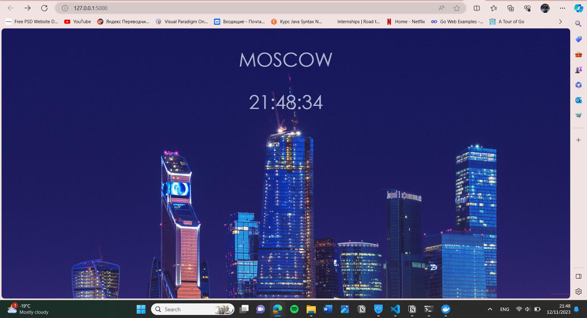
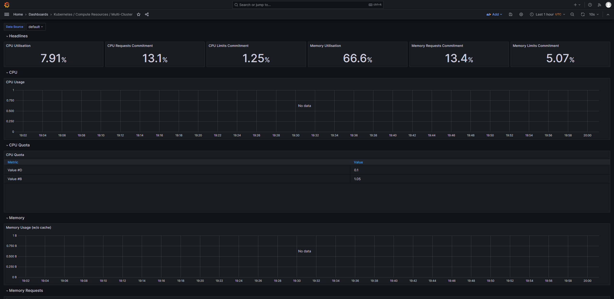
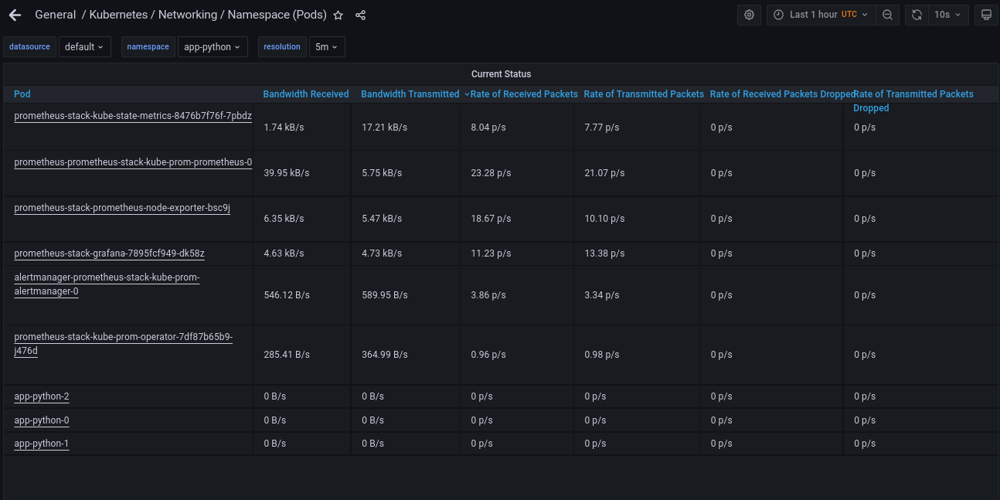

# Kube Prometheus Stack
Prometheus: Monitors various services in the cluster.

Alertmanager: Manages and forwards alerts to specified destinations.

Node Exporter: Collects metrics from the underlying machine.

Prometheus Operator: Integrates Prometheus with Kubernetes.

kube-state-metrics: Captures data about the Kubernetes cluster.

Grafana: Provides user-friendly dashboards for visualization.


```
kubectl get po,sts,svc,pvc,cm
NAME                                                         READY   STATUS    RESTARTS      AGE
pod/alertmanager-monitoring-kube-prometheus-alertmanager-0   2/2     Running   0             4m39s
pod/monitoring-grafana-6f8d546676-m8nsq                      3/3     Running   0             7m25s
pod/monitoring-kube-prometheus-operator-5fbb66b4b-pk7vn      1/1     Running   0             7m25s
pod/monitoring-kube-state-metrics-74f4d8858f-jz8gt           1/1     Running   0             7m25s
pod/monitoring-prometheus-node-exporter-g7hqq                1/1     Running   0             7m25s
pod/prometheus-monitoring-kube-prometheus-prometheus-0       2/2     Running   0             4m39s
pod/python-app-python-0                                      1/1     Running   0             42m
pod/vault-0                                                  1/1     Running   1 (48m ago)   14d

NAME                                                                    READY   AGE
statefulset.apps/alertmanager-monitoring-kube-prometheus-alertmanager   1/1     7m23s
statefulset.apps/prometheus-monitoring-kube-prometheus-prometheus       1/1     7m23s
statefulset.apps/python-app-python                                      1/1     42m
statefulset.apps/vault                                                  1/1     22d

NAME                                              TYPE           CLUSTER-IP       EXTERNAL-IP   PORT(S)                      AGE
service/alertmanager-operated                     ClusterIP      None             <none>        9093/TCP,9094/TCP,9094/UDP   7m23s
service/kubernetes                                ClusterIP      10.96.0.1        <none>        443/TCP                      14d
service/monitoring-grafana                        ClusterIP      10.100.195.118   <none>        80/TCP                       7m25s
service/monitoring-kube-prometheus-alertmanager   ClusterIP      10.109.188.210   <none>        9093/TCP,8080/TCP            7m25s
service/monitoring-kube-prometheus-operator       ClusterIP      10.97.77.204     <none>        443/TCP                      7m25s
service/monitoring-kube-prometheus-prometheus     ClusterIP      10.111.3.74      <none>        9090/TCP,8080/TCP            7m25s
service/monitoring-kube-state-metrics             ClusterIP      10.111.111.237   <none>        8080/TCP                     7m25s
service/monitoring-prometheus-node-exporter       ClusterIP      10.104.176.244   <none>        9100/TCP                     7m25s
service/prometheus-operated                       ClusterIP      None             <none>        9090/TCP                     7m23s
service/python-app-python                         LoadBalancer   10.99.107.160    <pending>     8000:30748/TCP               42m

NAME                                                        STATUS   VOLUME                                     CAPACITY   ACCESS MODES   STORAGECLASS   AGE
persistentvolumeclaim/counter-data-py-python-app-python-0   Bound    pvc-ef708ac2-2296-4d94-84a9-e804031ce15c   10Mi       RWO            standard       42m

NAME                                                                     DATA   AGE
configmap/config-map-entity-py                                           2      42m
configmap/kube-root-ca.crt                                               1      35d
configmap/monitoring-grafana                                             1      7m25s
configmap/monitoring-grafana-config-dashboards                           1      7m25s
configmap/monitoring-kube-prometheus-alertmanager-overview               1      7m25s
configmap/monitoring-kube-prometheus-apiserver                           1      7m25s
configmap/monitoring-kube-prometheus-cluster-total                       1      7m25s
configmap/monitoring-kube-prometheus-controller-manager                  1      7m25s
configmap/monitoring-kube-prometheus-etcd                                1      7m25s
configmap/monitoring-kube-prometheus-grafana-datasource                  1      7m25s
configmap/monitoring-kube-prometheus-grafana-overview                    1      7m25s
configmap/monitoring-kube-prometheus-k8s-coredns                         1      7m25s
configmap/monitoring-kube-prometheus-k8s-resources-cluster               1      7m25s
configmap/monitoring-kube-prometheus-k8s-resources-multicluster          1      7m25s
configmap/monitoring-kube-prometheus-k8s-resources-namespace             1      7m25s
configmap/monitoring-kube-prometheus-k8s-resources-node                  1      7m25s
configmap/monitoring-kube-prometheus-k8s-resources-pod                   1      7m25s
configmap/monitoring-kube-prometheus-k8s-resources-workload              1      7m25s
configmap/monitoring-kube-prometheus-k8s-resources-workloads-namespace   1      7m25s
configmap/monitoring-kube-prometheus-kubelet                             1      7m25s
configmap/monitoring-kube-prometheus-namespace-by-pod                    1      7m25s
configmap/monitoring-kube-prometheus-namespace-by-workload               1      7m25s
configmap/monitoring-kube-prometheus-node-cluster-rsrc-use               1      7m25s
configmap/monitoring-kube-prometheus-node-rsrc-use                       1      7m25s
configmap/monitoring-kube-prometheus-nodes                               1      7m25s
configmap/monitoring-kube-prometheus-nodes-darwin                        1      7m25s
configmap/monitoring-kube-prometheus-persistentvolumesusage              1      7m25s
configmap/monitoring-kube-prometheus-pod-total                           1      7m25s
configmap/monitoring-kube-prometheus-prometheus                          1      7m25s
configmap/monitoring-kube-prometheus-proxy                               1      7m25s
configmap/monitoring-kube-prometheus-scheduler                           1      7m25s
configmap/monitoring-kube-prometheus-workload-total                      1      7m25s
configmap/prometheus-monitoring-kube-prometheus-prometheus-rulefiles-0   34     7m23s
```

## Pods
The Pods section encompasses various pods, including those for Python, Alert Manager, Grafana, Prometheus Operator, kube-state-metrics, Node Exporter, and the primary Prometheus instance.

## StatefulSets
StatefulSets are employed for maintaining state and configuration data across pod restarts and scaling operations for essential components such as Alert Manager and Prometheus.

## Services
Services in the context of kube-prometheus-stack correspond to elements encompassing both applications and a service for Kubernetes itself.

## PersistentVolumeClaims
PersistentVolumeClaims (PVCs) are utilized for each application's pod (with an additional data PVC for the Python app) and for Vault.

## ConfigMaps
ConfigMaps include a singular configuration map for the Python application, while others are dedicated to configurations for the kube-prometheus-stack.








