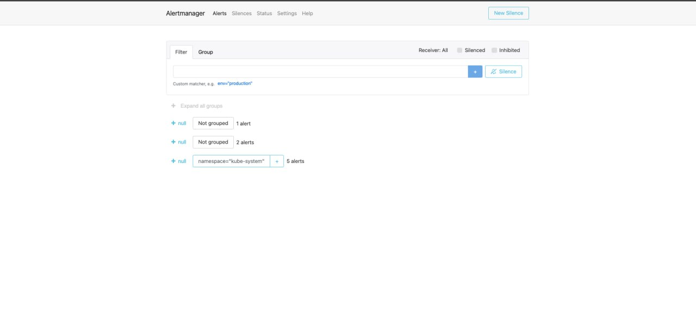
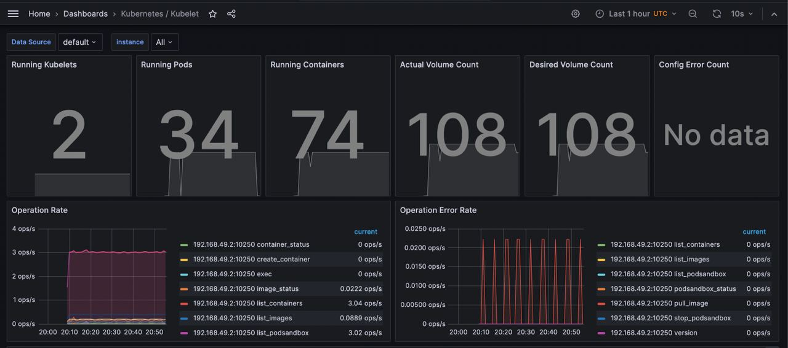
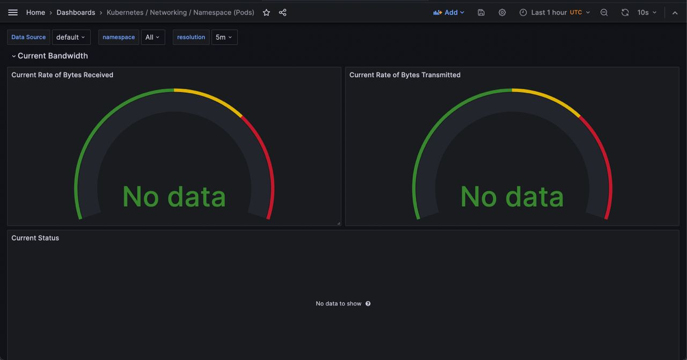
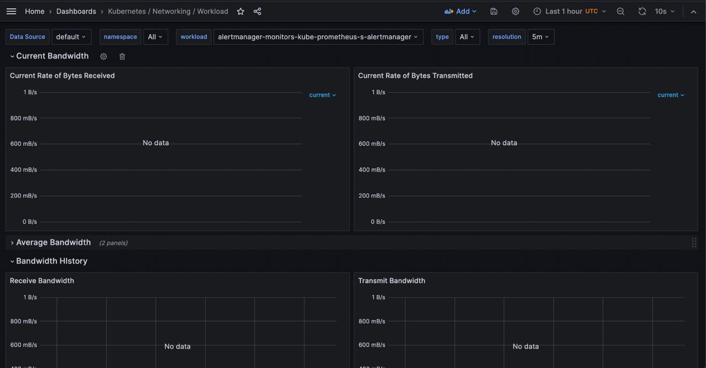
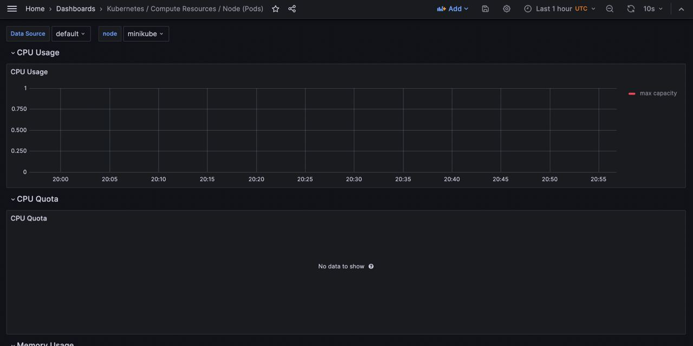
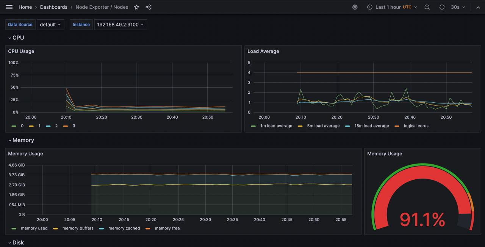
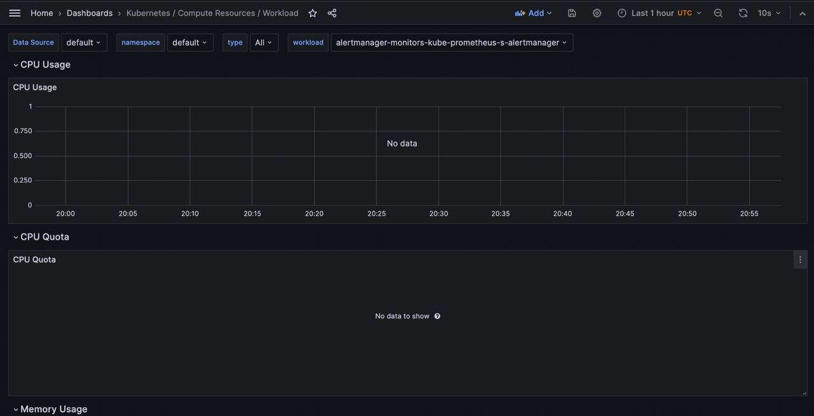

# Kube Prometheus Stack

The Kube Prometheus Stack is a collection of tools and components designed to facilitate monitoring and alerting for Kubernetes clusters. It's based on the Prometheus monitoring system and is optimized for Kubernetes environments. Let's break down its main components and their roles:

1. __Prometheus__: At the core of the stack, Prometheus is responsible for collecting and storing metrics. It scrapes metrics from configured targets at specified intervals, evaluates rule expressions, displays the results, and can trigger alerts if certain conditions are met. Prometheus is particularly well-suited for the dynamic nature of Kubernetes, as it can discover targets in a Kubernetes cluster automatically.

2. __Alertmanager__: This component handles alerts sent by Prometheus. It takes care of deduplicating, grouping, and routing them to the correct receiver such as email, PagerDuty, or OpsGenie. It also ensures that alerting rules are efficiently managed and that notifications are sent out based on those rules.

3. __Node Exporter__: This is a Prometheus exporter used for hardware and OS metrics exposed by *NIX kernels. It's usually deployed on every node of the Kubernetes cluster to provide detailed information about the system, including CPU, disk, and memory usage.

4. __Kube-state-metrics__: This service listens to the Kubernetes API server and generates metrics about the state of the objects (e.g., deployments, nodes, pods) in the cluster. This data provides insights into the state of Kubernetes resources, helping in understanding the operational state of the cluster.

5. __Grafana__: An open-source analytics and monitoring solution that is often included in the Kube Prometheus Stack. It provides the capability to create, explore, and share dashboards that visualize the metrics collected by Prometheus. This is crucial for understanding the performance of the cluster and quickly identifying issues.

6. __Prometheus Operator__: This component simplifies the deployment and management of Prometheus, Alertmanager, and related monitoring components. It offers Kubernetes-native deployment and management of Prometheus and its components, with features like automatic configuration reloading and easier alerting rules management.

Each of these components plays a vital role in the monitoring ecosystem of a Kubernetes cluster. The stack is designed to be extensible and customizable, allowing you to add or modify components to suit specific needs or integrate with existing systems. The combination of these tools provides a powerful platform for monitoring the health and performance of Kubernetes clusters, helping teams to proactively manage their infrastructure and applications.


## Helm Installation

Output of command:`helm repo add prometheus-community https://prometheus-community.github.io/helm-charts`

```
"prometheus-community" has been added to your repositories
```

Output of command:`helm repo update`

```
Hang tight while we grab the latest from your chart repositories...
...Successfully got an update from the "hashicorp" chart repository
...Successfully got an update from the "prometheus-community" chart repository
Update Complete. ⎈Happy Helming!⎈
```

Output of command:`helm install monitoring-grafana prometheus-community/kube-prometheus-stack`

```
NAME: monitoring-grafana
LAST DEPLOYED: Sat Dec  9 23:10:15 2023
NAMESPACE: default
STATUS: deployed
REVISION: 1
NOTES:
kube-prometheus-stack has been installed. Check its status by running:
  kubectl --namespace default get pods -l "release=monitoring-grafana"

Visit https://github.com/prometheus-operator/kube-prometheus for instructions on how to create & configure Alertmanager and Prometheus instances using the Operator.
```

Output of command:`helm install my-app app-python`

```
NAME: my-app
LAST DEPLOYED: Sat Dec  9 23:24:27 2023
NAMESPACE: default
STATUS: deployed
REVISION: 1
NOTES:
1. Get the application URL by running these commands:
  export NODE_PORT=$(kubectl get --namespace default -o jsonpath="{.spec.ports[0].nodePort}" services my-app-app-python)
  export NODE_IP=$(kubectl get nodes --namespace default -o jsonpath="{.items[0].status.addresses[0].address}")
  echo http://$NODE_IP:$NODE_PORT
```

Output of command:`helm ls`

```
NAME                    NAMESPACE       REVISION        UPDATED                                 STATUS          CHART                         APP VERSION
monitoring-grafana      default         1               2023-12-09 23:10:15.546661651 +0300 MSK deployed        kube-prometheus-stack-55.1.0  v0.70.0    
my-app                  default         1               2023-12-09 23:24:27.642196062 +0300 MSK deployed        app-python-0.1.0              1.16.0                 	1.16.0
```
---
```
kubectl get po,sts,svc,pvc,cm
```

```
NAME                                                         READY   STATUS                       RESTARTS   AGE
pod/alertmanager-monitoring-grafana-kube-pr-alertmanager-0   2/2     Running                      0          14m
pod/monitoring-grafana-56459f4455-jzk75                      3/3     Running                      0          15m
pod/monitoring-grafana-kube-pr-operator-6fb8c5d86b-bwqkj     1/1     Running                      0          15m
pod/monitoring-grafana-kube-state-metrics-7cc7bcfd4c-l94bs   1/1     Running                      0          15m
pod/monitoring-grafana-prometheus-node-exporter-4mg9v        1/1     Running                      0          15m
pod/my-app-app-python-0                                      0/1     CreateContainerConfigError   0          83s
pod/prometheus-monitoring-grafana-kube-pr-prometheus-0       2/2     Running                      0          14m

NAME                                                                    READY   AGE
statefulset.apps/alertmanager-monitoring-grafana-kube-pr-alertmanager   1/1     14m
statefulset.apps/my-app-app-python                                      0/1     83s
statefulset.apps/prometheus-monitoring-grafana-kube-pr-prometheus       1/1     14m

NAME                                                  TYPE        CLUSTER-IP       EXTERNAL-IP   PORT(S)                      AGE
service/alertmanager-operated                         ClusterIP   None             <none>        9093/TCP,9094/TCP,9094/UDP   14m
service/kubernetes                                    ClusterIP   10.96.0.1        <none>        443/TCP                      4h4m
service/monitoring-grafana                            ClusterIP   10.106.222.190   <none>        80/TCP                       15m
service/monitoring-grafana-kube-pr-alertmanager       ClusterIP   10.99.234.208    <none>        9093/TCP,8080/TCP            15m
service/monitoring-grafana-kube-pr-operator           ClusterIP   10.104.102.52    <none>        443/TCP                      15m
service/monitoring-grafana-kube-pr-prometheus         ClusterIP   10.106.212.74    <none>        9090/TCP,8080/TCP            15m
service/monitoring-grafana-kube-state-metrics         ClusterIP   10.96.77.35      <none>        8080/TCP                     15m
service/monitoring-grafana-prometheus-node-exporter   ClusterIP   10.99.142.184    <none>        9100/TCP                     15m
service/my-app-app-python                             NodePort    10.98.194.232    <none>        80:30111/TCP                 83s
service/prometheus-operated                           ClusterIP   None             <none>        9090/TCP                     14m

NAME                                               STATUS   VOLUME                                     CAPACITY   ACCESS MODES   STORAGECLASS   AGE
persistentvolumeclaim/visits-my-app-app-python-0   Bound    pvc-c5dde8a1-403e-4a78-acc6-c7f532b8202c   1Mi        RWO            standard       83s

NAME                                                                     DATA   AGE
configmap/kube-root-ca.crt                                               1      4h4m
configmap/monitoring-grafana                                             1      15m
configmap/monitoring-grafana-config-dashboards                           1      15m
configmap/monitoring-grafana-kube-pr-alertmanager-overview               1      15m
configmap/monitoring-grafana-kube-pr-apiserver                           1      15m
configmap/monitoring-grafana-kube-pr-cluster-total                       1      15m
configmap/monitoring-grafana-kube-pr-controller-manager                  1      15m
configmap/monitoring-grafana-kube-pr-etcd                                1      15m
configmap/monitoring-grafana-kube-pr-grafana-datasource                  1      15m
configmap/monitoring-grafana-kube-pr-grafana-overview                    1      15m
configmap/monitoring-grafana-kube-pr-k8s-coredns                         1      15m
configmap/monitoring-grafana-kube-pr-k8s-resources-cluster               1      15m
configmap/monitoring-grafana-kube-pr-k8s-resources-multicluster          1      15m
configmap/monitoring-grafana-kube-pr-k8s-resources-namespace             1      15m
configmap/monitoring-grafana-kube-pr-k8s-resources-node                  1      15m
configmap/monitoring-grafana-kube-pr-k8s-resources-pod                   1      15m
configmap/monitoring-grafana-kube-pr-k8s-resources-workload              1      15m
configmap/monitoring-grafana-kube-pr-k8s-resources-workloads-namespace   1      15m
configmap/monitoring-grafana-kube-pr-kubelet                             1      15m
configmap/monitoring-grafana-kube-pr-namespace-by-pod                    1      15m
configmap/monitoring-grafana-kube-pr-namespace-by-workload               1      15m
configmap/monitoring-grafana-kube-pr-node-cluster-rsrc-use               1      15m
configmap/monitoring-grafana-kube-pr-node-rsrc-use                       1      15m
configmap/monitoring-grafana-kube-pr-nodes                               1      15m
configmap/monitoring-grafana-kube-pr-nodes-darwin                        1      15m
configmap/monitoring-grafana-kube-pr-persistentvolumesusage              1      15m
configmap/monitoring-grafana-kube-pr-pod-total                           1      15m
configmap/monitoring-grafana-kube-pr-prometheus                          1      15m
configmap/monitoring-grafana-kube-pr-proxy                               1      15m
configmap/monitoring-grafana-kube-pr-scheduler                           1      15m
configmap/monitoring-grafana-kube-pr-workload-total                      1      15m
configmap/prometheus-monitoring-grafana-kube-pr-prometheus-rulefiles-0   34     14m
```

## Grafana Dashboards

Output of command:`minikube service monitoring-grafana`

```
|-----------|--------------------|-------------|--------------|
| NAMESPACE |        NAME        | TARGET PORT |     URL      |
|-----------|--------------------|-------------|--------------|
| default   | monitoring-grafana |             | No node port |
|-----------|--------------------|-------------|--------------|
😿  service default/monitoring-grafana has no node port
🏃  Starting tunnel for service monitoring-grafana.
|-----------|--------------------|-------------|------------------------|
| NAMESPACE |        NAME        | TARGET PORT |          URL           |
|-----------|--------------------|-------------|------------------------|
| default   | monitoring-grafana |             | http://127.0.0.1:56114 |
|-----------|--------------------|-------------|------------------------|
🎉  Opening service default/monitoring-grafana in default browser...
```







