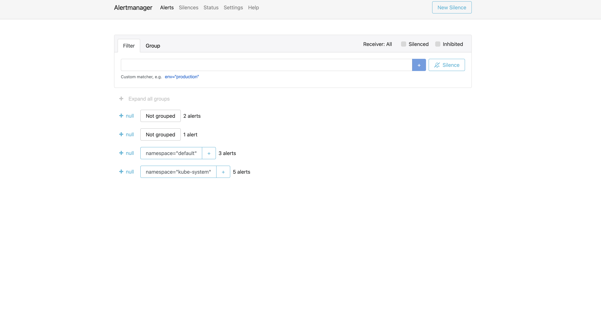
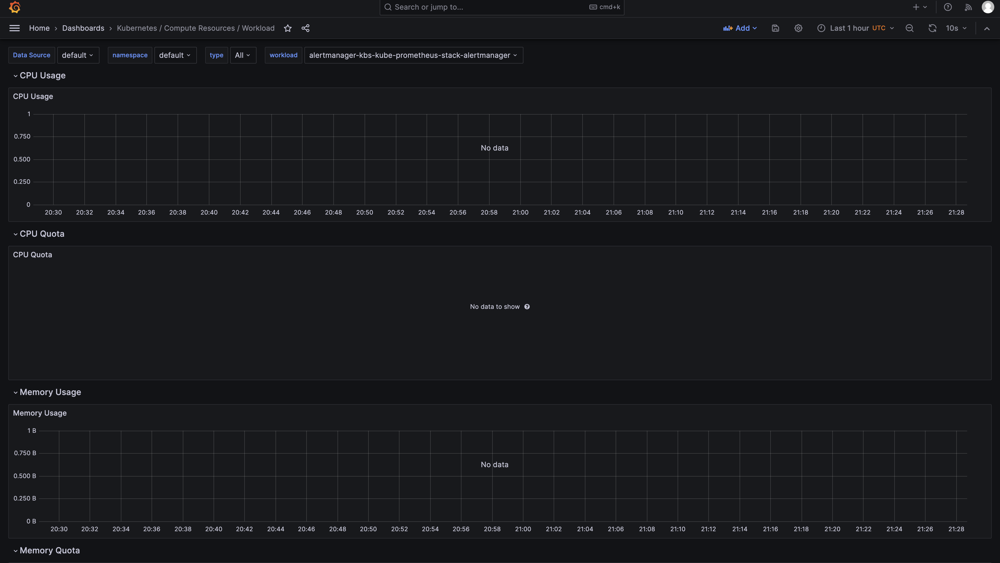
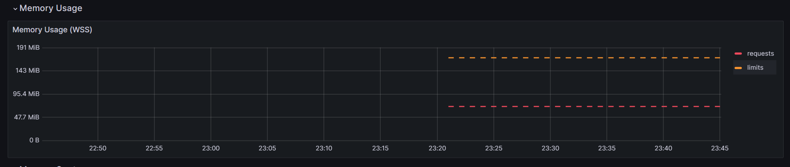
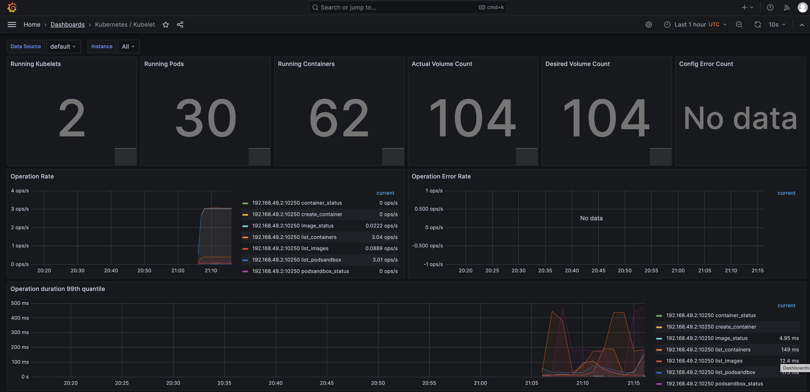
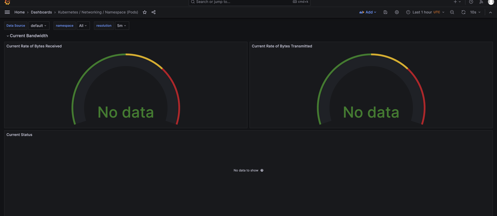
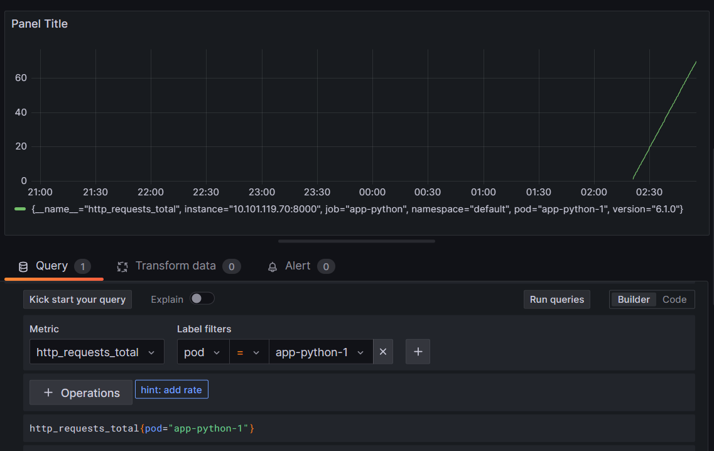

# Kube Prometheus Stack

- Prometheus - Retrieve metric from endpoints
- Alertmanager - Service to deliver alerts
- Node Exporter - grub system info and metrics
- Prometheus operator - K8s prometheus adapter
- kube-state-metrics - collector for metrics
- Graphana - GUI for dashboards/alerts

# Output of commands

```bash
PS G:\git\core-course-labs>  kubectl get po,sts,svc,pvc,cm
NAME                                                         READY   STATUS    RESTARTS   AGE
pod/alertmanager-monitoring-kube-prometheus-alertmanager-0   2/2     Running   0          119s
pod/monitoring-grafana-6f8d546676-c4bq9                      3/3     Running   0          2m37s
pod/monitoring-kube-prometheus-operator-5fbb66b4b-w4nbj      1/1     Running   0          2m37s
pod/monitoring-kube-state-metrics-74f4d8858f-n24jn           1/1     Running   0          2m37s
pod/monitoring-prometheus-node-exporter-zd2fh                1/1     Running   0          2m37s
pod/prometheus-monitoring-kube-prometheus-prometheus-0       2/2     Running   0          119s
pod/app-python-0                                             1/1     Running   0          3m47s
pod/app-python-1                                             1/1     Running   0          3m47s

NAME                                                                    READY   AGE
statefulset.apps/alertmanager-monitoring-kube-prometheus-alertmanager   1/1     119s
statefulset.apps/app-python                                             2/2     3m47s
statefulset.apps/prometheus-monitoring-kube-prometheus-prometheus       1/1     119s

NAME                                              TYPE        CLUSTER-IP       EXTERNAL-IP   PORT(S)                      AGE
service/alertmanager-operated                     ClusterIP   None             <none>        9093/TCP,9094/TCP,9094/UDP   119s
service/app-python                                NodePort    10.101.119.70    <none>        8000:32523/TCP               3m47s
service/kubernetes                                ClusterIP   10.96.0.1        <none>        443/TCP                      15m
service/monitoring-grafana                        ClusterIP   10.97.95.83      <none>        80/TCP                       2m37s
service/monitoring-kube-prometheus-alertmanager   ClusterIP   10.107.164.44    <none>        9093/TCP,8080/TCP            2m37s
service/monitoring-kube-prometheus-operator       ClusterIP   10.107.9.40      <none>        443/TCP                      2m37s
service/monitoring-kube-prometheus-prometheus     ClusterIP   10.110.198.61    <none>        9090/TCP,8080/TCP            2m37s
service/monitoring-kube-state-metrics             ClusterIP   10.101.124.243   <none>        8080/TCP                     2m37s
service/monitoring-prometheus-node-exporter       ClusterIP   10.97.194.51     <none>        9100/TCP                     2m37s
service/prometheus-operated                       ClusterIP   None             <none>        9090/TCP                     119s

NAME                                                                     DATA   AGE
configmap/config-py                                                      2      3m47s
configmap/kube-root-ca.crt                                               1      15m
configmap/monitoring-grafana                                             1      2m38s
configmap/monitoring-grafana-config-dashboards                           1      2m38s
configmap/monitoring-kube-prometheus-alertmanager-overview               1      2m38s
configmap/monitoring-kube-prometheus-apiserver                           1      2m38s
configmap/monitoring-kube-prometheus-cluster-total                       1      2m38s
configmap/monitoring-kube-prometheus-controller-manager                  1      2m38s
configmap/monitoring-kube-prometheus-etcd                                1      2m38s
configmap/monitoring-kube-prometheus-grafana-datasource                  1      2m38s
configmap/monitoring-kube-prometheus-grafana-overview                    1      2m38s
configmap/monitoring-kube-prometheus-k8s-coredns                         1      2m38s
configmap/monitoring-kube-prometheus-k8s-resources-cluster               1      2m38s
configmap/monitoring-kube-prometheus-k8s-resources-multicluster          1      2m38s
configmap/monitoring-kube-prometheus-k8s-resources-namespace             1      2m38s
configmap/monitoring-kube-prometheus-k8s-resources-node                  1      2m38s
configmap/monitoring-kube-prometheus-k8s-resources-pod                   1      2m38s
configmap/monitoring-kube-prometheus-k8s-resources-workload              1      2m38s
configmap/monitoring-kube-prometheus-k8s-resources-workloads-namespace   1      2m38s
configmap/monitoring-kube-prometheus-kubelet                             1      2m38s
configmap/monitoring-kube-prometheus-namespace-by-pod                    1      2m38s
configmap/monitoring-kube-prometheus-namespace-by-workload               1      2m38s
configmap/monitoring-kube-prometheus-node-cluster-rsrc-use               1      2m38s
configmap/monitoring-kube-prometheus-node-rsrc-use                       1      2m38s
configmap/monitoring-kube-prometheus-nodes                               1      2m38s
configmap/monitoring-kube-prometheus-nodes-darwin                        1      2m38s
configmap/monitoring-kube-prometheus-persistentvolumesusage              1      2m38s
configmap/monitoring-kube-prometheus-pod-total                           1      2m38s
configmap/monitoring-kube-prometheus-prometheus                          1      2m38s
configmap/monitoring-kube-prometheus-proxy                               1      2m38s
configmap/monitoring-kube-prometheus-scheduler                           1      2m38s
configmap/monitoring-kube-prometheus-workload-total                      1      2m38s
configmap/prometheus-monitoring-kube-prometheus-prometheus-rulefiles-0   34     119s
```

Pods:

- `alertmanager-monitoring-kube-prometheus-alertmanager-...` - alert manager pod
- `monitoring-grafana-...` - grafana pod
- `monitoring-kube-prometheus-operator-...` - prometheus operator pod
- `monitoring-kube-state-metrics-...` - kube-state-metrics pod
- `monitoring-prometheus-node-exporter-...` - node-exporter pod
- `prometheus-monitoring-kube-prometheus-prometheus-...` - pormetheus pods
- `app-python-...` - Python application pods

Stateful sets:

- `statefulset.apps/alertmanager-monitoring-kube-prometheus-alertmanager` - statefulset of AlertManager (for reliability)
- `statefulset.apps/prometheus-monitoring-kube-prometheus-prometheus` - statefulset of Prometheus (for reliability)
- `statefulset.apps/app-python` - Python app StatefulSet

# Task 2 + Bonus

```bash
PS G:\git\core-course-labs>  kubectl exec app-python-0 -- cat /init_data/file
Defaulted container "app-python" out of: app-python, install (init), zero (init), one (init), two (init), three (init)
1
2
3
PS G:\git\core-course-labs>  kubectl exec app-python-0 -- cat /init_data/index.html
Defaulted container "app-python" out of: app-python, install (init), zero (init), one (init), two (init), three (init)
<html><head></head><body><header>
<title>http://info.cern.ch</title>
</header>

<h1>http://info.cern.ch - home of the first website</h1>
<p>From here you can:</p>
<ul>
<li><a href="http://info.cern.ch/hypertext/WWW/TheProject.html">Browse the first website</a></li>
<li><a href="http://line-mode.cern.ch/www/hypertext/WWW/TheProject.html">Browse the first website using the line-mode browser simulator</a></li><li><a href="http://home.web.cern.ch/topics/birth-web">Learn about the birth of the web</a></li>
<li><a href="http://home.web.cern.ch/about">Learn about CERN, the physics laboratory where the web was born</a></li>
</ul>
</body></html>
```











# Bonus


