# Kubernetes Monitoring and Init Containers

## Task 1:

### Subtask 2:
 - Grafana: Dashboard GUI
 - Alertmanager: Reporting metric alerts and emitting notifications
 - Prometheus: Collecting metrics
 - Node Exporter: Collecting metrics from machine
 - kube-state-metrics: Collecting metrics from the cluster
 - Prometheus operator: Configuring Prometheus for k8s

### Subtask 3:

```
kubectl get po,sts,svc,pvc,cm
```

```
NAME                                                         READY   STATUS    RESTARTS   AGE
pod/alertmanager-monitoring-kube-prometheus-alertmanager-0   2/2     Running   0          18m
pod/app-python-helm-0                                        1/1     Running   0          24m
pod/app-python-helm-1                                        1/1     Running   0          24m
pod/monitoring-grafana-5b7db44454-dtl7f                      3/3     Running   0          19m
pod/monitoring-kube-prometheus-operator-f4c675984-pscpl      1/1     Running   0          19m
pod/monitoring-kube-state-metrics-f7ff68767-dbzpf            1/1     Running   0          19m
pod/monitoring-prometheus-node-exporter-fmw78                1/1     Running   0          19m
pod/prometheus-monitoring-kube-prometheus-prometheus-0       2/2     Running   0          18m

NAME                                                                    READY   AGE
statefulset.apps/alertmanager-monitoring-kube-prometheus-alertmanager   1/1     18m
statefulset.apps/app-python-helm                                        2/2     24m
statefulset.apps/prometheus-monitoring-kube-prometheus-prometheus       1/1     18m

NAME                                              TYPE        CLUSTER-IP       EXTERNAL-IP   PORT(S)                      AGE
service/alertmanager-operated                     ClusterIP   None             <none>        9093/TCP,9094/TCP,9094/UDP   18m
service/app-python-helm                           ClusterIP   10.104.136.114   <none>        5000/TCP                     24m
service/kubernetes                                ClusterIP   10.96.0.1        <none>        443/TCP                      26m
service/monitoring-grafana                        ClusterIP   10.97.138.60     <none>        80/TCP                       19m
service/monitoring-kube-prometheus-alertmanager   ClusterIP   10.102.228.179   <none>        9093/TCP,8080/TCP            19m
service/monitoring-kube-prometheus-operator       ClusterIP   10.106.56.23     <none>        443/TCP                      19m
service/monitoring-kube-prometheus-prometheus     ClusterIP   10.101.171.136   <none>        9090/TCP,8080/TCP            19m
service/monitoring-kube-state-metrics             ClusterIP   10.109.238.159   <none>        8080/TCP                     19m
service/monitoring-prometheus-node-exporter       ClusterIP   10.108.111.223   <none>        9100/TCP                     19m
service/prometheus-operated                       ClusterIP   None             <none>        9090/TCP                     18m

NAME                                                      STATUS   VOLUME                                     CAPACITY   ACCESS MODES   STORAGECLASS   AGE
persistentvolumeclaim/counter-data-py-app-python-helm-0   Bound    pvc-cbcdd6cd-fba8-4e07-bc4e-c6fb38a4e7b4   10Mi       RWO            standard       24m
persistentvolumeclaim/counter-data-py-app-python-helm-1   Bound    pvc-c8cc544a-a325-4ce4-a156-99d8b77db348   10Mi       RWO            standard       24m

NAME                                                                     DATA   AGE
configmap/config-map-entity-py                                           2      24m
configmap/kube-root-ca.crt                                               1      26m
configmap/monitoring-grafana                                             1      19m
configmap/monitoring-grafana-config-dashboards                           1      19m
configmap/monitoring-kube-prometheus-alertmanager-overview               1      19m
configmap/monitoring-kube-prometheus-apiserver                           1      19m
configmap/monitoring-kube-prometheus-cluster-total                       1      19m
configmap/monitoring-kube-prometheus-controller-manager                  1      19m
configmap/monitoring-kube-prometheus-etcd                                1      19m
configmap/monitoring-kube-prometheus-grafana-datasource                  1      19m
configmap/monitoring-kube-prometheus-grafana-overview                    1      19m
configmap/monitoring-kube-prometheus-k8s-coredns                         1      19m
configmap/monitoring-kube-prometheus-k8s-resources-cluster               1      19m
configmap/monitoring-kube-prometheus-k8s-resources-multicluster          1      19m
configmap/monitoring-kube-prometheus-k8s-resources-namespace             1      19m
configmap/monitoring-kube-prometheus-k8s-resources-node                  1      19m
configmap/monitoring-kube-prometheus-k8s-resources-pod                   1      19m
configmap/monitoring-kube-prometheus-k8s-resources-workload              1      19m
configmap/monitoring-kube-prometheus-k8s-resources-workloads-namespace   1      19m
configmap/monitoring-kube-prometheus-kubelet                             1      19m
configmap/monitoring-kube-prometheus-namespace-by-pod                    1      19m
configmap/monitoring-kube-prometheus-namespace-by-workload               1      19m
configmap/monitoring-kube-prometheus-node-cluster-rsrc-use               1      19m
configmap/monitoring-kube-prometheus-node-rsrc-use                       1      19m
configmap/monitoring-kube-prometheus-nodes                               1      19m
configmap/monitoring-kube-prometheus-nodes-darwin                        1      19m
configmap/monitoring-kube-prometheus-persistentvolumesusage              1      19m
configmap/monitoring-kube-prometheus-pod-total                           1      19m
configmap/monitoring-kube-prometheus-prometheus                          1      19m
configmap/monitoring-kube-prometheus-proxy                               1      19m
configmap/monitoring-kube-prometheus-scheduler                           1      19m
configmap/monitoring-kube-prometheus-workload-total                      1      19m
configmap/prometheus-monitoring-kube-prometheus-prometheus-rulefiles-0   34     18m
```

#### Pods
- `pod/alertmanager-monitoring-kube-prometheus-alertmanager-0` - Alert manager from monitoring stack
- `pod/app-python-helm-{0,1}` - Pods for Python app
- `pod/monitoring-grafana-5b7db44454-dtl7f` - Grafana pod
- `pod/monitoring-kube-prometheus-operator-f4c675984-pscpl` - Prometheus operator pod
- `pod/monitoring-kube-state-metrics-f7ff68767-dbzpf` - Kube state metrics pod
- `pod/monitoring-prometheus-node-exporter-fmw78` - Node exporter pod
- `pod/prometheus-monitoring-kube-prometheus-prometheus-0` - Prometheus pod

P.S: the fucntionalities of these pods were explained in Task 2.

#### StatefulSets
- `statefulset.apps/alertmanager-monitoring-kube-prometheus-alertmanager` - Alert menaager StatefulSet
- `statefulset.apps/app-python-helm` - Python app StatefulSet
- `statefulset.apps/prometheus-monitoring-kube-prometheus-prometheus` - Prometheus StatefulSet 

#### Services
Same functionalities as their individual elements of the stack (in Task 2)

#### Persistent Volumes
Persistent volumes from a previous lab

#### ConfigMaps
Used internally by Kube Prometheus Stack

### Subtask 4 & Bonus:

Screenshots from Grafana dashboard:
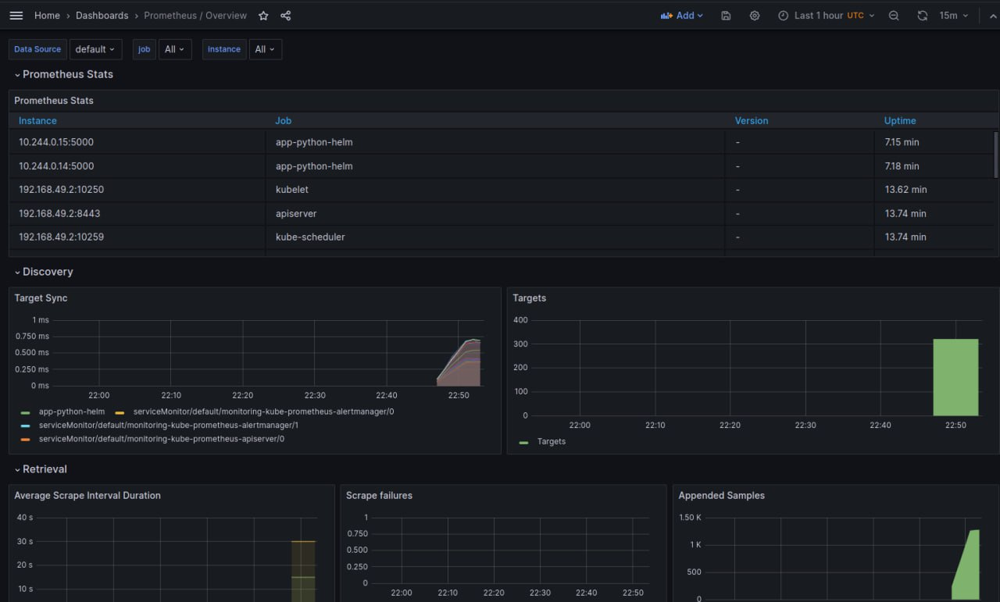
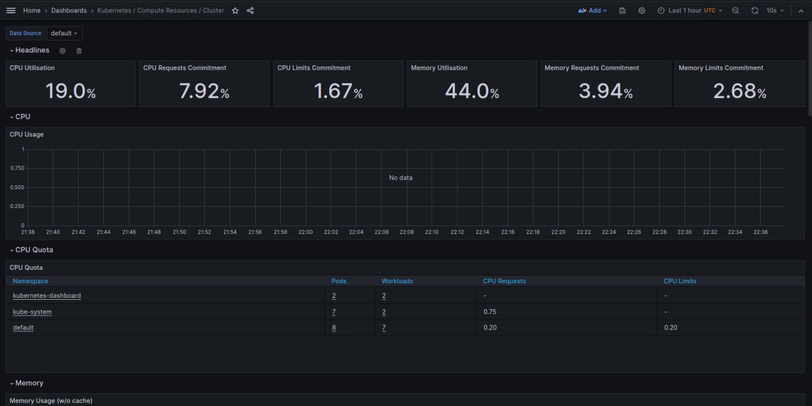
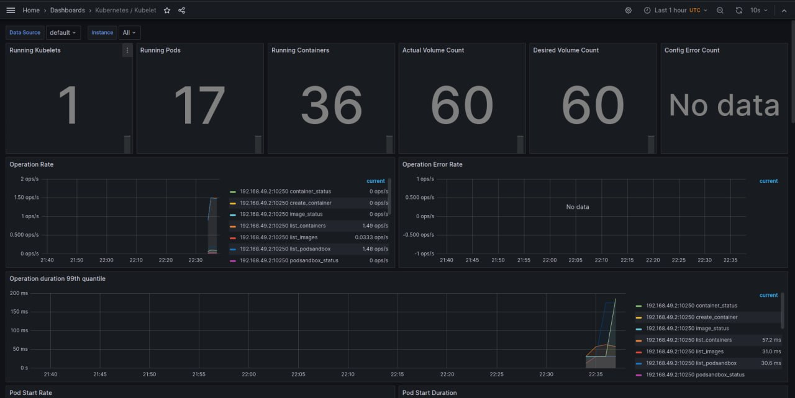
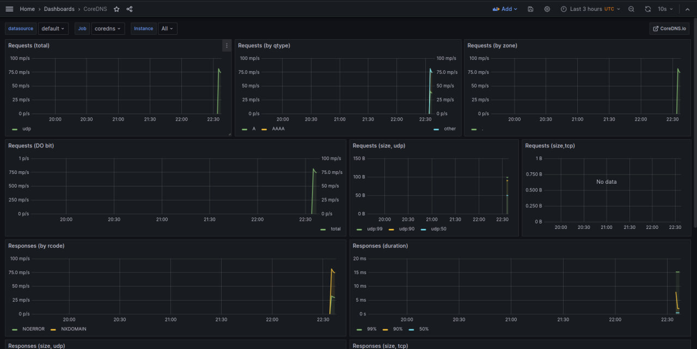
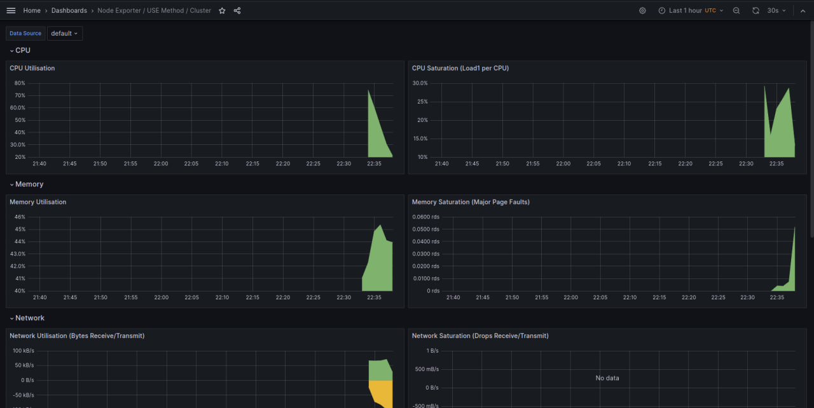
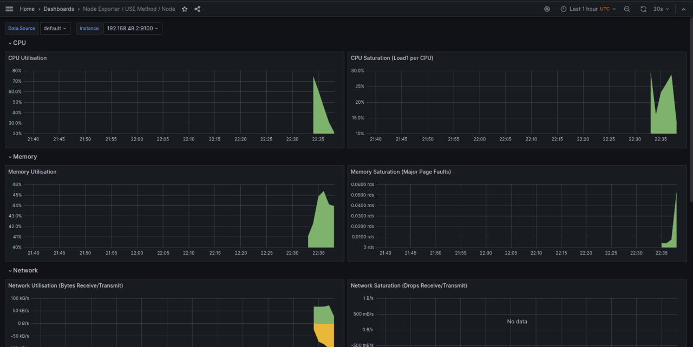
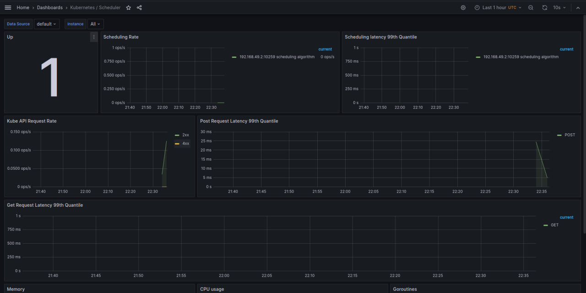
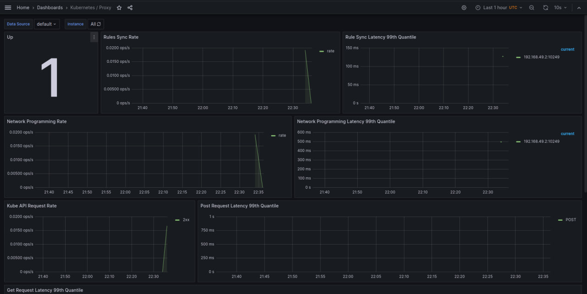
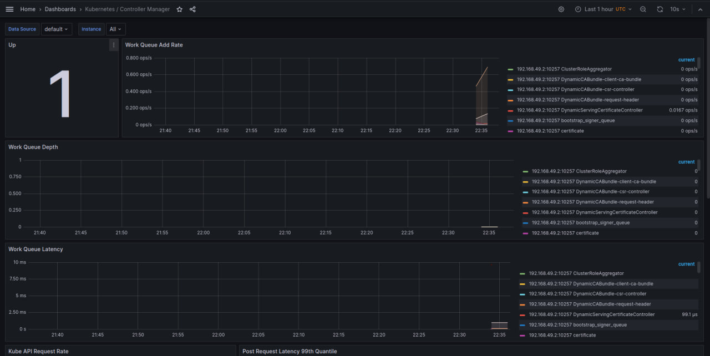
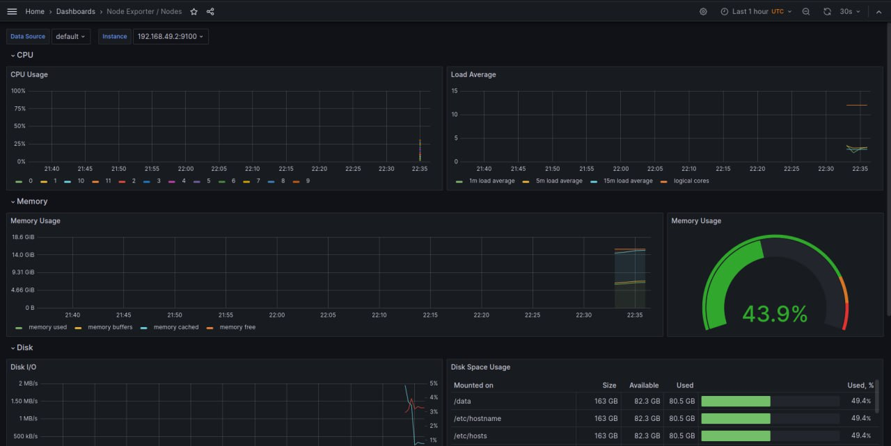
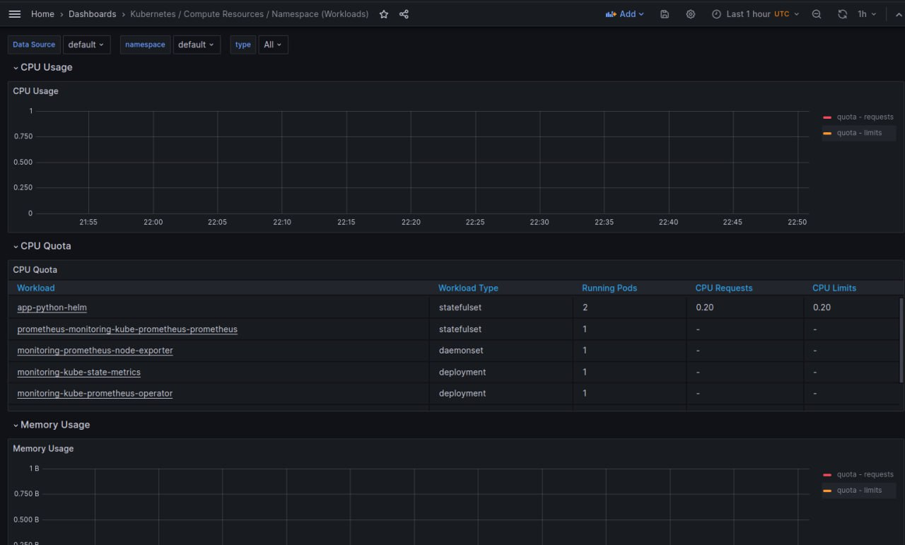
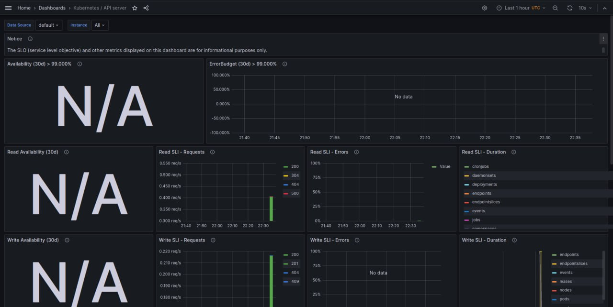
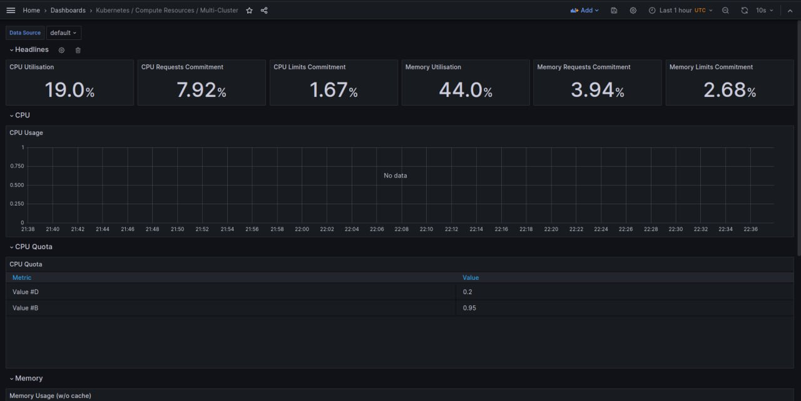
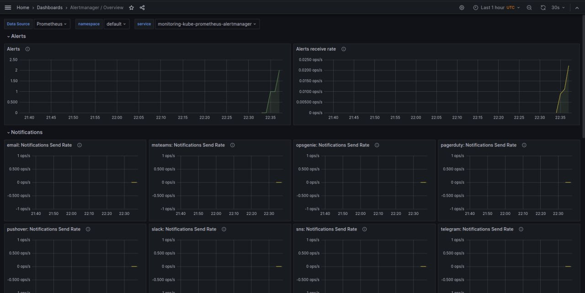

## Task 2 & Bonus:

```
kubectl exec app-python-helm-0 -- cat /init_data/file
```

```
Defaulted container "app-python-helm" out of: app-python-helm, install (init), queue-zero (init), queue-one (init), queue-two (init), queue-three (init)
one
two
three
```

```
kubectl exec app-python-helm-0 -- cat /init_data/index.html
```

```
Defaulted container "app-python-helm" out of: app-python-helm, install (init), queue-zero (init), queue-one (init), queue-two (init), queue-three (init)
<html><head></head><body><header>
<title>http://info.cern.ch</title>
</header>

<h1>http://info.cern.ch - home of the first website</h1>
<p>From here you can:</p>
<ul>
<li><a href="http://info.cern.ch/hypertext/WWW/TheProject.html">Browse the first website</a></li>
<li><a href="http://line-mode.cern.ch/www/hypertext/WWW/TheProject.html">Browse the first website using the line-mode browser simulator</a></li>
<li><a href="http://home.web.cern.ch/topics/birth-web">Learn about the birth of the web</a></li>
<li><a href="http://home.web.cern.ch/about">Learn about CERN, the physics laboratory where the web was born</a></li>
</ul>
</body></html>
```
