# Task 1

## Describing stack
The kuber Prometheus stack is used for tracking and monitoring states of Kubernetes clusters. This stack is built from several components that together provided desired functionality.
- Graphana: widely used tool for analytics and visualization of web applications, you can find graphs, charts, alert tracking if this tool is configured. Moreover tool is opensource which makes it more popular. 
- Alertmanager: Tracker of alerts sent by applications, f.e. prometheus server. It ensures that alerts will achieve needed destination like mails or other informing services.
- Prometheus Operator: make deployment of tools more comfortable. Used for deployment of Alertmanager, Prometheus, and other monitoring tools.
- Kube State Metrics: Kuber Api metrics tracker which collects state metrics.
- Prometheus: also open-source tool, that monitors systems. Relies on powerful query language, strong alerting model and has good time-serial database.
- Node exporter: hardware utilization and limits metrics collector 
## Deploying stack
### 1. deploy
```
helm install kps  prometheus-community/kube-prometheus-stack
```
```
NAME: kps
LAST DEPLOYED: Tue Dec  5 18:26:14 2023
NAMESPACE: default
STATUS: deployed
REVISION: 1
NOTES:
kube-prometheus-stack has been installed. Check its status by running:
  kubectl --namespace default get pods -l "release=kps"

Visit https://github.com/prometheus-operator/kube-prometheus for instructions on how to create & configure Alertmanager and Prometheus instances using the Operator.
```

### Check that all is working correctly
```
kubectl get po,sts,svc,pvc,cm
```

```
NAME                                                        READY   STATUS    RESTARTS   AGE
pod/alertmanager-kps-kube-prometheus-stack-alertmanager-0   2/2     Running   0          44s
pod/kps-grafana-6847bdcfc-hlmpx                             3/3     Running   0          49s
pod/kps-kube-prometheus-stack-operator-69dbb58d6d-gwfqk     1/1     Running   0          50s
pod/kps-kube-state-metrics-8689658569-k6zzf                 1/1     Running   0          50s
pod/kps-prometheus-node-exporter-jvx6f                      1/1     Running   0          50s
pod/prometheus-kps-kube-prometheus-stack-prometheus-0       2/2     Running   0          41s
pod/python-python-app-0                                     1/1     Running   0          2m6s
pod/python-python-app-1                                     1/1     Running   0          2m6s
pod/python-python-app-2                                     1/1     Running   0          2m6s

NAME                                                                   READY   AGE
statefulset.apps/alertmanager-kps-kube-prometheus-stack-alertmanager   1/1     44s
statefulset.apps/prometheus-kps-kube-prometheus-stack-prometheus       1/1     41s
statefulset.apps/python-python-app                                     3/3     2m6s

NAME                                             TYPE           CLUSTER-IP       EXTERNAL-IP    PORT(S)                      AGE
service/alertmanager-operated                    ClusterIP      None             <none>         9093/TCP,9094/TCP,9094/UDP   44s
service/kps-grafana                              ClusterIP      10.104.46.218    <none>         80/TCP                       50s
service/kps-kube-prometheus-stack-alertmanager   ClusterIP      10.101.66.59     <none>         9093/TCP,8080/TCP            50s
service/kps-kube-prometheus-stack-operator       ClusterIP      10.103.197.131   <none>         443/TCP                      50s
service/kps-kube-prometheus-stack-prometheus     ClusterIP      10.111.54.183    <none>         9090/TCP,8080/TCP            50s
service/kps-kube-state-metrics                   ClusterIP      10.98.214.201    <none>         8080/TCP                     50s
service/kps-prometheus-node-exporter             ClusterIP      10.109.102.236   <none>         9100/TCP                     50s
service/kubernetes                               ClusterIP      10.96.0.1        <none>         443/TCP                      13d
service/prometheus-operated                      ClusterIP      None             <none>         9090/TCP                     41s
service/python-python-app                        LoadBalancer   10.102.139.9     10.102.139.9   5000:32383/TCP               2m6s

NAME                                                             STATUS   VOLUME                                     CAPACITY   ACCESS MODES   STORAGECLASS   AGE
persistentvolumeclaim/python-access-metric-python-python-app-0   Bound    pvc-2c2748be-373d-4cf9-82ca-c59a6e454782   1Mi        RWO            standard       3m34s
persistentvolumeclaim/python-access-metric-python-python-app-1   Bound    pvc-724444db-94de-46c2-b151-7015c645561a   1Mi        RWO            standard       2m6s
persistentvolumeclaim/python-access-metric-python-python-app-2   Bound    pvc-6d01cb88-1d33-4282-8f52-f5fd4b7533f5   1Mi        RWO            standard       2m6s

NAME                                                                    DATA   AGE
configmap/kps-grafana                                                   1      50s
configmap/kps-grafana-config-dashboards                                 1      50s
configmap/kps-kube-prometheus-stack-alertmanager-overview               1      50s
configmap/kps-kube-prometheus-stack-apiserver                           1      50s
configmap/kps-kube-prometheus-stack-cluster-total                       1      50s
configmap/kps-kube-prometheus-stack-controller-manager                  1      50s
configmap/kps-kube-prometheus-stack-etcd                                1      50s
configmap/kps-kube-prometheus-stack-grafana-datasource                  1      50s
configmap/kps-kube-prometheus-stack-grafana-overview                    1      50s
configmap/kps-kube-prometheus-stack-k8s-coredns                         1      50s
configmap/kps-kube-prometheus-stack-k8s-resources-cluster               1      50s
configmap/kps-kube-prometheus-stack-k8s-resources-multicluster          1      50s
configmap/kps-kube-prometheus-stack-k8s-resources-namespace             1      50s
configmap/kps-kube-prometheus-stack-k8s-resources-node                  1      50s
configmap/kps-kube-prometheus-stack-k8s-resources-pod                   1      50s
configmap/kps-kube-prometheus-stack-k8s-resources-workload              1      50s
configmap/kps-kube-prometheus-stack-k8s-resources-workloads-namespace   1      50s
configmap/kps-kube-prometheus-stack-kubelet                             1      50s
configmap/kps-kube-prometheus-stack-namespace-by-pod                    1      50s
configmap/kps-kube-prometheus-stack-namespace-by-workload               1      50s
configmap/kps-kube-prometheus-stack-node-cluster-rsrc-use               1      50s
configmap/kps-kube-prometheus-stack-node-rsrc-use                       1      50s
configmap/kps-kube-prometheus-stack-nodes                               1      50s
configmap/kps-kube-prometheus-stack-nodes-darwin                        1      50s
configmap/kps-kube-prometheus-stack-persistentvolumesusage              1      50s
configmap/kps-kube-prometheus-stack-pod-total                           1      50s
configmap/kps-kube-prometheus-stack-prometheus                          1      50s
configmap/kps-kube-prometheus-stack-proxy                               1      50s
configmap/kps-kube-prometheus-stack-scheduler                           1      50s
configmap/kps-kube-prometheus-stack-workload-total                      1      50s
configmap/kube-root-ca.crt                                              1      13d
configmap/prometheus-kps-kube-prometheus-stack-prometheus-rulefiles-0   34     42s
```

### Pods
```
pod/alertmanager-kps-kube-prometheus-stack-alertmanager-0  - aler manager pod
pod/kps-grafana-6847bdcfc-hlmpx - graphana pod                             
pod/kps-kube-prometheus-stack-operator-69dbb58d6d-gwfqk  - prometheus operator pod
pod/kps-kube-state-metrics-8689658569-k6zzf - kube state metric pod              
pod/kps-prometheus-node-exporter-jvx6f - node-exporter pod                      
pod/prometheus-kps-kube-prometheus-stack-prometheus-0  - prometheus stack pod  
pod/python-python-app-0                                     
pod/python-python-app-1                                     
pod/python-python-app-2                                     
```

### Statefulset
```
statefulset.apps/alertmanager-kps-kube-prometheus-stack-alertmanager - alertmanager statefulset that provides reliability
statefulset.apps/prometheus-kps-kube-prometheus-stack-prometheus   - same as above for pormetheus stack manager
statefulset.apps/python-python-app   - it was here before :) from previous lab application statefulset
```

### Services
All this services are direct representation of  what they called, join all smaller objects like pods, etc. to provide interface of interaction 
```
service/alertmanager-operated                     
service/kps-grafana                             
service/kps-kube-prometheus-stack-alertmanager   
service/kps-kube-prometheus-stack-operator       
service/kps-kube-prometheus-stack-prometheus     
service/kps-kube-state-metrics                   
service/kps-prometheus-node-exporter             
service/kubernetes                               
service/prometheus-operated                      
service/python-python-app                        
```
### Persistant volume claim
Same as in lab13, serves for same purposes
```
persistentvolumeclaim/python-access-metric-python-python-app-0   Bound    pvc-2c2748be-373d-4cf9-82ca-c59a6e454782   1Mi        RWO            standard       3m34s
persistentvolumeclaim/python-access-metric-python-python-app-1   Bound    pvc-724444db-94de-46c2-b151-7015c645561a   1Mi        RWO            standard       2m6s
persistentvolumeclaim/python-access-metric-python-python-app-2   Bound    pvc-6d01cb88-1d33-4282-8f52-f5fd4b7533f5   1Mi        RWO            standard       2m6s
```
### Configmaps
serves for configuration of internal services and as a way of provide some parametrized data

## Questions
### All numbers are present on screenshots :)

### 1. Checking CPU utilization
python
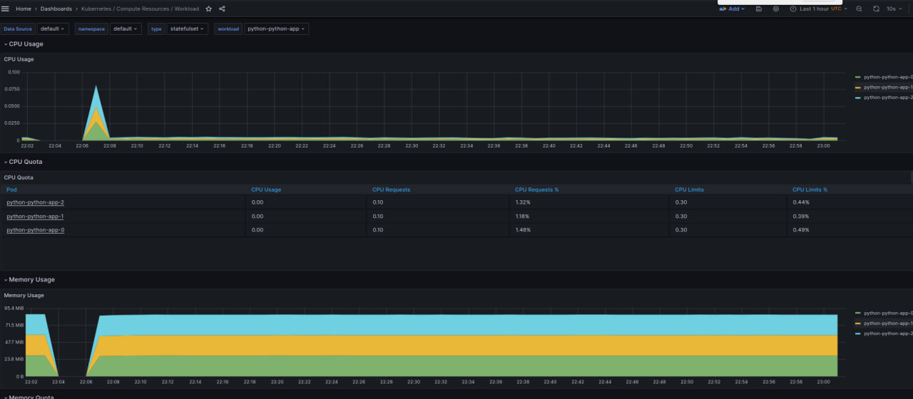
cpp
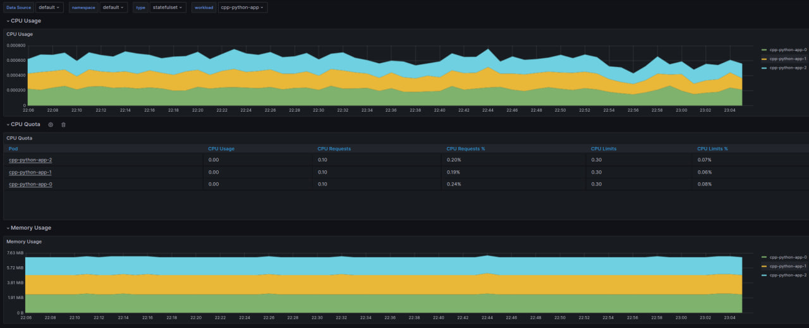
### 2. Higher and lower cpu utilization
Higher usage has kube-apiserver, etcd-controlplane, core-dns as their workload is continuous
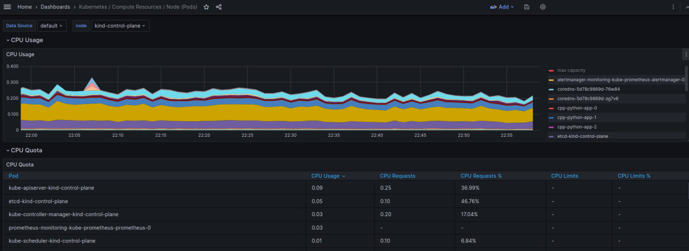
Lowest usage show my applications like app-cpp and app-python, as they are single purpose stateless webservers - lightest thing
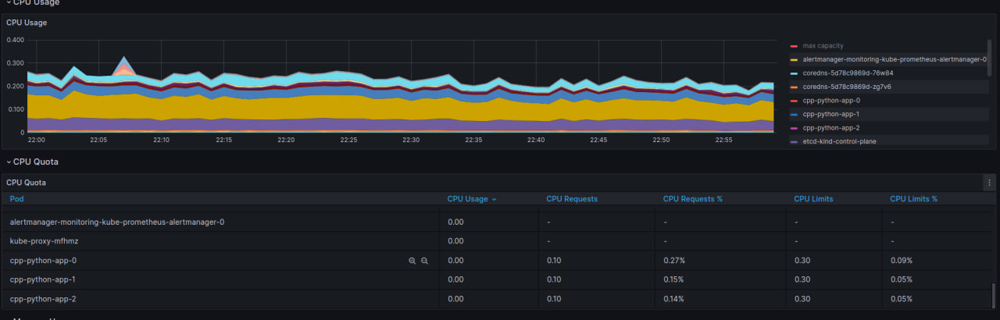
### Monitor node mem usage
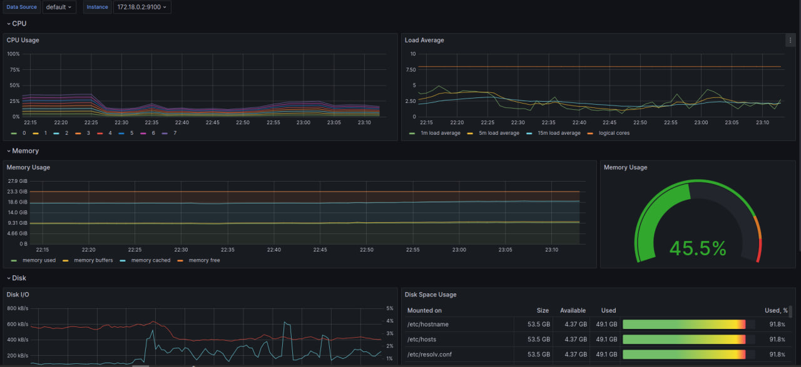
### Count the number of pods and containers managed by the Kubelet service
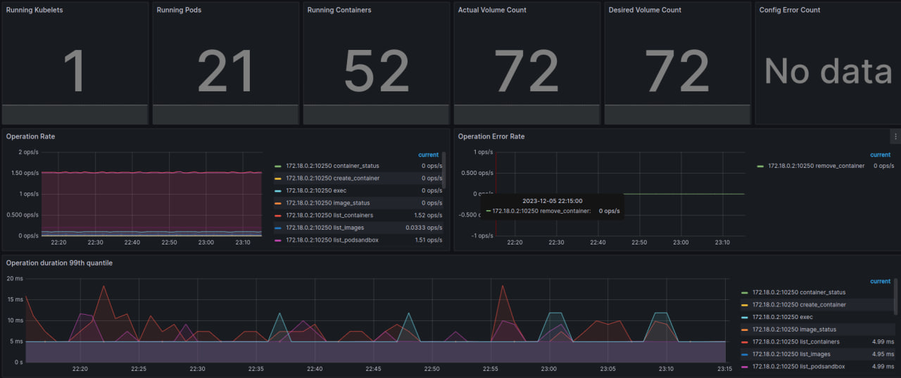
### Evaluate network usage of Pods in the default namespace
default full
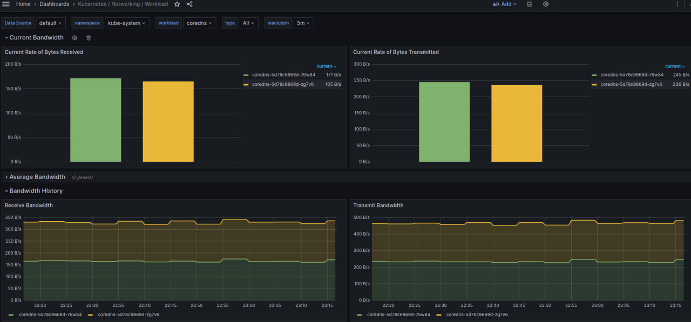
python

cpp
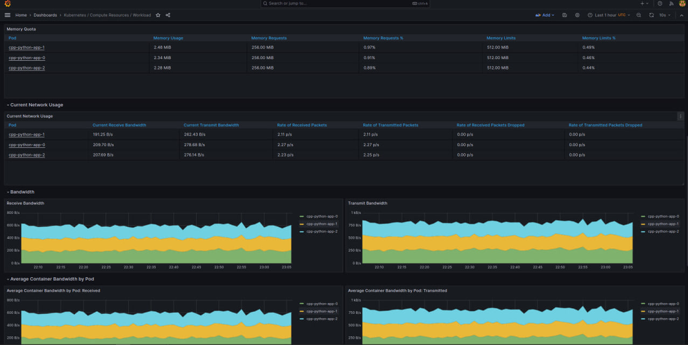

### Determine the number of active alerts; also check the Web UI with 
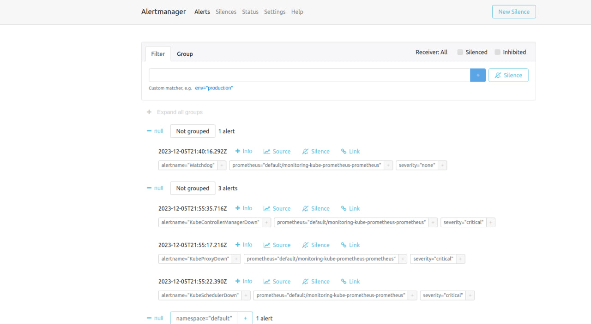
# Task 2
## Checking preinstall behaviour
```
ruslan@Elestrias:~/Downloads/devops/core-course-labs/k8s$ kubectl logs python-python-app-0 -c install
Connecting to info.cern.ch (188.184.100.182:80)
index.html           100% |*******************************|   646   0:00:00 ETA
```

## Checking file appearance
```
kubectl exec python-python-app-0 -- cat /work-dir/index.html
```

```
Defaulted container "python-app" out of: python-app, install (init)
<html><head></head><body><header>
<title>http://info.cern.ch</title>
</header>

<h1>http://info.cern.ch - home of the first website</h1>
<p>From here you can:</p>
<ul>
<li><a href="http://info.cern.ch/hypertext/WWW/TheProject.html">Browse the first website</a></li>
<li><a href="http://line-mode.cern.ch/www/hypertext/WWW/TheProject.html">Browse the first website using the line-mode browser simulator</a></li>
<li><a href="http://home.web.cern.ch/topics/birth-web">Learn about the birth of the web</a></li>
<li><a href="http://home.web.cern.ch/about">Learn about CERN, the physics laboratory where the web was born</a></li>
</ul>
</body></html>
```

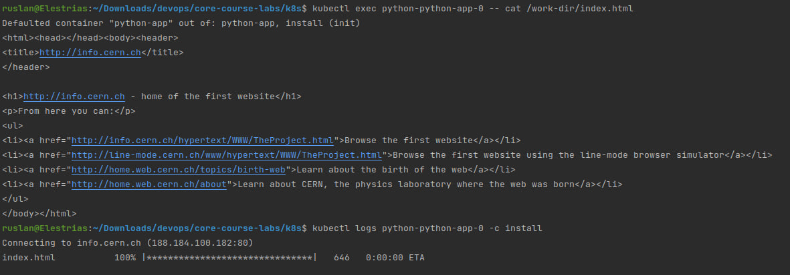

# Bonus task
## Fetch data from apps
Fetching data from app can be performed via configuration of prometheus by adding custom values.yaml to stack
I have used valuesBonus.yaml file that can be found in k8s directory

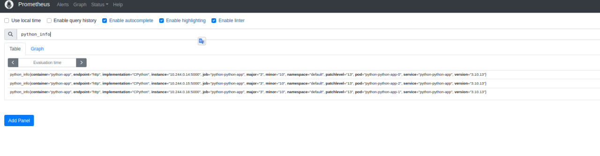
here we can see data fetched from cpp-python-python-app
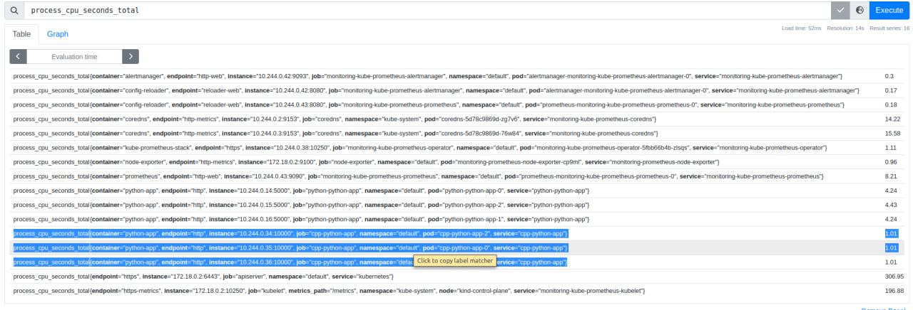
And proof that all is working well
```
NAME                                                         READY   STATUS    RESTARTS   AGE
pod/alertmanager-monitoring-kube-prometheus-alertmanager-0   2/2     Running   0          7m28s
pod/cpp-python-app-0                                         1/1     Running   0          10m
pod/cpp-python-app-1                                         1/1     Running   0          10m
pod/cpp-python-app-2                                         1/1     Running   0          10m
pod/monitoring-grafana-6f8d546676-58scg                      3/3     Running   0          7m29s
pod/monitoring-kube-prometheus-operator-5fbb66b4b-zlsqs      1/1     Running   0          7m29s
pod/monitoring-kube-state-metrics-74f4d8858f-6q6gk           1/1     Running   0          7m29s
pod/monitoring-prometheus-node-exporter-cp9ml                1/1     Running   0          7m29s
pod/prometheus-monitoring-kube-prometheus-prometheus-0       2/2     Running   0          7m27s
pod/python-python-app-0                                      1/1     Running   0          52m
pod/python-python-app-1                                      1/1     Running   0          52m
pod/python-python-app-2                                      1/1     Running   0          52m

NAME                                                                    READY   AGE
statefulset.apps/alertmanager-monitoring-kube-prometheus-alertmanager   1/1     7m28s
statefulset.apps/cpp-python-app                                         3/3     10m
statefulset.apps/prometheus-monitoring-kube-prometheus-prometheus       1/1     7m27s
statefulset.apps/python-python-app                                      3/3     52m

NAME                                              TYPE           CLUSTER-IP      EXTERNAL-IP   PORT(S)                      AGE
service/alertmanager-operated                     ClusterIP      None            <none>        9093/TCP,9094/TCP,9094/UDP   7m28s
service/cpp-python-app                            LoadBalancer   10.96.221.51    <pending>     10000:31742/TCP              10m
service/kubernetes                                ClusterIP      10.96.0.1       <none>        443/TCP                      68m
service/monitoring-grafana                        ClusterIP      10.96.12.37     <none>        80/TCP                       7m29s
service/monitoring-kube-prometheus-alertmanager   ClusterIP      10.96.249.230   <none>        9093/TCP,8080/TCP            7m29s
service/monitoring-kube-prometheus-operator       ClusterIP      10.96.92.235    <none>        443/TCP                      7m29s
service/monitoring-kube-prometheus-prometheus     ClusterIP      10.96.106.7     <none>        9090/TCP,8080/TCP            7m29s
service/monitoring-kube-state-metrics             ClusterIP      10.96.141.255   <none>        8080/TCP                     7m29s
service/monitoring-prometheus-node-exporter       ClusterIP      10.96.48.154    <none>        9100/TCP                     7m29s
service/prometheus-operated                       ClusterIP      None            <none>        9090/TCP                     7m27s
service/python-python-app                         LoadBalancer   10.96.156.114   <pending>     5000:31351/TCP               52m

NAME                                                             STATUS   VOLUME                                     CAPACITY   ACCESS MODES   STORAGECLASS   AGE
persistentvolumeclaim/python-access-metric-cpp-python-app-0      Bound    pvc-41217996-d20a-46e2-9a64-807c64cabf2c   1Mi        RWO            standard       12m
persistentvolumeclaim/python-access-metric-cpp-python-app-1      Bound    pvc-53770e93-6fe9-49cc-8313-eebf76950572   1Mi        RWO            standard       10m
persistentvolumeclaim/python-access-metric-cpp-python-app-2      Bound    pvc-f70f1501-5a79-4824-9ba7-756409c011a2   1Mi        RWO            standard       10m
persistentvolumeclaim/python-access-metric-python-python-app-0   Bound    pvc-2434aaeb-a7e7-4566-b90c-d175187c32fa   1Mi        RWO            standard       60m
persistentvolumeclaim/python-access-metric-python-python-app-1   Bound    pvc-afc65fcc-447b-4ece-9a7f-2abbd58344a9   1Mi        RWO            standard       60m
persistentvolumeclaim/python-access-metric-python-python-app-2   Bound    pvc-36c332b3-5a71-4352-97b8-a1c116a1b8e9   1Mi        RWO            standard       60m

NAME                                                                     DATA   AGE
configmap/kube-root-ca.crt                                               1      68m
configmap/monitoring-grafana                                             1      7m30s
configmap/monitoring-grafana-config-dashboards                           1      7m30s
configmap/monitoring-kube-prometheus-alertmanager-overview               1      7m30s
configmap/monitoring-kube-prometheus-apiserver                           1      7m30s
configmap/monitoring-kube-prometheus-cluster-total                       1      7m30s
configmap/monitoring-kube-prometheus-controller-manager                  1      7m30s
configmap/monitoring-kube-prometheus-etcd                                1      7m30s
configmap/monitoring-kube-prometheus-grafana-datasource                  1      7m30s
configmap/monitoring-kube-prometheus-grafana-overview                    1      7m30s
configmap/monitoring-kube-prometheus-k8s-coredns                         1      7m30s
configmap/monitoring-kube-prometheus-k8s-resources-cluster               1      7m30s
configmap/monitoring-kube-prometheus-k8s-resources-multicluster          1      7m30s
configmap/monitoring-kube-prometheus-k8s-resources-namespace             1      7m30s
configmap/monitoring-kube-prometheus-k8s-resources-node                  1      7m30s
configmap/monitoring-kube-prometheus-k8s-resources-pod                   1      7m30s
configmap/monitoring-kube-prometheus-k8s-resources-workload              1      7m30s
configmap/monitoring-kube-prometheus-k8s-resources-workloads-namespace   1      7m30s
configmap/monitoring-kube-prometheus-kubelet                             1      7m30s
configmap/monitoring-kube-prometheus-namespace-by-pod                    1      7m30s
configmap/monitoring-kube-prometheus-namespace-by-workload               1      7m30s
configmap/monitoring-kube-prometheus-node-cluster-rsrc-use               1      7m30s
configmap/monitoring-kube-prometheus-node-rsrc-use                       1      7m30s
configmap/monitoring-kube-prometheus-nodes                               1      7m30s
configmap/monitoring-kube-prometheus-nodes-darwin                        1      7m30s
configmap/monitoring-kube-prometheus-persistentvolumesusage              1      7m30s
configmap/monitoring-kube-prometheus-pod-total                           1      7m30s
configmap/monitoring-kube-prometheus-prometheus                          1      7m30s
configmap/monitoring-kube-prometheus-proxy                               1      7m30s
configmap/monitoring-kube-prometheus-scheduler                           1      7m30s
configmap/monitoring-kube-prometheus-workload-total                      1      7m30s
configmap/prometheus-monitoring-kube-prometheus-prometheus-rulefiles-0   34     7m28s
```
### Create queue of initContainers
```
ruslan@Elestrias:~/Downloads/devops/core-course-labs/k8s$ kubectl exec python-python-app-0  -- cat /work-dir/history.txt
Defaulted container "python-app" out of: python-app, install (init), write-1 (init), write-2 (init), write-3 (init)
helloFrom_1
helloFrom_2
helloFrom_3
```
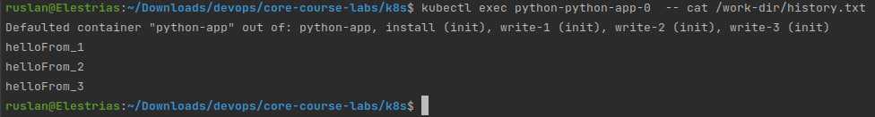
