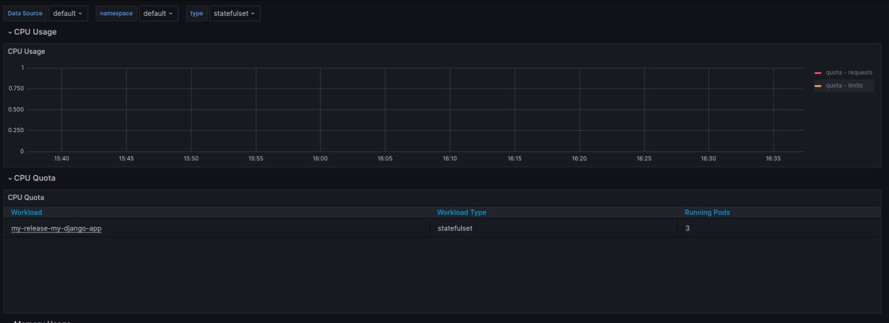
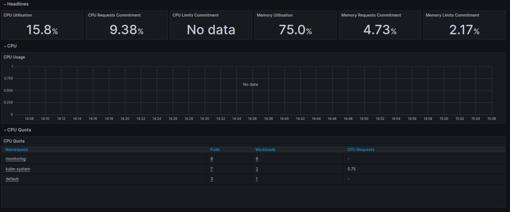
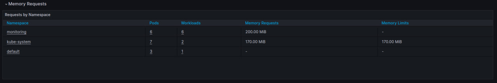

# Components of the Kube Prometheus Stack

The Kube Prometheus Stack, as offered by the Prometheus Community, is a collection of Kubernetes monitoring tools. It simplifies the deployment of Prometheus, Grafana, and several other tools that work together to provide comprehensive monitoring capabilities. Below are the key components of the stack and their functions:

## 1. **Prometheus**
Prometheus is the core component of the stack. It's responsible for collecting and storing metrics from various sources within the Kubernetes environment. Prometheus uses a time-series database to store data and offers a powerful query language (PromQL) for analyzing and visualizing this data.

## 2. **Grafana**
Grafana is a versatile dashboarding tool used for visualizing the data collected by Prometheus. It provides rich options for creating and customizing dashboards to display metrics in a user-friendly format. Grafana supports various data sources and allows for complex alerting rules.

## 3. **Alertmanager**
Alertmanager handles alerts sent by Prometheus. It is responsible for deduplicating, grouping, and routing the alerts to the correct receiver. It also takes care of silencing and inhibition of alerts, allowing for fine control over alert notifications.

## 4. **Node Exporter**
Node Exporter is a Prometheus exporter used for hardware and OS metrics exposed by *NIX kernels. It's deployed on each node of the Kubernetes cluster to capture information about system resources like CPU, memory, disk, and network utilization.

## 5. **Kube State Metrics**
Kube State Metrics is a service that listens to the Kubernetes API server and generates metrics about the state of the objects (like deployments, nodes, and pods) in the cluster. It provides essential data about the status and performance of various Kubernetes components.

## 6. **Prometheus Operator**
The Prometheus Operator simplifies the deployment and configuration of Prometheus and related monitoring components. It introduces several custom resource definitions (CRDs) in Kubernetes, allowing for easy management of Prometheus components through Kubernetes-native API calls.

## 7. **Prometheus Adapter**
The Prometheus Adapter is an implementation of the Kubernetes Custom Metrics API. It allows for the scaling of Kubernetes resources based on metrics available in Prometheus, integrating with the Kubernetes Horizontal Pod Autoscaler.

## 8. **Additional Exporters and Integrations**
The stack also includes various other exporters and integrations for monitoring specific applications or infrastructure components. These can range from database exporters to application-specific metrics exporters, providing flexibility to tailor the monitoring setup to specific needs.

In summary, the Kube Prometheus Stack brings together a suite of tools that provide a complete monitoring solution for Kubernetes environments. It leverages the strengths of each component to offer detailed insight into the performance and health of Kubernetes clusters and applications running on them.


#  Tasks output 

## Output of the `kubectl get po,sts,svc,pvc,cm`

```bash
~$ kubectl get po,sts,svc,pvc,cm 
NAME                             READY   STATUS    RESTARTS      AGE
pod/my-release-my-django-app-0   1/1     Running   2 (18h ago)   21h
pod/my-release-my-django-app-1   1/1     Running   2 (18h ago)   21h
pod/my-release-my-django-app-2   1/1     Running   2 (18h ago)   21h

NAME                                        READY   AGE
statefulset.apps/my-release-my-django-app   3/3     21h

NAME                               TYPE        CLUSTER-IP      EXTERNAL-IP   PORT(S)          AGE
service/kubernetes                 ClusterIP   10.96.0.1       <none>        443/TCP          36d
service/my-release-my-django-app   NodePort    10.105.21.163   <none>        5000:30002/TCP   21h

NAME                         DATA   AGE
configmap/kube-root-ca.crt   1      36d


~$ kubectl get po,sts,svc,pvc,cm  -n monitoring
NAME                                                         READY   STATUS    RESTARTS      AGE
pod/alertmanager-kube-release-kube-promethe-alertmanager-0   2/2     Running   2 (18h ago)   19h
pod/kube-release-grafana-855ccc567d-8x9zm                    3/3     Running   3 (18h ago)   19h
pod/kube-release-kube-promethe-operator-5c5f845cb6-szq5m     1/1     Running   1 (18h ago)   19h
pod/kube-release-kube-state-metrics-5987d6dc45-tl9dw         1/1     Running   1 (18h ago)   19h
pod/kube-release-prometheus-node-exporter-twtq9              1/1     Running   1 (18h ago)   19h
pod/prometheus-kube-release-kube-promethe-prometheus-0       2/2     Running   2 (18h ago)   19h

NAME                                                                    READY   AGE
statefulset.apps/alertmanager-kube-release-kube-promethe-alertmanager   1/1     19h
statefulset.apps/prometheus-kube-release-kube-promethe-prometheus       1/1     19h

NAME                                              TYPE        CLUSTER-IP       EXTERNAL-IP   PORT(S)                      AGE
service/alertmanager-operated                     ClusterIP   None             <none>        9093/TCP,9094/TCP,9094/UDP   19h
service/kube-release-grafana                      ClusterIP   10.105.169.8     <none>        80/TCP                       19h
service/kube-release-kube-promethe-alertmanager   ClusterIP   10.111.30.115    <none>        9093/TCP,8080/TCP            19h
service/kube-release-kube-promethe-operator       ClusterIP   10.104.133.110   <none>        443/TCP                      19h
service/kube-release-kube-promethe-prometheus     ClusterIP   10.98.195.217    <none>        9090/TCP,8080/TCP            19h
service/kube-release-kube-state-metrics           ClusterIP   10.102.55.148    <none>        8080/TCP                     19h
service/kube-release-prometheus-node-exporter     ClusterIP   10.102.153.63    <none>        9100/TCP                     19h
service/prometheus-operated                       ClusterIP   None             <none>        9090/TCP                     19h

NAME                                                                     DATA   AGE
configmap/kube-release-grafana                                           1      19h
configmap/kube-release-grafana-config-dashboards                         1      19h
configmap/kube-release-kube-promethe-alertmanager-overview               1      19h
configmap/kube-release-kube-promethe-apiserver                           1      19h
configmap/kube-release-kube-promethe-cluster-total                       1      19h
configmap/kube-release-kube-promethe-controller-manager                  1      19h
configmap/kube-release-kube-promethe-etcd                                1      19h
configmap/kube-release-kube-promethe-grafana-datasource                  1      19h
configmap/kube-release-kube-promethe-grafana-overview                    1      19h
configmap/kube-release-kube-promethe-k8s-coredns                         1      19h
configmap/kube-release-kube-promethe-k8s-resources-cluster               1      19h
configmap/kube-release-kube-promethe-k8s-resources-multicluster          1      19h
configmap/kube-release-kube-promethe-k8s-resources-namespace             1      19h
configmap/kube-release-kube-promethe-k8s-resources-node                  1      19h
configmap/kube-release-kube-promethe-k8s-resources-pod                   1      19h
configmap/kube-release-kube-promethe-k8s-resources-workload              1      19h
configmap/kube-release-kube-promethe-k8s-resources-workloads-namespace   1      19h
configmap/kube-release-kube-promethe-kubelet                             1      19h
configmap/kube-release-kube-promethe-namespace-by-pod                    1      19h
configmap/kube-release-kube-promethe-namespace-by-workload               1      19h
configmap/kube-release-kube-promethe-node-cluster-rsrc-use               1      19h
configmap/kube-release-kube-promethe-node-rsrc-use                       1      19h
configmap/kube-release-kube-promethe-nodes                               1      19h
configmap/kube-release-kube-promethe-nodes-darwin                        1      19h
configmap/kube-release-kube-promethe-persistentvolumesusage              1      19h
configmap/kube-release-kube-promethe-pod-total                           1      19h
configmap/kube-release-kube-promethe-prometheus                          1      19h
configmap/kube-release-kube-promethe-proxy                               1      19h
configmap/kube-release-kube-promethe-scheduler                           1      19h
configmap/kube-release-kube-promethe-workload-total                      1      19h
configmap/kube-root-ca.crt                                               1      23h
configmap/prometheus-kube-release-kube-promethe-prometheus-rulefiles-0   34     19h

```

## Check CPU and Memory consumption of your StatefulSet




## Identify Pods with higher and lower CPU usage in the default namespace

Smallest CPU usage is my application pod. It uses no resource.




## Monitor node memory usage in percentage and megabytes




## Count the number of pods and containers managed by the Kubelet service


## Evaluate network usage of Pods in the default namespace

For some reason I have no data for any pod


## Determine the number of active alerts


