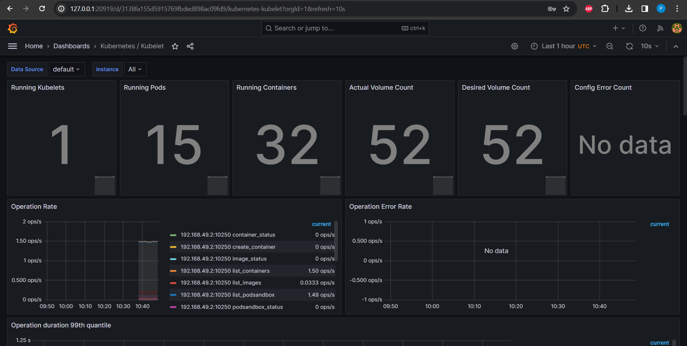
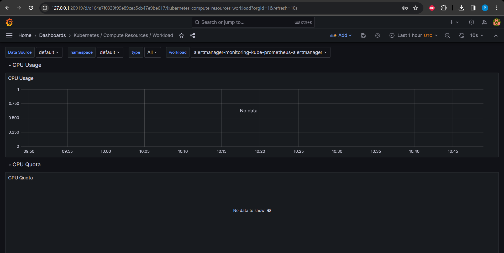
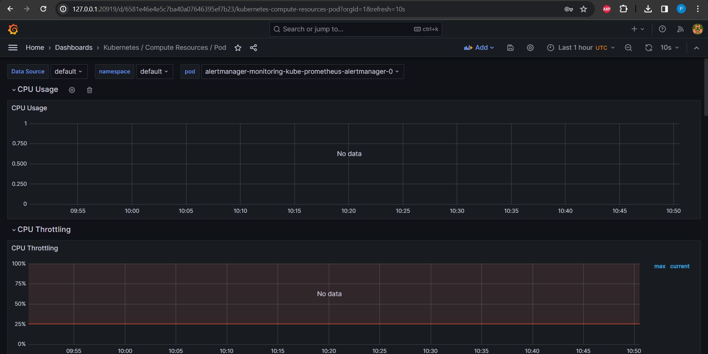
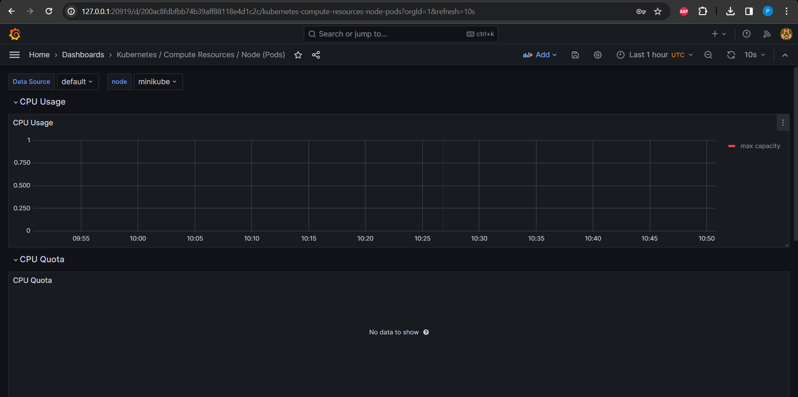
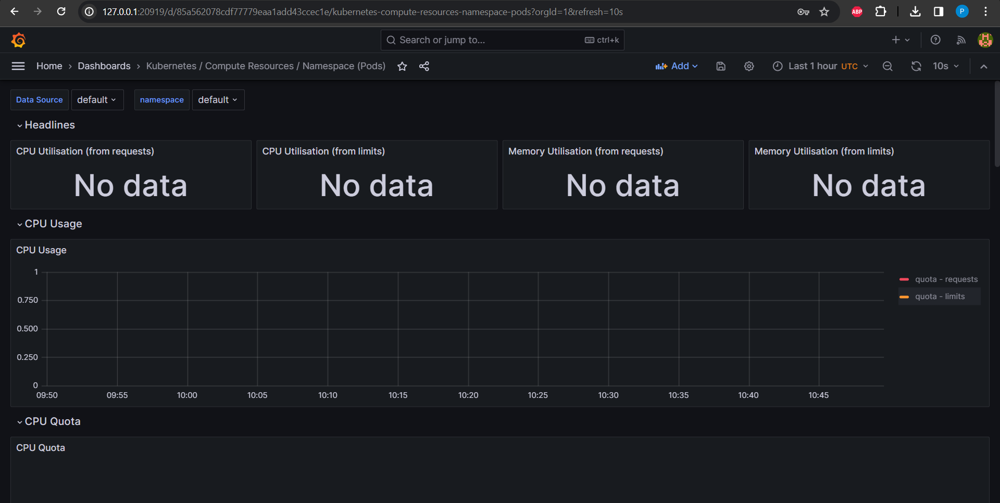
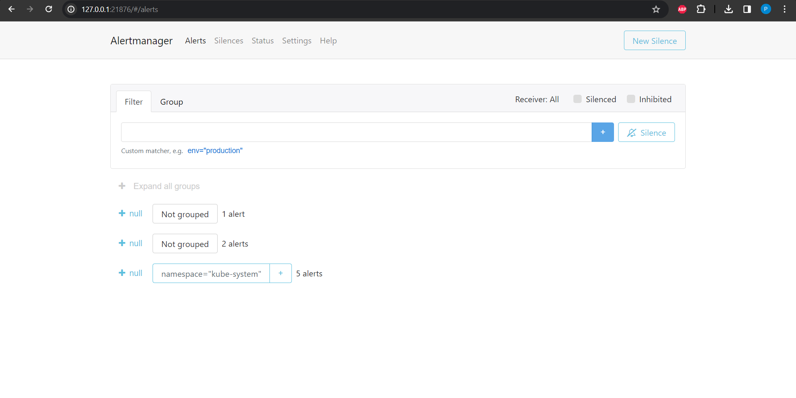

The Kube Prometheus Stack comprises the following key components:

Prometheus Operator:
    Takes charge of automating the deployment and management of Prometheus instances within the cluster.
    Utilizes Custom Resource Definitions to specify Prometheus deployments, service monitors, and other Prometheus-related resources.
    Monitors custom resources and makes adjustments to the running Prometheus instances.

Prometheus:
    Functions as a monitoring and alerting system.
    Gathers, stores, and analyzes metrics from diverse sources, including application endpoints and container orchestration systems.

Grafana:
    Serves as a data visualization and dashboard tool.
    Integrates seamlessly with Prometheus to visualize the metrics collected by Prometheus.
    Offers a range of visualization options, including graphs, tables, and alert panels.

Alertmanager:
    Takes on the responsibility of handling and managing alerts generated by Prometheus.
    Groups, deduplicates, and routes alerts based on predefined configurations.
    Dispatches alerts through various channels, such as email, Slack, or other notification systems.

kube-state-metrics:
    Provides cluster-level metrics pertaining to various Kubernetes resources like deployments, pods, nodes, and services.
    Offers insights into the health and status of Kubernetes components.
    Exposes Kubernetes-specific metrics in a format that can be scraped.

Node Exporter:
    Collects metrics related to hardware utilization and limits.

```sh
helm repo add prometheus-community https://prometheus-community.github.io/helm-charts
"prometheus-community" has been added to your repositories
```

```sh
helm repo update
Hang tight while we grab the latest from your chart repositories...
...Successfully got an update from the "hashicorp" chart repository
...Successfully got an update from the "prometheus-community" chart repository
Update Complete. ⎈Happy Helming!⎈
```

```sh
helm install monitoring prometheus-community/kube-prometheus-stack
NAME: monitoring
LAST DEPLOYED: Wed Dec  6 13:33:11 2023
NAMESPACE: default
STATUS: deployed
REVISION: 1
NOTES:
kube-prometheus-stack has been installed. Check its status by running:
  kubectl --namespace default get pods -l "release=monitoring"

Visit https://github.com/prometheus-operator/kube-prometheus for instructions on how to create & configure Alertmanager and Prometheus instances using the Operator.
```

```sh
kubectl get po,sts,svc,pvc,cm
NAME                                                         READY   STATUS              RESTARTS   AGE
pod/alertmanager-monitoring-kube-prometheus-alertmanager-0   0/2     PodInitializing     0          70s
pod/monitoring-grafana-6f8d546676-c7vnc                      0/3     ContainerCreating   0          109s
pod/monitoring-kube-prometheus-operator-5fbb66b4b-t8tzz      1/1     Running             0          109s
pod/monitoring-kube-state-metrics-74f4d8858f-ngkgd           1/1     Running             0          109s
pod/monitoring-prometheus-node-exporter-m296g                1/1     Running             0          109s
pod/prometheus-monitoring-kube-prometheus-prometheus-0       0/2     PodInitializing     0          70s

NAME                                                                    READY   AGE
statefulset.apps/alertmanager-monitoring-kube-prometheus-alertmanager   0/1     70s
statefulset.apps/prometheus-monitoring-kube-prometheus-prometheus       0/1     70s

NAME                                              TYPE        CLUSTER-IP       EXTERNAL-IP   PORT(S)                      AGE
service/alertmanager-operated                     ClusterIP   None             <none>        9093/TCP,9094/TCP,9094/UDP   70s
service/kubernetes                                ClusterIP   10.96.0.1        <none>        443/TCP                      9d
service/monitoring-grafana                        ClusterIP   10.103.150.130   <none>        80/TCP                       110s
service/monitoring-kube-prometheus-alertmanager   ClusterIP   10.100.185.217   <none>        9093/TCP,8080/TCP            110s
service/monitoring-kube-prometheus-operator       ClusterIP   10.104.152.30    <none>        443/TCP                      110s
service/monitoring-kube-prometheus-prometheus     ClusterIP   10.99.40.73      <none>        9090/TCP,8080/TCP            110s
service/monitoring-kube-state-metrics             ClusterIP   10.98.233.225    <none>        8080/TCP                     110s
service/monitoring-prometheus-node-exporter       ClusterIP   10.108.181.241   <none>        9100/TCP                     110s
service/prometheus-operated                       ClusterIP   None             <none>        9090/TCP                     70s

NAME                                                          STATUS   VOLUME                                     CAPACITY   ACCESS MODES   STORAGECLASS   AGE
persistentvolumeclaim/python-visits-pvc-python-python-app-0   Bound    pvc-e1a18b93-6a6e-496a-93fe-1b3919889c9e   1Mi        RWO            standard       7d12h
persistentvolumeclaim/python-visits-pvc-python-python-app-1   Bound    pvc-dc6f08a3-6590-454d-8312-eb75a2d6087c   1Mi        RWO            standard       7d12h

NAME                                                                     DATA   AGE
configmap/kube-root-ca.crt                                               1      27d
configmap/monitoring-grafana                                             1      111s
configmap/monitoring-grafana-config-dashboards                           1      111s
configmap/monitoring-kube-prometheus-alertmanager-overview               1      111s
configmap/monitoring-kube-prometheus-apiserver                           1      111s
configmap/monitoring-kube-prometheus-cluster-total                       1      111s
configmap/monitoring-kube-prometheus-controller-manager                  1      111s
configmap/monitoring-kube-prometheus-etcd                                1      111s
configmap/monitoring-kube-prometheus-grafana-datasource                  1      111s
configmap/monitoring-kube-prometheus-grafana-overview                    1      111s
configmap/monitoring-kube-prometheus-k8s-coredns                         1      111s
configmap/monitoring-kube-prometheus-k8s-resources-cluster               1      111s
configmap/monitoring-kube-prometheus-k8s-resources-multicluster          1      111s
configmap/monitoring-kube-prometheus-k8s-resources-namespace             1      111s
configmap/monitoring-kube-prometheus-k8s-resources-node                  1      111s
configmap/monitoring-kube-prometheus-k8s-resources-pod                   1      111s
configmap/monitoring-kube-prometheus-k8s-resources-workload              1      111s
configmap/monitoring-kube-prometheus-k8s-resources-workloads-namespace   1      111s
configmap/monitoring-kube-prometheus-kubelet                             1      111s
configmap/monitoring-kube-prometheus-namespace-by-pod                    1      111s
configmap/monitoring-kube-prometheus-namespace-by-workload               1      111s
configmap/monitoring-kube-prometheus-node-cluster-rsrc-use               1      111s
configmap/monitoring-kube-prometheus-node-rsrc-use                       1      111s
configmap/monitoring-kube-prometheus-nodes                               1      111s
configmap/monitoring-kube-prometheus-nodes-darwin                        1      111s
configmap/monitoring-kube-prometheus-persistentvolumesusage              1      111s
configmap/monitoring-kube-prometheus-pod-total                           1      111s
configmap/monitoring-kube-prometheus-prometheus                          1      111s
configmap/monitoring-kube-prometheus-proxy                               1      111s
configmap/monitoring-kube-prometheus-scheduler                           1      111s
configmap/monitoring-kube-prometheus-workload-total                      1      111s
configmap/prometheus-monitoring-kube-prometheus-prometheus-rulefiles-0   34     70s
```

```sh
kubectl get po
```

The output displays a list of pods along with their names and current status.

pod/alertmanager-monitoring-kube-prometheus-alertmanager-0: Alertmanager component in the context of monitoring with Prometheus
pod/monitoring-grafana-6f8d546676-c7vnc: This pod is associated with Grafana
pod/monitoring-kube-prometheus-operator-5fbb66b4b-t8tzz: kube-prometheus operator, responsible for managing Prometheus instances within the cluster
pod/monitoring-kube-state-metrics-74f4d8858f-ngkgd: kube-state-metrics, which provides cluster-level metrics related to various Kubernetes resources
pod/monitoring-prometheus-node-exporter-m296g: Prometheus Node Exporter, responsible for collecting hardware-related metrics from nodes
pod/prometheus-monitoring-kube-prometheus-prometheus-0: Prometheus

```sh
kubectl get sts
```

Indicates the status of StatefulSets in a Kubernetes cluster

statefulset.apps/alertmanager-monitoring-kube-prometheus-alertmanager: Manages pods that are part of the Alertmanager application
statefulset.apps/prometheus-monitoring-kube-prometheus-prometheus: Manages pods that constitute the Prometheus application

```sh
kubectl get svc
```

The result showcases a roster of services with their respective names, delineating the diverse components and functionalities existing within the cluster. Noteworthy examples include services like "alertmanager-operated," "kubernetes," and "monitoring-grafana," symbolizing distinct aspects like monitoring, alerting, Grafana visualization, and the fundamental Kubernetes service. Each service holds a pivotal role in shaping the comprehensive functionality and structure of the Kubernetes cluster.

service/alertmanager-operated
service/kubernetes
service/monitoring-grafana
service/monitoring-kube-prometheus-alertmanager
service/monitoring-kube-prometheus-operator
service/monitoring-kube-prometheus-prometheus
service/monitoring-kube-state-metrics
service/monitoring-prometheus-node-exporter
service/prometheus-operated

```sh
kubectl get pvc
```

Information about PersistentVolumeClaims (PVCs) within the Kubernetes cluster
PersistentVolumeClaim is a request for storage in a Kubernetes cluster. Both PVCs associated with the same application

persistentvolumeclaim/python-visits-pvc-python-python-app-0: 
persistentvolumeclaim/python-visits-pvc-python-python-app-1: 

```sh
kubectl get cm
```

The command fetches details about ConfigMaps within a Kubernetes cluster. The resulting list comprises diverse ConfigMaps, each distinguished by a distinct name. Examples include "kube-root-ca.crt" and "monitoring-grafana," suggesting they hold configuration information for various elements in a monitoring configuration, potentially encompassing Grafana dashboards, Prometheus rules, and Kubernetes resources. ConfigMaps serve as repositories for crucial settings, playing an essential role in supplying configuration parameters to applications and services throughout the Kubernetes ecosystem.

configmap/kube-root-ca.crt
configmap/monitoring-grafana                       
configmap/monitoring-grafana-config-dashboards             
configmap/monitoring-kube-prometheus-alertmanager-overview   
configmap/monitoring-kube-prometheus-apiserver                    
configmap/monitoring-kube-prometheus-cluster-total             
configmap/monitoring-kube-prometheus-controller-manager        
configmap/monitoring-kube-prometheus-etcd                         
configmap/monitoring-kube-prometheus-grafana-datasource            
configmap/monitoring-kube-prometheus-grafana-overview               
configmap/monitoring-kube-prometheus-k8s-coredns           
configmap/monitoring-kube-prometheus-k8s-resources-cluster          
configmap/monitoring-kube-prometheus-k8s-resources-multicluster  
configmap/monitoring-kube-prometheus-k8s-resources-namespace        
configmap/monitoring-kube-prometheus-k8s-resources-node              
configmap/monitoring-kube-prometheus-k8s-resources-pod            
configmap/monitoring-kube-prometheus-k8s-resources-workload         
configmap/monitoring-kube-prometheus-k8s-resources-workloads-namespace 
configmap/monitoring-kube-prometheus-kubelet                       
configmap/monitoring-kube-prometheus-namespace-by-pod             
configmap/monitoring-kube-prometheus-namespace-by-workload          
configmap/monitoring-kube-prometheus-node-cluster-rsrc-use          
configmap/monitoring-kube-prometheus-node-rsrc-use                   
configmap/monitoring-kube-prometheus-nodes                             
configmap/monitoring-kube-prometheus-nodes-darwin                 
configmap/monitoring-kube-prometheus-persistentvolumesusage         
configmap/monitoring-kube-prometheus-pod-total                     
configmap/monitoring-kube-prometheus-prometheus               
configmap/monitoring-kube-prometheus-proxy                       
configmap/monitoring-kube-prometheus-scheduler                     
configmap/monitoring-kube-prometheus-workload-total                
configmap/prometheus-monitoring-kube-prometheus-prometheus-rulefiles-0 

```sh
minikube service monitoring-grafana
W1206 13:38:51.065363   16480 main.go:291] Unable to resolve the current Docker CLI context "default": context "default": context not found: open C:\Users\Gabri\.docker\contexts\meta\37a8eec1ce19687d132fe29051dca629d164e2c4958ba141d5f4133a33f0688f\meta.json: The system cannot find the path specified.
|-----------|--------------------|-------------|--------------|
| NAMESPACE |        NAME        | TARGET PORT |     URL      |
|-----------|--------------------|-------------|--------------|
| default   | monitoring-grafana |             | No node port |
|-----------|--------------------|-------------|--------------|
😿  service default/monitoring-grafana has no node port
🏃  Starting tunnel for service monitoring-grafana.
|-----------|--------------------|-------------|------------------------|
| NAMESPACE |        NAME        | TARGET PORT |          URL           |
|-----------|--------------------|-------------|------------------------|
| default   | monitoring-grafana |             | http://127.0.0.1:20919 |
|-----------|--------------------|-------------|------------------------|
🎉  Opening service default/monitoring-grafana in default browser...
❗  Because you are using a Docker driver on windows, the terminal needs to be open to run it.
```












