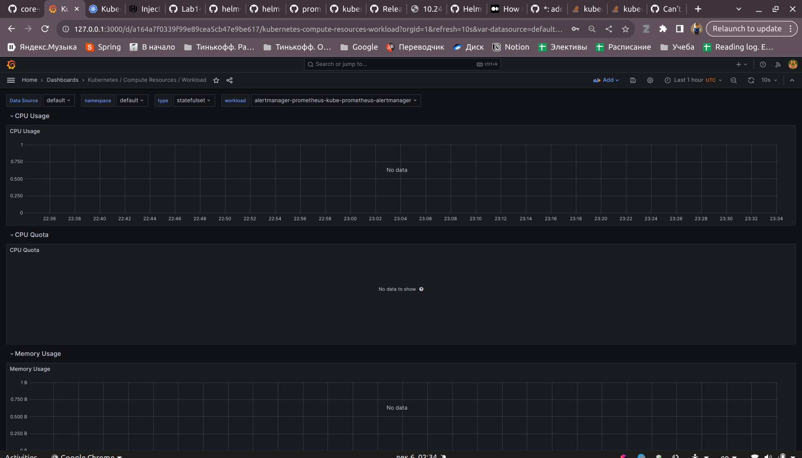
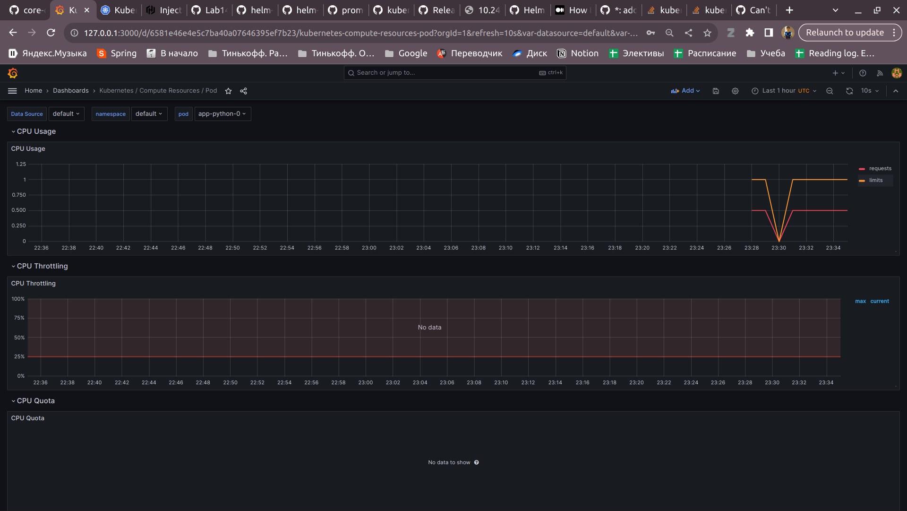
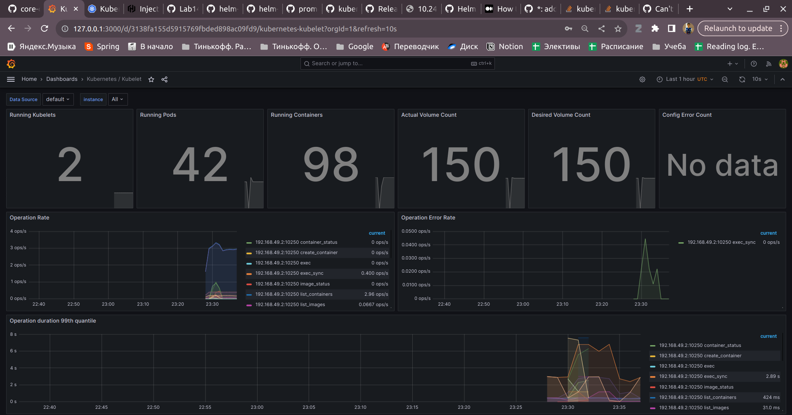
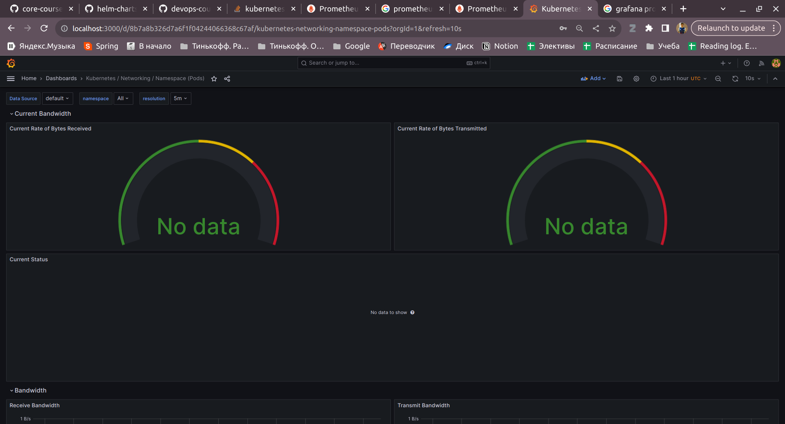
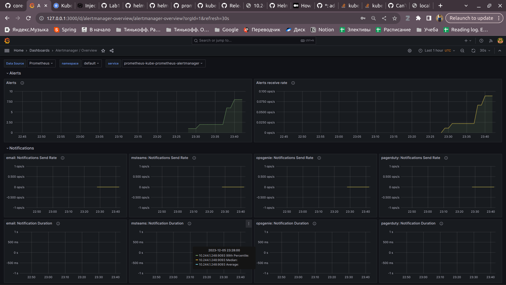
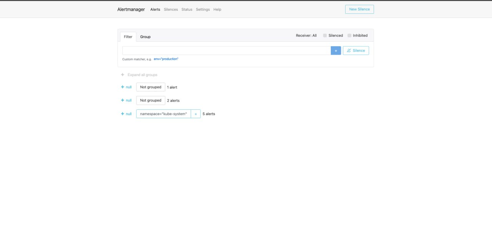
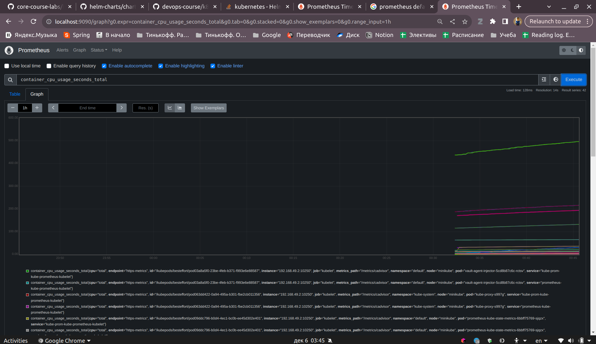
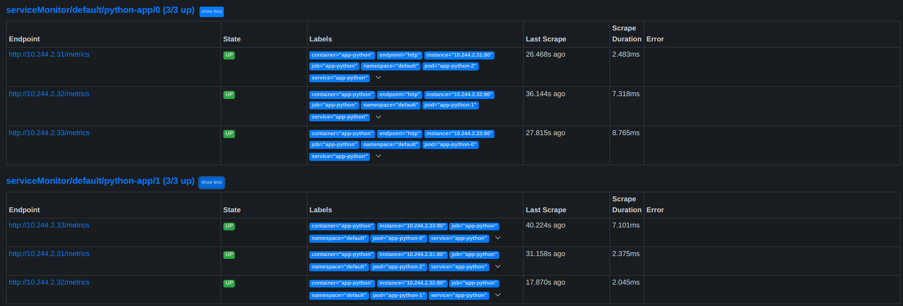
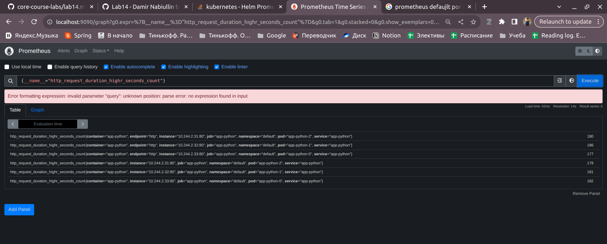

# Lab 13: Kubernetes Monitoring and Init Containers
## Task 1
### [kube-prometheus](https://github.com/prometheus-operator/kube-prometheus#kubeprometheus) included in this package:
#### The Prometheus Operator:
[useful video](https://www.youtube.com/watch?v=ha2LjlD6g7g&ab_channel=TechWorldwithNana)

Operator is needed for stateful application in k8s. k8s doesn't know natively
how to manage lifecycle of stateful application and due to that we provide external
automated operator that says k8s how to properly manage application.
Most of the stateful application have operators. The prometheus also provides it.

#### Highly available Prometheus

Just default prometheus service. Needed for storing and providing metrics. 
Use pql language for extracting metrics info

#### Highly available Alertmanager

Needed for redirecting all alerts from, for example, Prometheus server to any system: email, telegram, slack

#### Prometheus node-exporter

Needed for export metrics of hardware and OS for *NIX systems. 

#### Prometheus Adapter for Kubernetes Metrics APIs

Needed for determine which metrics from default k8s metrics should be taken

#### kube-state-metrics

Needed to generate base metrics from k8s and expose them as enpdoint for, for example, for Prometheus to scrap.

#### Grafana

Service for vizualization metrics, logs, etc. Provide many templates for graph that can show most of the cases.
Can take data from different sources, such as InfluxDB, Loki, Prometheus, etc.


There is can be issue with node exporter. Can be solved by https://github.com/prometheus-community/helm-charts/issues/2983

Install:
```
$ helm install prometheus prometheus-community/kube-prometheus-stack
 ```

### `kubectl` command outputs:
```
$ kubectl get po,sts,svc,pvc,cm
NAME                                                         READY   STATUS    RESTARTS      AGE
pod/alertmanager-prometheus-kube-prometheus-alertmanager-0   2/2     Running   0             51m
pod/app-python-0                                             2/2     Running   0             4m8s
pod/app-python-1                                             2/2     Running   0             4m8s
pod/app-python-2                                             2/2     Running   0             4m8s
pod/prometheus-grafana-6cc7d6f67f-zsxc5                      3/3     Running   0             51m
pod/prometheus-kube-prometheus-operator-58c49d56f4-b8vfp     1/1     Running   0             51m
pod/prometheus-kube-state-metrics-6bbff75769-kbg64           1/1     Running   0             51m
pod/prometheus-prometheus-kube-prometheus-prometheus-0       2/2     Running   0             51m
pod/prometheus-prometheus-node-exporter-887tg                1/1     Running   0             51m
pod/vault-0                                                  1/1     Running   6 (67m ago)   22d
pod/vault-agent-injector-5cd8b87c6c-rctsv                    1/1     Running   6 (67m ago)   22d

NAME                                                                    READY   AGE
statefulset.apps/alertmanager-prometheus-kube-prometheus-alertmanager   1/1     51m
statefulset.apps/app-python                                             3/3     4m9s
statefulset.apps/prometheus-prometheus-kube-prometheus-prometheus       1/1     51m
statefulset.apps/vault                                                  1/1     22d

NAME                                              TYPE        CLUSTER-IP       EXTERNAL-IP   PORT(S)                      AGE
service/alertmanager-operated                     ClusterIP   None             <none>        9093/TCP,9094/TCP,9094/UDP   51m
service/app-python                                NodePort    10.111.59.180    <none>        80:31071/TCP                 4m10s
service/kubernetes                                ClusterIP   10.96.0.1        <none>        443/TCP                      36d
service/prometheus-grafana                        ClusterIP   10.99.131.136    <none>        80/TCP                       51m
service/prometheus-kube-prometheus-alertmanager   ClusterIP   10.105.89.179    <none>        9093/TCP,8080/TCP            51m
service/prometheus-kube-prometheus-operator       ClusterIP   10.102.33.144    <none>        443/TCP                      51m
service/prometheus-kube-prometheus-prometheus     ClusterIP   10.100.193.87    <none>        9090/TCP,8080/TCP            51m
service/prometheus-kube-state-metrics             ClusterIP   10.100.110.237   <none>        8080/TCP                     51m
service/prometheus-operated                       ClusterIP   None             <none>        9090/TCP                     51m
service/prometheus-prometheus-node-exporter       ClusterIP   10.105.71.147    <none>        9100/TCP                     51m
service/vault                                     ClusterIP   10.109.25.80     <none>        8200/TCP,8201/TCP            22d
service/vault-agent-injector-svc                  ClusterIP   10.103.112.208   <none>        443/TCP                      22d
service/vault-internal                            ClusterIP   None             <none>        8200/TCP,8201/TCP            22d

NAME                                                 STATUS   VOLUME                                     CAPACITY   ACCESS MODES   STORAGECLASS   AGE
persistentvolumeclaim/app-data-app-python-0          Bound    pvc-e186228b-bf08-46b8-ae61-68c478f40cbc   62Mi       RWO            standard       8d
persistentvolumeclaim/app-data-app-python-1          Bound    pvc-5a63812d-c754-481f-be4c-823559acbfd4   62Mi       RWO            standard       8d
persistentvolumeclaim/app-data-app-python-2          Bound    pvc-a54ec4b3-fbe3-41b2-be3d-d66dd7394e40   62Mi       RWO            standard       8d
persistentvolumeclaim/app-data-kotlin-app-kotlin-0   Bound    pvc-771bc73c-8785-4046-ab30-e706470e3248   62Mi       RWO            standard       8d
persistentvolumeclaim/app-data-kotlin-app-kotlin-1   Bound    pvc-ef92e74b-b6b2-4f76-91fb-63f5c7be580e   62Mi       RWO            standard       8d
persistentvolumeclaim/app-data-kotlin-app-kotlin-2   Bound    pvc-a96bf888-7954-44b1-bcce-87c8fd578775   62Mi       RWO            standard       8d

NAME                                                                     DATA   AGE
configmap/app-python-config-map                                          1      4m10s
configmap/kube-root-ca.crt                                               1      36d
configmap/prometheus-grafana                                             1      51m
configmap/prometheus-grafana-config-dashboards                           1      51m
configmap/prometheus-kube-prometheus-alertmanager-overview               1      51m
configmap/prometheus-kube-prometheus-apiserver                           1      51m
configmap/prometheus-kube-prometheus-cluster-total                       1      51m
configmap/prometheus-kube-prometheus-controller-manager                  1      51m
configmap/prometheus-kube-prometheus-etcd                                1      51m
configmap/prometheus-kube-prometheus-grafana-datasource                  1      51m
configmap/prometheus-kube-prometheus-grafana-overview                    1      51m
configmap/prometheus-kube-prometheus-k8s-coredns                         1      51m
configmap/prometheus-kube-prometheus-k8s-resources-cluster               1      51m
configmap/prometheus-kube-prometheus-k8s-resources-multicluster          1      51m
configmap/prometheus-kube-prometheus-k8s-resources-namespace             1      51m
configmap/prometheus-kube-prometheus-k8s-resources-node                  1      51m
configmap/prometheus-kube-prometheus-k8s-resources-pod                   1      51m
configmap/prometheus-kube-prometheus-k8s-resources-workload              1      51m
configmap/prometheus-kube-prometheus-k8s-resources-workloads-namespace   1      51m
configmap/prometheus-kube-prometheus-kubelet                             1      51m
configmap/prometheus-kube-prometheus-namespace-by-pod                    1      51m
configmap/prometheus-kube-prometheus-namespace-by-workload               1      51m
configmap/prometheus-kube-prometheus-node-cluster-rsrc-use               1      51m
configmap/prometheus-kube-prometheus-node-rsrc-use                       1      51m
configmap/prometheus-kube-prometheus-nodes                               1      51m
configmap/prometheus-kube-prometheus-nodes-darwin                        1      51m
configmap/prometheus-kube-prometheus-persistentvolumesusage              1      51m
configmap/prometheus-kube-prometheus-pod-total                           1      51m
configmap/prometheus-kube-prometheus-prometheus                          1      51m
configmap/prometheus-kube-prometheus-proxy                               1      51m
configmap/prometheus-kube-prometheus-scheduler                           1      51m
configmap/prometheus-kube-prometheus-workload-total                      1      51m
configmap/prometheus-prometheus-kube-prometheus-prometheus-rulefiles-0   34     51m
```

### Explanation:
#### Pods:
1. `pod/alertmanager-prometheus-kube-prometheus-alertmanager-0` - pod for alertmanager
2. `pod/prometheus-grafana-6cc7d6f67f-zsxc5` - pod for grafana
3. `pod/prometheus-kube-prometheus-operator-58c49d56f4-b8vfp` - pod for prometheus operator
4. `pod/prometheus-kube-state-metrics-6bbff75769-kbg64` - pod for kube state metrics
5. `pod/prometheus-prometheus-kube-prometheus-prometheus-0` - pod for prometheus
6. `pod/prometheus-prometheus-node-exporter-887tg` - pod for node exporter

#### Statefulset:
1. `statefulset.apps/alertmanager-prometheus-kube-prometheus-alertmanager` - statefulset for kube prometheus alert manager
2. `statefulset.apps/app-python` - stateful set for app-python

#### Services:
1. `service/app-python` - service for app-python
2. `service/prometheus-grafana` - service for grafana
3. `service/prometheus-kube-prometheus-alertmanager` - service for alertmanager
4. `service/prometheus-kube-prometheus-operator` - service for prom operator
5. `service/prometheus-kube-prometheus-prometheus` - service for prometheus
6. `service/prometheus-kube-state-metrics` - service for state metrics
7. `service/prometheus-operated` - service for prometheus operated
8. `service/prometheus-prometheus-node-exporter` - service for node exporter

#### Configmaps are used for internal work of prometheus stack 

### Grafana dashboards
a. 
b. 
c. 
d. 
e. 
f. 




## Task 2
Add init containers config to statefulset.yaml

Run as default:
```
helm secrets install app-python . -n default -f ./secrets.yaml
```

Get ls from new volume folder:
```
$ kubectl exec app-python-0 -- ls ./init
Defaulted container "app-python" out of: app-python, vault-agent, install (init), queue-1 (init), queue-2 (init), queue-3 (init), vault-agent-init (init)
queue
test.html
```

```html
$ kubectl exec app-python-0 -- cat ./init/test.html
Defaulted container "app-python" out of: app-python, vault-agent, install (init), queue-1 (init), queue-2 (init), queue-3 (init), vault-agent-init (init)
<html><head></head><body><header>
<title>http://info.cern.ch</title>
</header>

<h1>http://info.cern.ch - home of the first website</h1>
<p>From here you can:</p>
<ul>
<li><a href="http://info.cern.ch/hypertext/WWW/TheProject.html">Browse the first website</a></li>
<li><a href="http://line-mode.cern.ch/www/hypertext/WWW/TheProject.html">Browse the first website using the line-mode browser simulator</a></li>
<li><a href="http://home.web.cern.ch/topics/birth-web">Learn about the birth of the web</a></li>
<li><a href="http://home.web.cern.ch/about">Learn about CERN, the physics laboratory where the web was born</a></li>
</ul>
</body></html>
```

## Bonus task
### 1:
Add additional values file and use:
```
helm install prometheus prometheus-community/kube-prometheus-stack -f app-python-values.yaml
```





### 2:
```$ kubectl exec app-python-0 -- cat ./init/queue
Defaulted container "app-python" out of: app-python, vault-agent, install (init), queue-1 (init), queue-2 (init), queue-3 (init), vault-agent-init (init)
1
2
3
```