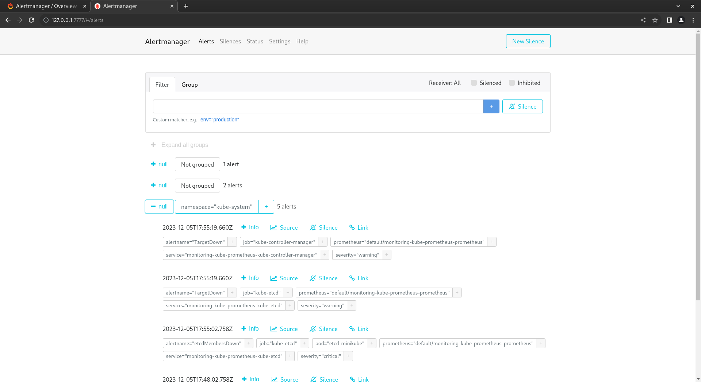
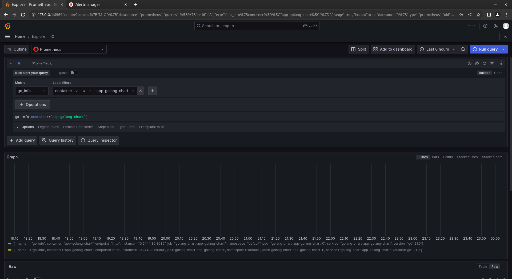

# Kubernetes Monitoring and Init Containers
In this lab, Kubernetes cluster monitoring using Prometheus with the Kube Prometheus Stack, and Init Containers will be explored.

### Prometheus Stack
Th main components of the Prometheus Stack are:
- **The Prometheus Operator** - manages deployment and configuration of Prometheus, Alertmanager and other monitoring-related components.
- **Highly available Prometheus** - collects metrics from monitored targets. Includes timeseries database and query language.
- **Highly available Alertmanager** - handles alerts from Prometheus and sends them to configured receivers (e.g. Telegram, PagerDuty, email).
- **Prometheus node-exporter** - collects metrics from the host machine.
- **Prometheus Adapter for Kubernetes Metrics APIs** - allows using Kubernetes metrics APIs as source of metrics for Prometheus.
- **kube-state-metrics** - collects metrics from Kubernetes objects.
- **Grafana** - visualizes metrics from Prometheus.

Using [guide](https://github.com/prometheus-community/helm-charts/tree/main/charts/kube-prometheus-stack) to install monitoring stack.
```bash
vladislav5ik@AsusTuf:~$ helm repo add prometheus-community https://prometheus-community.github.io/helm-charts
"prometheus-community" has been added to your repositories
vladislav5ik@AsusTuf:~$ helm repo update
Hang tight while we grab the latest from your chart repositories...
...Successfully got an update from the "hashicorp" chart repository
...Successfully got an update from the "prometheus-community" chart repository
Update Complete. ⎈Happy Helming!⎈
```

Installing application charts.
```bash
vladislav5ik@AsusTuf:~/code-iu/core-course-labs/k8s$ helm install golang-chart app-golang-chart/
NAME: golang-chart
LAST DEPLOYED: Tue Dec  5 20:49:21 2023
NAMESPACE: default
STATUS: deployed
REVISION: 1
NOTES:
1. Get the application URL by running these commands:
  export NODE_PORT=$(kubectl get --namespace default -o jsonpath="{.spec.ports[0].nodePort}" services golang-chart-app-golang-chart)
  export NODE_IP=$(kubectl get nodes --namespace default -o jsonpath="{.items[0].status.addresses[0].address}")
  echo http://$NODE_IP:$NODE_PORT
vladislav5ik@AsusTuf:~/code-iu/core-course-labs/k8s$ helm install python-chart app-python-chart/
NAME: python-chart
LAST DEPLOYED: Tue Dec  5 20:51:24 2023
NAMESPACE: default
STATUS: deployed
REVISION: 1
NOTES:
1. Get the application URL by running these commands:
  export NODE_PORT=$(kubectl get --namespace default -o jsonpath="{.spec.ports[0].nodePort}" services python-chart-app-python-chart)
  export NODE_IP=$(kubectl get nodes --namespace default -o jsonpath="{.items[0].status.addresses[0].address}")
  echo http://$NODE_IP:$NODE_PORT
```

Output of `kubectl get po,sts,svc,pvc,cm`
```bash
vladislav5ik@AsusTuf:~/code-iu/core-course-labs/k8s$ kubectl get po,sts,svc,pvc,cm
NAME                                                         READY   STATUS    RESTARTS       AGE
pod/alertmanager-monitoring-kube-prometheus-alertmanager-0   2/2     Running   0              14m
pod/golang-chart-app-golang-chart-0                          2/2     Running   0              9m33s
pod/golang-chart-app-golang-chart-1                          2/2     Running   0              9m33s
pod/monitoring-grafana-6f8d546676-vgzpn                      3/3     Running   0              14m
pod/monitoring-kube-prometheus-operator-5fbb66b4b-8rk8n      1/1     Running   0              14m
pod/monitoring-kube-state-metrics-74f4d8858f-pqcz6           1/1     Running   0              14m
pod/monitoring-prometheus-node-exporter-b26f9                1/1     Running   0              14m
pod/prometheus-monitoring-kube-prometheus-prometheus-0       2/2     Running   0              14m
pod/python-chart-app-python-chart-0                          2/2     Running   0              7m32s
pod/python-chart-app-python-chart-1                          2/2     Running   0              7m32s
pod/vault-0                                                  1/1     Running   10 (24m ago)   21d
pod/vault-agent-injector-5cd8b87c6c-7ktn5                    1/1     Running   7 (24m ago)    20d

NAME                                                                    READY   AGE
statefulset.apps/alertmanager-monitoring-kube-prometheus-alertmanager   1/1     14m
statefulset.apps/golang-chart-app-golang-chart                          2/2     9m33s
statefulset.apps/prometheus-monitoring-kube-prometheus-prometheus       1/1     14m
statefulset.apps/python-chart-app-python-chart                          2/2     7m32s
statefulset.apps/vault                                                  1/1     21d

NAME                                              TYPE        CLUSTER-IP       EXTERNAL-IP   PORT(S)                      AGE
service/alertmanager-operated                     ClusterIP   None             <none>        9093/TCP,9094/TCP,9094/UDP   14m
service/golang-chart-app-golang-chart             NodePort    10.111.186.207   <none>        8080:30220/TCP               9m33s
service/kubernetes                                ClusterIP   10.96.0.1        <none>        443/TCP                      28d
service/monitoring-grafana                        ClusterIP   10.106.157.253   <none>        80/TCP                       14m
service/monitoring-kube-prometheus-alertmanager   ClusterIP   10.104.214.240   <none>        9093/TCP,8080/TCP            14m
service/monitoring-kube-prometheus-operator       ClusterIP   10.109.211.135   <none>        443/TCP                      14m
service/monitoring-kube-prometheus-prometheus     ClusterIP   10.98.4.134      <none>        9090/TCP,8080/TCP            14m
service/monitoring-kube-state-metrics             ClusterIP   10.105.77.4      <none>        8080/TCP                     14m
service/monitoring-prometheus-node-exporter       ClusterIP   10.108.238.149   <none>        9100/TCP                     14m
service/prometheus-operated                       ClusterIP   None             <none>        9090/TCP                     14m
service/python-chart-app-python-chart             NodePort    10.105.78.186    <none>        8080:32545/TCP               7m32s
service/vault                                     ClusterIP   10.106.142.207   <none>        8200/TCP,8201/TCP            21d
service/vault-agent-injector-svc                  ClusterIP   10.102.46.250    <none>        443/TCP                      21d
service/vault-internal                            ClusterIP   None             <none>        8200/TCP,8201/TCP            21d

NAME                                                                                      STATUS   VOLUME                                     CAPACITY   ACCESS MODES   STORAGECLASS   AGE
persistentvolumeclaim/golang-persistent-volume-golang-chart-app-golang-chart-0            Bound    pvc-c173984f-ee99-4a70-ad0d-7416f567ffb0   1Mi        RWO            standard       22h
persistentvolumeclaim/golang-persistent-volume-golang-chart-app-golang-chart-1            Bound    pvc-7ac9dc63-f92f-4fe8-91bc-53b108dbf102   1Mi        RWO            standard       22h
persistentvolumeclaim/golang-persistent-volume-golang-with-del-hooks-app-golang-chart-0   Bound    pvc-43f7ba5e-152e-49ae-b2ab-02e677bbec87   1Mi        RWO            standard       7d20h
persistentvolumeclaim/golang-persistent-volume-golang-with-del-hooks-app-golang-chart-1   Bound    pvc-38fa078c-3cc0-4330-837d-baf1d888f2af   1Mi        RWO            standard       7d20h
persistentvolumeclaim/python-persistent-volume-python-chart-app-python-chart-0            Bound    pvc-56db77fb-95f6-4d9e-9b3f-b9b32d4ad31b   1Mi        RWO            standard       22h
persistentvolumeclaim/python-persistent-volume-python-chart-app-python-chart-1            Bound    pvc-e13b50e3-89ce-451d-bca8-33c9ecf52c6c   1Mi        RWO            standard       22h
persistentvolumeclaim/python-persistent-volume-python-with-del-hooks-app-python-chart-0   Bound    pvc-8fdbb6f8-fbb4-42b5-93b8-c5e771814143   1Mi        RWO            standard       7d21h
persistentvolumeclaim/python-persistent-volume-python-with-del-hooks-app-python-chart-1   Bound    pvc-a7e2164b-c5b3-4524-9dd8-80e90ae48833   1Mi        RWO            standard       7d21h

NAME                                                                     DATA   AGE
configmap/chart-configmap                                                1      7m32s
configmap/chart-configmap-envfrom                                        4      7m32s
configmap/kube-root-ca.crt                                               1      28d
configmap/monitoring-grafana                                             1      14m
configmap/monitoring-grafana-config-dashboards                           1      14m
configmap/monitoring-kube-prometheus-alertmanager-overview               1      14m
configmap/monitoring-kube-prometheus-apiserver                           1      14m
configmap/monitoring-kube-prometheus-cluster-total                       1      14m
configmap/monitoring-kube-prometheus-controller-manager                  1      14m
configmap/monitoring-kube-prometheus-etcd                                1      14m
configmap/monitoring-kube-prometheus-grafana-datasource                  1      14m
configmap/monitoring-kube-prometheus-grafana-overview                    1      14m
configmap/monitoring-kube-prometheus-k8s-coredns                         1      14m
configmap/monitoring-kube-prometheus-k8s-resources-cluster               1      14m
configmap/monitoring-kube-prometheus-k8s-resources-multicluster          1      14m
configmap/monitoring-kube-prometheus-k8s-resources-namespace             1      14m
configmap/monitoring-kube-prometheus-k8s-resources-node                  1      14m
configmap/monitoring-kube-prometheus-k8s-resources-pod                   1      14m
configmap/monitoring-kube-prometheus-k8s-resources-workload              1      14m
configmap/monitoring-kube-prometheus-k8s-resources-workloads-namespace   1      14m
configmap/monitoring-kube-prometheus-kubelet                             1      14m
configmap/monitoring-kube-prometheus-namespace-by-pod                    1      14m
configmap/monitoring-kube-prometheus-namespace-by-workload               1      14m
configmap/monitoring-kube-prometheus-node-cluster-rsrc-use               1      14m
configmap/monitoring-kube-prometheus-node-rsrc-use                       1      14m
configmap/monitoring-kube-prometheus-nodes                               1      14m
configmap/monitoring-kube-prometheus-nodes-darwin                        1      14m
configmap/monitoring-kube-prometheus-persistentvolumesusage              1      14m
configmap/monitoring-kube-prometheus-pod-total                           1      14m
configmap/monitoring-kube-prometheus-prometheus                          1      14m
configmap/monitoring-kube-prometheus-proxy                               1      14m
configmap/monitoring-kube-prometheus-scheduler                           1      14m
configmap/monitoring-kube-prometheus-workload-total                      1      14m
configmap/prometheus-monitoring-kube-prometheus-prometheus-rulefiles-0   34     14m
```
This command displays all the pods, statefulsets, services, persistent volume claims and configmaps in the default namespace. As we can see, there are configmaps storing configuration for the prometheus stack, statefulsets for python and golang apps, and some pods. Reason there are many versions of persistent volume claims is that Ive installed the same apps with different names.

### Grafana
To access grafana I configured port-forwarding for the Grafana service
```bash
vladislav5ik@AsusTuf:~/code-iu/core-course-labs/k8s$ kubectl port-forward service/monitoring-grafana 6969:80
Forwarding from 127.0.0.1:6969 -> 3000
Handling connection for 6969
```
Grafana now avaailable at localhost:6969.


Here are some dashboards:

  Some of the metrics ar not present because of version of k8s Ive installed, the problem discussed in [this issue](https://github.com/rancher/rancher/issues/38934).
- CPU and Memory consumption of the StatefulSet.

  Python app
  

  Golang app
  
  Since I have no data for such metrics, I cannot determine pods with higher and lower CPU usage in the default namespace.

- Node memory usage in percentage and megabytes.
  
  Node used around 10GB of memory which is 77% of total memory.

- Number of pods and containers managed by the Kubelet service.
  
  There are 23 pods and 50 containers managed by the Kubelet service.
- Network usage of Pods in the default namespace.

  For both apps there is no data for network usage.
  
- Number of active alerts.
  
  There are 8 active alerts.
- Number of active alerts from the Web UI.
  
  The same number of active alerts - 8.


### Init Containers
Init containers runs before the main pod starts. In this lab Ive defined 4 init containers for the python and golang apps in this way:
```yaml
      initContainers:
        - name: init-container-one
          image: busybox:1.28
          command:
          - wget
          - "-O"
          - "/work-dir/index.html"
          - http://info.cern.ch
          volumeMounts:
          - name: init-volume
            mountPath: "/work-dir"
```

Checking init containers work and execution in the order they are defined in the pod manifest.
```bash
vladislav5ik@AsusTuf:~/code-iu/core-course-labs/k8s$ kubectl exec pod/python-chart-app-python-chart-0 -it /bin/sh
kubectl exec [POD] [COMMAND] is DEPRECATED and will be removed in a future version. Use kubectl exec [POD] -- [COMMAND] instead.
Defaulted container "app-python-chart" out of: app-python-chart, vault-agent, init-container-one (init), init-container-two (init), init-container-three (init), init-container-four (init)
~ $ cd /app/init_workdir/
~/init_workdir $ ls
file        index.html
~/init_workdir $ cat file
messageOne
messageTwo
messageThree
~/init_workdir $ cat index.html
<html><head></head><body><header>
<title>http://info.cern.ch</title>
</header>

<h1>http://info.cern.ch - home of the first website</h1>
<p>From here you can:</p>
<ul>
<li><a href="http://info.cern.ch/hypertext/WWW/TheProject.html">Browse the first website</a></li>
<li><a href="http://line-mode.cern.ch/www/hypertext/WWW/TheProject.html">Browse the first website using the line-mode browser simulator</a></li>
<li><a href="http://home.web.cern.ch/topics/birth-web">Learn about the birth of the web</a></li>
<li><a href="http://home.web.cern.ch/about">Learn about CERN, the physics laboratory where the web was born</a></li>
</ul>
</body></html>
```

### Prometheus
To access application metrics, Ive configured prometheus target to scrape metrics from the python and golang apps.
```yaml
prometheus:
  additionalServiceMonitors:
  - name: "python-chart-target"
    selector:
      matchLabels:
        app.kubernetes.io/instance: python-chart
    namespaceSelector:
      any: true
    endpoints:
    - port: http
```
Installing prometheus stack with the config above.
```
vladislav5ik@AsusTuf:~/code-iu/core-course-labs/k8s$ helm install monitoring prometheus-community/kube-prometheus-stack -f promconfig/values.yaml
NAME: monitoring
LAST DEPLOYED: Tue Dec  5 23:51:48 2023
NAMESPACE: default
STATUS: deployed
REVISION: 1
NOTES:
kube-prometheus-stack has been installed. Check its status by running:
  kubectl --namespace default get pods -l "release=monitoring"

Visit https://github.com/prometheus-operator/kube-prometheus for instructions on how to create & configure Alertmanager and Prometheus instances using the Operator.
```
Accessing apps metrics from prometheus datasource in grafana.
- Python app metric from underlaying blacksheep framework.
  
- Golang app metric.
  
