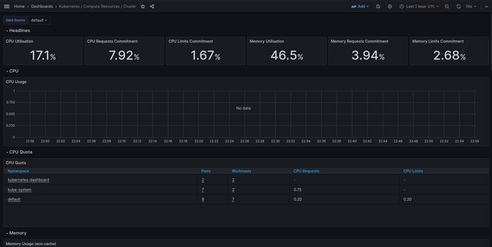
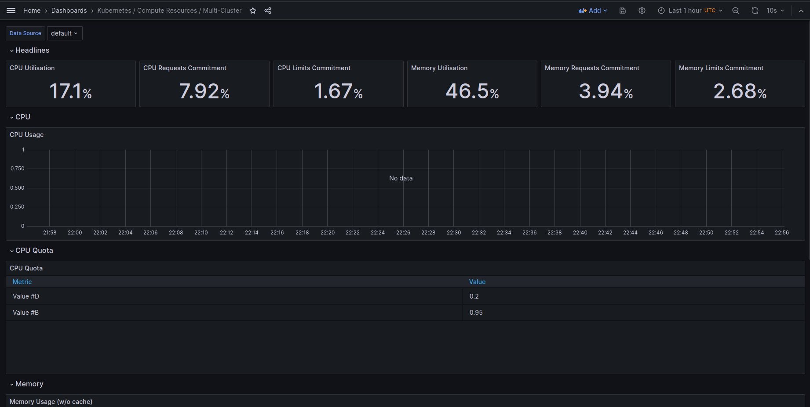
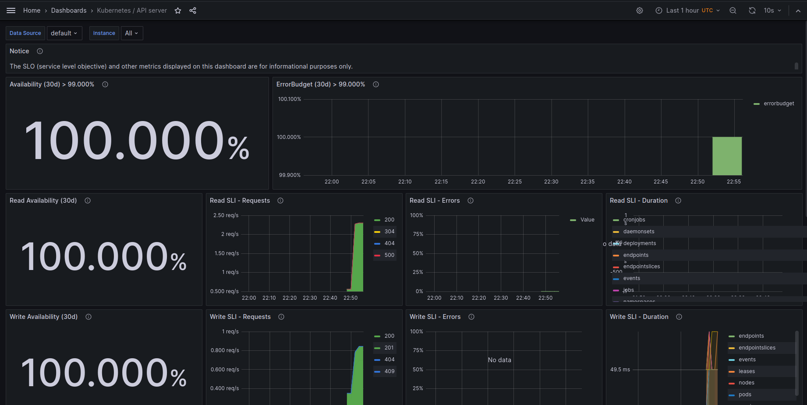
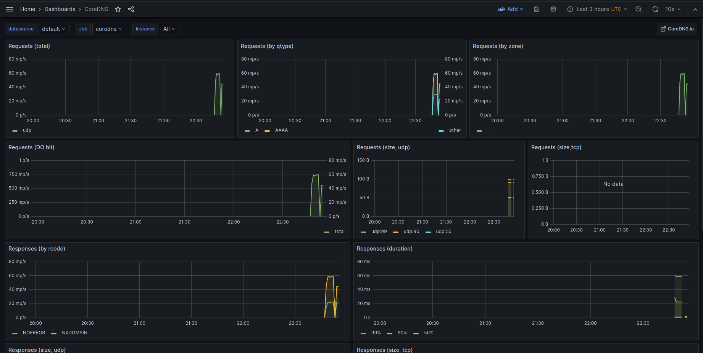

# Lab 14: Kubernetes Monitoring and Init Containers

## Task 1: Kubernetes Cluster Monitoring with Prometheus

### Describe Components

- The Prometheus Operator - the component which is responsible for the configuration, deployment, and management of Prometheus monitoring instances in the Kubernetes cluster.

- Prometheus - a monitoring and alerting toolkit designed for reliability and scalability. It collects metrics from configured targets at specified intervals, stores them, and provides a query language for analyzing the data.

- Alertmanager - a component which handles alerts sent by client applications, such as the Prometheus server. It takes care of deduplicating, grouping, and routing alerts to the appropriate receivers (e.g., email, Slack, etc.).

- Prometheus node-exporter - an exporter that collects various system-level metrics from Linux/Unix nodes such as CPU usage, memory consumption, disk utilization and sends this metrics to Prometheus.

- Prometheus Adapter for Kubernetes Metrics APIs - adapter which provides a standardized interface for consuming metrics from Kubernetes, allowing different monitoring and scaling tools to integrate seamlessly with Kubernetes clusters.

- kube-state-metrics - a service that listens to the Kubernetes API server and generates metrics about the state of the objects (pods, deployments, nodes, etc.) in the cluster.

- Grafana - a platform for monitoring and observability. It is often used in conjunction with Prometheus to visualize and analyze metrics through customizable dashboards.

### Install Helm Charts

To install the Kube Prometheus Stack to your Kubernetes cluster:
```
helm repo add prometheus-community https://prometheus-community.github.io/helm-charts
helm repo update
```
Command:
```
helm install monitoring-kps prometheus-community/kube-prometheus-stack
```
Output:
```
NAME: monitoring-kps
LAST DEPLOYED: Mon Dec  4 21:52:40 2023
NAMESPACE: default
STATUS: deployed
REVISION: 1
NOTES:
kube-prometheus-stack has been installed. Check its status by running:
  kubectl --namespace default get pods -l "release=monitoring-kps"

Visit https://github.com/prometheus-operator/kube-prometheus for instructions on how to create & configure Alertmanager and Prometheus instances using the Operator.
```

To install your app's Helm chart:
```
helm install python-app ./helm-app-python
```
Output:
```
NAME: python-app
LAST DEPLOYED: Mon Dec  4 21:54:56 2023
NAMESPACE: default
STATUS: deployed
REVISION: 1
NOTES:
1. Get the application URL by running these commands:
     NOTE: It may take a few minutes for the LoadBalancer IP to be available.
           You can watch the status of by running 'kubectl get --namespace default svc -w python-app-helm-app-python'
  export SERVICE_IP=$(kubectl get svc --namespace default python-app-helm-app-python --template "{{ range (index .status.loadBalancer.ingress 0) }}{{.}}{{ end }}")
  echo http://$SERVICE_IP:5000
```

Command:
```
kubectl get po,sts,svc,pvc,cm
```
Output:
```
NAME                                                         READY   STATUS    RESTARTS        AGE
pod/alertmanager-monitoring-kps-kube-promet-alertmanager-0   2/2     Running   0               5m19s
pod/monitoring-kps-grafana-68675656f4-vnc65                  3/3     Running   0               6m7s
pod/monitoring-kps-kube-promet-operator-758c88f95b-nw64n     1/1     Running   0               6m7s
pod/monitoring-kps-kube-state-metrics-f779b787c-6mmxp        1/1     Running   0               6m7s
pod/monitoring-kps-prometheus-node-exporter-lrm59            1/1     Running   0               6m7s
pod/prometheus-monitoring-kps-kube-promet-prometheus-0       2/2     Running   0               5m19s
pod/python-app-helm-app-python-0                             1/1     Running   0               3m59s
pod/python-app-helm-app-python-1                             1/1     Running   0               3m59s
pod/vault-0                                                  1/1     Running   3 (6d23h ago)   20d
pod/vault-agent-injector-5cd8b87c6c-nzb6w                    1/1     Running   3 (6d23h ago)   20d

NAME                                                                    READY   AGE
statefulset.apps/alertmanager-monitoring-kps-kube-promet-alertmanager   1/1     5m19s
statefulset.apps/prometheus-monitoring-kps-kube-promet-prometheus       1/1     5m19s
statefulset.apps/python-app-helm-app-python                             2/2     3m59s
statefulset.apps/vault                                                  1/1     20d

NAME                                              TYPE           CLUSTER-IP       EXTERNAL-IP   PORT(S)                      AGE
service/alertmanager-operated                     ClusterIP      None             <none>        9093/TCP,9094/TCP,9094/UDP   5m19s
service/kubernetes                                ClusterIP      10.96.0.1        <none>        443/TCP                      34d
service/monitoring-kps-grafana                    ClusterIP      10.104.14.171    <none>        80/TCP                       6m8s
service/monitoring-kps-kube-promet-alertmanager   ClusterIP      10.105.212.242   <none>        9093/TCP,8080/TCP            6m8s
service/monitoring-kps-kube-promet-operator       ClusterIP      10.104.224.179   <none>        443/TCP                      6m8s
service/monitoring-kps-kube-promet-prometheus     ClusterIP      10.110.77.155    <none>        9090/TCP,8080/TCP            6m8s
service/monitoring-kps-kube-state-metrics         ClusterIP      10.110.126.11    <none>        8080/TCP                     6m8s
service/monitoring-kps-prometheus-node-exporter   ClusterIP      10.103.28.198    <none>        9100/TCP                     6m8s
service/prometheus-operated                       ClusterIP      None             <none>        9090/TCP                     5m19s
service/python-app-helm-app-python                LoadBalancer   10.104.27.42     <pending>     5000:31385/TCP               3m59s
service/vault                                     ClusterIP      10.104.79.3      <none>        8200/TCP,8201/TCP            20d
service/vault-agent-injector-svc                  ClusterIP      10.101.181.232   <none>        443/TCP                      20d
service/vault-internal                            ClusterIP      None             <none>        8200/TCP,8201/TCP            20d

NAME                                                                               STATUS   VOLUME                                     CAPACITY   ACCESS MODES   STORAGECLASS   AGE
persistentvolumeclaim/python-app-visits-python-app-helm-app-python-0               Bound    pvc-7052236b-2b00-450e-9605-8aff5ef5c96b   5Mi        RWO            standard       6d23h
persistentvolumeclaim/python-app-visits-python-app-helm-app-python-1               Bound    pvc-e2040f63-faad-499d-a6fe-780a4ea89566   5Mi        RWO            standard       6d23h

NAME                                                                     DATA   AGE
configmap/env-configmap                                                  1      3m59s
configmap/kube-root-ca.crt                                               1      34d
configmap/monitoring-kps-grafana                                         1      6m8s
configmap/monitoring-kps-grafana-config-dashboards                       1      6m8s
configmap/monitoring-kps-kube-promet-alertmanager-overview               1      6m8s
configmap/monitoring-kps-kube-promet-apiserver                           1      6m8s
configmap/monitoring-kps-kube-promet-cluster-total                       1      6m8s
configmap/monitoring-kps-kube-promet-controller-manager                  1      6m8s
configmap/monitoring-kps-kube-promet-etcd                                1      6m8s
configmap/monitoring-kps-kube-promet-grafana-datasource                  1      6m8s
configmap/monitoring-kps-kube-promet-grafana-overview                    1      6m8s
configmap/monitoring-kps-kube-promet-k8s-coredns                         1      6m8s
configmap/monitoring-kps-kube-promet-k8s-resources-cluster               1      6m8s
configmap/monitoring-kps-kube-promet-k8s-resources-multicluster          1      6m8s
configmap/monitoring-kps-kube-promet-k8s-resources-namespace             1      6m8s
configmap/monitoring-kps-kube-promet-k8s-resources-node                  1      6m8s
configmap/monitoring-kps-kube-promet-k8s-resources-pod                   1      6m8s
configmap/monitoring-kps-kube-promet-k8s-resources-workload              1      6m8s
configmap/monitoring-kps-kube-promet-k8s-resources-workloads-namespace   1      6m8s
configmap/monitoring-kps-kube-promet-kubelet                             1      6m8s
configmap/monitoring-kps-kube-promet-namespace-by-pod                    1      6m8s
configmap/monitoring-kps-kube-promet-namespace-by-workload               1      6m8s
configmap/monitoring-kps-kube-promet-node-cluster-rsrc-use               1      6m8s
configmap/monitoring-kps-kube-promet-node-rsrc-use                       1      6m8s
configmap/monitoring-kps-kube-promet-nodes                               1      6m8s
configmap/monitoring-kps-kube-promet-nodes-darwin                        1      6m8s
configmap/monitoring-kps-kube-promet-persistentvolumesusage              1      6m8s
configmap/monitoring-kps-kube-promet-pod-total                           1      6m8s
configmap/monitoring-kps-kube-promet-prometheus                          1      6m8s
configmap/monitoring-kps-kube-promet-proxy                               1      6m8s
configmap/monitoring-kps-kube-promet-scheduler                           1      6m8s
configmap/monitoring-kps-kube-promet-workload-total                      1      6m8s
configmap/myconfigmap                                                    1      3m59s
configmap/prometheus-monitoring-kps-kube-promet-prometheus-rulefiles-0   34     5m19s
```

### Explaination of each part:
Pods:
- `pod/alertmanager-monitoring-kps-kube-promet-alertmanager-0` - alert manager (explained above)
- `pod/monitoring-kps-grafana-68675656f4-vnc65` - grafana (explained above)
- `pod/monitoring-kps-kube-promet-operator-758c88f95b-nw64n` - prometheus operator (explained above)
- `pod/monitoring-kps-kube-state-metrics-f779b787c-6mmxp` - kube-state-metrics (explained above)
- `pod/monitoring-kps-prometheus-node-exporter-lrm59` - node exporter (explained above)
- `pod/prometheus-monitoring-kps-kube-promet-prometheus-0` - prometheus itself (explained above)
- `pod/python-app-helm-app-python-0` - our application pod
- `pod/python-app-helm-app-python-1` - our application pod
- `pod/vault-0 - vault` (from previous labs)
- `pod/vault-agent-injector-5cd8b87c6c-nzb6w` - vault injector (from previous labs)

Statefulsets:
- `statefulset.apps/alertmanager-monitoring-kps-kube-promet-alertmanager` - statefulset for management alert manager pods
- `statefulset.apps/prometheus-monitoring-kps-kube-promet-prometheus` - statefulset for management prometheus pods
- `statefulset.apps/python-app-helm-app-python` - statefulset for management our application pods
- `statefulset.apps/vault` - statefulset for management vault pods

Services:
- Correspond to the used stack and descriptions above.

Persistent Volume Claims:
- Created in previous labs, here doesn't affect anything.

Config Maps:
- Used for internal affairs of kube-prometheus-stack + our previous configmaps from previous labs.

### Utilize Grafana Dashboards

In my system minikube doesn't allow to access service monitoring-kps-grafana, so we need to use port-forward:
```
kubectl port-forward svc/monitoring-kps-grafana 9898:80
```

Then go to the URL:
```
127.0.0.1:9898
```

The default login:password:
```
admin:prom-operator
```

In my case I have a problem with collecting info from pods using grafana in minikube+docker. I researched this problem in the Internet and found this [link](https://github.com/rancher/rancher/issues/38934#issuecomment-1294585708). I tried to add this configuration to my project (helm-cadvisor) to replace labels, but this doesn't help.

So I run my minikube with suggested command:
```
minikube start --extra-config=controller-manager.bind-address=0.0.0.0 --extra-config=scheduler.bind-address=0.0.0.0
```

And I will provide everything I can:
1. Check CPU and Memory consumption of your StatefulSet.

2. Identify Pods with higher and lower CPU usage in the default namespace.

3. Monitor node memory usage in percentage and megabytes.

4. Count the number of pods and containers managed by the Kubelet service.

5. Evaluate network usage of Pods in the default namespace.

6. Determine the number of active alerts; also check the Web UI with `minikube service monitoring-kube-prometheus-alertmanager`.


To run the kube-prometheus-alertmanager we need to use port-forward:
```
kubectl port-forward svc/monitoring-kps-kube-promet-alertmanager 9898:9093
```


Other dashboards:




## Task 2: Init Containers

### Implement Init Container

Created new volume added in values.yaml:
```
volumeMounts:
  - name: python-app-init
    mountPath: "/init"

volumes:
  - name: python-app-init
    emptyDir:
      sizeLimit: 20Mi
```

Created init container in statefulset.yaml:
```
initContainers:
- name: install
image: busybox:1.28
command:
- wget
- "-O"
- "/work-dir/index.html"
- http://info.cern.ch
volumeMounts:
- name: python-app-init
mountPath: "/work-dir"
```

Command:
```
kubectl get pods
```
Output:
```
NAME                                                     READY   STATUS    RESTARTS       AGE
alertmanager-monitoring-kps-kube-promet-alertmanager-0   2/2     Running   4 (127m ago)   24h
monitoring-kps-grafana-68675656f4-vnc65                  3/3     Running   6 (127m ago)   24h
monitoring-kps-kube-promet-operator-758c88f95b-nw64n     1/1     Running   3 (127m ago)   24h
monitoring-kps-kube-state-metrics-f779b787c-6mmxp        1/1     Running   4 (120m ago)   24h
monitoring-kps-prometheus-node-exporter-lrm59            1/1     Running   2 (127m ago)   24h
prometheus-monitoring-kps-kube-promet-prometheus-0       2/2     Running   4 (127m ago)   24h
python-app-helm-app-python-0                             2/2     Running   0              34s
python-app-helm-app-python-1                             2/2     Running   0              34s
vault-0                                                  1/1     Running   5 (127m ago)   21d
vault-agent-injector-5cd8b87c6c-nzb6w                    1/1     Running   5 (127m ago)   21d
```

Command:
```
kubectl logs python-app-helm-app-python-0 -c install -f
```
Output:
```
Connecting to info.cern.ch (188.184.100.182:80)
index.html           100% |*******************************|   646   0:00:00 ETA
```

Command:
```
kubectl exec -it python-app-helm-app-python-0 -- cat /app/init/index.html
```
Output:
```
Defaulted container "helm-app-python" out of: helm-app-python, vault-agent, install (init)
<html><head></head><body><header>
<title>http://info.cern.ch</title>
</header>

<h1>http://info.cern.ch - home of the first website</h1>
<p>From here you can:</p>
<ul>
<li><a href="http://info.cern.ch/hypertext/WWW/TheProject.html">Browse the first website</a></li>
<li><a href="http://line-mode.cern.ch/www/hypertext/WWW/TheProject.html">Browse the first website using the line-mode browser simulator</a></li>
<li><a href="http://home.web.cern.ch/topics/birth-web">Learn about the birth of the web</a></li>
<li><a href="http://home.web.cern.ch/about">Learn about CERN, the physics laboratory where the web was born</a></li>
</ul>
</body></html>
```

## Bonus

### App Metrics
Created monitoring/values.yaml to fetch metrics from app:
```
helm install monitoring-kps prometheus-community/kube-prometheus-stack -f values.yaml
```

monitoring/values.yaml: (name and instance we can see in minikube dashboard)
```
prometheus:
  additionalServiceMonitors:
  - name: "helm-app-python"
    selector:
      matchLabels:
        app.kubernetes.io/instance: python-app
    namespaceSelector:
      any: true
    endpoints:
    - port: http
```

Need to update some default values in installed stack:
```
helm delete monitoring-kps
helm install monitoring-kps prometheus-community/kube-prometheus-stack -f values.yaml
```

Then lets go to prometheus:
```
kubectl port-forward svc/monitoring-kps-kube-promet-prometheus 9898:9090
```


### Init Container Queue

Added to initContainers in statefulset.yaml:
```
- name: queue-1
    image: busybox:1.28
    command:
    - "sh"
    - "-c"
    - 'echo line1 >> /work-dir/file'
    volumeMounts:
    - name: python-app-init
    mountPath: "/work-dir"
- name: queue-2
    image: busybox:1.28
    command:
    - "sh"
    - "-c"
    - 'echo line2 >> /work-dir/file'
    volumeMounts:
    - name: python-app-init
    mountPath: "/work-dir"
- name: queue-3
    image: busybox:1.28
    command:
    - "sh"
    - "-c"
    - 'echo line3 >> /work-dir/file'
    volumeMounts:
    - name: python-app-init
    mountPath: "/work-dir"
```

Command:
```
kubectl exec -it python-app-helm-app-python-0 -- cat /app/init/file
```
Output:
```
Defaulted container "helm-app-python" out of: helm-app-python, vault-agent, install (init), queue-1 (init), queue-2 (init), queue-3 (init)
line1
line2
line3
```