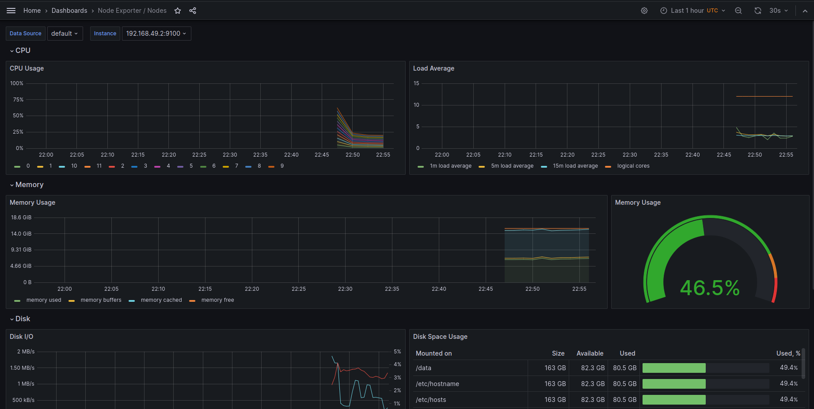
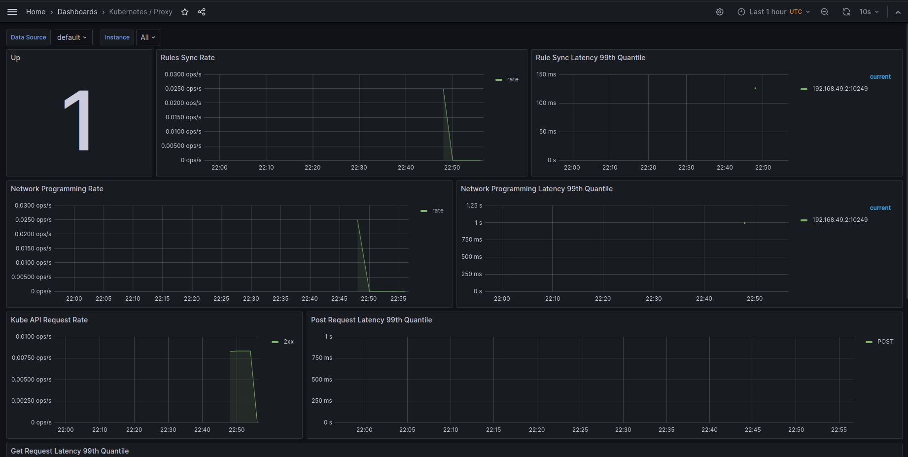

# Kubernetes Monitoring and Init Containers

## Task 1: Kubernetes Cluster Monitoring with Prometheus
### 1.2: Describe Components
- **Prometheus**: Central monitoring and alerting toolkit, collecting and storing metrics.
- **Alertmanager**: Manages, silences, and routes alerts from Prometheus.
- **Grafana**: Visualization platform for analyzing and visualizing metrics.
- **Prometheus Operator**: Automates deployment and maintenance of Prometheus resources.
- **Node Exporter**: Gathers hardware and OS metrics from Kubernetes nodes.
- **Kube State Metrics**: Provides metrics on the state of Kubernetes objects.
- **Prometheus Adapter**: Links Prometheus with Kubernetes autoscaling.
- **Blackbox Exporter**: Probes external endpoints for availability.
- **Pushgateway**: Enables Prometheus to scrape metrics from ephemeral or batch jobs.

### 1.3: Install Helm Charts

```bash
>$ kubectl get po,sts,svc,pvc,cm

NAME                                                         READY   STATUS    RESTARTS   AGE
pod/alertmanager-monitoring-kube-prometheus-alertmanager-0   2/2     Running   0          13m
pod/monitoring-grafana-6f8d546676-f9btw                      3/3     Running   0          14m
pod/monitoring-kube-prometheus-operator-5fbb66b4b-xrclt      1/1     Running   0          14m
pod/monitoring-kube-state-metrics-74f4d8858f-h77cl           1/1     Running   0          14m
pod/monitoring-prometheus-node-exporter-qbxqc                1/1     Running   0          14m
pod/prometheus-monitoring-kube-prometheus-prometheus-0       2/2     Running   0          13m
pod/helm-python-0                                             1/1     Running   0          13m
pod/helm-python-1                                             1/1     Running   0          13m

NAME                                                                    READY   AGE
statefulset.apps/alertmanager-monitoring-kube-prometheus-alertmanager   1/1     13m
statefulset.apps/prometheus-monitoring-kube-prometheus-prometheus       1/1     13m
statefulset.apps/helm-python                                             2/2     13m

NAME                                              TYPE        CLUSTER-IP       EXTERNAL-IP   PORT(S)                      AGE
service/alertmanager-operated                     ClusterIP   None             <none>        9093/TCP,9094/TCP,9094/UDP   13m
service/kubernetes                                ClusterIP   10.96.0.1        <none>        443/TCP                      18m
service/monitoring-grafana                        ClusterIP   10.109.6.4       <none>        80/TCP                       14m
service/monitoring-kube-prometheus-alertmanager   ClusterIP   10.101.88.111    <none>        9093/TCP,8080/TCP            14m
service/monitoring-kube-prometheus-operator       ClusterIP   10.99.98.161     <none>        443/TCP                      14m
service/monitoring-kube-prometheus-prometheus     ClusterIP   10.106.17.225    <none>        9090/TCP,8080/TCP            14m
service/monitoring-kube-state-metrics             ClusterIP   10.105.97.246    <none>        8080/TCP                     14m
service/monitoring-prometheus-node-exporter       ClusterIP   10.104.4.226     <none>        9100/TCP                     14m
service/prometheus-operated                       ClusterIP   None             <none>        9090/TCP                     13m
service/helm-python                                NodePort    10.100.172.117   <none>        8000:30787/TCP               13m

NAME                                                 STATUS   VOLUME                                     CAPACITY   ACCESS MODES   STORAGECLASS   AGE
persistentvolumeclaim/counter-data-py-helm-python-0   Bound    pvc-3557e137-73f3-44fc-95b3-60ffcaa8a933   10Mi       RWO            standard       13m
persistentvolumeclaim/counter-data-py-helm-python-1   Bound    pvc-3c55f277-737f-47ed-b15d-86d2fc47b973   10Mi       RWO            standard       13m

NAME                                                                     DATA   AGE
configmap/config-map-entity-py                                           2      13m
configmap/kube-root-ca.crt                                               1      17m
configmap/monitoring-grafana                                             1      14m
configmap/monitoring-grafana-config-dashboards                           1      14m
configmap/monitoring-kube-prometheus-alertmanager-overview               1      14m
configmap/monitoring-kube-prometheus-apiserver                           1      14m
configmap/monitoring-kube-prometheus-cluster-total                       1      14m
configmap/monitoring-kube-prometheus-controller-manager                  1      14m
configmap/monitoring-kube-prometheus-etcd                                1      14m
configmap/monitoring-kube-prometheus-grafana-datasource                  1      14m
configmap/monitoring-kube-prometheus-grafana-overview                    1      14m
configmap/monitoring-kube-prometheus-k8s-coredns                         1      14m
configmap/monitoring-kube-prometheus-k8s-resources-cluster               1      14m
configmap/monitoring-kube-prometheus-k8s-resources-multicluster          1      14m
configmap/monitoring-kube-prometheus-k8s-resources-namespace             1      14m
configmap/monitoring-kube-prometheus-k8s-resources-node                  1      14m
configmap/monitoring-kube-prometheus-k8s-resources-pod                   1      14m
configmap/monitoring-kube-prometheus-k8s-resources-workload              1      14m
configmap/monitoring-kube-prometheus-k8s-resources-workloads-namespace   1      14m
configmap/monitoring-kube-prometheus-kubelet                             1      14m
configmap/monitoring-kube-prometheus-namespace-by-pod                    1      14m
configmap/monitoring-kube-prometheus-namespace-by-workload               1      14m
configmap/monitoring-kube-prometheus-node-cluster-rsrc-use               1      14m
configmap/monitoring-kube-prometheus-node-rsrc-use                       1      14m
configmap/monitoring-kube-prometheus-nodes                               1      14m
configmap/monitoring-kube-prometheus-nodes-darwin                        1      14m
configmap/monitoring-kube-prometheus-persistentvolumesusage              1      14m
configmap/monitoring-kube-prometheus-pod-total                           1      14m
configmap/monitoring-kube-prometheus-prometheus                          1      14m
configmap/monitoring-kube-prometheus-proxy                               1      14m
configmap/monitoring-kube-prometheus-scheduler                           1      14m
configmap/monitoring-kube-prometheus-workload-total                      1      14m
configmap/prometheus-monitoring-kube-prometheus-prometheus-rulefiles-0   34     13m
```

### 1.4: Utilize Grafana Dashboard








## Task 2: Init Containers
### 2.2: Implement Init Container
```bash
>$ kubectl exec helm-python-0 -- cat /init_data/file

Defaulted container "helm-python" out of: helm-python, install (init), queue-zero (init), queue-one (init), queue-two (init), queue-three (init)
one
two
three
```

```bash
>$ kubectl exec helm-python-0 -- cat /init_data/index.html

Defaulted container "helm-python" out of: helm-python, install (init), queue-zero (init), queue-one (init), queue-two (init), queue-three (init)
<html><head></head><body><header>
<title>http://info.cern.ch</title>
</header>

<h1>http://info.cern.ch - home of the first website</h1>
<p>From here you can:</p>
<ul>
<li><a href="http://info.cern.ch/hypertext/WWW/TheProject.html">Browse the first website</a></li>
<li><a href="http://line-mode.cern.ch/www/hypertext/WWW/TheProject.html">Browse the first website using the line-mode browser simulator</a></li>
<li><a href="http://home.web.cern.ch/topics/birth-web">Learn about the birth of the web</a></li>
<li><a href="http://home.web.cern.ch/about">Learn about CERN, the physics laboratory where the web was born</a></li>
</ul>
</body></html>
```

## Bonus:
### 3.1: App Metrics
[Shown in 1.4](###-1.4:utilize-grafana-dashboard)
### 3.2: Init Container Queue
[Shown in 2.2](###-2.2:-implement-init-container)