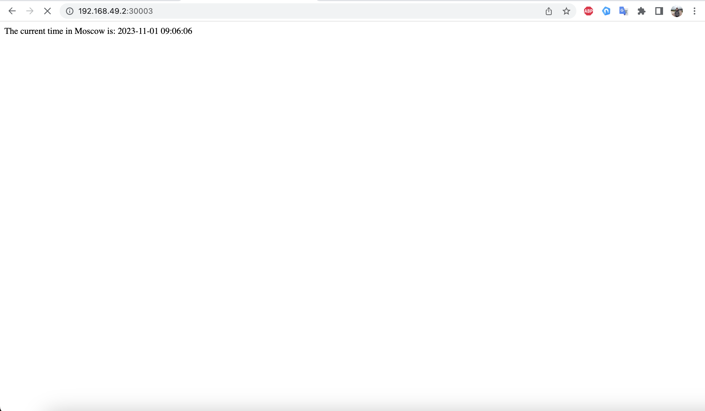

# Task 1

# Kube Prometheus Stack

The Kube Prometheus Stack is a collection of Kubernetes custom resources and configurations for running Prometheus and Grafana within a Kubernetes cluster. The stack is designed to be easily deployable and customizable, and it includes several key components:

1. Prometheus Operator: This component manages and deploys Prometheus instances using Kubernetes custom resources. It includes a set of custom resource definitions (CRDs) such as Prometheus, ServiceMonitor, and Alertmanager, which define the configuration for Prometheus, monitoring targets, and alerting rules.

2. Prometheus: Prometheus is a monitoring and alerting toolkit that collects metrics from monitored targets and stores them in a time-series database. The Kube Prometheus Stack includes configurations for deploying Prometheus instances as Kubernetes resources.

3. Alertmanager: Alertmanager is a component that handles alert notifications and routing. It integrates with Prometheus to send alerts based on defined rules and configurations. The Kube Prometheus Stack includes configurations for deploying Alertmanager instances as Kubernetes resources.

4. Grafana: Grafana is a popular open-source platform for analytics and monitoring. It provides a user-friendly interface for visualizing and analyzing the metrics collected by Prometheus. The Kube Prometheus Stack includes configurations for deploying Grafana instances as Kubernetes resources.

5. Node Exporter: Node Exporter is a Prometheus exporter that collects system metrics from the host machine and makes them available to Prometheus for monitoring. The Kube Prometheus Stack includes configurations for deploying Node Exporter instances as Kubernetes resources.

6. kube-state-metrics: kube-state-metrics is a service that collects and exposes cluster-wide metrics generated by Kubernetes. It provides detailed insight into the state of the various Kubernetes resources, such as deployments, pods, and services. The Kube Prometheus Stack includes configurations for deploying kube-state-metrics as a Kubernetes resource.

These components work together to provide a comprehensive monitoring and alerting solution for Kubernetes clusters, allowing users to collect, visualize, and analyze metrics from their applications and infrastructure. The Kube Prometheus Stack simplifies the deployment and management of these components within a Kubernetes environment, making it easier for users to set up a robust monitoring and alerting system.

# Deploy:

```
helm install mon prometheus-community/kube-prometheus-stack
```

```
NAME: mon
LAST DEPLOYED: Fri Dec 5 18:17:26 2023
NAMESPACE: default
STATUS: deployed
REVISION: 1
NOTES:
kube-prometheus-stack has been installed. Check its status by running:
  kubectl --namespace default get pods -l "release=mon"
```

```
kubectl get po,sts,svc,pvc,cm
```

```
NAME                                                         READY   STATUS    RESTARTS        AGE
pod/alertmanager-monitoring-kube-prometheus-alertmanager-0   2/2     Running   0               97s
pod/app-go-0                                                 1/1     Running   1 (4d6h ago)    5d23h
pod/app-go-1                                                 1/1     Running   1 (6m29s ago)   5d23h
pod/app-go-2                                                 1/1     Running   1 (7d2h ago)    5d23h
pod/app-python-0                                             1/1     Running   3 (7d2h ago)    5d23h
pod/app-python-1                                             1/1     Running   2 (7d2h ago)    5d23h
pod/app-python-2                                             1/1     Running   3 (7d2h ago)    5d23h
pod/monitoring-grafana-6f8d546676-25bd8                      3/3     Running   0               1m27s
pod/monitoring-kube-prometheus-operator-5fbb66b4b-t9rtv      1/1     Running   0               1m27s
pod/monitoring-kube-state-metrics-74f4d8858f-2ntqx           1/1     Running   0               1m27s
pod/monitoring-prometheus-node-exporter-4dhgq                1/1     Running   0               1m27s
pod/prometheus-monitoring-kube-prometheus-prometheus-0       2/2     Running   0               85s

NAME                                                                    READY   AGE
statefulset.apps/alertmanager-monitoring-kube-prometheus-alertmanager   1/1     92s
statefulset.apps/app-go                                                 3/3     6d22h
statefulset.apps/app-python                                             3/3     6d22h
statefulset.apps/prometheus-monitoring-kube-prometheus-prometheus       1/1     95s

NAME                                              TYPE           CLUSTER-IP       EXTERNAL-IP   PORT(S)                      AGE
service/alertmanager-operated                     ClusterIP      None             <none>        9093/TCP,9094/TCP,9094/UDP   3m45s
service/kubernetes                                ClusterIP      10.96.0.1        <none>        443/TCP                      25m
service/mon-grafana                               ClusterIP      10.103.95.232    <none>        80/TCP                       4m13s
service/mon-kube-prometheus-stack-alertmanager    ClusterIP      10.109.51.233    <none>        9093/TCP,8080/TCP            5m28s
service/mon-kube-prometheus-stack-operator        ClusterIP      10.99.91.63     <none>        443/TCP                      5m28s
service/mon-kube-prometheus-stack-prometheus      ClusterIP      10.110.84.8      <none>        9090/TCP,8080/TCP            5m28s
service/mon-kube-state-metrics                    ClusterIP      10.101.77.10     <none>        8080/TCP                     5m28s
service/mon-prometheus-node-exporter              ClusterIP      10.107.39.40     <none>        9100/TCP                     5m28s
service/prometheus-operated                       ClusterIP      None             <none>        9090/TCP                     3m44s
service/python-helm-app                           LoadBalancer   10.102.132.233   <pending>     8080:31410/TCP               8m
service/typescript-helm-app                       LoadBalancer   10.107.183.126   <pending>     8080:30073/TCP

NAME                                                                STATUS   VOLUME                                     CAPACITY   ACCESS MODES   STORAGECLASS   AGE
persistentvolumeclaim/python-app-0               Bound    pvc-gf53d2d1-1h75-3820-k251-4df3d1c6d5eg   1Mi        RWO            standard       7m
persistentvolumeclaim/python-app-1               Bound    pvc-2c4d01480-d1f2-36h1-78d5-919bf2a6c720   1Mi        RWO            standard       7m
persistentvolumeclaim/python-app-2               Bound    pvc-14b32g81-1638-25a1-cd65-7bc5578cfdec   1Mi        RWO            standard       7m
persistentvolumeclaim/go-app-0       Bound    pvc-b28c326-af5b-327c-7682-468471c43a86   1Mi        RWO            standard       9m
persistentvolumeclaim/go-app-1       Bound    pvc-a253c41f-a262-3d5b-51ba-497c157ncbf2   1Mi        RWO            standard       9m
persistentvolumeclaim/go-app-2       Bound    pvc-cbd42213-c6c1-2cb3-8236-c5fd6ce2be35   1Mi        RWO            standard       9m

NAME                                                                     DATA   AGE
configmap/kube-root-ca.crt                                               1      23d
configmap/monitoring-grafana                                             1      9m21s
configmap/monitoring-grafana-config-dashboards                           1      9m21s
configmap/monitoring-kube-prometheus-alertmanager-overview               1      9m21s
configmap/monitoring-kube-prometheus-apiserver                           1      9m21s
configmap/monitoring-kube-prometheus-cluster-total                       1      9m21s
configmap/monitoring-kube-prometheus-controller-manager                  1      9m21s
configmap/monitoring-kube-prometheus-etcd                                1      9m21s
configmap/monitoring-kube-prometheus-grafana-datasource                  1      9m21s
configmap/monitoring-kube-prometheus-grafana-overview                    1      9m21s
configmap/monitoring-kube-prometheus-k8s-coredns                         1      9m21s
configmap/monitoring-kube-prometheus-k8s-resources-cluster               1      9m21s
configmap/monitoring-kube-prometheus-k8s-resources-multicluster          1      9m21s
configmap/monitoring-kube-prometheus-k8s-resources-namespace             1      9m21s
configmap/monitoring-kube-prometheus-k8s-resources-node                  1      9m21s
configmap/monitoring-kube-prometheus-k8s-resources-pod                   1      9m21s
configmap/monitoring-kube-prometheus-k8s-resources-workload              1      9m21s
configmap/monitoring-kube-prometheus-k8s-resources-workloads-namespace   1      9m21s
configmap/monitoring-kube-prometheus-kubelet                             1      9m21s
configmap/monitoring-kube-prometheus-namespace-by-pod                    1      9m21s
configmap/monitoring-kube-prometheus-namespace-by-workload               1      9m21s
configmap/monitoring-kube-prometheus-node-cluster-rsrc-use               1      9m21s
configmap/monitoring-kube-prometheus-node-rsrc-use                       1      9m21s
configmap/monitoring-kube-prometheus-nodes                               1      9m21s
configmap/monitoring-kube-prometheus-nodes-darwin                        1      9m21s
configmap/monitoring-kube-prometheus-persistentvolumesusage              1      9m21s
configmap/monitoring-kube-prometheus-pod-total                           1      9m21s
configmap/monitoring-kube-prometheus-prometheus                          1      9m21s
configmap/monitoring-kube-prometheus-proxy                               1      9m21s
configmap/monitoring-kube-prometheus-scheduler                           1      9m21s
configmap/monitoring-kube-prometheus-workload-total                      1      9m21s
configmap/prometheus-monitoring-kube-prometheus-prometheus-rulefiles-0   34     7m14s                       
```
# Pods
pod/go-app-golang-{0-2} and pod/py-app-python-{0-2}: pods of both applications
pod/monitoring-kube-prometheus-operator-5fbb66b4b-jr46r: prometheus operator
pod/alertmanager-monitoring-kube-prometheus-alertmanager-0: pod for alert manager
pod/monitoring-grafana-6f8d546676-wd85k: grafana (dashboards, query visualization, etc.)
pod/monitoring-kube-state-metrics-74f4d8858f-vs2mr: pod that generates metrics from k8s (kube-state-metrics)
pod/prometheus-monitoring-kube-prometheus-prometheus-0: pod with prometheus
pod/monitoring-prometheus-node-exporter-8nmd7: node exporter for prometheus

# go app cpu and memory




# python app cpu and memory


# node memory and cpu


# Task 2

```
helm install python . --values values.python.yaml
```

```
NAME: python
LAST DEPLOYED: Tue Dec  5 22:43:17 2023
NAMESPACE: default
STATUS: deployed
REVISION: 1
NOTES:
1. Get the application URL by running these commands:
     NOTE: It may take a few minutes for the LoadBalancer IP to be available.
           You can watch the status of by running 'kubectl get --namespace default svc -w python-helm-app'
  export SERVICE_IP=$(kubectl get svc --namespace default python-helm-app --template "{{ range (index .status.loadBalancer.ingress 0) }}{{.}}{{ end }}")
  echo http://$SERVICE_IP:8080
```

```
kubectl logs python-app-0 -c install -f
```

```
Connecting to info.cern.ch (187.183.101.180:80)
index.html           100% |*******************************|   545   0:00:00 ETA
```

```
Defaulted container "helm-app" out of: helm-app, install (init)
<html><head></head><body><header>
<title>http://info.cern.ch</title>
</header>

<h1>http://info.cern.ch - home of the first website</h1>
<p>From here you can:</p>
<ul>
<li><a href="http://info.cern.ch/hypertext/WWW/TheProject.html">Browse the first website</a></li>
<li><a href="http://line-mode.cern.ch/www/hypertext/WWW/TheProject.html">Browse the first website using the line-mode browser simulator</a></li>
<li><a href="http://home.web.cern.ch/topics/birth-web">Learn about the birth of the web</a></li>
<li><a href="http://home.web.cern.ch/about">Learn about CERN, the physics laboratory where the web was born</a></li>
</ul>
</body></html>
```
