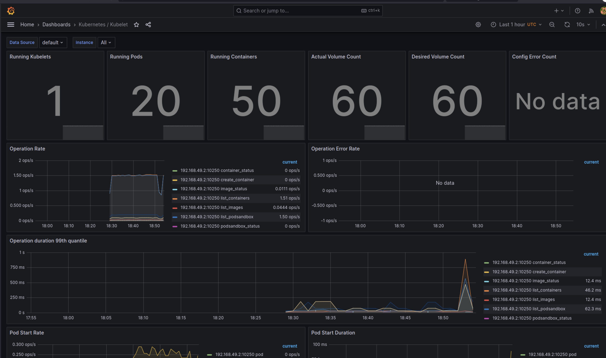

# Kube Prometheus Stack

## Prometheus:

Collects and stores time-series data. Monitors Kubernetes resources and triggers alerts.

## Grafana:

Provides visualization and dashboarding. Creates custom views for analyzing cluster metrics.

## Alertmanager:

Handles and routes alerts. Ensures efficient alert management and response.

## Node Exporter:

Exposes host-level metrics. Monitors CPU, memory, disk, and network stats on each node.

## Prometheus Operator:

Simplifies Prometheus configuration management. Eases deployment and maintenance of Prometheus instances.

## kube-state-metrics:

Exposes metrics related to the state of Kubernetes objects. Aids in cluster analysis and troubleshooting.

# Install Helm Chart

## `kubectl get po,sts,svc,pvc,cm`

```bash
NAME                                                            READY   STATUS    RESTARTS   AGE
pod/alertmanager-kube-prometheus-stack-alertmanager-0           2/2     Running   0          6m53s
pod/app-python-0                                                2/2     Running   0          28m
pod/app-python-1                                                2/2     Running   0          27m
pod/kube-prometheus-stack-grafana-56bf765f49-5tr5f              3/3     Running   0          7m20s
pod/kube-prometheus-stack-kube-state-metrics-5c68dd7f45-dknmk   1/1     Running   0          7m20s
pod/kube-prometheus-stack-operator-86bfcc6d4d-b62gc             1/1     Running   0          7m20s
pod/kube-prometheus-stack-prometheus-node-exporter-45wv8        1/1     Running   0          7m20s
pod/prometheus-kube-prometheus-stack-prometheus-0               2/2     Running   0          6m53s
pod/vault-0                                                     1/1     Running   0          59m
pod/vault-agent-injector-576cc6ffc4-c25tz                       1/1     Running   0          59m

NAME                                                               READY   AGE
statefulset.apps/alertmanager-kube-prometheus-stack-alertmanager   1/1     6m53s
statefulset.apps/app-python                                        2/2     28m
statefulset.apps/prometheus-kube-prometheus-stack-prometheus       1/1     6m53s
statefulset.apps/vault                                             1/1     59m

NAME                                                     TYPE        CLUSTER-IP       EXTERNAL-IP   PORT(S)                      AGE
service/alertmanager-operated                            ClusterIP   None             <none>        9093/TCP,9094/TCP,9094/UDP   6m53s
service/app-python                                       NodePort    10.105.11.171    <none>        8080:30506/TCP               28m
service/kube-prometheus-stack-alertmanager               ClusterIP   10.100.116.219   <none>        9093/TCP,8080/TCP            7m20s
service/kube-prometheus-stack-grafana                    ClusterIP   10.111.46.140    <none>        80/TCP                       7m20s
service/kube-prometheus-stack-kube-state-metrics         ClusterIP   10.109.126.56    <none>        8080/TCP                     7m20s
service/kube-prometheus-stack-operator                   ClusterIP   10.107.41.177    <none>        443/TCP                      7m20s
service/kube-prometheus-stack-prometheus                 ClusterIP   10.108.91.131    <none>        9090/TCP,8080/TCP            7m20s
service/kube-prometheus-stack-prometheus-node-exporter   ClusterIP   10.105.32.7      <none>        9100/TCP                     7m20s
service/kubernetes                                       ClusterIP   10.96.0.1        <none>        443/TCP                      77m
service/prometheus-operated                              ClusterIP   None             <none>        9090/TCP                     6m53s
service/vault                                            ClusterIP   10.103.249.64    <none>        8200/TCP,8201/TCP            59m
service/vault-agent-injector-svc                         ClusterIP   10.110.145.31    <none>        443/TCP                      59m
service/vault-internal                                   ClusterIP   None             <none>        8200/TCP,8201/TCP            59m

NAME                                             STATUS   VOLUME                                     CAPACITY   ACCESS MODES   STORAGECLASS   AGE
persistentvolumeclaim/persistence-app-python-0   Bound    pvc-46765b0e-5239-46ba-85a5-85a58be1ed8f   10Mi       RWO            standard       28m
persistentvolumeclaim/persistence-app-python-1   Bound    pvc-72ec55a9-a738-4d05-a0d5-15510b7b1b1d   10Mi       RWO            standard       27m

NAME                                                                DATA   AGE
configmap/config                                                    2      28m
configmap/kube-prometheus-stack-alertmanager-overview               1      7m20s
configmap/kube-prometheus-stack-apiserver                           1      7m20s
configmap/kube-prometheus-stack-cluster-total                       1      7m20s
configmap/kube-prometheus-stack-controller-manager                  1      7m20s
configmap/kube-prometheus-stack-etcd                                1      7m20s
configmap/kube-prometheus-stack-grafana                             1      7m20s
configmap/kube-prometheus-stack-grafana-config-dashboards           1      7m20s
configmap/kube-prometheus-stack-grafana-datasource                  1      7m20s
configmap/kube-prometheus-stack-grafana-overview                    1      7m20s
configmap/kube-prometheus-stack-k8s-coredns                         1      7m20s
configmap/kube-prometheus-stack-k8s-resources-cluster               1      7m20s
configmap/kube-prometheus-stack-k8s-resources-multicluster          1      7m20s
configmap/kube-prometheus-stack-k8s-resources-namespace             1      7m20s
configmap/kube-prometheus-stack-k8s-resources-node                  1      7m20s
configmap/kube-prometheus-stack-k8s-resources-pod                   1      7m20s
configmap/kube-prometheus-stack-k8s-resources-workload              1      7m20s
configmap/kube-prometheus-stack-k8s-resources-workloads-namespace   1      7m20s
configmap/kube-prometheus-stack-kubelet                             1      7m20s
configmap/kube-prometheus-stack-namespace-by-pod                    1      7m20s
configmap/kube-prometheus-stack-namespace-by-workload               1      7m20s
configmap/kube-prometheus-stack-node-cluster-rsrc-use               1      7m20s
configmap/kube-prometheus-stack-node-rsrc-use                       1      7m20s
configmap/kube-prometheus-stack-nodes                               1      7m20s
configmap/kube-prometheus-stack-nodes-darwin                        1      7m20s
configmap/kube-prometheus-stack-persistentvolumesusage              1      7m20s
configmap/kube-prometheus-stack-pod-total                           1      7m20s
configmap/kube-prometheus-stack-prometheus                          1      7m20s
configmap/kube-prometheus-stack-proxy                               1      7m20s
configmap/kube-prometheus-stack-scheduler                           1      7m20s
configmap/kube-prometheus-stack-workload-total                      1      7m20s
configmap/kube-root-ca.crt                                          1      77m
configmap/prometheus-kube-prometheus-stack-prometheus-rulefiles-0   34     6m53s
```

# Images





