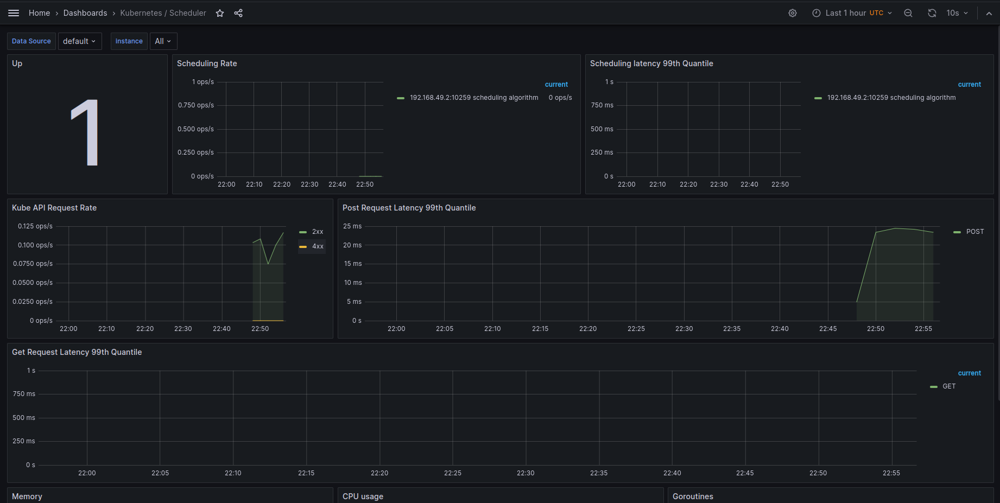

# Kube Prometheus Stack

The Kube Prometheus Stack is an approach for deploying the complete Prometheus stack in a Kubernetes cluster with ease. This stack is composed of several key components:

`Prometheus`: As the central piece, Prometheus takes on the role of the metrics collection engine. It gathers metrics from different agents, referred to as exporters, and stores these within its internal time-series database.
`Alertmanager`: This component plays a crucial role by managing alerts and notifications derived from the metrics that Prometheus collects. After receiving alerts from Prometheus, Alertmanager processes, removes duplicates, and forwards notifications to different receivers such as email, Slack, or PagerDuty.
`Grafana`: Grafana serves as the graphical user interface component offering a wide range of visualization and dashboarding options for the Prometheus-collected metrics. Grafana allows users to create and personalize dashboards, facilitating a visually pleasing and intuitive way to monitor and analyze metrics.
`Kubernetes-specific Exporters`: Included in the Kube Prometheus Stack are Kubernetes-specific exporters that essentially act as metrics collection agents. They gather metrics from a variety of Kubernetes components and resources, exposing these metrics through HTTP endpoints for Prometheus to scrape. kube-state-metrics is an example of a Kubernetes-specific exporter.

---

After installing Kube Prometheus stack, the output of `kubectl get po,sts,svc,pvc,cm` (split into parts with explanation):

**List of pods**

```
NAME                                                         READY   STATUS    RESTARTS        AGE
pod/alertmanager-prometheus-stack-kube-prom-alertmanager-0   2/2     Running   0               40m
pod/app-python-0                                             1/1     Running   1 (43m ago)     5h45m
pod/app-python-1                                             1/1     Running   1 (43m ago)     5h44m
pod/prometheus-prometheus-stack-kube-prom-prometheus-0       2/2     Running   0               40m
pod/prometheus-stack-grafana-59db77b87d-rb44m                3/3     Running   0               41m
pod/prometheus-stack-kube-prom-operator-5697ccf9f4-dmlnm     1/1     Running   0               41m
pod/prometheus-stack-kube-state-metrics-b67cd45df-d5q67      1/1     Running   0               41m
pod/prometheus-stack-prometheus-node-exporter-jz6sw          1/1     Running   0               41m
pod/vault-0                                                  1/1     Running   4 (4h18m ago)   14d
pod/vault-agent-injector-5cd8b87c6c-rhcdm                    1/1     Running   4 (4h18m ago)   14d
```

**List of statefulsets**
```
NAME                                                                    READY   AGE
statefulset.apps/alertmanager-prometheus-stack-kube-prom-alertmanager   1/1     40m
statefulset.apps/app-python                                             2/2     5h45m
statefulset.apps/prometheus-prometheus-stack-kube-prom-prometheus       1/1     40m
statefulset.apps/vault                                                  1/1     14d
```

**List if services**
```
NAME                                                TYPE           CLUSTER-IP       EXTERNAL-IP   PORT(S)                      AGE
service/alertmanager-operated                       ClusterIP      None             <none>        9093/TCP,9094/TCP,9094/UDP   40m
service/app-python                                  LoadBalancer   10.97.12.194     <pending>     5000:30398/TCP               5h45m
service/kubernetes                                  ClusterIP      10.96.0.1        <none>        443/TCP                      28d
service/prometheus-operated                         ClusterIP      None             <none>        9090/TCP                     40m
service/prometheus-stack-grafana                    ClusterIP      10.101.106.177   <none>        80/TCP                       41m
service/prometheus-stack-kube-prom-alertmanager     ClusterIP      10.101.218.141   <none>        9093/TCP,8080/TCP            41m
service/prometheus-stack-kube-prom-operator         ClusterIP      10.99.215.24     <none>        443/TCP                      41m
service/prometheus-stack-kube-prom-prometheus       ClusterIP      10.99.17.209     <none>        9090/TCP,8080/TCP            41m
service/prometheus-stack-kube-state-metrics         ClusterIP      10.97.115.51     <none>        8080/TCP                     41m
service/prometheus-stack-prometheus-node-exporter   ClusterIP      10.109.77.240    <none>        9100/TCP                     41m
service/vault                                       ClusterIP      10.103.249.137   <none>        8200/TCP,8201/TCP            14d
service/vault-agent-injector-svc                    ClusterIP      10.100.117.54    <none>        443/TCP                      14d
service/vault-internal                              ClusterIP      None             <none>        8200/TCP,8201/TCP            14d
```

**List of persistence storages**
```
NAME                                         STATUS   VOLUME                                     CAPACITY   ACCESS MODES   STORAGECLASS   AGE
persistentvolumeclaim/counter-app-python-0   Bound    pvc-4ea43ed5-947c-4dfd-941d-f32022879b03   10Mi       RWO            standard       25h
persistentvolumeclaim/counter-app-python-1   Bound    pvc-2a8cfc07-2563-4d6e-96b1-9e67e190d8d5   10Mi       RWO            standard       22h
```

**List of configmaps**
```
NAME                                                                     DATA   AGE
configmap/config-map                                                     1      5h45m
configmap/kube-root-ca.crt                                               1      28d
configmap/prometheus-prometheus-stack-kube-prom-prometheus-rulefiles-0   34     40m
configmap/prometheus-stack-grafana                                       1      41m
configmap/prometheus-stack-grafana-config-dashboards                     1      41m
configmap/prometheus-stack-kube-prom-alertmanager-overview               1      41m
configmap/prometheus-stack-kube-prom-apiserver                           1      41m
configmap/prometheus-stack-kube-prom-cluster-total                       1      41m
configmap/prometheus-stack-kube-prom-controller-manager                  1      41m
configmap/prometheus-stack-kube-prom-etcd                                1      41m
configmap/prometheus-stack-kube-prom-grafana-datasource                  1      41m
configmap/prometheus-stack-kube-prom-grafana-overview                    1      41m
configmap/prometheus-stack-kube-prom-k8s-coredns                         1      41m
configmap/prometheus-stack-kube-prom-k8s-resources-cluster               1      41m
configmap/prometheus-stack-kube-prom-k8s-resources-multicluster          1      41m
configmap/prometheus-stack-kube-prom-k8s-resources-namespace             1      41m
configmap/prometheus-stack-kube-prom-k8s-resources-node                  1      41m
configmap/prometheus-stack-kube-prom-k8s-resources-pod                   1      41m
configmap/prometheus-stack-kube-prom-k8s-resources-workload              1      41m
configmap/prometheus-stack-kube-prom-k8s-resources-workloads-namespace   1      41m
configmap/prometheus-stack-kube-prom-kubelet                             1      41m
configmap/prometheus-stack-kube-prom-namespace-by-pod                    1      41m
configmap/prometheus-stack-kube-prom-namespace-by-workload               1      41m
configmap/prometheus-stack-kube-prom-node-cluster-rsrc-use               1      41m
configmap/prometheus-stack-kube-prom-node-rsrc-use                       1      41m
configmap/prometheus-stack-kube-prom-nodes                               1      41m
configmap/prometheus-stack-kube-prom-nodes-darwin                        1      41m
configmap/prometheus-stack-kube-prom-persistentvolumesusage              1      41m
configmap/prometheus-stack-kube-prom-pod-total                           1      41m
configmap/prometheus-stack-kube-prom-prometheus                          1      41m
configmap/prometheus-stack-kube-prom-proxy                               1      41m
configmap/prometheus-stack-kube-prom-scheduler                           1      41m
configmap/prometheus-stack-kube-prom-workload-total                      1      41m
```

---

## Grafana Dashboards


**Check CPU and Memory consumption of your StatefulSet**


**Identify Pods with higher and lower CPU usage in the default namespace**


**Monitor node memory usage in percentage and megabytes**


**Evaluate network usage of Pods in the default namespace**


**Determine the number of active alerts; also check the Web UI with minikube service monitoring-kube-prometheus-alertmanager**



---

## Init Container

Output of `kubectl exec pod/app-python-0 -- cat /work-dir/index.html`:

```bash
Defaulted container "app-python" out of: app-python, install (init)
<html><head></head><body><header>
<title>http://info.cern.ch</title>
</header>

<h1>http://info.cern.ch - home of the first website</h1>
<p>From here you can:</p>
<ul>
<li><a href="http://info.cern.ch/hypertext/WWW/TheProject.html">Browse the first website</a></li>
<li><a href="http://line-mode.cern.ch/www/hypertext/WWW/TheProject.html">Browse the first website using the line-mode browser simulator</a></li>
<li><a href="http://home.web.cern.ch/topics/birth-web">Learn about the birth of the web</a></li>
<li><a href="http://home.web.cern.ch/about">Learn about CERN, the physics laboratory where the web was born</a></li>
</ul>
</body></html>
```