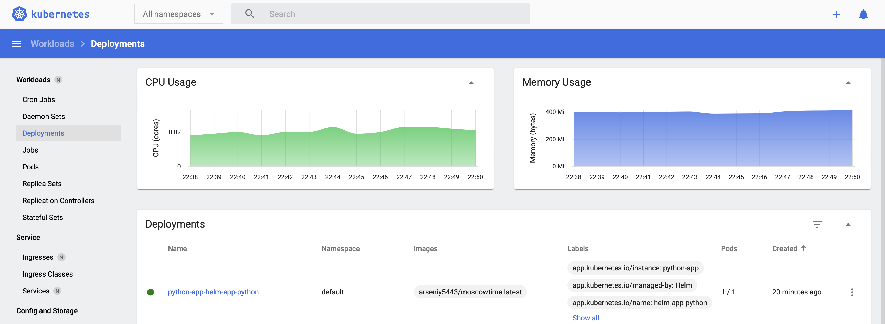

# Introduction to Helm
## Task 1
### Install helm
To install helm I run the following command:
```
brew install helm
```
To check the version:
```
helm version
```
Output:
```
version.BuildInfo{Version:"v3.13.1", GitCommit:"3547a4b5bf5edb5478ce352e18858d8a552a4110", GitTreeState:"clean", GoVersion:"go1.21.3"}
```
### Create Your Own Helm Chart
```
helm create helm-app-python
```
Then we check our chart:
```
helm lint helm-app-python
```

### Install Your Helm Chart
To check what will be installed by our custom helm chart:
```
helm install python-app ./helm-app-python --dry-run
```
Then install:
```
helm install python-app ./helm-app-python
```
To upgrade:
```
helm upgrade --install python-app ./helm-app-python
```
Output:
```
helm upgrade --install python-app ./helm-app-python
Release "python-app" has been upgraded. Happy Helming!
NAME: python-app
LAST DEPLOYED: Mon Nov  6 22:34:53 2023
NAMESPACE: default
STATUS: deployed
REVISION: 2
NOTES:
1. Get the application URL by running these commands:
  export POD_NAME=$(kubectl get pods --namespace default -l "app.kubernetes.io/name=helm-app-python,app.kubernetes.io/instance=python-app" -o jsonpath="{.items[0].metadata.name}")
  export CONTAINER_PORT=$(kubectl get pod --namespace default $POD_NAME -o jsonpath="{.spec.containers[0].ports[0].containerPort}")
  echo "Visit http://127.0.0.1:8080 to use your application"
  kubectl --namespace default port-forward $POD_NAME 8080:$CONTAINER_PORT
```

Workloads:


### Access Your Application
Using command:
```
minikube service python-app-helm-app-python
```
Output:
```
|-----------|----------------------------|-------------|--------------|
| NAMESPACE |            NAME            | TARGET PORT |     URL      |
|-----------|----------------------------|-------------|--------------|
| default   | python-app-helm-app-python |             | No node port |
|-----------|----------------------------|-------------|--------------|
😿  service default/python-app-helm-app-python has no node port
🏃  Starting tunnel for service python-app-helm-app-python.
|-----------|----------------------------|-------------|------------------------|
| NAMESPACE |            NAME            | TARGET PORT |          URL           |
|-----------|----------------------------|-------------|------------------------|
| default   | python-app-helm-app-python |             | http://127.0.0.1:61805 |
|-----------|----------------------------|-------------|------------------------|
🎉  Opening service default/python-app-helm-app-python in default browser...
❗  Because you are using a Docker driver on darwin, the terminal needs to be open to run it.
```

### Create a HELM.md File
Created HELM.MD.
Using command:
```
kubectl get pods,svc
```
Output:
```
NAME                                              READY   STATUS    RESTARTS   AGE
pod/python-app-helm-app-python-5d989f5d56-6gm94   1/1     Running   0          21m

NAME                                 TYPE        CLUSTER-IP     EXTERNAL-IP   PORT(S)    AGE
service/kubernetes                   ClusterIP   10.96.0.1      <none>        443/TCP    6d23h
service/python-app-helm-app-python   ClusterIP   10.102.23.60   <none>        5000/TCP   23m
```

### Uninstall app
With command:
```
helm uninstall python-app
```

## Task 2

### Troubleshoot Hooks
Command:
```
helm lint ./helm-app-python
```
Output:
```
==> Linting ./helm-app-python
[INFO] Chart.yaml: icon is recommended

1 chart(s) linted, 0 chart(s) failed
```
Command:
```
helm install helm-hooks ./helm-app-python --dry-run
helm install helm-hooks ./helm-app-python
```
Output:
```
NAME: helm-hooks
LAST DEPLOYED: Mon Nov  6 23:14:20 2023
NAMESPACE: default
STATUS: pending-install
REVISION: 1
HOOKS:
---
# Source: helm-app-python/templates/post-install-hook.yaml
apiVersion: v1
kind: Pod
metadata:
   name: postinstall-hook
   annotations:
       "helm.sh/hook": "post-install"
spec:
  containers:
  - name: post-install-container
    image: busybox
    imagePullPolicy: Always
    command: ['sh', '-c', 'echo The post-install hook is running && sleep 15' ]
  restartPolicy: Never
  terminationGracePeriodSeconds: 0
---
# Source: helm-app-python/templates/pre-install-hook.yaml
apiVersion: v1
kind: Pod
metadata:
   name: preinstall-hook
   annotations:
       "helm.sh/hook": "pre-install"
spec:
  containers:
  - name: pre-install-container
    image: busybox
    imagePullPolicy: IfNotPresent
    command: ['sh', '-c', 'echo The pre-install hook is running && sleep 20' ]
  restartPolicy: Never
  terminationGracePeriodSeconds: 0
---
# Source: helm-app-python/templates/tests/test-connection.yaml
apiVersion: v1
kind: Pod
metadata:
  name: "helm-hooks-helm-app-python-test-connection"
  labels:
    helm.sh/chart: helm-app-python-0.1.0
    app.kubernetes.io/name: helm-app-python
    app.kubernetes.io/instance: helm-hooks
    app.kubernetes.io/version: "1.16.0"
    app.kubernetes.io/managed-by: Helm
  annotations:
    "helm.sh/hook": test
spec:
  containers:
    - name: wget
      image: busybox
      command: ['wget']
      args: ['helm-hooks-helm-app-python:5000']
  restartPolicy: Never
MANIFEST:
---
# Source: helm-app-python/templates/serviceaccount.yaml
apiVersion: v1
kind: ServiceAccount
metadata:
  name: helm-hooks-helm-app-python
  labels:
    helm.sh/chart: helm-app-python-0.1.0
    app.kubernetes.io/name: helm-app-python
    app.kubernetes.io/instance: helm-hooks
    app.kubernetes.io/version: "1.16.0"
    app.kubernetes.io/managed-by: Helm
automountServiceAccountToken: true
---
# Source: helm-app-python/templates/service.yaml
apiVersion: v1
kind: Service
metadata:
  name: helm-hooks-helm-app-python
  labels:
    helm.sh/chart: helm-app-python-0.1.0
    app.kubernetes.io/name: helm-app-python
    app.kubernetes.io/instance: helm-hooks
    app.kubernetes.io/version: "1.16.0"
    app.kubernetes.io/managed-by: Helm
spec:
  type: ClusterIP
  ports:
    - port: 5000
      targetPort: http
      protocol: TCP
      name: http
  selector:
    app.kubernetes.io/name: helm-app-python
    app.kubernetes.io/instance: helm-hooks
---
# Source: helm-app-python/templates/deployment.yaml
apiVersion: apps/v1
kind: Deployment
metadata:
  name: helm-hooks-helm-app-python
  labels:
    helm.sh/chart: helm-app-python-0.1.0
    app.kubernetes.io/name: helm-app-python
    app.kubernetes.io/instance: helm-hooks
    app.kubernetes.io/version: "1.16.0"
    app.kubernetes.io/managed-by: Helm
spec:
  replicas: 1
  selector:
    matchLabels:
      app.kubernetes.io/name: helm-app-python
      app.kubernetes.io/instance: helm-hooks
  template:
    metadata:
      labels:
        helm.sh/chart: helm-app-python-0.1.0
        app.kubernetes.io/name: helm-app-python
        app.kubernetes.io/instance: helm-hooks
        app.kubernetes.io/version: "1.16.0"
        app.kubernetes.io/managed-by: Helm
    spec:
      serviceAccountName: helm-hooks-helm-app-python
      securityContext:
        {}
      containers:
        - name: helm-app-python
          securityContext:
            {}
          image: "arseniy5443/moscowtime:latest"
          imagePullPolicy: IfNotPresent
          ports:
            - name: http
              containerPort: 5000
              protocol: TCP
          livenessProbe:
            httpGet:
              path: /
              port: http
          readinessProbe:
            httpGet:
              path: /
              port: http
          resources:
            {}

NOTES:
1. Get the application URL by running these commands:
  export POD_NAME=$(kubectl get pods --namespace default -l "app.kubernetes.io/name=helm-app-python,app.kubernetes.io/instance=helm-hooks" -o jsonpath="{.items[0].metadata.name}")
  export CONTAINER_PORT=$(kubectl get pod --namespace default $POD_NAME -o jsonpath="{.spec.containers[0].ports[0].containerPort}")
  echo "Visit http://127.0.0.1:8080 to use your application"
  kubectl --namespace default port-forward $POD_NAME 8080:$CONTAINER_PORT
```

Command:
```
kubectl get po
```
Output:
```
NAME                                          READY   STATUS      RESTARTS   AGE
helm-hooks-helm-app-python-5fb9564bbf-kx47w   1/1     Running     0          30s
postinstall-hook                              0/1     Completed   0          30s
preinstall-hook                               0/1     Completed   0          64s
```

### Provide Output

Command:
```
kubectl get po
```
Output:
```
NAME                                          READY   STATUS      RESTARTS   AGE
helm-hooks-helm-app-python-5fb9564bbf-kx47w   1/1     Running     0          30s
postinstall-hook                              0/1     Completed   0          30s
preinstall-hook                               0/1     Completed   0          64s
```

Command:
```
kubectl describe po preinstall-hook
```
Output:
```
Name:             preinstall-hook
Namespace:        default
Priority:         0
Service Account:  default
Node:             minikube/192.168.49.2
Start Time:       Mon, 06 Nov 2023 23:16:35 +0300
Labels:           <none>
Annotations:      helm.sh/hook: pre-install
Status:           Succeeded
IP:               10.244.0.59
IPs:
  IP:  10.244.0.59
Containers:
  pre-install-container:
    Container ID:  docker://9fa71979dd8278d505e3ffe21b4cba2d5f02b9b24c719f89bc0ccf2390e93e41
    Image:         busybox
    Image ID:      docker-pullable://busybox@sha256:3fbc632167424a6d997e74f52b878d7cc478225cffac6bc977eedfe51c7f4e79
    Port:          <none>
    Host Port:     <none>
    Command:
      sh
      -c
      echo The pre-install hook is running && sleep 20
    State:          Terminated
      Reason:       Completed
      Exit Code:    0
      Started:      Mon, 06 Nov 2023 23:16:48 +0300
      Finished:     Mon, 06 Nov 2023 23:17:08 +0300
    Ready:          False
    Restart Count:  0
    Environment:    <none>
    Mounts:
      /var/run/secrets/kubernetes.io/serviceaccount from kube-api-access-fdmgk (ro)
Conditions:
  Type              Status
  Initialized       True 
  Ready             False 
  ContainersReady   False 
  PodScheduled      True 
Volumes:
  kube-api-access-fdmgk:
    Type:                    Projected (a volume that contains injected data from multiple sources)
    TokenExpirationSeconds:  3607
    ConfigMapName:           kube-root-ca.crt
    ConfigMapOptional:       <nil>
    DownwardAPI:             true
QoS Class:                   BestEffort
Node-Selectors:              <none>
Tolerations:                 node.kubernetes.io/not-ready:NoExecute op=Exists for 300s
                             node.kubernetes.io/unreachable:NoExecute op=Exists for 300s
Events:
  Type    Reason     Age    From               Message
  ----    ------     ----   ----               -------
  Normal  Scheduled  3m14s  default-scheduler  Successfully assigned default/preinstall-hook to minikube
  Normal  Pulling    3m13s  kubelet            Pulling image "busybox"
  Normal  Pulled     3m1s   kubelet            Successfully pulled image "busybox" in 11.766097214s (11.766107839s including waiting)
  Normal  Created    3m1s   kubelet            Created container pre-install-container
  Normal  Started    3m1s   kubelet            Started container pre-install-container
```

Command:
```
kubectl describe po postinstall-hook
```
Output:
```
Name:             postinstall-hook
Namespace:        default
Priority:         0
Service Account:  default
Node:             minikube/192.168.49.2
Start Time:       Mon, 06 Nov 2023 23:17:09 +0300
Labels:           <none>
Annotations:      helm.sh/hook: post-install
Status:           Succeeded
IP:               10.244.0.61
IPs:
  IP:  10.244.0.61
Containers:
  post-install-container:
    Container ID:  docker://6e93e87cacfa967ac8cb24348525294ec1c27a3a1feaa7dea278d9e3f3139dc5
    Image:         busybox
    Image ID:      docker-pullable://busybox@sha256:3fbc632167424a6d997e74f52b878d7cc478225cffac6bc977eedfe51c7f4e79
    Port:          <none>
    Host Port:     <none>
    Command:
      sh
      -c
      echo The post-install hook is running && sleep 15
    State:          Terminated
      Reason:       Completed
      Exit Code:    0
      Started:      Mon, 06 Nov 2023 23:17:13 +0300
      Finished:     Mon, 06 Nov 2023 23:17:28 +0300
    Ready:          False
    Restart Count:  0
    Environment:    <none>
    Mounts:
      /var/run/secrets/kubernetes.io/serviceaccount from kube-api-access-84pw7 (ro)
Conditions:
  Type              Status
  Initialized       True 
  Ready             False 
  ContainersReady   False 
  PodScheduled      True 
Volumes:
  kube-api-access-84pw7:
    Type:                    Projected (a volume that contains injected data from multiple sources)
    TokenExpirationSeconds:  3607
    ConfigMapName:           kube-root-ca.crt
    ConfigMapOptional:       <nil>
    DownwardAPI:             true
QoS Class:                   BestEffort
Node-Selectors:              <none>
Tolerations:                 node.kubernetes.io/not-ready:NoExecute op=Exists for 300s
                             node.kubernetes.io/unreachable:NoExecute op=Exists for 300s
Events:
  Type    Reason     Age    From               Message
  ----    ------     ----   ----               -------
  Normal  Scheduled  3m16s  default-scheduler  Successfully assigned default/postinstall-hook to minikube
  Normal  Pulling    3m16s  kubelet            Pulling image "busybox"
  Normal  Pulled     3m12s  kubelet            Successfully pulled image "busybox" in 3.819763377s (3.819790794s including waiting)
  Normal  Created    3m12s  kubelet            Created container post-install-container
  Normal  Started    3m12s  kubelet            Started container post-install-container
```

### Hook Delete Policy
Added to pre and post hooks:
```
"helm.sh/hook-delete-policy": hook-succeeded, hook-failed
```

## Bonus task

### Helm Chart for Extra App
Prepared.

### Create a Library Chart
Created.

