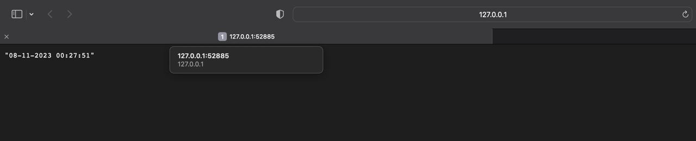
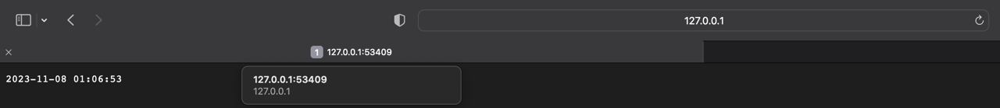

# HELM

## Task 1
#### Uploading chart to Kubernetes
```
helm install helm-app helm-app                                          
```

```
NAME: helm-app
LAST DEPLOYED: Wed Nov  8 00:24:55 2023
NAMESPACE: default
STATUS: deployed
REVISION: 1
NOTES:
1. Get the application URL by running these commands:
  export NODE_PORT=$(kubectl get --namespace default -o jsonpath="{.spec.ports[0].nodePort}" services helm-app)
  export NODE_IP=$(kubectl get nodes --namespace default -o jsonpath="{.items[0].status.addresses[0].address}")
  echo http://$NODE_IP:$NODE_PORT
```

----
#### Listing releases of charts
```
helm ls
```

```
NAME    	NAMESPACE	REVISION	UPDATED                             	STATUS  	CHART         	APP VERSION
helm-app	default  	1       	2023-11-08 00:24:55.313736 +0300 MSK	deployed	helm-app-0.1.0	1.16.0
```


----

```
kubectl get pods,svc
```

```
NAME                              READY   STATUS    RESTARTS       AGE
pod/app-python-dbfc8f6b4-5gsbm    1/1     Running   1 (8m7s ago)   6d21h
pod/go-app-58b7c44d98-6dl5n       1/1     Running   1 (8m7s ago)   6d21h
pod/go-app-58b7c44d98-g5rl9       1/1     Running   1 (8m7s ago)   6d21h
pod/go-app-58b7c44d98-tvwhs       1/1     Running   1 (8m7s ago)   6d21h
pod/helm-app-674c8f757d-bd6fl     1/1     Running   0              98s
pod/python-app-84c9748db8-btxx8   1/1     Running   1 (8m7s ago)   6d21h
pod/python-app-84c9748db8-f2k6v   1/1     Running   1 (8m7s ago)   6d21h
pod/python-app-84c9748db8-nptck   1/1     Running   1 (8m7s ago)   6d21h

NAME                 TYPE        CLUSTER-IP       EXTERNAL-IP   PORT(S)          AGE
service/go-app       NodePort    10.108.176.231   <none>        9000:32732/TCP   6d21h
service/helm-app     NodePort    10.100.185.198   <none>        8000:31173/TCP   98s
service/kubernetes   ClusterIP   10.96.0.1        <none>        443/TCP          6d22h
service/python-app   NodePort    10.96.121.224    <none>        8000:32713/TCP   6d21h
```

----

#### Application is accessible by running the minikube service helm-app command.

```
minikube service helm-app
```

```
|-----------|----------|-------------|---------------------------|
| NAMESPACE |   NAME   | TARGET PORT |            URL            |
|-----------|----------|-------------|---------------------------|
| default   | helm-app | http/8000   | http://192.168.49.2:31173 |
|-----------|----------|-------------|---------------------------|
🏃  Starting tunnel for service helm-app.
|-----------|----------|-------------|------------------------|
| NAMESPACE |   NAME   | TARGET PORT |          URL           |
|-----------|----------|-------------|------------------------|
| default   | helm-app |             | http://127.0.0.1:52885 |
|-----------|----------|-------------|------------------------|
🎉  Opening service default/helm-app in default browser...
```




## Task 2
### Commands output
```
helm lint helm-app
```

```
==> Linting helm-app
[INFO] Chart.yaml: icon is recommended

1 chart(s) linted, 0 chart(s) failed
```

----
```
kubectl get po
```

```
NAME                                   READY   STATUS      RESTARTS      AGE
app-python-dbfc8f6b4-5gsbm             1/1     Running     1 (36m ago)   6d22h
go-app-58b7c44d98-6dl5n                1/1     Running     1 (36m ago)   6d22h
go-app-58b7c44d98-g5rl9                1/1     Running     1 (36m ago)   6d22h
go-app-58b7c44d98-tvwhs                1/1     Running     1 (36m ago)   6d22h
helm-app-674c8f757d-bd6fl              1/1     Running     0             29m
helm-hooks-helm-app-8644f659d9-vr7df   1/1     Running     0             27s
postinstall-hook                       0/1     Completed   0             27s
preinstall-hook                        0/1     Completed   0             49s
python-app-84c9748db8-btxx8            1/1     Running     1 (36m ago)   6d22h
python-app-84c9748db8-f2k6v            1/1     Running     1 (36m ago)   6d22h
python-app-84c9748db8-nptck            1/1     Running     1 (36m ago)   6d22h
```

----

```
kubectl describe po preinstall-hook
```

```
Name:             preinstall-hook
Namespace:        default
Priority:         0
Service Account:  default
Node:             minikube/192.168.49.2
Start Time:       Wed, 08 Nov 2023 00:53:40 +0300
Labels:           <none>
Annotations:      helm.sh/hook: pre-install
Status:           Succeeded
IP:               10.244.0.26
IPs:
  IP:  10.244.0.26
Containers:
  pre-install-container:
    Container ID:  docker://600988d63b3107d79ee09eb10feca0a46ffd2610ad6a9d215c81425501b303a4
    Image:         busybox
    Image ID:      docker-pullable://busybox@sha256:3fbc632167424a6d997e74f52b878d7cc478225cffac6bc977eedfe51c7f4e79
    Port:          <none>
    Host Port:     <none>
    Command:
      sh
      -c
      echo The pre-install hook is running && sleep 20
    State:          Terminated
      Reason:       Completed
      Exit Code:    0
      Started:      Wed, 08 Nov 2023 00:53:40 +0300
      Finished:     Wed, 08 Nov 2023 00:54:00 +0300
    Ready:          False
    Restart Count:  0
    Environment:    <none>
    Mounts:
      /var/run/secrets/kubernetes.io/serviceaccount from kube-api-access-t5pjx (ro)
Conditions:
  Type              Status
  Initialized       True
  Ready             False
  ContainersReady   False
  PodScheduled      True
Volumes:
  kube-api-access-t5pjx:
    Type:                    Projected (a volume that contains injected data from multiple sources)
    TokenExpirationSeconds:  3607
    ConfigMapName:           kube-root-ca.crt
    ConfigMapOptional:       <nil>
    DownwardAPI:             true
QoS Class:                   BestEffort
Node-Selectors:              <none>
Tolerations:                 node.kubernetes.io/not-ready:NoExecute op=Exists for 300s
                             node.kubernetes.io/unreachable:NoExecute op=Exists for 300s
Events:
  Type    Reason     Age   From               Message
  ----    ------     ----  ----               -------
  Normal  Scheduled  81s   default-scheduler  Successfully assigned default/preinstall-hook to minikube
  Normal  Pulled     81s   kubelet            Container image "busybox" already present on machine
  Normal  Created    81s   kubelet            Created container pre-install-container
  Normal  Started    81s   kubelet            Started container pre-install-container
```

----

```
kubectl describe po postinstall-hook
```

```
Name:             postinstall-hook
Namespace:        default
Priority:         0
Service Account:  default
Node:             minikube/192.168.49.2
Start Time:       Wed, 08 Nov 2023 00:54:02 +0300
Labels:           <none>
Annotations:      helm.sh/hook: post-install
Status:           Succeeded
IP:               10.244.0.28
IPs:
  IP:  10.244.0.28
Containers:
  post-install-container:
    Container ID:  docker://52726d9df20b5743458108e1b179fb8cd064ba86cb43831f252b6855c3e57297
    Image:         busybox
    Image ID:      docker-pullable://busybox@sha256:3fbc632167424a6d997e74f52b878d7cc478225cffac6bc977eedfe51c7f4e79
    Port:          <none>
    Host Port:     <none>
    Command:
      sh
      -c
      echo The post-install hook is running && sleep 20
    State:          Terminated
      Reason:       Completed
      Exit Code:    0
      Started:      Wed, 08 Nov 2023 00:54:03 +0300
      Finished:     Wed, 08 Nov 2023 00:54:23 +0300
    Ready:          False
    Restart Count:  0
    Environment:    <none>
    Mounts:
      /var/run/secrets/kubernetes.io/serviceaccount from kube-api-access-fh5t8 (ro)
Conditions:
  Type              Status
  Initialized       True
  Ready             False
  ContainersReady   False
  PodScheduled      True
Volumes:
  kube-api-access-fh5t8:
    Type:                    Projected (a volume that contains injected data from multiple sources)
    TokenExpirationSeconds:  3607
    ConfigMapName:           kube-root-ca.crt
    ConfigMapOptional:       <nil>
    DownwardAPI:             true
QoS Class:                   BestEffort
Node-Selectors:              <none>
Tolerations:                 node.kubernetes.io/not-ready:NoExecute op=Exists for 300s
                             node.kubernetes.io/unreachable:NoExecute op=Exists for 300s
Events:
  Type    Reason     Age   From               Message
  ----    ------     ----  ----               -------
  Normal  Scheduled  111s  default-scheduler  Successfully assigned default/postinstall-hook to minikube
  Normal  Pulled     111s  kubelet            Container image "busybox" already present on machine
  Normal  Created    111s  kubelet            Created container post-install-container
  Normal  Started    111s  kubelet            Started container post-install-container
```

### Delete policy

I have used delete policy `"helm.sh hook-delete-policy": hook-succeeded` for (post|pre)-install-job. 

## Bonus

I have prepared new values for Go app.
So we can start Go app charts using the following command:
```
helm install helm-go-app helm-app --values helm-app/values.go.yaml
```

```
NAME: helm-go-app
LAST DEPLOYED: Wed Nov  8 01:04:07 2023
NAMESPACE: default
STATUS: deployed
REVISION: 1
NOTES:
1. Get the application URL by running these commands:
  export NODE_PORT=$(kubectl get --namespace default -o jsonpath="{.spec.ports[0].nodePort}" services helm-go-app-helm-app)
  export NODE_IP=$(kubectl get nodes --namespace default -o jsonpath="{.items[0].status.addresses[0].address}")
  echo http://$NODE_IP:$NODE_PORT
```
---

```
kubectl get pods,svc
```

```
NAME                                        READY   STATUS    RESTARTS      AGE
pod/app-python-dbfc8f6b4-5gsbm              1/1     Running   1 (46m ago)   6d22h
pod/go-app-58b7c44d98-6dl5n                 1/1     Running   1 (46m ago)   6d22h
pod/go-app-58b7c44d98-g5rl9                 1/1     Running   1 (46m ago)   6d22h
pod/go-app-58b7c44d98-tvwhs                 1/1     Running   1 (46m ago)   6d22h
pod/helm-app-674c8f757d-bd6fl               1/1     Running   0             40m
pod/helm-go-app-helm-app-6cbcbcc9c9-kzhp6   1/1     Running   0             54s
pod/python-app-84c9748db8-btxx8             1/1     Running   1 (46m ago)   6d22h
pod/python-app-84c9748db8-f2k6v             1/1     Running   1 (46m ago)   6d22h
pod/python-app-84c9748db8-nptck             1/1     Running   1 (46m ago)   6d22h

NAME                           TYPE        CLUSTER-IP       EXTERNAL-IP   PORT(S)          AGE
service/go-app                 NodePort    10.108.176.231   <none>        9000:32732/TCP   6d22h
service/helm-app               NodePort    10.100.185.198   <none>        8000:31173/TCP   40m
service/helm-go-app-helm-app   NodePort    10.100.81.117    <none>        9000:32482/TCP   54s
service/kubernetes             ClusterIP   10.96.0.1        <none>        443/TCP          6d23h
service/python-app             NodePort    10.96.121.224    <none>        8000:32713/TCP   6d22h
```


---

#### Application is accessible by running the minikube service helm-app command.

```
minikube service helm-go-app-helm-app
```

```
|-----------|----------------------|-------------|---------------------------|
| NAMESPACE |         NAME         | TARGET PORT |            URL            |
|-----------|----------------------|-------------|---------------------------|
| default   | helm-go-app-helm-app | http/9000   | http://192.168.49.2:32482 |
|-----------|----------------------|-------------|---------------------------|
🏃  Starting tunnel for service helm-go-app-helm-app.
|-----------|----------------------|-------------|------------------------|
| NAMESPACE |         NAME         | TARGET PORT |          URL           |
|-----------|----------------------|-------------|------------------------|
| default   | helm-go-app-helm-app |             | http://127.0.0.1:53409 |
|-----------|----------------------|-------------|------------------------|
🎉  Opening service default/helm-go-app-helm-app in default browser...
```




### Helm Library Charts

`/templates/deployment.yaml` was updated

```
helm dependency update helm-app
```

```
Saving 1 charts
Deleting outdated charts
```