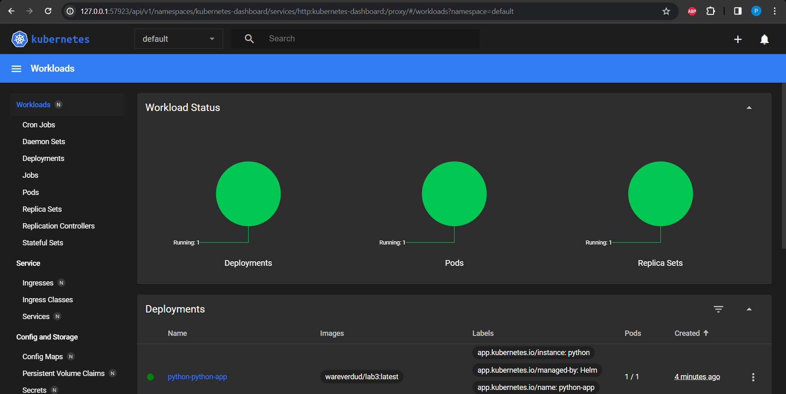

# Helm

## Task 1

helm install python python-app/

```sh
kubectl get pods,svc
NAME                        TYPE           CLUSTER-IP       EXTERNAL-IP   PORT(S)          AGE
service/kubernetes          ClusterIP      10.96.0.1        <none>        443/TCP          2m35s
service/python-python-app   LoadBalancer   10.105.122.125   <pending>     8000:32717/TCP   23s

NAME                                     READY   STATUS    RESTARTS   AGE
pod/python-python-app-6f99dc7695-xfrjr   1/1     Running   0          23s
```

```sh
minikube service --all
|-----------|------------|-------------|--------------|
| NAMESPACE |    NAME    | TARGET PORT |     URL      |
|-----------|------------|-------------|--------------|
| default   | kubernetes |             | No node port |
|-----------|------------|-------------|--------------|
😿  service default/kubernetes has no node port
|-----------|-------------------|-------------|---------------------------|
| NAMESPACE |       NAME        | TARGET PORT |            URL            |
|-----------|-------------------|-------------|---------------------------|
| default   | python-python-app | http/8000   | http://192.168.49.2:32717 |
|-----------|-------------------|-------------|---------------------------|
🏃  Starting tunnel for service kubernetes.
🏃  Starting tunnel for service python-python-app.
|-----------|-------------------|-------------|------------------------|
| NAMESPACE |       NAME        | TARGET PORT |          URL           |
|-----------|-------------------|-------------|------------------------|
| default   | kubernetes        |             | http://127.0.0.1:57692 |
| default   | python-python-app |             | http://127.0.0.1:57693 |
|-----------|-------------------|-------------|------------------------|
🎉  Opening service default/kubernetes in default browser...
🎉  Opening service default/python-python-app in default browser...
❗  Because you are using a Docker driver on windows, the terminal needs to be open to run it.
```



## Task 2


```sh
kubectl get pods,svc
NAME                                     READY   STATUS      RESTARTS   AGE
pod/postinstall-hook                     0/1     Completed   0          4m
pod/preinstall-hook                      0/1     Completed   0          4m27s
pod/python-python-app-6f99dc7695-rjjxg   1/1     Running     0          4m

NAME                        TYPE           CLUSTER-IP       EXTERNAL-IP   PORT(S)          AGE
service/kubernetes          ClusterIP      10.96.0.1        <none>        443/TCP          7m6s
service/python-python-app   LoadBalancer   10.108.176.246   <pending>     8000:30616/TCP   4m
```

```sh
kubectl get po
NAME                                 READY   STATUS      RESTARTS   AGE
postinstall-hook                     0/1     Completed   0          2m15s
preinstall-hook                      0/1     Completed   0          2m42s
python-python-app-6f99dc7695-rjjxg   1/1     Running     0          2m15s
```

```sh
kubectl describe po preinstall-hook
Name:             preinstall-hook
Namespace:        default
Priority:         0
Service Account:  default
Node:             minikube/192.168.49.2
Start Time:       Wed, 08 Nov 2023 20:51:49 +0300
Labels:           <none>
Annotations:      helm.sh/hook: pre-install
Status:           Succeeded
IP:               10.244.0.6
IPs:
  IP:  10.244.0.6
Containers:
  pre-install-container:
    Container ID:  docker://099f6cdff6873602cd412e02eb6538dbbd0af980b1f508f9447ddccea6faf5fb
    Image:         busybox
    Image ID:      docker-pullable://busybox@sha256:3fbc632167424a6d997e74f52b878d7cc478225cffac6bc977eedfe51c7f4e79
    Port:          <none>
    Host Port:     <none>
    Command:
      sh
      -c
      echo The pre-install hook is running && sleep 20
    State:          Terminated
      Reason:       Completed
      Exit Code:    0
      Started:      Wed, 08 Nov 2023 20:51:54 +0300
      Finished:     Wed, 08 Nov 2023 20:52:14 +0300
    Ready:          False
    Restart Count:  0
    Environment:    <none>
    Mounts:
      /var/run/secrets/kubernetes.io/serviceaccount from kube-api-access-swm6c (ro)
Conditions:
  Type              Status
  Initialized       True
  Ready             False
  ContainersReady   False
  PodScheduled      True
  kube-api-access-swm6c:
    Type:                    Projected (a volume that contains injected data from multiple sources)
    TokenExpirationSeconds:  3607
    ConfigMapName:           kube-root-ca.crt
    ConfigMapOptional:       <nil>
    DownwardAPI:             true
QoS Class:                   BestEffort
Node-Selectors:              <none>
Tolerations:                 node.kubernetes.io/not-ready:NoExecute op=Exists for 300s
                             node.kubernetes.io/unreachable:NoExecute op=Exists for 300s
Events:
  Type    Reason     Age    From               Message
  ----    ------     ----   ----               -------
  Normal  Scheduled  3m35s  default-scheduler  Successfully assigned default/preinstall-hook to minikube
  Normal  Pulling    3m34s  kubelet            Pulling image "busybox"
  Normal  Pulled     3m30s  kubelet            Successfully pulled image "busybox" in 3.958931436s (3.958944271s including waiting)
  Normal  Created    3m30s  kubelet            Created container pre-install-container
  Normal  Started    3m30s  kubelet            Started container pre-install-container
```

```sh
kubectl describe po postinstall-hook
Name:             postinstall-hook
Namespace:        default
Priority:         0
Service Account:  default
Node:             minikube/192.168.49.2
Start Time:       Wed, 08 Nov 2023 20:52:16 +0300
Labels:           <none>
Annotations:      helm.sh/hook: post-install
Status:           Succeeded
IP:               10.244.0.8
IPs:
  IP:  10.244.0.8
Containers:
  post-install-container:
    Container ID:  docker://0476e313623cd282a40b1b6e166f913a1c840549137e04034a95ced3f83063de
    Image:         busybox
    Image ID:      docker-pullable://busybox@sha256:3fbc632167424a6d997e74f52b878d7cc478225cffac6bc977eedfe51c7f4e79
    Port:          <none>
    Host Port:     <none>
    Command:
      sh
      -c
      echo The post-install hook is running && sleep 15
    State:          Terminated
      Reason:       Completed
      Exit Code:    0
      Started:      Wed, 08 Nov 2023 20:52:19 +0300
      Finished:     Wed, 08 Nov 2023 20:52:34 +0300
    Ready:          False
    Restart Count:  0
    Environment:    <none>
    Mounts:
      /var/run/secrets/kubernetes.io/serviceaccount from kube-api-access-sd9hl (ro)
Conditions:
  Type              Status
  Initialized       True
  Ready             False
  ContainersReady   False
  PodScheduled      True
  kube-api-access-sd9hl:
    Type:                    Projected (a volume that contains injected data from multiple sources)
    TokenExpirationSeconds:  3607
    ConfigMapName:           kube-root-ca.crt
    ConfigMapOptional:       <nil>
    DownwardAPI:             true
QoS Class:                   BestEffort
Node-Selectors:              <none>
Tolerations:                 node.kubernetes.io/not-ready:NoExecute op=Exists for 300s
                             node.kubernetes.io/unreachable:NoExecute op=Exists for 300s
Events:
  Type    Reason     Age    From               Message
  ----    ------     ----   ----               -------
  Normal  Scheduled  3m33s  default-scheduler  Successfully assigned default/postinstall-hook to minikube
  Normal  Pulling    3m32s  kubelet            Pulling image "busybox"
  Normal  Pulled     3m30s  kubelet            Successfully pulled image "busybox" in 1.546376217s (1.546388481s including waiting)
  Normal  Created    3m30s  kubelet            Created container post-install-container
  Normal  Started    3m30s  kubelet            Started container post-install-container
```
