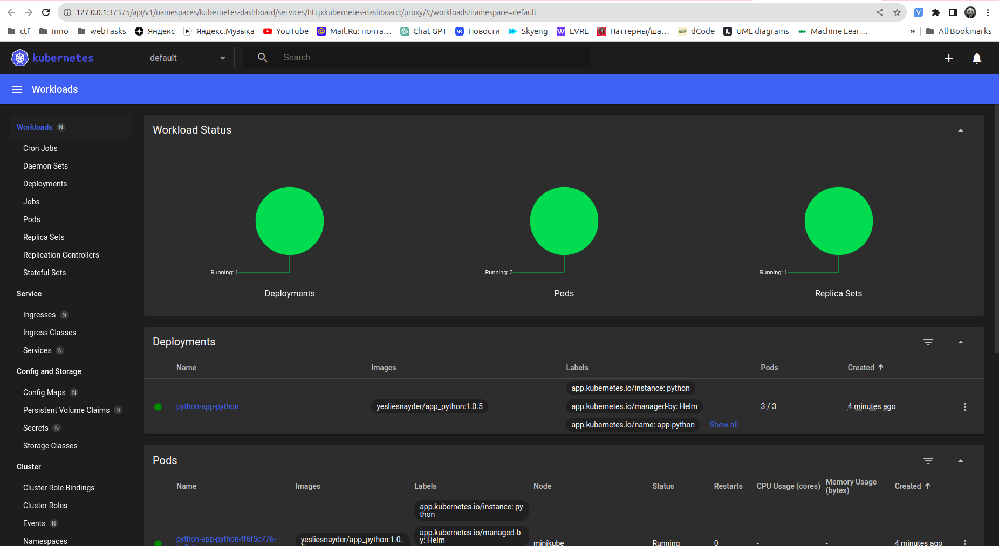
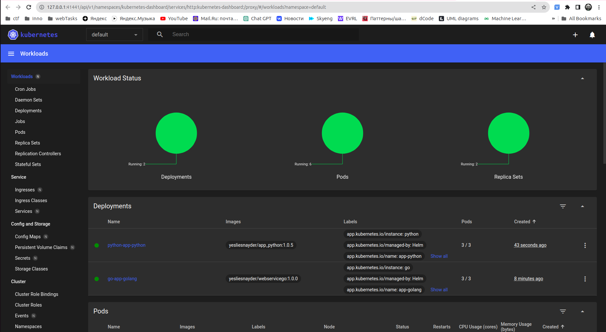

# Helm charts

## App python

1. **Create helm chart**

    ```shell
    helm create app-python
    ```
    
    Then change image in `values.yaml` file to download image of the app_python application.
    Change service parameters and enable ingress.

1. **Install Helm chart**

    ```shell
    helm install python app-python/
    ```
    ```text
    NAME: python
    LAST DEPLOYED: Sat Nov  4 16:01:48 2023
    NAMESPACE: default
    STATUS: deployed
    REVISION: 1
    NOTES:
    1. Get the application URL by running these commands:
      http://app-python/
    ```
   
1. **Check service availability**

    ```shell
    kubectl get pods,svc
    ```
    ```text
    NAME                                    READY   STATUS    RESTARTS   AGE
    pod/python-app-python-ff6f5c776-bx8pl   1/1     Running   0          2m35s
    pod/python-app-python-ff6f5c776-dk68b   1/1     Running   0          2m35s
    pod/python-app-python-ff6f5c776-zf6rc   1/1     Running   0          2m35s
    
    NAME                        TYPE           CLUSTER-IP      EXTERNAL-IP   PORT(S)          AGE
    service/kubernetes          ClusterIP      10.96.0.1       <none>        443/TCP          13d
    service/python-app-python   LoadBalancer   10.99.167.222   <pending>     8000:30650/TCP   2m35s
    ```
    
    And check service from minikube: `minikube service python-app-python`
    
    ```text
    |-----------|-------------------|-------------|---------------------------|
    | NAMESPACE |       NAME        | TARGET PORT |            URL            |
    |-----------|-------------------|-------------|---------------------------|
    | default   | python-app-python | http/8000   | http://192.168.49.2:30650 |
    |-----------|-------------------|-------------|---------------------------|
    🎉  Opening service default/python-app-python in default browser...
    ```
   
## App golang

1. **Installation**

   To install this application correctly, I changed liveness and readyness probes in `templates/deployment.yaml` file.
   
   ```shell
   helm install go app-golang/
   ```
   ```text
   NAME: go
   LAST DEPLOYED: Sun Nov  5 17:02:43 2023
   NAMESPACE: default
   STATUS: deployed
   REVISION: 1
   NOTES:
   1. Get the application URL by running these commands:
     http://app-golang/
   ```

1. **Check if it works**

   ```shell
   curl -H "Host: app-golang" 192.168.49.2/home
   ```
   ```text
   {"buildTime":"unset","commit":"unset","release":"unset"}
   ```

## Minikube dashboard

To check dashboard, run the command:
```shell
minikube dashboard
```

### App Python



### Both applications (App python, App golang)



## Helm Chart Hooks

I have 2 files inside `app-python/templates` directory that represent preinstall and postinstall hooks:
*pre-install-hook.yaml*, *post-install-hook.yaml*.

Both hooks just sleep some amount of time (default=10 seconds) before creation and after loading the resources into k8s.

### Troubleshoot Hooks

1. **Linter**

   ```shell
   helm lint app-python/
   ```
   ```text
   ==> Linting app-python/
   [INFO] Chart.yaml: icon is recommended
   
   1 chart(s) linted, 0 chart(s) failed
   ```
   
1. **Pods of helm hooks**

   First of all, let's start our chart `helm install python app-python/`.
   After that, we can check pods:

   ```shell
   kubectl get po
   ```
   ```text
   NAME                                READY   STATUS      RESTARTS   AGE
   python-app-python-ff6f5c776-bpkc9   1/1     Running     0          19s
   python-app-python-ff6f5c776-cwb4r   1/1     Running     0          19s
   python-app-python-ff6f5c776-npsfp   1/1     Running     0          19s
   python-post-install-w5t7d           0/1     Completed   0          19s
   python-pre-install-mfr6b            0/1     Completed   0          31s
   ```
   
   As we can see all hooks work correctly: just slept and completed.

1. **Describe preinstall hook**

   ```shell
   kubectl describe po python-pre-install
   ```
   ```text
   Name:             python-pre-install-mfr6b
   Namespace:        default
   Priority:         0
   Service Account:  default
   Node:             minikube/192.168.49.2
   Start Time:       Sun, 05 Nov 2023 16:33:51 +0300
   Labels:           app.kubernetes.io/instance=python
                     app.kubernetes.io/managed-by=Helm
                     batch.kubernetes.io/controller-uid=96d4047f-37c4-4e50-b371-5f8d76a5eaab
                     batch.kubernetes.io/job-name=python-pre-install
                     controller-uid=96d4047f-37c4-4e50-b371-5f8d76a5eaab
                     helm.sh/chart=app-python-0.1.0
                     job-name=python-pre-install
   Annotations:      <none>
   Status:           Succeeded
   IP:               10.244.0.58
   IPs:
     IP:           10.244.0.58
   Controlled By:  Job/python-pre-install
   Containers:
     pre-install-job:
       Container ID:  docker://bb3ff0234b5c6ff995413d08a4ba5bbbc5d5dc030b1bf0640dddef3f7c0c8b11
       Image:         busybox
       Image ID:      docker-pullable://busybox@sha256:3fbc632167424a6d997e74f52b878d7cc478225cffac6bc977eedfe51c7f4e79
       Port:          <none>
       Host Port:     <none>
       Command:
         sh
         -c
         echo The pre-install hook is running && sleep 5
       State:          Terminated
         Reason:       Completed
         Exit Code:    0
         Started:      Sun, 05 Nov 2023 16:33:54 +0300
         Finished:     Sun, 05 Nov 2023 16:33:59 +0300
       Ready:          False
       Restart Count:  0
       Environment:    <none>
       Mounts:
         /var/run/secrets/kubernetes.io/serviceaccount from kube-api-access-mspd6 (ro)
   Conditions:
     Type              Status
     Initialized       True 
     Ready             False 
     ContainersReady   False 
     PodScheduled      True 
   Volumes:
     kube-api-access-mspd6:
       Type:                    Projected (a volume that contains injected data from multiple sources)
       TokenExpirationSeconds:  3607
       ConfigMapName:           kube-root-ca.crt
       ConfigMapOptional:       <nil>
       DownwardAPI:             true
   QoS Class:                   BestEffort
   Node-Selectors:              <none>
   Tolerations:                 node.kubernetes.io/not-ready:NoExecute op=Exists for 300s
                                node.kubernetes.io/unreachable:NoExecute op=Exists for 300s
   Events:
     Type    Reason     Age    From               Message
     ----    ------     ----   ----               -------
     Normal  Scheduled  3m55s  default-scheduler  Successfully assigned default/python-pre-install-mfr6b to minikube
     Normal  Pulling    3m55s  kubelet            Pulling image "busybox"
     Normal  Pulled     3m53s  kubelet            Successfully pulled image "busybox" in 2.33875736s (2.338768418s including waiting)
     Normal  Created    3m53s  kubelet            Created container pre-install-job
     Normal  Started    3m53s  kubelet            Started container pre-install-job
   ```

1. **Describe postinstall hook**

   ```shell
   kubectl describe po python-post-install
   ```
   ```text
   Name:             python-post-install-w5t7d
   Namespace:        default
   Priority:         0
   Service Account:  default
   Node:             minikube/192.168.49.2
   Start Time:       Sun, 05 Nov 2023 16:34:03 +0300
   Labels:           app.kubernetes.io/instance=python
                     app.kubernetes.io/managed-by=Helm
                     batch.kubernetes.io/controller-uid=242ff093-b31b-45bd-b6ed-83e94f756277
                     batch.kubernetes.io/job-name=python-post-install
                     controller-uid=242ff093-b31b-45bd-b6ed-83e94f756277
                     helm.sh/chart=app-python-0.1.0
                     job-name=python-post-install
   Annotations:      <none>
   Status:           Succeeded
   IP:               10.244.0.62
   IPs:
     IP:           10.244.0.62
   Controlled By:  Job/python-post-install
   Containers:
     post-install-job:
       Container ID:  docker://1c3a6457dc484d1e3073927b9f70963d321de207fbe84a79fba2712501459416
       Image:         busybox
       Image ID:      docker-pullable://busybox@sha256:3fbc632167424a6d997e74f52b878d7cc478225cffac6bc977eedfe51c7f4e79
       Port:          <none>
       Host Port:     <none>
       Command:
         sh
         -c
         echo The post-install hook is running && sleep 5
       State:          Terminated
         Reason:       Completed
         Exit Code:    0
         Started:      Sun, 05 Nov 2023 16:34:05 +0300
         Finished:     Sun, 05 Nov 2023 16:34:10 +0300
       Ready:          False
       Restart Count:  0
       Environment:    <none>
       Mounts:
         /var/run/secrets/kubernetes.io/serviceaccount from kube-api-access-tqxq6 (ro)
   Conditions:
     Type              Status
     Initialized       True 
     Ready             False 
     ContainersReady   False 
     PodScheduled      True 
   Volumes:
     kube-api-access-tqxq6:
       Type:                    Projected (a volume that contains injected data from multiple sources)
       TokenExpirationSeconds:  3607
       ConfigMapName:           kube-root-ca.crt
       ConfigMapOptional:       <nil>
       DownwardAPI:             true
   QoS Class:                   BestEffort
   Node-Selectors:              <none>
   Tolerations:                 node.kubernetes.io/not-ready:NoExecute op=Exists for 300s
                                node.kubernetes.io/unreachable:NoExecute op=Exists for 300s
   Events:
     Type    Reason     Age    From               Message
     ----    ------     ----   ----               -------
     Normal  Scheduled  6m59s  default-scheduler  Successfully assigned default/python-post-install-w5t7d to minikube
     Normal  Pulling    6m59s  kubelet            Pulling image "busybox"
     Normal  Pulled     6m57s  kubelet            Successfully pulled image "busybox" in 1.966357395s (1.966365369s including waiting)
     Normal  Created    6m57s  kubelet            Created container post-install-job
     Normal  Started    6m57s  kubelet            Started container post-install-job
   ```

### Hook delete policy

To delete hooks after execution, I've added annotation `"helm.sh/hook-delete-policy": hook-succeeded`.
Now, after the chart installation, we can see no hooks:

```shell
helm install python app-python/
kubectl get po
```
```text
NAME                                READY   STATUS    RESTARTS   AGE
python-app-python-ff6f5c776-j8qtk   1/1     Running   0          33s
python-app-python-ff6f5c776-qzk6x   1/1     Running   0          33s
python-app-python-ff6f5c776-x27mb   1/1     Running   0          33s
```

So, let's check all pods and services of the chart:

```shell
kubectl get pods,svc
```
```text
NAME                                    READY   STATUS    RESTARTS   AGE
pod/python-app-python-ff6f5c776-j8qtk   1/1     Running   0          2m17s
pod/python-app-python-ff6f5c776-qzk6x   1/1     Running   0          2m17s
pod/python-app-python-ff6f5c776-x27mb   1/1     Running   0          2m17s

NAME                        TYPE           CLUSTER-IP     EXTERNAL-IP   PORT(S)          AGE
service/kubernetes          ClusterIP      10.96.0.1      <none>        443/TCP          14d
service/python-app-python   LoadBalancer   10.104.139.7   <pending>     8000:30803/TCP   2m17s
```
