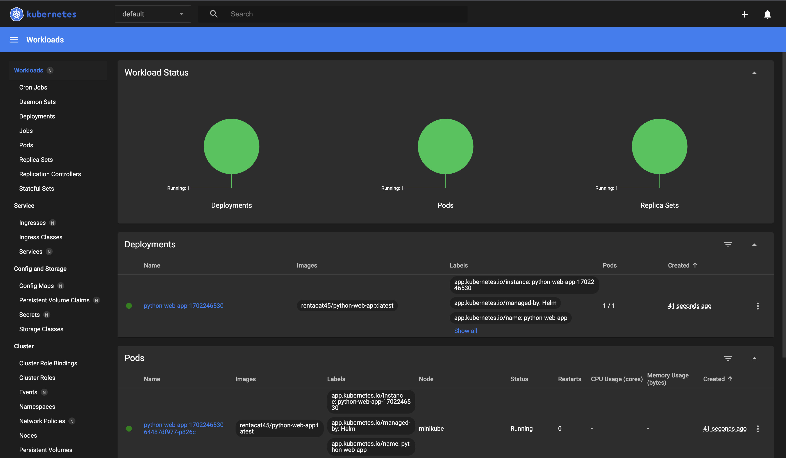

Task 1

Checking installed helm charts:
```
r-shakirova-osx:k8s r-shakirova$ helm list
NAME                            NAMESPACE       REVISION        UPDATED                                 STATUS          CHART                 APP VERSION
python-web-app-1702246530       default         1               2023-12-11 01:15:30.367768 +0300 MSK    deployed        python-web-app-0.1.0  1.16.0
```

Accessing the application via minikube service:
```
r-shakirova-osx:k8s r-shakirova$  minikube service  python-web-app-1702246530
|-----------|---------------------------|-------------|--------------|
| NAMESPACE |           NAME            | TARGET PORT |     URL      |
|-----------|---------------------------|-------------|--------------|
| default   | python-web-app-1702246530 |             | No node port |
|-----------|---------------------------|-------------|--------------|
😿  service default/python-web-app-1702246530 has no node port
🏃  Starting tunnel for service python-web-app-1702246530.
|-----------|---------------------------|-------------|------------------------|
| NAMESPACE |           NAME            | TARGET PORT |          URL           |
|-----------|---------------------------|-------------|------------------------|
| default   | python-web-app-1702246530 |             | http://127.0.0.1:55044 |
|-----------|---------------------------|-------------|------------------------|
🎉  Opening service default/python-web-app-1702246530 in default browser...
❗  Because you are using a Docker driver on darwin, the terminal needs to be open to run it.
```

Minikube dashboard:
 

Pods and services:
```
r-shakirova-osx:k8s r-shakirova$ kubectl get pods,svc
NAME                                             READY   STATUS    RESTARTS   AGE
pod/python-web-app-1702246530-64487df977-p826c   1/1     Running   0          4m3s

NAME                                TYPE        CLUSTER-IP       EXTERNAL-IP   PORT(S)    AGE
service/kubernetes                  ClusterIP   10.96.0.1        <none>        443/TCP    4m27s
service/python-web-app-1702246530   ClusterIP   10.103.106.220   <none>        8000/TCP   4m3s
```

Task 2

Getting pods and describing pre-install and postinstall hooks:
```
r-shakirova-osx:k8s r-shakirova$ kubectl get pods
NAME                                         READY   STATUS      RESTARTS   AGE
helm-hooks-python-web-app-6f66bb6b46-89wt4   1/1     Running     0          2m11s
postinstall-hook-python                      0/1     Completed   0          2m11s
preinstall-hook-python                       0/1     Completed   0          2m14s
r-shakirova-osx:k8s r-shakirova$ kubectl describe po preinstall-hook-python
Name:         preinstall-hook-python
Namespace:    default
Priority:     0
Node:         minikube/192.168.49.2
Start Time:   Mon, 11 Dec 2023 08:44:50 +0300
Labels:       <none>
Annotations:  helm.sh/hook: pre-install
Status:       Succeeded
IP:           10.244.0.43
IPs:
  IP:  10.244.0.43
Containers:
  pre-install-container:
    Container ID:  docker://d14f1686ed29053baa8125e2b5fb8ee4b4f3e231a9136971dd018670cbe32f11
    Image:         busybox
    Image ID:      docker-pullable://busybox@sha256:1ceb872bcc68a8fcd34c97952658b58086affdcb604c90c1dee2735bde5edc2f
    Port:          <none>
    Host Port:     <none>
    Command:
      sh
      -c
      echo The pre-install hook is running && sleep 1
    State:          Terminated
      Reason:       Completed
      Exit Code:    0
      Started:      Mon, 11 Dec 2023 08:44:51 +0300
      Finished:     Mon, 11 Dec 2023 08:44:52 +0300
    Ready:          False
    Restart Count:  0
    Environment:    <none>
    Mounts:
      /var/run/secrets/kubernetes.io/serviceaccount from kube-api-access-6jlwz (ro)
Conditions:
  Type              Status
  Initialized       True
  Ready             False
  ContainersReady   False
  PodScheduled      True
Volumes:
  kube-api-access-6jlwz:
    Type:                    Projected (a volume that contains injected data from multiple sources)
    TokenExpirationSeconds:  3607
    ConfigMapName:           kube-root-ca.crt
    ConfigMapOptional:       <nil>
    DownwardAPI:             true
QoS Class:                   BestEffort
Node-Selectors:              <none>
Tolerations:                 node.kubernetes.io/not-ready:NoExecute op=Exists for 300s
                             node.kubernetes.io/unreachable:NoExecute op=Exists for 300s
Events:
  Type    Reason     Age    From               Message
  ----    ------     ----   ----               -------
  Normal  Scheduled  2m27s  default-scheduler  Successfully assigned default/preinstall-hook-python to minikube
  Normal  Pulled     2m28s  kubelet            Container image "busybox" already present on machine
  Normal  Created    2m27s  kubelet            Created container pre-install-container
  Normal  Started    2m27s  kubelet            Started container pre-install-container
r-shakirova-osx:k8s r-shakirova$ kubectl describe po postinstall-hook-python
Name:         postinstall-hook-python
Namespace:    default
Priority:     0
Node:         minikube/192.168.49.2
Start Time:   Mon, 11 Dec 2023 08:44:53 +0300
Labels:       <none>
Annotations:  helm.sh/hook: post-install
Status:       Succeeded
IP:           10.244.0.45
IPs:
  IP:  10.244.0.45
Containers:
  post-install-container:
    Container ID:  docker://067a6a99bcbcd601e6973417f2150b6984bdec3b9b83c989c0ae0447a5427db7
    Image:         busybox
    Image ID:      docker-pullable://busybox@sha256:1ceb872bcc68a8fcd34c97952658b58086affdcb604c90c1dee2735bde5edc2f
    Port:          <none>
    Host Port:     <none>
    Command:
      sh
      -c
      echo The post-install hook is running && sleep 1
    State:          Terminated
      Reason:       Completed
      Exit Code:    0
      Started:      Mon, 11 Dec 2023 08:44:55 +0300
      Finished:     Mon, 11 Dec 2023 08:44:56 +0300
    Ready:          False
    Restart Count:  0
    Environment:    <none>
    Mounts:
      /var/run/secrets/kubernetes.io/serviceaccount from kube-api-access-mwl6n (ro)
Conditions:
  Type              Status
  Initialized       True
  Ready             False
  ContainersReady   False
  PodScheduled      True
Volumes:
  kube-api-access-mwl6n:
    Type:                    Projected (a volume that contains injected data from multiple sources)
    TokenExpirationSeconds:  3607
    ConfigMapName:           kube-root-ca.crt
    ConfigMapOptional:       <nil>
    DownwardAPI:             true
QoS Class:                   BestEffort
Node-Selectors:              <none>
Tolerations:                 node.kubernetes.io/not-ready:NoExecute op=Exists for 300s
                             node.kubernetes.io/unreachable:NoExecute op=Exists for 300s
Events:
  Type    Reason     Age    From               Message
  ----    ------     ----   ----               -------
  Normal  Scheduled  6m30s  default-scheduler  Successfully assigned default/postinstall-hook-python to minikube
  Normal  Pulling    6m29s  kubelet            Pulling image "busybox"
  Normal  Pulled     6m28s  kubelet            Successfully pulled image "busybox" in 1.6150177s (1.6150654s including waiting)
  Normal  Created    6m28s  kubelet            Created container post-install-container
  Normal  Started    6m28s  kubelet            Started container post-install-container
  ```