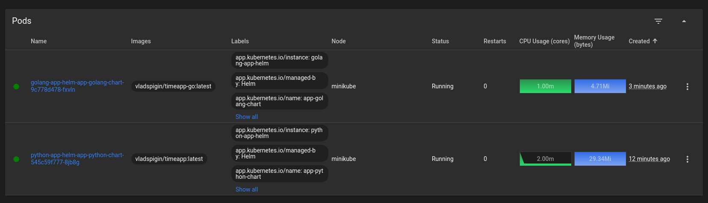

# Helm
### Installing Helm
```
vladislav5ik@AsusTuf:~$ curl -fsSL -o get_helm.sh https://raw.githubusercontent.com/helm/helm/main/scripts/get-helm-3
vladislav5ik@AsusTuf:~$ chmod 700 get_helm.sh
vladislav5ik@AsusTuf:~$ ./get_helm.sh
vladislav5ik@AsusTuf:~$ helm version
version.BuildInfo{Version:"v3.13.1", GitCommit:"3547a4b5bf5edb5478ce352e18858d8a552a4110", GitTreeState:"clean", GoVersion:"go1.20.8"}
```

### Creating charts
Creating a Helm chart template using the command `helm create` for python and golang apps.
```
vladislav5ik@AsusTuf:~/code-iu/core-course-labs/k8s$ helm create app-python-chart
Creating app-python-chart
vladislav5ik@AsusTuf:~/code-iu/core-course-labs/k8s$ helm create app-golang-chart
Creating app-golang-chart
```

### Configuring charts
Changing image repositories and tags inside `values.yaml`.
```yaml
image:
  repository: vladspigin/timeapp
  pullPolicy: IfNotPresent
  tag: "latest"
```
Changing default node port from 80 to 8080.
```yaml
service:
  type: NodePort
  port: 8080
```

### Linting
Executing `helm lint` command to check for syntex errors.
```
vladislav5ik@AsusTuf:~/code-iu/core-course-labs/k8s$ helm lint app-python-chart/
==> Linting app-python-chart/
[INFO] Chart.yaml: icon is recommended

1 chart(s) linted, 0 chart(s) failed
vladislav5ik@AsusTuf:~/code-iu/core-course-labs/k8s$ helm lint app-golang-chart/
==> Linting app-golang-chart/
[INFO] Chart.yaml: icon is recommended

1 chart(s) linted, 0 chart(s) failed
```

### Deploying
Using `helm install` command to deploy apps.
```
vladislav5ik@AsusTuf:~/code-iu/core-course-labs/k8s$ helm install python-app-helm ./app-python-chart/
NAME: python-app-helm
LAST DEPLOYED: Mon Nov  6 22:57:19 2023
NAMESPACE: default
STATUS: deployed
REVISION: 1
NOTES:
...

vladislav5ik@AsusTuf:~/code-iu/core-course-labs/k8s$ helm install golang-app-helm ./app-golang-chart/
NAME: golang-app-helm
LAST DEPLOYED: Mon Nov  6 23:07:18 2023
NAMESPACE: default
STATUS: deployed
REVISION: 1
NOTES:
...
```
Checking that applications are accessible using `minikube service` command.
```
vladislav5ik@AsusTuf:~$ minikube service python-app-helm-app-python-chart
|-----------|----------------------------------|-------------|---------------------------|
| NAMESPACE |               NAME               | TARGET PORT |            URL            |
|-----------|----------------------------------|-------------|---------------------------|
| default   | python-app-helm-app-python-chart | http/8080   | http://192.168.49.2:30511 |
|-----------|----------------------------------|-------------|---------------------------|
🎉  Opening service default/python-app-helm-app-python-chart in default browser...
vladislav5ik@AsusTuf:~$ minikube service golang-app-helm-app-golang-chart
|-----------|----------------------------------|-------------|---------------------------|
| NAMESPACE |               NAME               | TARGET PORT |            URL            |
|-----------|----------------------------------|-------------|---------------------------|
| default   | golang-app-helm-app-golang-chart | http/8080   | http://192.168.49.2:31550 |
|-----------|----------------------------------|-------------|---------------------------|
🎉  Opening service default/golang-app-helm-app-golang-chart in default browser...

```
Here is how the pods displayed in dashboard.


Output of `kubectl get pods,svc`.
```
vladislav5ik@AsusTuf:~$ kubectl get pods,svc
NAME                                                    READY   STATUS    RESTARTS   AGE
pod/golang-app-helm-app-golang-chart-9c778d478-fxvln    1/1     Running   0          5m15s
pod/python-app-helm-app-python-chart-545c59f777-8jb8g   1/1     Running   0          15m

NAME                                       TYPE        CLUSTER-IP      EXTERNAL-IP   PORT(S)          AGE
service/golang-app-helm-app-golang-chart   NodePort    10.104.28.38    <none>        8080:31550/TCP   5m15s
service/kubernetes                         ClusterIP   10.96.0.1       <none>        443/TCP          108m
service/python-app-helm-app-python-chart   NodePort    10.100.22.119   <none>        8080:30024/TCP   15m
```

### Adding hooks
Creating pre- and post- installing hooks, referring to [example](https://www.golinuxcloud.com/kubernetes-helm-hooks-examples/). Hooks are doing anything but sleep for 15-20 seconds. Here is the `pre-install-hook.yaml`:
```yaml
apiVersion: v1
kind: Pod
metadata:
   name: preinstall-hook
   annotations:
       "helm.sh/hook": "pre-install"
spec:
  containers:
  - name: pre-install-container
    image: busybox
    imagePullPolicy: IfNotPresent
    command: ['sh', '-c', 'echo The pre-install hook is running && sleep 20' ]
  restartPolicy: Never
  terminationGracePeriodSeconds: 0
```
Installing app with hooks (without deletion policy).
```
vladislav5ik@AsusTuf:~/code-iu/core-course-labs/k8s$ helm install python-with-hooks ./app-python-chart/
NAME: python-with-hooks
LAST DEPLOYED: Tue Nov  7 00:39:24 2023
NAMESPACE: default
STATUS: deployed
REVISION: 1
NOTES:
...

vladislav5ik@AsusTuf:~/code-iu/core-course-labs/k8s$ helm install golang-with-hooks ./app-golang-chart/
NAME: golang-with-hooks
LAST DEPLOYED: Tue Nov  7 00:39:40 2023
NAMESPACE: default
STATUS: deployed
REVISION: 1
NOTES:
...
```

Output of `kubectl get po` command to display hooks without deletion policy.
```
vladislav5ik@AsusTuf:~/code-iu/core-course-labs/k8s$ kubectl get po
NAME                                                      READY   STATUS      RESTARTS   AGE
golang-with-del-hooks-app-golang-chart-589cfd57c7-79lnx   1/1     Running     0          76s
postinstall-hook                                          0/1     Completed   0          54s
preinstall-hook                                           0/1     Completed   0          76s
python-with-del-hooks-app-python-chart-66f97d95d8-f6rcp   1/1     Running     0          54s
```

Output of `kubectl describe po` command for preinstall hook withoud deletion policy.
```
vladislav5ik@AsusTuf:~/code-iu/core-course-labs/k8s$ kubectl describe po preinstall-hook
Name:             preinstall-hook
Namespace:        default
Priority:         0
Service Account:  default
Node:             minikube/192.168.49.2
Start Time:       Wed, 08 Nov 2023 00:26:55 +0300
Labels:           <none>
Annotations:      helm.sh/hook: pre-install
Status:           Succeeded
IP:               10.244.0.53
IPs:
  IP:  10.244.0.53
Containers:
  pre-install-container:
    Container ID:  docker://ceb845bc3fa4e6bf1b94b0038bfcd826c75df774504b66a5eb6950e38ddda914
    Image:         busybox
    Image ID:      docker-pullable://busybox@sha256:3fbc632167424a6d997e74f52b878d7cc478225cffac6bc977eedfe51c7f4e79
    Port:          <none>
    Host Port:     <none>
    Command:
      sh
      -c
      echo The pre-install hook is running && sleep 20
    State:          Terminated
      Reason:       Completed
      Exit Code:    0
      Started:      Wed, 08 Nov 2023 00:26:55 +0300
      Finished:     Wed, 08 Nov 2023 00:27:15 +0300
    Ready:          False
    Restart Count:  0
    Environment:    <none>
    Mounts:
      /var/run/secrets/kubernetes.io/serviceaccount from kube-api-access-xwnq7 (ro)
Conditions:
  Type              Status
  Initialized       True
  Ready             False
  ContainersReady   False
  PodScheduled      True
Volumes:
  kube-api-access-xwnq7:
    Type:                    Projected (a volume that contains injected data from multiple sources)
    TokenExpirationSeconds:  3607
    ConfigMapName:           kube-root-ca.crt
    ConfigMapOptional:       <nil>
    DownwardAPI:             true
QoS Class:                   BestEffort
Node-Selectors:              <none>
Tolerations:                 node.kubernetes.io/not-ready:NoExecute op=Exists for 300s
                             node.kubernetes.io/unreachable:NoExecute op=Exists for 300s
Events:
  Type    Reason     Age   From               Message
  ----    ------     ----  ----               -------
  Normal  Scheduled  94s   default-scheduler  Successfully assigned default/preinstall-hook to minikube
  Normal  Pulled     94s   kubelet            Container image "busybox" already present on machine
  Normal  Created    94s   kubelet            Created container pre-install-container
  Normal  Started    94s   kubelet            Started container pre-install-container
```
Output of `kubectl describe po` command for postinstall hook withoud deletion policy.
```
vladislav5ik@AsusTuf:~/code-iu/core-course-labs/k8s$ kubectl describe po postinstall-hook
Name:             postinstall-hook
Namespace:        default
Priority:         0
Service Account:  default
Node:             minikube/192.168.49.2
Start Time:       Wed, 08 Nov 2023 00:27:17 +0300
Labels:           <none>
Annotations:      helm.sh/hook: post-install
Status:           Succeeded
IP:               10.244.0.56
IPs:
  IP:  10.244.0.56
Containers:
  post-install-container:
    Container ID:  docker://b74eeae971018c0fe514497a0dff82ad99c5f6c9969d84b9d13be3daf0f37ed8
    Image:         busybox
    Image ID:      docker-pullable://busybox@sha256:3fbc632167424a6d997e74f52b878d7cc478225cffac6bc977eedfe51c7f4e79
    Port:          <none>
    Host Port:     <none>
    Command:
      sh
      -c
      echo The post-install hook is running && sleep 15
    State:          Terminated
      Reason:       Completed
      Exit Code:    0
      Started:      Wed, 08 Nov 2023 00:27:27 +0300
      Finished:     Wed, 08 Nov 2023 00:27:42 +0300
    Ready:          False
    Restart Count:  0
    Environment:    <none>
    Mounts:
      /var/run/secrets/kubernetes.io/serviceaccount from kube-api-access-cnfhx (ro)
Conditions:
  Type              Status
  Initialized       True
  Ready             False
  ContainersReady   False
  PodScheduled      True
Volumes:
  kube-api-access-cnfhx:
    Type:                    Projected (a volume that contains injected data from multiple sources)
    TokenExpirationSeconds:  3607
    ConfigMapName:           kube-root-ca.crt
    ConfigMapOptional:       <nil>
    DownwardAPI:             true
QoS Class:                   BestEffort
Node-Selectors:              <none>
Tolerations:                 node.kubernetes.io/not-ready:NoExecute op=Exists for 300s
                             node.kubernetes.io/unreachable:NoExecute op=Exists for 300s
Events:
  Type    Reason     Age    From               Message
  ----    ------     ----   ----               -------
  Normal  Scheduled  2m17s  default-scheduler  Successfully assigned default/postinstall-hook to minikube
  Normal  Pulling    2m17s  kubelet            Pulling image "busybox"
  Normal  Pulled     2m8s   kubelet            Successfully pulled image "busybox" in 9.018107945s (9.01811656s including waiting)
  Normal  Created    2m8s   kubelet            Created container post-install-container
  Normal  Started    2m8s   kubelet            Started container post-install-container
```
### Adding hook delete policy
To remove the hook once it has executed successfully, a hook delete policy was added to hook configuration.
```yaml
metadata:
   name: preinstall-hook
   annotations:
       "helm.sh/hook": "pre-install"
       "helm.sh/hook-delete-policy": before-hook-creation, hook-succeeded
```
#### Testing deletion policy.
To make test clear, I deleted previous apps and hooks and installed new ones with deletion policies.
```
vladislav5ik@AsusTuf:~/code-iu/core-course-labs/k8s$ helm install python-with-del-hooks ./app-python-chart/
NAME: python-with-del-hooks
LAST DEPLOYED: Wed Nov  8 00:16:28 2023
NAMESPACE: default
STATUS: deployed
REVISION: 1
NOTES:
1. Get the application URL by running these commands:
  export NODE_PORT=$(kubectl get --namespace default -o jsonpath="{.spec.ports[0].nodePort}" services python-with-del-hooks-app-python-chart)
  export NODE_IP=$(kubectl get nodes --namespace default -o jsonpath="{.items[0].status.addresses[0].address}")
  echo http://$NODE_IP:$NODE_PORT
```
```
NAME: golang-with-del-hooks
LAST DEPLOYED: Wed Nov  8 00:16:09 2023
NAMESPACE: default
STATUS: deployed
REVISION: 1
NOTES:
1. Get the application URL by running these commands:
  export NODE_PORT=$(kubectl get --namespace default -o jsonpath="{.spec.ports[0].nodePort}" services golang-with-del-hooks-app-golang-chart)
  export NODE_IP=$(kubectl get nodes --namespace default -o jsonpath="{.items[0].status.addresses[0].address}")
  echo http://$NODE_IP:$NODE_PORT
```
Let's chrck that hooks are deleted. Executing `kubectl get po` command.
```
vladislav5ik@AsusTuf:~/code-iu/core-course-labs/k8s$ kubectl get po
NAME                                                      READY   STATUS    RESTARTS   AGE
golang-with-del-hooks-app-golang-chart-589cfd57c7-rlxm7   1/1     Running   0          2m41s
python-with-del-hooks-app-python-chart-66f97d95d8-x7c2n   1/1     Running   0          2m18s
```
Executing `kubectl describe po` command for both pre- and post- install hooks to check that they are deleted because of deletion policy.
```
vladislav5ik@AsusTuf:~/code-iu/core-course-labs/k8s$ kubectl describe po preinstall-hook
Error from server (NotFound): pods "preinstall-hook" not found
```
```
vladislav5ik@AsusTuf:~/code-iu/core-course-labs/k8s$ kubectl describe po postinstall-hook
Error from server (NotFound): pods "postinstall-hook" not found
```

### Creating library chart
```
vladislav5ik@AsusTuf:~/code-iu/core-course-labs/k8s$ helm create library-chart
Creating library-chart
vladislav5ik@AsusTuf:~/code-iu/core-course-labs/k8s$ rm -rf library-chart/templates/*
vladislav5ik@AsusTuf:~/code-iu/core-course-labs/k8s$ rm -f library-chart/values.yaml
```
Changing type of chart from application to library in `library-chart/Chart.yaml` file.
```yaml
type: library
```
Creating labels template `library-chart/templates/_labels.tpl`. So apps deployed with this library will have the same label set.
```yaml
{{- define "library-chart.labels" -}}
  labels:
    app.kubernetes.io/name: {{ include "library-chart.name" . }}
    app.kubernetes.io/instance: {{ .Release.Name }}
    app.kubernetes.io/version: {{ include "library-chart.version" . }}
    app.kubernetes.io/managed-by: {{ .Release.Service | quote }}
{{- end -}}
```
Checking that helm recognizes library chart.
```
vladislav5ik@AsusTuf:~/code-iu/core-course-labs/k8s$ helm install lib-chart ./library-chart/
Error: INSTALLATION FAILED: library charts are not installable
```
### Using library chart
Adding library chart to `app-python-chart/Chart.yaml` and `app-golang-chart/Chart.yaml` files.
```yaml
dependencies:
  - name: library-chart
    version: 0.1.0
    repository: "file://../library-chart"
```
Triggering dependency update.
```
vladislav5ik@AsusTuf:~/code-iu/core-course-labs/k8s$ helm dependency update ./app-golang-chart/
Saving 1 charts
Deleting outdated charts
```
```
vladislav5ik@AsusTuf:~/code-iu/core-course-labs/k8s$ helm dependency update ./app-python-chart/
Saving 1 charts
Deleting outdated charts
```
Checking output of `helm get manifest`. It should contain labels from library chart:
```
...
metadata:
  name: python-with-del-hooks-app-python-chart
  labels:
    helm.sh/chart: app-python-chart-0.1.0
    app.kubernetes.io/name: app-python-chart
    app.kubernetes.io/instance: python-with-del-hooks
    app.kubernetes.io/version: "1.16.0"
    app.kubernetes.io/managed-by: Helm
...
```
```
...
metadata:
  name: golang-with-del-hooks-app-golang-chart
  labels:
    helm.sh/chart: app-golang-chart-0.1.0
    app.kubernetes.io/name: app-golang-chart
    app.kubernetes.io/instance: golang-with-del-hooks
    app.kubernetes.io/version: "1.16.0"
    app.kubernetes.io/managed-by: Helm
...
```
