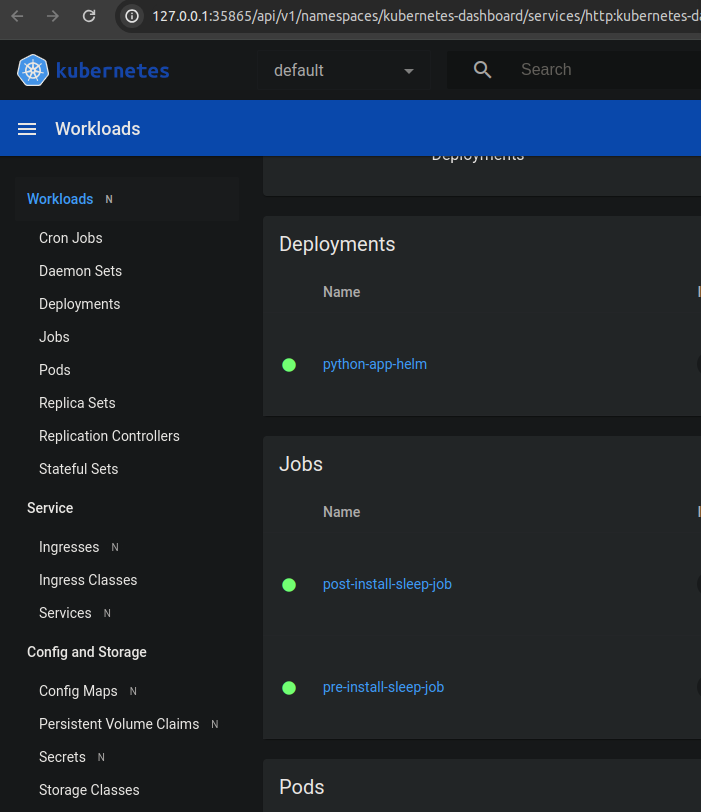
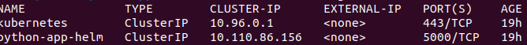
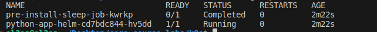
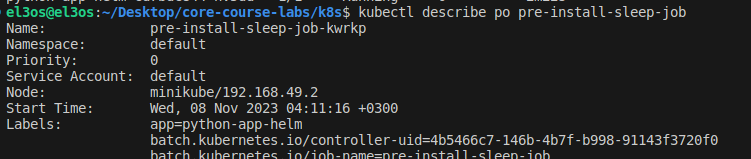
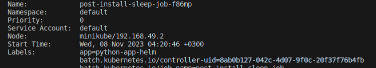
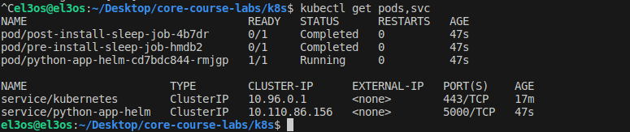
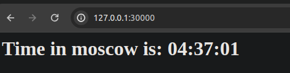

# Using Helm to Manage Kubernetes Applications

## Learn About Helm

### Helm Architecture
- Helm operates with a client-server architecture, consisting of the Helm client and the Tiller server (though Tiller is being phased out in recent versions).

### Understanding Helm Charts
- Helm packages applications as Helm Charts, containing Kubernetes resources and default configuration values.

## Install Helm
1. Install Helm by following the instructions provided in the [Helm Installation Guide](https://helm.sh/docs/intro/install/).
2. Initialize the Chart repository using the following commands:
   ```shell
   helm repo add stable https://charts.helm.sh/stable
   helm repo update
   ```

## Create a Helm Chart
1. Generate a Helm chart template for your application:
   ```shell
   helm create your-app
   ```
2. Edit `values.yaml` in the `your-app` chart folder to update repository and tag values with your repository information.
3. Modify the `containerPort` setting in `deployment.yml` to match your application's port.
4. If needed, comment out `livenessProbe` and `readinessProbe` for troubleshooting.
5. Use `minikube dashboard` for monitoring and troubleshooting with the Kubernetes dashboard.

## Install Helm Chart
1. Install your Helm chart with the following command:
   ```shell
   helm install your-release-name ./path/to/your-app
   ```
   Replace `your-release-name` with your chosen release name and `./path/to/your-app` with the actual path to your Helm chart.
2. Verify the deployment and service status by checking the Workloads page in the Minikube dashboard or using `kubectl get pods,svc`.

## Access Your Application
1. Confirm application access with:
   ```shell
   minikube service your_service_name
   ```
   Replace `your_service_name` with the service name associated with your application.


# My output

- Output of `kubectl get pods,svc`:

```shell
kubectl get pods,svc

NAME                                  READY   STATUS    RESTARTS   AGE
pod/python-app-helm-cd7bdc844-f9xdq   1/1     Running   1          4h36m

NAME                      TYPE        CLUSTER-IP       EXTERNAL-IP   PORT(S)    AGE
service/kubernetes        ClusterIP   10.96.0.1        <none>        443/TCP    4h37m
service/python-app-helm   ClusterIP   10.108.162.152   <none>        5000/TCP   4h36m
```






- Output of `kubectl get po`



- Output of `kubectl describe po pre-install-sleep-job`

  

```bash
Name:             pre-install-sleep-job-kwrkp
Namespace:        default
Priority:         0
Service Account:  default
Node:             minikube/192.168.49.2
Start Time:       Wed, 08 Nov 2023 04:11:16 +0300
Labels:           app=python-app-helm
                  batch.kubernetes.io/controller-uid=4b5466c7-146b-4b7f-b998-91143f3720f0
                  batch.kubernetes.io/job-name=pre-install-sleep-job
                  chart=python-app-helm-0.1.0
                  controller-uid=4b5466c7-146b-4b7f-b998-91143f3720f0
                  job-name=pre-install-sleep-job
Annotations:      <none>
Status:           Succeeded
IP:               10.244.0.74
IPs:
  IP:           10.244.0.74
Controlled By:  Job/pre-install-sleep-job
Containers:
  sleep-container:
    Container ID:  docker://f832c4d91742858de9e31cc46d439abbc001f2444b77e31e4e0ae8156d99f408
    Image:         busybox
    Image ID:      docker-pullable://busybox@sha256:3fbc632167424a6d997e74f52b878d7cc478225cffac6bc977eedfe51c7f4e79
    Port:          <none>
    Host Port:     <none>
    Command:
      sleep
      20
    State:          Terminated
      Reason:       Completed
      Exit Code:    0
      Started:      Wed, 08 Nov 2023 04:11:19 +0300
      Finished:     Wed, 08 Nov 2023 04:11:40 +0300
    Ready:          False
    Restart Count:  0
    Environment:    <none>
    Mounts:
      /var/run/secrets/kubernetes.io/serviceaccount from kube-api-access-g9gcc (ro)
Conditions:
  Type              Status
  Initialized       True 
  Ready             False 
  ContainersReady   False 
  PodScheduled      True 
Volumes:
  kube-api-access-g9gcc:
    Type:                    Projected (a volume that contains injected data from multiple sources)
    TokenExpirationSeconds:  3607
    ConfigMapName:           kube-root-ca.crt
    ConfigMapOptional:       <nil>
    DownwardAPI:             true
QoS Class:                   BestEffort
Node-Selectors:              <none>
Tolerations:                 node.kubernetes.io/not-ready:NoExecute op=Exists for 300s
                             node.kubernetes.io/unreachable:NoExecute op=Exists for 300s
Events:
  Type    Reason     Age    From               Message
  ----    ------     ----   ----               -------
  Normal  Scheduled  4m24s  default-scheduler  Successfully assigned default/pre-install-sleep-job-kwrkp to minikube
  Normal  Pulling    4m23s  kubelet            Pulling image "busybox"
  Normal  Pulled     4m21s  kubelet            Successfully pulled image "busybox" in 2.273745193s (2.273767634s including waiting)
  Normal  Created    4m21s  kubelet            Created container sleep-container
  Normal  Started    4m20s  kubelet            Started container sleep-container
```

- Output of `kubectl describe po post-install-sleep-job`

  

```bash
Name:             post-install-sleep-job-f86mp
Namespace:        default
Priority:         0
Service Account:  default
Node:             minikube/192.168.49.2
Start Time:       Wed, 08 Nov 2023 04:20:46 +0300
Labels:           app=python-app-helm
                  batch.kubernetes.io/controller-uid=8ab0b127-042c-4d07-9f0c-20f37f76b4fb
                  batch.kubernetes.io/job-name=post-install-sleep-job
                  chart=python-app-helm-0.1.0
                  controller-uid=8ab0b127-042c-4d07-9f0c-20f37f76b4fb
                  job-name=post-install-sleep-job
Annotations:      <none>
Status:           Succeeded
IP:               10.244.0.75
IPs:
  IP:           10.244.0.75
Controlled By:  Job/post-install-sleep-job
Containers:
  sleep-container:
    Container ID:  docker://e45fe84b12dd9bd39642875c8aaa6f9b76267a94e3e40eb43493bda734c7a2c6
    Image:         busybox
    Image ID:      docker-pullable://busybox@sha256:3fbc632167424a6d997e74f52b878d7cc478225cffac6bc977eedfe51c7f4e79
    Port:          <none>
    Host Port:     <none>
    Command:
      sleep
      20
    State:          Terminated
      Reason:       Completed
      Exit Code:    0
      Started:      Wed, 08 Nov 2023 04:20:50 +0300
      Finished:     Wed, 08 Nov 2023 04:21:10 +0300
    Ready:          False
    Restart Count:  0
    Environment:    <none>
    Mounts:
      /var/run/secrets/kubernetes.io/serviceaccount from kube-api-access-jfbjh (ro)
Conditions:
  Type              Status
  Initialized       True 
  Ready             False 
  ContainersReady   False 
  PodScheduled      True 
Volumes:
  kube-api-access-jfbjh:
    Type:                    Projected (a volume that contains injected data from multiple sources)
    TokenExpirationSeconds:  3607
    ConfigMapName:           kube-root-ca.crt
    ConfigMapOptional:       <nil>
    DownwardAPI:             true
QoS Class:                   BestEffort
Node-Selectors:              <none>
Tolerations:                 node.kubernetes.io/not-ready:NoExecute op=Exists for 300s
                             node.kubernetes.io/unreachable:NoExecute op=Exists for 300s
Events:
  Type    Reason     Age    From               Message
  ----    ------     ----   ----               -------
  Normal  Scheduled  2m12s  default-scheduler  Successfully assigned default/post-install-sleep-job-f86mp to minikube
  Normal  Pulling    2m11s  kubelet            Pulling image "busybox"
  Normal  Pulled     2m8s   kubelet            Successfully pulled image "busybox" in 2.904362809s (2.904468383s including waiting)
  Normal  Created    2m8s   kubelet            Created container sleep-container
  Normal  Started    2m8s   kubelet            Started container sleep-container
```

- Output of `kubectl get pods,svc`



```bash
NAME                                  READY   STATUS      RESTARTS   AGE
pod/post-install-sleep-job-4b7dr      0/1     Completed   0          47s
pod/pre-install-sleep-job-hmdb2       0/1     Completed   0          47s
pod/python-app-helm-cd7bdc844-rmjgp   1/1     Running     0          47s

NAME                      TYPE        CLUSTER-IP      EXTERNAL-IP   PORT(S)    AGE
service/kubernetes        ClusterIP   10.96.0.1       <none>        443/TCP    17m
service/python-app-helm   ClusterIP   10.110.86.156   <none>        5000/TCP   47s
```


## Rust chart browser ip

