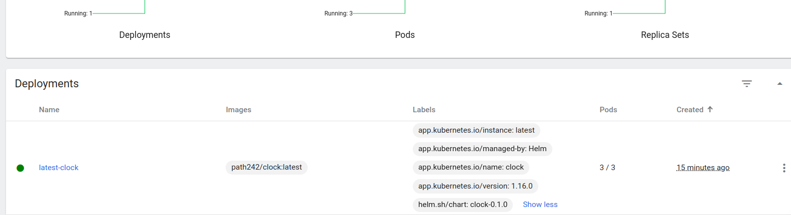
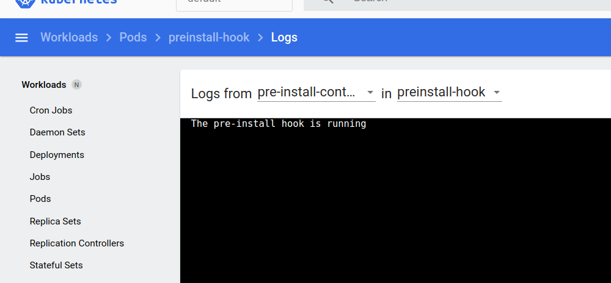

## Helm
Running
```
kubectl get pods,svc
```
outputs

```
NAME                                READY   STATUS    RESTARTS   AGE
pod/latest-clock-6c886659b8-7qjpf   1/1     Running   0          2m29s
pod/latest-clock-6c886659b8-gjcmh   1/1     Running   0          2m29s
pod/latest-clock-6c886659b8-pvv67   1/1     Running   0          2m29s

NAME                   TYPE           CLUSTER-IP      EXTERNAL-IP   PORT(S)          AGE
service/kubernetes     ClusterIP      10.96.0.1       <none>        443/TCP          7d5h
service/latest-clock   LoadBalancer   10.110.196.41   <pending>     8000:31091/TCP   2m29s
```
Running 
```
minikube dashboard
```


### Helm chart Hooks
Running helm install outputs:
```
NAME: latest
LAST DEPLOYED: Wed Nov  8 02:05:22 2023
NAMESPACE: default
STATUS: deployed
REVISION: 1
NOTES:
1. Get the application URL by running these commands:
     NOTE: It may take a few minutes for the LoadBalancer IP to be available.
           You can watch the status of by running 'kubectl get --namespace default svc -w latest-latest-clock'
  export SERVICE_IP=$(kubectl get svc --namespace default latest-latest-clock --template "{{ range (index .status.loadBalancer.ingress 0) }}{{.}}{{ end }}")
  echo http://$SERVICE_IP:8000
```
Pre-Install


Post-Install


Running:
```
kubectl describe po postinstall-hook
```
Outputs:
```
Name:             postinstall-hook
Namespace:        default
Priority:         0
Service Account:  default
Node:             minikube/192.168.49.2
Start Time:       Wed, 08 Nov 2023 02:05:46 +0300
Labels:           <none>
Annotations:      helm.sh/hook: post-install
Status:           Succeeded
IP:               10.244.0.48
IPs:
  IP:  10.244.0.48
Containers:
  post-install-container:
    Container ID:  docker://06c2aadf15645608ae47379869638c09cdbc824652e5cab191a9490dc520e9f7
    Image:         busybox
    Image ID:      docker-pullable://busybox@sha256:3fbc632167424a6d997e74f52b878d7cc478225cffac6bc977eedfe51c7f4e79
    Port:          <none>
    Host Port:     <none>
    Command:
      sh
      -c
      echo The post-install hook is running && sleep 20
    State:          Terminated
      Reason:       Completed
      Exit Code:    0
      Started:      Wed, 08 Nov 2023 02:05:47 +0300
      Finished:     Wed, 08 Nov 2023 02:06:07 +0300
    Ready:          False
    Restart Count:  0
    Environment:    <none>
    Mounts:
      /var/run/secrets/kubernetes.io/serviceaccount from kube-api-access-j6wd6 (ro)
Conditions:
  Type              Status
  Initialized       True 
  Ready             False 
  ContainersReady   False 
  PodScheduled      True 
Volumes:
  kube-api-access-j6wd6:
    Type:                    Projected (a volume that contains injected data from multiple sources)
    TokenExpirationSeconds:  3607
    ConfigMapName:           kube-root-ca.crt
    ConfigMapOptional:       <nil>
    DownwardAPI:             true
QoS Class:                   BestEffort
Node-Selectors:              <none>
Tolerations:                 node.kubernetes.io/not-ready:NoExecute op=Exists for 300s
                             node.kubernetes.io/unreachable:NoExecute op=Exists for 300s
Events:
  Type    Reason     Age    From               Message
  ----    ------     ----   ----               -------
  Normal  Scheduled  2m26s  default-scheduler  Successfully assigned default/postinstall-hook to minikube
  Normal  Pulled     2m26s  kubelet            Container image "busybox" already present on machine
  Normal  Created    2m25s  kubelet            Created container post-install-container
  Normal  Started    2m25s  kubelet            Started container post-install-containe
  ```

Running
```
kubectl describe po preinstall-hook
```
Outputs:
```
Name:             preinstall-hook
Namespace:        default
Priority:         0
Service Account:  default
Node:             minikube/192.168.49.2
Start Time:       Wed, 08 Nov 2023 02:05:22 +0300
Labels:           <none>
Annotations:      helm.sh/hook: pre-install
Status:           Succeeded
IP:               10.244.0.45
IPs:
  IP:  10.244.0.45
Containers:
  pre-install-container:
    Container ID:  docker://e8735b83f9efc3246a2d01be3c54a88421f47e1711b6ca6c3c8b9f0e3beccf8e
    Image:         busybox
    Image ID:      docker-pullable://busybox@sha256:3fbc632167424a6d997e74f52b878d7cc478225cffac6bc977eedfe51c7f4e79
    Port:          <none>
    Host Port:     <none>
    Command:
      sh
      -c
      echo The pre-install hook is running && sleep 20
    State:          Terminated
      Reason:       Completed
      Exit Code:    0
      Started:      Wed, 08 Nov 2023 02:05:23 +0300
      Finished:     Wed, 08 Nov 2023 02:05:43 +0300
    Ready:          False
    Restart Count:  0
    Environment:    <none>
    Mounts:
      /var/run/secrets/kubernetes.io/serviceaccount from kube-api-access-8l7xb (ro)
Conditions:
  Type              Status
  Initialized       True 
  Ready             False 
  ContainersReady   False 
  PodScheduled      True 
Volumes:
  kube-api-access-8l7xb:
    Type:                    Projected (a volume that contains injected data from multiple sources)
    TokenExpirationSeconds:  3607
    ConfigMapName:           kube-root-ca.crt
    ConfigMapOptional:       <nil>
    DownwardAPI:             true
QoS Class:                   BestEffort
Node-Selectors:              <none>
Tolerations:                 node.kubernetes.io/not-ready:NoExecute op=Exists for 300s
                             node.kubernetes.io/unreachable:NoExecute op=Exists for 300s
Events:
  Type    Reason     Age   From               Message
  ----    ------     ----  ----               -------
  Normal  Scheduled  4m9s  default-scheduler  Successfully assigned default/preinstall-hook to minikube
  Normal  Pulled     4m9s  kubelet            Container image "busybox" already present on machine
  Normal  Created    4m9s  kubelet            Created container pre-install-container
  Normal  Started    4m9s  kubelet            Started container pre-install-container
```

Hook Delete Policy was added.

