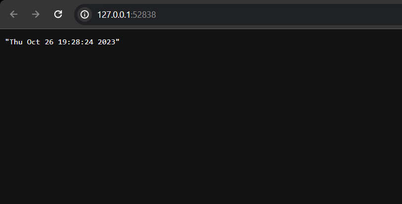

# Helm (lab 10)

## Task 1

### Python and Rust chart deployment

```bash
[user@fedora app-helm]$ helm install python . --values values.python.yaml 
NAME: python
LAST DEPLOYED: Sun Oct 29 13:04:00 2023
NAMESPACE: default
STATUS: deployed
REVISION: 1
NOTES:
1. Get the application URL by running these commands:
  http://python.app/

[user@fedora app-helm]$ helm install rust . --values values.rust.yaml 
NAME: rust
LAST DEPLOYED: Sun Oct 29 13:04:48 2023
NAMESPACE: default
STATUS: deployed
REVISION: 1
NOTES:
1. Get the application URL by running these commands:
  http://rust.app/
```

### minikube service



```bash
curl -H "Host: python.app" 192.168.49.2
2023-10-29T13:05:14.345680+03:00

curl -H "Host: rust.app" 192.168.49.2
2023-10-29T13:08:24.083086627+03:00
```

### kubectl get pods,svc

```bash
NAME                                   READY   STATUS    RESTARTS   AGE
pod/python-app-helm-656f549cd6-bdfq9   1/1     Running   0          6m17s
pod/python-app-helm-656f549cd6-hcnkc   1/1     Running   0          6m17s
pod/python-app-helm-656f549cd6-hl5xk   1/1     Running   0          6m17s
pod/rust-app-helm-5ff5bffbc8-n9r6m     1/1     Running   0          5m29s
pod/rust-app-helm-5ff5bffbc8-whf9j     1/1     Running   0          5m29s
pod/rust-app-helm-5ff5bffbc8-zrkzm     1/1     Running   0          5m29s

NAME                      TYPE           CLUSTER-IP      EXTERNAL-IP   PORT(S)          AGE
service/kubernetes        ClusterIP      10.96.0.1       <none>        443/TCP          28m
service/python-app-helm   LoadBalancer   10.106.72.109   <pending>     8080:31213/TCP   6m17s
service/rust-app-helm     LoadBalancer   10.110.123.62   <pending>     8080:31945/TCP   5m29s
```

## Task 2

### helm lint

```bash
helm lint app-helm
==> Linting app-helm
[INFO] Chart.yaml: icon is recommended

1 chart(s) linted, 0 chart(s) failed
```

### helm install --dry-run helm-hooks

```bash
helm install nginx app-helm
NAME: nginx
LAST DEPLOYED: Sun Oct 29 13:38:40 2023
NAMESPACE: default
STATUS: deployed
REVISION: 1
NOTES:
1. Get the application URL by running these commands:
  export POD_NAME=$(kubectl get pods --namespace default -l "app.kubernetes.io/name=app-helm,app.kubernetes.io/instance=nginx" -o jsonpath="{.items[0].metadata.name}")
  export CONTAINER_PORT=$(kubectl get pod --namespace default $POD_NAME -o jsonpath="{.spec.containers[0].ports[0].containerPort}")
  echo "Visit http://127.0.0.1:8080 to use your application"
  kubectl --namespace default port-forward $POD_NAME 8080:$CONTAINER_PORT
```

I have installed chart to simplify post-install hook triggering

### kubectl get po

```bash
kubectl get po
NAME                               READY   STATUS      RESTARTS   AGE
nginx-app-helm-76dddcff7d-9pq4q    1/1     Running     0          37s
postinstall-hook                   0/1     Completed   0          37s
preinstall-hook                    0/1     Completed   0          67s
python-app-helm-656f549cd6-bdfq9   1/1     Running     0          35m
python-app-helm-656f549cd6-hcnkc   1/1     Running     0          35m
python-app-helm-656f549cd6-hl5xk   1/1     Running     0          35m
rust-app-helm-5ff5bffbc8-n9r6m     1/1     Running     0          34m
rust-app-helm-5ff5bffbc8-whf9j     1/1     Running     0          34m
rust-app-helm-5ff5bffbc8-zrkzm     1/1     Running     0          34m
```

### Hooks verifying

```
kubectl describe pod preinstall-hook
Name:             preinstall-hook
Namespace:        default
Priority:         0
Service Account:  default
Node:             minikube/192.168.49.2
Start Time:       Sun, 29 Oct 2023 13:38:41 +0300
Labels:           <none>
Annotations:      helm.sh/hook: pre-install
Status:           Succeeded
IP:               10.244.0.43
IPs:
  IP:  10.244.0.43
Containers:
  pre-install-container:
    Container ID:  docker://9c92e109867575333d00dab5a42a5b998b1caa44921c02affa8294eacb41ab9e
    Image:         busybox
    Image ID:      docker-pullable://busybox@sha256:3fbc632167424a6d997e74f52b878d7cc478225cffac6bc977eedfe51c7f4e79
    Port:          <none>
    Host Port:     <none>
    Command:
      sh
      -c
      echo The pre-install hook is running && sleep 20
    State:          Terminated
      Reason:       Completed
      Exit Code:    0
      Started:      Sun, 29 Oct 2023 13:38:49 +0300
      Finished:     Sun, 29 Oct 2023 13:39:09 +0300
    Ready:          False
    Restart Count:  0
    Environment:    <none>
    Mounts:
      /var/run/secrets/kubernetes.io/serviceaccount from kube-api-access-xgx9l (ro)
Conditions:
  Type              Status
  Initialized       True 
  Ready             False 
  ContainersReady   False 
  PodScheduled      True 
Volumes:
  kube-api-access-xgx9l:
    Type:                    Projected (a volume that contains injected data from multiple sources)
    TokenExpirationSeconds:  3607
    ConfigMapName:           kube-root-ca.crt
    ConfigMapOptional:       <nil>
    DownwardAPI:             true
QoS Class:                   BestEffort
Node-Selectors:              <none>
Tolerations:                 node.kubernetes.io/not-ready:NoExecute op=Exists for 300s
                             node.kubernetes.io/unreachable:NoExecute op=Exists for 300s
Events:
  Type    Reason     Age    From               Message
  ----    ------     ----   ----               -------
  Normal  Scheduled  3m5s   default-scheduler  Successfully assigned default/preinstall-hook to minikube
  Normal  Pulling    3m4s   kubelet            Pulling image "busybox"
  Normal  Pulled     2m58s  kubelet            Successfully pulled image "busybox" in 6.577012041s (6.577021545s including waiting)
  Normal  Created    2m58s  kubelet            Created container pre-install-container
  Normal  Started    2m57s  kubelet            Started container pre-install-container

kubectl describe pod postinstall-hook
Name:             postinstall-hook
Namespace:        default
Priority:         0
Service Account:  default
Node:             minikube/192.168.49.2
Start Time:       Sun, 29 Oct 2023 13:39:11 +0300
Labels:           <none>
Annotations:      helm.sh/hook: post-install
Status:           Succeeded
IP:               10.244.0.44
IPs:
  IP:  10.244.0.44
Containers:
  post-install-container:
    Container ID:  docker://bf1abaad17f546b7cde16d7455c840f23859c794eb484430837481a9259d8ca6
    Image:         busybox
    Image ID:      docker-pullable://busybox@sha256:3fbc632167424a6d997e74f52b878d7cc478225cffac6bc977eedfe51c7f4e79
    Port:          <none>
    Host Port:     <none>
    Command:
      sh
      -c
      echo The post-install hook is running && sleep 20
    State:          Terminated
      Reason:       Completed
      Exit Code:    0
      Started:      Sun, 29 Oct 2023 13:39:22 +0300
      Finished:     Sun, 29 Oct 2023 13:39:42 +0300
    Ready:          False
    Restart Count:  0
    Environment:    <none>
    Mounts:
      /var/run/secrets/kubernetes.io/serviceaccount from kube-api-access-7qtpz (ro)
Conditions:
  Type              Status
  Initialized       True 
  Ready             False 
  ContainersReady   False 
  PodScheduled      True 
Volumes:
  kube-api-access-7qtpz:
    Type:                    Projected (a volume that contains injected data from multiple sources)
    TokenExpirationSeconds:  3607
    ConfigMapName:           kube-root-ca.crt
    ConfigMapOptional:       <nil>
    DownwardAPI:             true
QoS Class:                   BestEffort
Node-Selectors:              <none>
Tolerations:                 node.kubernetes.io/not-ready:NoExecute op=Exists for 300s
                             node.kubernetes.io/unreachable:NoExecute op=Exists for 300s
Events:
  Type    Reason     Age    From               Message
  ----    ------     ----   ----               -------
  Normal  Scheduled  2m12s  default-scheduler  Successfully assigned default/postinstall-hook to minikube
  Normal  Pulling    2m11s  kubelet            Pulling image "busybox"
  Normal  Pulled     2m9s   kubelet            Successfully pulled image "busybox" in 2.525182475s (2.525191793s including waiting)
  Normal  Created    2m1s   kubelet            Created container post-install-container
  Normal  Started    2m1s   kubelet            Started container post-install-container
```

I have used `"helm.sh/hook-delete-policy": hook-succeeded` as a hook delete policy

## Bonus

### Rust application

For Rust application I have created separated `values.rust.yaml` file

### Helm Library
