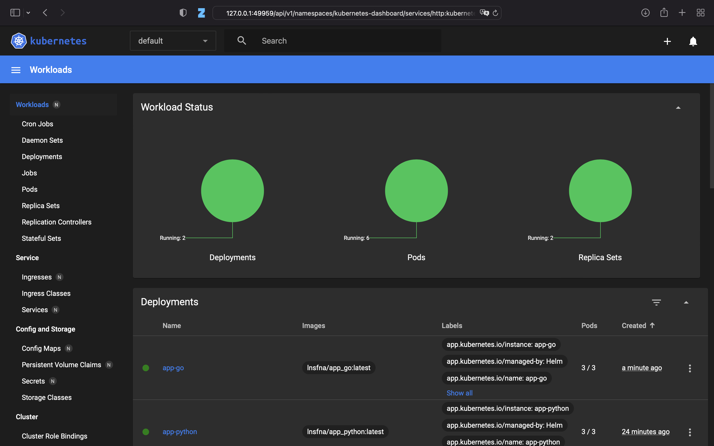

# Helm charts

## App Python

<details>

Firstly run `helm create app-py-helm`

When new directory created change `values.yaml` file for python application

Then install helm chart
```shell
$ helm install python app-py-helm
NAME: python
LAST DEPLOYED: Tue Nov  7 21:18:15 2023
NAMESPACE: default
STATUS: deployed
REVISION: 1
NOTES:
1. Get the application URL by running these commands:
  export POD_NAME=$(kubectl get pods --namespace default -l "app.kubernetes.io/name=python-app-helm,app.kubernetes.io/instance=python" -o jsonpath="{.items[0].metadata.name}")
  export CONTAINER_PORT=$(kubectl get pod --namespace default $POD_NAME -o jsonpath="{.spec.containers[0].ports[0].containerPort}")
  echo "Visit http://127.0.0.1:8080 to use your application"
  kubectl --namespace default port-forward $POD_NAME 8080:$CONTAINER_PORT
```

Using the following commands check the availability  

```shell
$ kubectl get pods,svc
NAME                                      READY   STATUS    RESTARTS        AGE
pod/python-app-py-helm-5b8f45876b-9p7vv   1/1     Running   4 (25s ago)     2m24s

NAME                         TYPE           CLUSTER-IP       EXTERNAL-IP   PORT(S)          AGE
service/kubernetes           ClusterIP      10.96.0.1        <none>        443/TCP          7d2h
service/python-app-py-helm   ClusterIP      10.100.231.185   <none>        8082/TCP         2m24s
```

```shell
$ minikube service python-app-py-helm     
|-----------|--------------------|-------------|--------------|
| NAMESPACE |        NAME        | TARGET PORT |     URL      |
|-----------|--------------------|-------------|--------------|
| default   | python-app-py-helm |             | No node port |
|-----------|--------------------|-------------|--------------|
😿  service default/python-app-py-helm has no node port
🏃  Starting tunnel for service python-app-py-helm.
|-----------|--------------------|-------------|------------------------|
| NAMESPACE |        NAME        | TARGET PORT |          URL           |
|-----------|--------------------|-------------|------------------------|
| default   | python-app-py-helm |             | http://127.0.0.1:50193 |
|-----------|--------------------|-------------|------------------------|
🎉  Opening service default/python-app-py-helm in default browser...
```
</details>

## App Javascript

<details>

Apply the same steps as for the Python app

```shell
$ helm install python app-py-helm
NAME: javascript
LAST DEPLOYED: Tue Nov  7 21:38:49 2023
NAMESPACE: default
STATUS: deployed
REVISION: 1
NOTES:
1. Get the application URL by running these commands:
  export POD_NAME=$(kubectl get pods --namespace default -l "app.kubernetes.io/name=app-js-helm,app.kubernetes.io/instance=javascript" -o jsonpath="{.items[0].metadata.name}")
  export CONTAINER_PORT=$(kubectl get pod --namespace default $POD_NAME -o jsonpath="{.spec.containers[0].ports[0].containerPort}")
  echo "Visit http://127.0.0.1:8080 to use your application"
  kubectl --namespace default port-forward $POD_NAME 8080:$CONTAINER_PORT
```

```shell
$ kubectl get pods,svc
NAME                                          READY   STATUS             RESTARTS         AGE
pod/javascript-app-js-helm-8587f655d4-5dngt   1/1     Running            0                2m8s
pod/python-app-py-helm-5b8f45876b-9p7vv       1/1     Running            6 (3m9s ago)     20m34s

NAME                             TYPE           CLUSTER-IP       EXTERNAL-IP   PORT(S)          AGE
service/javascript-app-js-helm   ClusterIP      10.99.234.175    <none>        8081/TCP         2m8s
service/kubernetes               ClusterIP      10.96.0.1        <none>        443/TCP          7d10h
service/python-app-py-helm       ClusterIP      10.100.231.185   <none>        8082/TCP         20m34s
```

```shell
$ minikube service javascript-app-js-helm
|-----------|------------------------|-------------|--------------|
| NAMESPACE |          NAME          | TARGET PORT |     URL      |
|-----------|------------------------|-------------|--------------|
| default   | javascript-app-js-helm |             | No node port |
|-----------|------------------------|-------------|--------------|
😿  service default/javascript-app-js-helm has no node port
🏃  Starting tunnel for service javascript-app-js-helm.
|-----------|------------------------|-------------|------------------------|
| NAMESPACE |          NAME          | TARGET PORT |          URL           |
|-----------|------------------------|-------------|------------------------|
| default   | javascript-app-js-helm |             | http://127.0.0.1:64985 |
|-----------|------------------------|-------------|------------------------|
🎉  Opening service default/javascript-app-js-helm in default browser...
```

</details>

## Minikube dashboard

To check the dashboard run the command `minikube dashboard`



## Helm hooks

### Provided Output

```shell
$ kubectl get po                        
NAME                                       READY   STATUS             RESTARTS       AGE
javascript-app-js-helm-8587f655d4-5dngt    0/1     Running            0              37m
preinstall-hook                            0/1     Completed          0              1m31s
postinstall-hook                           0/1     Completed          0              1m58s
python-app-py-helm-5b8f45876b-9p7vv        0/1     Running            6 (3m ago)     1h7m
```


b. `kubectl describe po preinstall-hook`

```shell
Name:             preinstall-hook
Namespace:        default
Priority:         0
Service Account:  default
Node:             minikube/192.168.49.2
Start Time:       Tue, 07 Nov 2023 21:32:13 +0300
Labels:           <none>
Annotations:      helm.sh/hook: pre-install
Status:           Succeeded
IP:               10.244.0.42
IPs:
  IP:  10.244.0.42
Containers:
  pre-install-container:
    Container ID:  docker://67479226cefa7de945495e8bfe2cac745abda157b4e75c6e138d5a7dc85a5930
    Image:         busybox
    Image ID:      docker-pullable://busybox@sha256:3fbc632167424a6d997e74f52b878d7cc478225cffac6bc977eedfe51c7f4e79
    Port:          <none>
    Host Port:     <none>
    Command:
      sh
      -c
      echo The pre-install hook is running && sleep 20
    State:          Terminated
      Reason:       Completed
      Exit Code:    0
      Started:      Tue, 07 Nov 2023 21:32:24 +0300
      Finished:     Tue, 07 Nov 2023 21:32:44 +0300
    Ready:          False
    Restart Count:  0
    Environment:    <none>
    Mounts:
      /var/run/secrets/kubernetes.io/serviceaccount from kube-api-access-vvhrd (ro)
Conditions:
  Type              Status
  Initialized       True 
  Ready             False 
  ContainersReady   False 
  PodScheduled      True 
Volumes:
  kube-api-access-vvhrd:
    Type:                    Projected (a volume that contains injected data from multiple sources)
    TokenExpirationSeconds:  3607
    ConfigMapName:           kube-root-ca.crt
    ConfigMapOptional:       <nil>
    DownwardAPI:             true
QoS Class:                   BestEffort
Node-Selectors:              <none>
Tolerations:                 node.kubernetes.io/not-ready:NoExecute op=Exists for 300s
                             node.kubernetes.io/unreachable:NoExecute op=Exists for 300s
Events:
  Type    Reason     Age    From               Message
  ----    ------     ----   ----               -------
  Normal  Scheduled  2m30s  default-scheduler  Successfully assigned default/preinstall-hook to minikube
  Normal  Pulled     2m29s  kubelet            Container image "busybox" already present on machine
  Normal  Created    2m29s  kubelet            Created container pre-install-container
  Normal  Started    2m29s  kubelet            Started container pre-install-container
```

c. `kubectl describe po postinstall-hook`

```shell
Name:             postinstall-hook
Namespace:        default
Priority:         0
Service Account:  default
Node:             minikube/192.168.49.2
Start Time:       Tue, 07 Nov 2023 21:32:33 +0300
Labels:           <none>
Annotations:      helm.sh/hook: post-install
Status:           Succeeded
IP:               10.244.0.42
IPs:
  IP:  10.244.0.42
Containers:
  pre-install-container:
    Container ID:  docker://df3b58b0617a7de945495e8bfe204fb75abda157b4e75c6e138d5a7dc85a5930
    Image:         busybox  
    Image ID:      docker-pullable://busybox@sha256:3fbc632167424a6d997e74f52b878d7cc478225cffac6bc977eedfe51c7f4e79
    Port:          <none>
    Host Port:     <none>
    Command:
      sh
      -c
      echo The post-install hook is running && sleep 15
    State:          Terminated
      Reason:       Completed
      Exit Code:    0
      Started:      Tue, 07 Nov 2023 21:32:36 +0300
      Finished:     Tue, 07 Nov 2023 21:32:58 +0300
    Ready:          False
    Restart Count:  0
    Environment:    <none>
    Mounts:
      /var/run/secrets/kubernetes.io/serviceaccount from kube-api-access-vvhrd (ro)
Conditions:
  Type              Status
  Initialized       True 
  Ready             False 
  ContainersReady   False 
  PodScheduled      True 
Volumes:
  kube-api-access-vvhrd:
    Type:                    Projected (a volume that contains injected data from multiple sources)
    TokenExpirationSeconds:  3607
    ConfigMapName:           kube-root-ca.crt
    ConfigMapOptional:       <nil>
    DownwardAPI:             true
QoS Class:                   BestEffort
Node-Selectors:              <none>
Tolerations:                 node.kubernetes.io/not-ready:NoExecute op=Exists for 300s
                             node.kubernetes.io/unreachable:NoExecute op=Exists for 300s
Events:
  Type    Reason     Age   From               Message
  ----    ------     ----  ----               -------
  Normal  Scheduled  91s   default-scheduler  Successfully assigned default/postinstall-hook to minikube
  Normal  Pulling    91s   kubelet            Pulling image "busybox"
  Normal  Pulled     89s   kubelet            Successfully pulled image "busybox" in 1.422698542s (1.422713335s including waiting)
  Normal  Created    89s   kubelet            Created container post-install-container
  Normal  Started    89s   kubelet            Started container post-install-container
```

