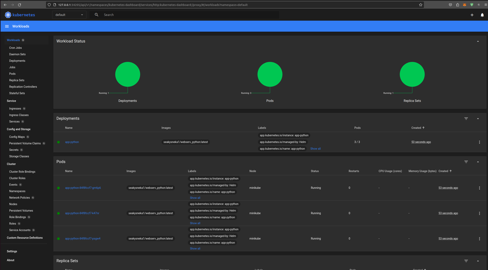
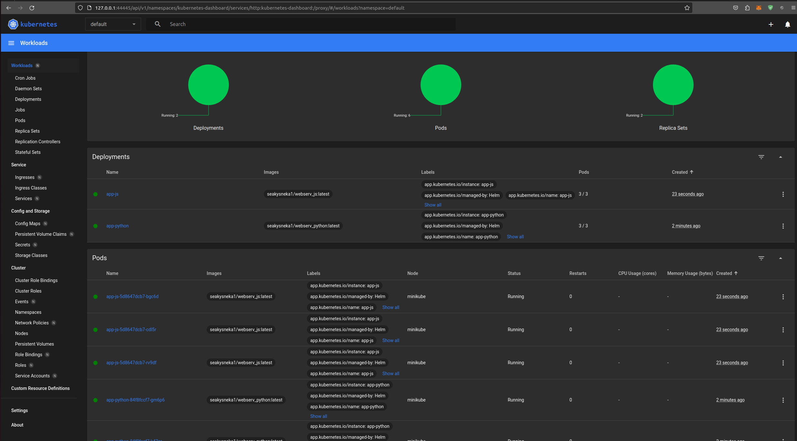

# App python
1. Helm create

```bash
helm create app-python
```

2. Helm install

```bash
helm install python app-python
```

```bash
NAME: app-python
LAST DEPLOYED: Wed Nov  8 00:16:08 2023
NAMESPACE: default
STATUS: deployed
REVISION: 1
NOTES:
1. Get the application URL by running these commands:
  http://app-python/
```

3. Check service availability
```bash
kubectl get pods,svc
```

```bash
NAME                             READY   STATUS    RESTARTS   AGE
pod/app-python-84f8fccf7-5mdr6   1/1     Running   0          11s
pod/app-python-84f8fccf7-c84pr   1/1     Running   0          11s
pod/app-python-84f8fccf7-mjgvb   1/1     Running   0          11s

NAME                 TYPE           CLUSTER-IP     EXTERNAL-IP   PORT(S)          AGE
service/app-python   LoadBalancer   10.102.78.40   <pending>     8000:30331/TCP   11s
service/kubernetes   ClusterIP      10.96.0.1      <none>        443/TCP          26s
```


Check using minicube:
```bash
minikube service app-python
```

```bash
|-----------|------------|-------------|---------------------------|
| NAMESPACE |    NAME    | TARGET PORT |            URL            |
|-----------|------------|-------------|---------------------------|
| default   | app-python | http/8000   | http://192.168.49.2:30331 |
|-----------|------------|-------------|---------------------------|
🎉  Opening service default/app-python in default browser...
```
# App javascript

1. Helm create

```bash
helm create app-js
```

2. Helm install

```bash
helm install app-js app-js/
```

```bash
NAME: app-js
LAST DEPLOYED: Wed Nov  8 00:27:31 2023
NAMESPACE: default
STATUS: deployed
REVISION: 1
NOTES:
1. Get the application URL by running these commands:
  http://app-js/
```

3. Check service availability
```bash
kubectl get pods,svc
```

```bash
NAME                          READY   STATUS    RESTARTS   AGE
pod/app-js-5d8647dcb7-9rb2k   1/1     Running   0          23s
pod/app-js-5d8647dcb7-dqvms   1/1     Running   0          23s
pod/app-js-5d8647dcb7-lkc2f   1/1     Running   0          23s

NAME                 TYPE           CLUSTER-IP      EXTERNAL-IP   PORT(S)          AGE
service/app-js       LoadBalancer   10.102.228.37   <pending>     5000:30071/TCP   23s
service/kubernetes   ClusterIP      10.96.0.1       <none>        443/TCP          2m32s
```


Check using minicube:
```bash
minikube service app-python
```

```bash
|-----------|--------|-------------|---------------------------|
| NAMESPACE |  NAME  | TARGET PORT |            URL            |
|-----------|--------|-------------|---------------------------|
| default   | app-js | http/5000   | http://192.168.49.2:30071 |
|-----------|--------|-------------|---------------------------|
🎉  Opening service default/app-js in default browser...
```

# Minikube dashboard
## App python

## App javascript + app python 


# Helm Chart Hooks

I have created two files in app-python/templates/ 
- pre-install-hook.yaml
- post-install-hook.yaml

## Verify hooks 
- Linter:
```bash
helm lint app-python/
```

```bash
==> Linting app-python/
[INFO] Chart.yaml: icon is recommended

1 chart(s) linted, 0 chart(s) failed
```
- Pods of helm hooks
```bash
kubectl get po
```

```bash
NAME                                 READY   STATUS      RESTARTS   AGE
python-app-python-5b5d55c6cf-dzkkv   1/1     Running     0          23s
python-app-python-5b5d55c6cf-n6cbx   1/1     Running     0          23s
python-app-python-5b5d55c6cf-z8wxm   1/1     Running     0          23s
python-post-install-wlnkp            0/1     Completed   0          23s
python-pre-install-bxwd9             0/1     Completed   0          39s
```
- Describe preinstall
```bash
kubectl describe po python-pre-install
```

```bash
Name:             python-pre-install-bxwd9
Namespace:        default
Priority:         0
Service Account:  default
Node:             minikube/192.168.49.2
Start Time:       Wed, 08 Nov 2023 00:56:13 +0300
Labels:           app.kubernetes.io/instance=python
                  app.kubernetes.io/managed-by=Helm
                  batch.kubernetes.io/controller-uid=04008a3e-1800-4102-9a56-36781fcc09b5
                  batch.kubernetes.io/job-name=python-pre-install
                  controller-uid=04008a3e-1800-4102-9a56-36781fcc09b5
                  helm.sh/chart=app-python-0.1.0
                  job-name=python-pre-install
Annotations:      <none>
Status:           Succeeded
IP:               10.244.0.53
IPs:
  IP:           10.244.0.53
Controlled By:  Job/python-pre-install
Containers:
  pre-install-job:
    Container ID:  docker://d9148068b26b47ff7b4b44297cdff471a381509be5e54814943529212ee89e69
    Image:         busybox
    Image ID:      docker-pullable://busybox@sha256:3fbc632167424a6d997e74f52b878d7cc478225cffac6bc977eedfe51c7f4e79
    Port:          <none>
    Host Port:     <none>
    Command:
      sh
      -c
      echo The pre-install hook is running && sleep 10
    State:          Terminated
      Reason:       Completed
      Exit Code:    0
      Started:      Wed, 08 Nov 2023 00:56:16 +0300
      Finished:     Wed, 08 Nov 2023 00:56:26 +0300
    Ready:          False
    Restart Count:  0
    Environment:    <none>
    Mounts:
      /var/run/secrets/kubernetes.io/serviceaccount from kube-api-access-bj9vq (ro)
Conditions:
  Type              Status
  Initialized       True 
  Ready             False 
  ContainersReady   False 
  PodScheduled      True 
Volumes:
  kube-api-access-bj9vq:
    Type:                    Projected (a volume that contains injected data from multiple sources)
    TokenExpirationSeconds:  3607
    ConfigMapName:           kube-root-ca.crt
    ConfigMapOptional:       <nil>
    DownwardAPI:             true
QoS Class:                   BestEffort
Node-Selectors:              <none>
Tolerations:                 node.kubernetes.io/not-ready:NoExecute op=Exists for 300s
                             node.kubernetes.io/unreachable:NoExecute op=Exists for 300s
Events:
  Type    Reason     Age   From               Message
  ----    ------     ----  ----               -------
  Normal  Scheduled  66s   default-scheduler  Successfully assigned default/python-pre-install-bxwd9 to minikube
  Normal  Pulling    66s   kubelet            Pulling image "busybox"
  Normal  Pulled     64s   kubelet            Successfully pulled image "busybox" in 1.916281566s (1.916290362s including waiting)
  Normal  Created    64s   kubelet            Created container pre-install-job
  Normal  Started    64s   kubelet            Started container pre-install-job
```
- Describe postinstall

```bash
kubectl describe po python-post-install
```

```bash
Name:             python-post-install-wlnkp
Namespace:        default
Priority:         0
Service Account:  default
Node:             minikube/192.168.49.2
Start Time:       Wed, 08 Nov 2023 00:56:29 +0300
Labels:           app.kubernetes.io/instance=python
                  app.kubernetes.io/managed-by=Helm
                  batch.kubernetes.io/controller-uid=a53f6a85-dfe1-4ac0-9a7e-b13455a32e97
                  batch.kubernetes.io/job-name=python-post-install
                  controller-uid=a53f6a85-dfe1-4ac0-9a7e-b13455a32e97
                  helm.sh/chart=app-python-0.1.0
                  job-name=python-post-install
Annotations:      <none>
Status:           Succeeded
IP:               10.244.0.57
IPs:
  IP:           10.244.0.57
Controlled By:  Job/python-post-install
Containers:
  post-install-job:
    Container ID:  docker://0d71dcccb4fbac5d35f8068bf4c2761e00e1f84ba6bd696f00970ccd1dde550c
    Image:         busybox
    Image ID:      docker-pullable://busybox@sha256:3fbc632167424a6d997e74f52b878d7cc478225cffac6bc977eedfe51c7f4e79
    Port:          <none>
    Host Port:     <none>
    Command:
      sh
      -c
      echo The post-install hook is running && sleep 10
    State:          Terminated
      Reason:       Completed
      Exit Code:    0
      Started:      Wed, 08 Nov 2023 00:56:31 +0300
      Finished:     Wed, 08 Nov 2023 00:56:41 +0300
    Ready:          False
    Restart Count:  0
    Environment:    <none>
    Mounts:
      /var/run/secrets/kubernetes.io/serviceaccount from kube-api-access-97kss (ro)
Conditions:
  Type              Status
  Initialized       True 
  Ready             False 
  ContainersReady   False 
  PodScheduled      True 
Volumes:
  kube-api-access-97kss:
    Type:                    Projected (a volume that contains injected data from multiple sources)
    TokenExpirationSeconds:  3607
    ConfigMapName:           kube-root-ca.crt
    ConfigMapOptional:       <nil>
    DownwardAPI:             true
QoS Class:                   BestEffort
Node-Selectors:              <none>
Tolerations:                 node.kubernetes.io/not-ready:NoExecute op=Exists for 300s
                             node.kubernetes.io/unreachable:NoExecute op=Exists for 300s
Events:
  Type    Reason     Age   From               Message
  ----    ------     ----  ----               -------
  Normal  Scheduled  91s   default-scheduler  Successfully assigned default/python-post-install-wlnkp to minikube
  Normal  Pulling    91s   kubelet            Pulling image "busybox"
  Normal  Pulled     89s   kubelet            Successfully pulled image "busybox" in 1.833109254s (1.833117159s including waiting)
  Normal  Created    89s   kubelet            Created container post-install-job
  Normal  Started    89s   kubelet            Started container post-install-job

```

# Hook delete policy

I added this line to pre and post install hooks:
```bash
"helm.sh/hook-delete-policy": hook-succeeded
```

Lets check that delete policy is done:
```bash
"helm.sh/hook-delete-policy": hook-succeeded
```

```bash
NAME                                 READY   STATUS      RESTARTS   AGE
python-app-python-5b5d55c6cf-dzkkv   1/1     Running     0          5m3s
python-app-python-5b5d55c6cf-n6cbx   1/1     Running     0          5m3s
python-app-python-5b5d55c6cf-z8wxm   1/1     Running     0          5m3s
```

```bash
kubectl get pods,svc
```

```bash
NAME                                     READY   STATUS      RESTARTS   AGE
pod/python-app-python-5b5d55c6cf-dzkkv   1/1     Running     0          7m41s
pod/python-app-python-5b5d55c6cf-n6cbx   1/1     Running     0          7m41s
pod/python-app-python-5b5d55c6cf-z8wxm   1/1     Running     0          7m41s

NAME                        TYPE           CLUSTER-IP       EXTERNAL-IP   PORT(S)          AGE
service/kubernetes          ClusterIP      10.96.0.1        <none>        443/TCP          12m
service/python-app-python   LoadBalancer   10.102.250.126   <pending>     8000:31994/TCP   7m41s
```