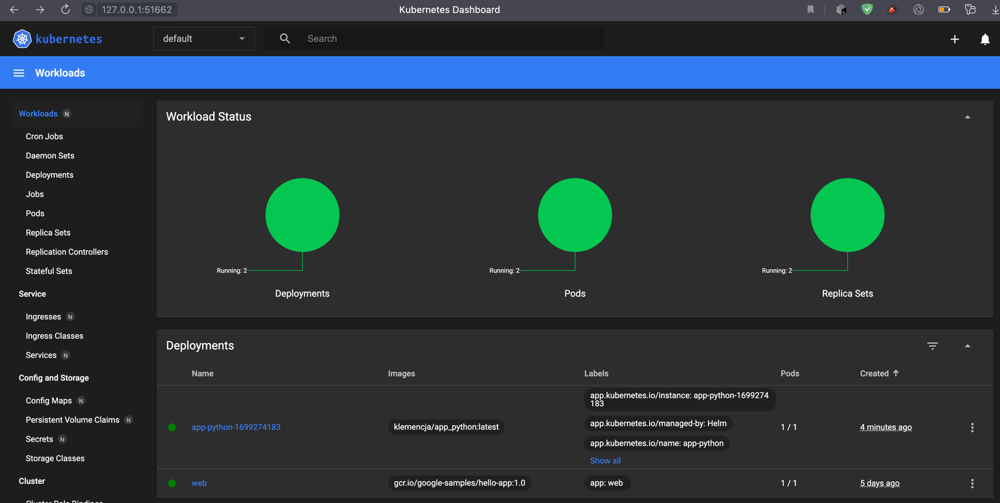

## Serving helm chart


`kubectl get pods,svc`
 
```
NAME                                         READY   STATUS    RESTARTS      AGE
pod/app-python-1699274183-699595b64c-z54jl   1/1     Running   0             4m14s
pod/web-548f6458b5-2vbr4                     1/1     Running   3 (10m ago)   5d18h

NAME                            TYPE        CLUSTER-IP      EXTERNAL-IP   PORT(S)    AGE
service/app-python-1699274183   ClusterIP   10.99.217.112   <none>        8000/TCP   4m14s
service/kubernetes              ClusterIP   10.96.0.1       <none>        443/TCP    8d
```