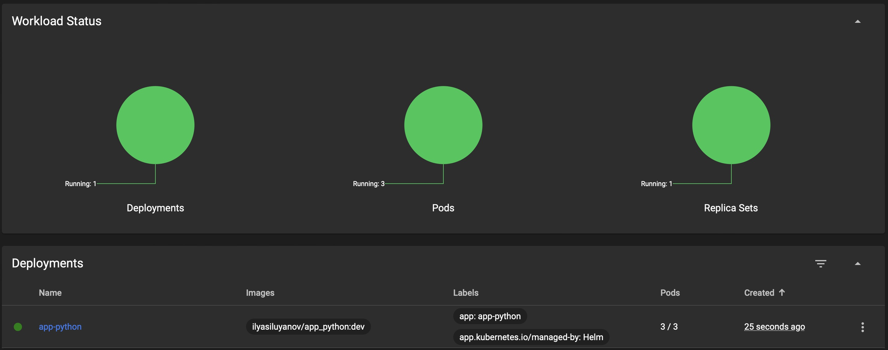
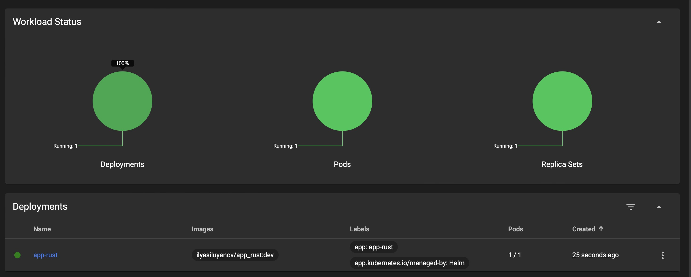
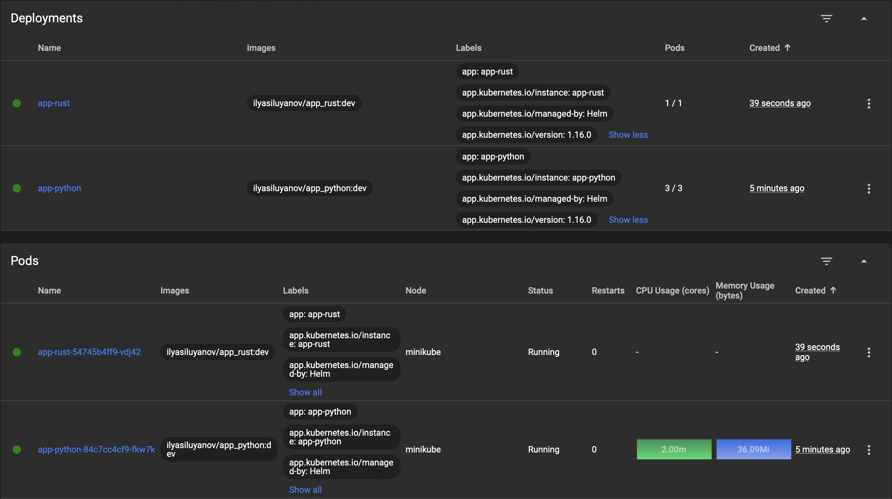

# Helm charts

## Install chart

```bash
> helm install --values k8s/charts/app-python/values.yaml app-python k8s/charts/app-python
NAME: app-python
LAST DEPLOYED: Mon Nov  6 19:44:55 2023
NAMESPACE: default
STATUS: deployed
REVISION: 1
TEST SUITE: None
```

## Verify accessibility

```bash
> minikube service app-python
|-----------|------------|-------------|--------------|
| NAMESPACE   | NAME         | TARGET PORT   | URL            |
| ----------- | ------------ | ------------- | -------------- |
| default     | app-python   |               | No node port   |
| ----------- | ------------ | ------------- | -------------- |
😿  service default/app-python has no node port

> curl -H "Host: app-python" http://$(minikube ip)/notes/
[]
```

```bash
> kubectl get pods,svc
NAME                              READY   STATUS    RESTARTS   AGE
pod/app-python-644dc76bd9-5fwrw   1/1     Running   0          2m40s
pod/app-python-644dc76bd9-dnzkl   1/1     Running   0          2m40s
pod/app-python-644dc76bd9-l59zk   1/1     Running   0          2m40s

NAME                 TYPE        CLUSTER-IP      EXTERNAL-IP   PORT(S)   AGE
service/app-python   ClusterIP   10.104.80.172   <none>        80/TCP    2m40s
service/kubernetes   ClusterIP   10.96.0.1       <none>        443/TCP   7h36m
```



## Bonus task (same steps as above)

```bash
> helm install --values k8s/charts/app-rust/values.yaml app-rust k8s/charts/app-rust
NAME: app-rust
LAST DEPLOYED: Mon Nov  6 19:49:10 2023
NAMESPACE: default
STATUS: deployed
REVISION: 1
TEST SUITE: None

> curl -H "Host: app-rust" http://$(minikube ip)/
2023-11-06T22:49:30.669622537+03:00

> kubectl get po,svc
NAME                            READY   STATUS    RESTARTS   AGE
pod/app-rust-5d9cfbd577-shrrq   1/1     Running   0          40s

NAME                 TYPE        CLUSTER-IP      EXTERNAL-IP   PORT(S)   AGE
service/app-rust     ClusterIP   10.105.34.147   <none>        80/TCP    40s
service/kubernetes   ClusterIP   10.96.0.1       <none>        443/TCP   7h38m
```



## Task 2

```bash
> helm lint app-python
==> Linting app-python
[INFO] Chart.yaml: icon is recommended

1 chart(s) linted, 0 chart(s) failed
```

```bash
> helm install --values k8s/charts/app-python/values.yaml app-python k8s/charts/app-python
NAME: app-python
LAST DEPLOYED: Mon Nov  6 20:03:30 2023
NAMESPACE: default
STATUS: deployed
REVISION: 1
TEST SUITE: None

> kubectl get po
NAME                          READY   STATUS      RESTARTS   AGE
app-python-644dc76bd9-7cfzw   1/1     Running     0          2m2s
app-python-644dc76bd9-fkw4q   1/1     Running     0          2m2s
app-python-644dc76bd9-kxwdc   1/1     Running     0          2m2s
postinstall-hook              0/1     Completed   0          2m2s
preinstall-hook               0/1     Completed   0          2m28s

> kubectl describe po preinstall-hook postinstall-hook
Name:             preinstall-hook
Namespace:        default
Priority:         0
Service Account:  default
Node:             minikube/192.168.49.2
Start Time:       Mon, 06 Nov 2023 20:03:30 +0000
Labels:           <none>
Annotations:      helm.sh/hook: pre-install
Status:           Succeeded
IP:               10.244.0.20
IPs:
  IP:  10.244.0.20
Containers:
  pre-install-container:
    Container ID:  docker://b9dd2307e582cb28c949712e5a3ccc0db2b96879653bb32e85098bc3240de139
    Image:         busybox
    Image ID:      docker-pullable://busybox@sha256:3fbc632167424a6d997e74f52b878d7cc478225cffac6bc977eedfe51c7f4e79
    Port:          <none>
    Host Port:     <none>
    Command:
      sh
      -c
      echo The pre-install hook is running && sleep 20
    State:          Terminated
      Reason:       Completed
      Exit Code:    0
      Started:      Mon, 06 Nov 2023 20:03:34 +0000
      Finished:     Mon, 06 Nov 2023 20:03:54 +0000
    Ready:          False
    Restart Count:  0
    Environment:    <none>
    Mounts:
      /var/run/secrets/kubernetes.io/serviceaccount from kube-api-access-rdh7l (ro)
Conditions:
  Type              Status
  Initialized       True 
  Ready             False 
  ContainersReady   False 
  PodScheduled      True 
Volumes:
  kube-api-access-rdh7l:
    Type:                    Projected (a volume that contains injected data from multiple sources)
    TokenExpirationSeconds:  3607
    ConfigMapName:           kube-root-ca.crt
    ConfigMapOptional:       <nil>
    DownwardAPI:             true
QoS Class:                   BestEffort
Node-Selectors:              <none>
Tolerations:                 node.kubernetes.io/not-ready:NoExecute op=Exists for 300s
                             node.kubernetes.io/unreachable:NoExecute op=Exists for 300s
Events:
  Type    Reason     Age    From               Message
  ----    ------     ----   ----               -------
  Normal  Scheduled  3m     default-scheduler  Successfully assigned default/preinstall-hook to minikube
  Normal  Pulling    2m59s  kubelet            Pulling image "busybox"
  Normal  Pulled     2m56s  kubelet            Successfully pulled image "busybox" in 2.935606188s (2.935618889s including waiting)
  Normal  Created    2m56s  kubelet            Created container pre-install-container
  Normal  Started    2m56s  kubelet            Started container pre-install-container


Name:             postinstall-hook
Namespace:        default
Priority:         0
Service Account:  default
Node:             minikube/192.168.49.2
Start Time:       Mon, 06 Nov 2023 20:03:56 +0000
Labels:           <none>
Annotations:      helm.sh/hook: post-install
Status:           Succeeded
IP:               10.244.0.24
IPs:
  IP:  10.244.0.24
Containers:
  post-install-container:
    Container ID:  docker://822cd7f7df4076167e4de66213ff025bcb9932a6b9a99d08710aa4c025460d8e
    Image:         busybox
    Image ID:      docker-pullable://busybox@sha256:3fbc632167424a6d997e74f52b878d7cc478225cffac6bc977eedfe51c7f4e79
    Port:          <none>
    Host Port:     <none>
    Command:
      sh
      -c
      echo The post-install hook is running && sleep 15
    State:          Terminated
      Reason:       Completed
      Exit Code:    0
      Started:      Mon, 06 Nov 2023 20:04:02 +0000
      Finished:     Mon, 06 Nov 2023 20:04:17 +0000
    Ready:          False
    Restart Count:  0
    Environment:    <none>
    Mounts:
      /var/run/secrets/kubernetes.io/serviceaccount from kube-api-access-g2fvf (ro)
Conditions:
  Type              Status
  Initialized       True 
  Ready             False 
  ContainersReady   False 
  PodScheduled      True 
Volumes:
  kube-api-access-g2fvf:
    Type:                    Projected (a volume that contains injected data from multiple sources)
    TokenExpirationSeconds:  3607
    ConfigMapName:           kube-root-ca.crt
    ConfigMapOptional:       <nil>
    DownwardAPI:             true
QoS Class:                   BestEffort
Node-Selectors:              <none>
Tolerations:                 node.kubernetes.io/not-ready:NoExecute op=Exists for 300s
                             node.kubernetes.io/unreachable:NoExecute op=Exists for 300s
Events:
  Type    Reason     Age    From               Message
  ----    ------     ----   ----               -------
  Normal  Scheduled  2m34s  default-scheduler  Successfully assigned default/postinstall-hook to minikube
  Normal  Pulling    2m34s  kubelet            Pulling image "busybox"
  Normal  Pulled     2m28s  kubelet            Successfully pulled image "busybox" in 1.389608888s (5.3423011s including waiting)
  Normal  Created    2m28s  kubelet            Created container post-install-container
  Normal  Started    2m28s  kubelet            Started container post-install-container
```

After delete policy applied:

```bash
> kubectl delete po preinstall-hook postinstall-hook
pod "preinstall-hook" deleted
pod "postinstall-hook" deleted

> helm uninstall app-python
release "app-python" uninstalled

> helm install --values k8s/charts/app-python/values.yaml app-python k8s/charts/app-python
NAME: app-python
LAST DEPLOYED: Mon Nov  6 20:08:48 2023
NAMESPACE: default
STATUS: deployed
REVISION: 1
TEST SUITE: None

> kubectl get po
NAME                          READY   STATUS    RESTARTS   AGE
app-python-644dc76bd9-nsd5w   1/1     Running   0          43s
app-python-644dc76bd9-sxdv4   1/1     Running   0          43s
app-python-644dc76bd9-v8ddj   1/1     Running   0          43s
```

## Create library chart

```bash
> helm dependency update app-python
Saving 1 charts
Deleting outdated chart

> helm dependency update app-rust
Saving 1 charts
Deleting outdated charts
```


