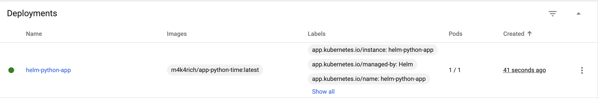
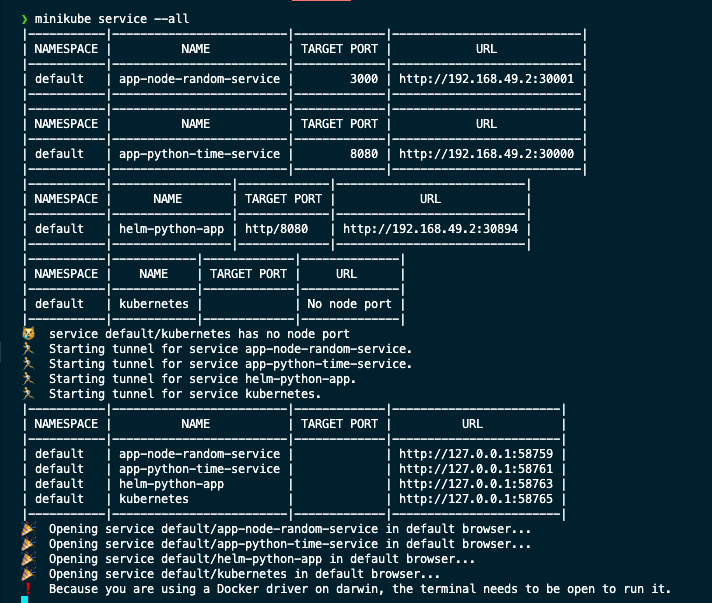

### First Task ( helm install & helm-python-app )

Here is the output of command `helm install helm-python-app helm-node-app`

```sh
❯ helm install helm-python-app helm-python-app
NAME: helm-python-app
LAST DEPLOYED: Wed Nov  8 10:12:22 2023
NAMESPACE: default
STATUS: deployed
REVISION: 1
NOTES:
1. Get the application URL by running these commands:
  export NODE_PORT=$(kubectl get --namespace default -o jsonpath="{.spec.ports[0].nodePort}" services helm-python-app)
  export NODE_IP=$(kubectl get nodes --namespace default -o jsonpath="{.items[0].status.addresses[0].address}")
  echo http://$NODE_IP:$NODE_PORT
```



The app is accessible, checked using `minikube service --all`



Output of the commands :

```sh
❯ kubectl get svc
NAME                      TYPE        CLUSTER-IP       EXTERNAL-IP   PORT(S)          AGE
app-node-random-service   NodePort    10.97.7.65       <none>        3000:30001/TCP   7d1h
app-python-time-service   NodePort    10.111.250.122   <none>        8080:30000/TCP   7d1h
helm-python-app           NodePort    10.99.38.211     <none>        8080:30894/TCP   3m12s
kubernetes                ClusterIP   10.96.0.1        <none>        443/TCP          7d1h
❯ kubectl get pods
NAME                               READY   STATUS    RESTARTS       AGE
app-node-random-9896c4944-24b4f    1/1     Running   4 (123m ago)   7d
app-node-random-9896c4944-bclb2    1/1     Running   4 (123m ago)   7d
app-node-random-9896c4944-pqwmm    1/1     Running   4 (123m ago)   7d
app-node-random-9896c4944-x7svp    1/1     Running   4 (123m ago)   7d
app-python-time-7c5695b94-hkt4b    1/1     Running   6 (123m ago)   7d1h
app-python-time-7c5695b94-jwdrv    1/1     Running   6 (123m ago)   7d1h
app-python-time-7c5695b94-lhs5n    1/1     Running   6 (123m ago)   7d1h
app-python-time-7c5695b94-zk79k    1/1     Running   6 (123m ago)   7d1h
helm-python-app-67577fd5f4-25dq7   1/1     Running   0              3m17s
```

# Task 2: Helm Chart Hooks

The helm chart hooks are implemented !

Linting the helm-python-app, installing dry-runs and installing

```sh
❯ helm lint helm-python-app
==> Linting helm-python-app
[INFO] Chart.yaml: icon is recommended

1 chart(s) linted, 0 chart(s) failed
❯ helm install --dry-run helm-python-app ./helm-python-app
NAME: helm-python-app
LAST DEPLOYED: Wed Nov  8 10:37:35 2023
NAMESPACE: default
STATUS: pending-install
REVISION: 1
HOOKS:
---
# Source: helm-python-app/templates/post-install-hook.yaml
apiVersion: v1
kind: Pod
metadata:
   name: postinstall-hook
   annotations:
       "helm.sh/hook": "post-install"
spec:
  containers:
  - name: post-install-container
    image: busybox
    imagePullPolicy: Always
    command: ['sh', '-c', 'echo The post-install hook is running && sleep 15' ]
  restartPolicy: Never
  terminationGracePeriodSeconds: 0
---
# Source: helm-python-app/templates/pre-install-hook.yaml
apiVersion: v1
kind: Pod
metadata:
   name: preinstall-hook
   annotations:
       "helm.sh/hook": "pre-install"
spec:
  containers:
  - name: pre-install-container
    image: busybox
    imagePullPolicy: IfNotPresent
    command: ['sh', '-c', 'echo The pre-install hook is running && sleep 20' ]
  restartPolicy: Never
  terminationGracePeriodSeconds: 0
---
# Source: helm-python-app/templates/tests/test-connection.yaml
apiVersion: v1
kind: Pod
metadata:
  name: "helm-python-app-test-connection"
  labels:
    helm.sh/chart: helm-python-app-0.1.0
    app.kubernetes.io/name: helm-python-app
    app.kubernetes.io/instance: helm-python-app
    app.kubernetes.io/version: "1.16.0"
    app.kubernetes.io/managed-by: Helm
  annotations:
    "helm.sh/hook": test
spec:
  containers:
    - name: wget
      image: busybox
      command: ['wget']
      args: ['helm-python-app:8080']
  restartPolicy: Never
MANIFEST:
---
# Source: helm-python-app/templates/serviceaccount.yaml
apiVersion: v1
kind: ServiceAccount
metadata:
  name: helm-python-app
  labels:
    helm.sh/chart: helm-python-app-0.1.0
    app.kubernetes.io/name: helm-python-app
    app.kubernetes.io/instance: helm-python-app
    app.kubernetes.io/version: "1.16.0"
    app.kubernetes.io/managed-by: Helm
automountServiceAccountToken: true
---
# Source: helm-python-app/templates/service.yaml
apiVersion: v1
kind: Service
metadata:
  name: helm-python-app
  labels:
    helm.sh/chart: helm-python-app-0.1.0
    app.kubernetes.io/name: helm-python-app
    app.kubernetes.io/instance: helm-python-app
    app.kubernetes.io/version: "1.16.0"
    app.kubernetes.io/managed-by: Helm
spec:
  type: NodePort
  ports:
    - port: 8080
      targetPort: http
      protocol: TCP
      name: http
  selector:
    app.kubernetes.io/name: helm-python-app
    app.kubernetes.io/instance: helm-python-app
---
# Source: helm-python-app/templates/deployment.yaml
apiVersion: apps/v1
kind: Deployment
metadata:
  name: helm-python-app
  labels:
    helm.sh/chart: helm-python-app-0.1.0
    app.kubernetes.io/name: helm-python-app
    app.kubernetes.io/instance: helm-python-app
    app.kubernetes.io/version: "1.16.0"
    app.kubernetes.io/managed-by: Helm
spec:
  replicas: 1
  selector:
    matchLabels:
      app.kubernetes.io/name: helm-python-app
      app.kubernetes.io/instance: helm-python-app
  template:
    metadata:
      labels:
        helm.sh/chart: helm-python-app-0.1.0
        app.kubernetes.io/name: helm-python-app
        app.kubernetes.io/instance: helm-python-app
        app.kubernetes.io/version: "1.16.0"
        app.kubernetes.io/managed-by: Helm
    spec:
      serviceAccountName: helm-python-app
      securityContext:
        {}
      containers:
        - name: helm-python-app
          securityContext:
            {}
          image: "m4k4rich/app-python-time:latest"
          imagePullPolicy: IfNotPresent
          ports:
            - name: http
              containerPort: 8080
              protocol: TCP
          livenessProbe:
            httpGet:
              path: /
              port: http
          readinessProbe:
            httpGet:
              path: /
              port: http
          resources:
            {}

NOTES:
1. Get the application URL by running these commands:
  export NODE_PORT=$(kubectl get --namespace default -o jsonpath="{.spec.ports[0].nodePort}" services helm-python-app)
  export NODE_IP=$(kubectl get nodes --namespace default -o jsonpath="{.items[0].status.addresses[0].address}")
  echo http://$NODE_IP:$NODE_PORT
❯ helm install helm-python-app ./helm-python-app
NAME: helm-python-app
LAST DEPLOYED: Wed Nov  8 10:38:11 2023
NAMESPACE: default
STATUS: deployed
REVISION: 1
NOTES:
1. Get the application URL by running these commands:
  export NODE_PORT=$(kubectl get --namespace default -o jsonpath="{.spec.ports[0].nodePort}" services helm-python-app)
  export NODE_IP=$(kubectl get nodes --namespace default -o jsonpath="{.items[0].status.addresses[0].address}")
  echo http://$NODE_IP:$NODE_PORT
```

The result of the execution is going to be the following

```sh
❯ kubectl get pods
NAME                               READY   STATUS      RESTARTS      AGE
app-node-random-9896c4944-24b4f    1/1     Running     6 (10m ago)   7d1h
app-node-random-9896c4944-bclb2    1/1     Running     6 (10m ago)   7d1h
app-node-random-9896c4944-pqwmm    1/1     Running     6 (10m ago)   7d1h
app-node-random-9896c4944-x7svp    1/1     Running     6 (10m ago)   7d1h
app-python-time-7c5695b94-hkt4b    1/1     Running     8 (10m ago)   7d1h
app-python-time-7c5695b94-jwdrv    1/1     Running     8 (10m ago)   7d1h
app-python-time-7c5695b94-lhs5n    1/1     Running     8 (10m ago)   7d1h
app-python-time-7c5695b94-zk79k    1/1     Running     8 (10m ago)   7d1h
helm-python-app-67577fd5f4-cdkqg   1/1     Running     0             91s
postinstall-hook                   0/1     Completed   0             91s
preinstall-hook                    0/1     Completed   0             115s
```

Descriptions of postinstall hook:

```sh
❯ kubectl describe pod postinstall-hook
Name:             postinstall-hook
Namespace:        default
Priority:         0
Service Account:  default
Node:             minikube/192.168.49.2
Start Time:       Wed, 08 Nov 2023 10:38:36 +0300
Labels:           <none>
Annotations:      helm.sh/hook: post-install
Status:           Succeeded
IP:               10.244.0.84
IPs:
  IP:  10.244.0.84
Containers:
  post-install-container:
    Container ID:  docker://9432a528c98bbf4fa085c321962d8daa9bd2e120be055696c531fd8901b04a11
    Image:         busybox
    Image ID:      docker-pullable://busybox@sha256:3fbc632167424a6d997e74f52b878d7cc478225cffac6bc977eedfe51c7f4e79
    Port:          <none>
    Host Port:     <none>
    Command:
      sh
      -c
      echo The post-install hook is running && sleep 15
    State:          Terminated
      Reason:       Completed
      Exit Code:    0
      Started:      Wed, 08 Nov 2023 10:38:38 +0300
      Finished:     Wed, 08 Nov 2023 10:38:53 +0300
    Ready:          False
    Restart Count:  0
    Environment:    <none>
    Mounts:
      /var/run/secrets/kubernetes.io/serviceaccount from kube-api-access-hs4pn (ro)
Conditions:
  Type              Status
  Initialized       True
  Ready             False
  ContainersReady   False
  PodScheduled      True
Volumes:
  kube-api-access-hs4pn:
    Type:                    Projected (a volume that contains injected data from multiple sources)
    TokenExpirationSeconds:  3607
    ConfigMapName:           kube-root-ca.crt
    ConfigMapOptional:       <nil>
    DownwardAPI:             true
QoS Class:                   BestEffort
Node-Selectors:              <none>
Tolerations:                 node.kubernetes.io/not-ready:NoExecute op=Exists for 300s
                             node.kubernetes.io/unreachable:NoExecute op=Exists for 300s
Events:
  Type    Reason     Age    From               Message
  ----    ------     ----   ----               -------
  Normal  Scheduled  2m13s  default-scheduler  Successfully assigned default/postinstall-hook to minikube
  Normal  Pulling    2m13s  kubelet            Pulling image "busybox"
  Normal  Pulled     2m11s  kubelet            Successfully pulled image "busybox" in 1.890552126s (1.890575542s including waiting)
  Normal  Created    2m11s  kubelet            Created container post-install-container
  Normal  Started    2m11s  kubelet            Started container post-install-container
```

Description of preinstall hook :

```sh
❯ kubectl describe pod preinstall-hook
Name:             preinstall-hook
Namespace:        default
Priority:         0
Service Account:  default
Node:             minikube/192.168.49.2
Start Time:       Wed, 08 Nov 2023 10:38:11 +0300
Labels:           <none>
Annotations:      helm.sh/hook: pre-install
Status:           Succeeded
IP:               10.244.0.82
IPs:
IP:  10.244.0.82
Containers:
pre-install-container:
  Container ID:  docker://6059b538045a6496b89499b8828f7077be6a9a736c201bf9485e3683a808b237
  Image:         busybox
  Image ID:      docker-pullable://busybox@sha256:3fbc632167424a6d997e74f52b878d7cc478225cffac6bc977eedfe51c7f4e79
  Port:          <none>
  Host Port:     <none>
  Command:
    sh
    -c
    echo The pre-install hook is running && sleep 20
  State:          Terminated
    Reason:       Completed
    Exit Code:    0
    Started:      Wed, 08 Nov 2023 10:38:14 +0300
    Finished:     Wed, 08 Nov 2023 10:38:34 +0300
  Ready:          False
  Restart Count:  0
  Environment:    <none>
  Mounts:
    /var/run/secrets/kubernetes.io/serviceaccount from kube-api-access-rs4dr (ro)
Conditions:
Type              Status
Initialized       True
Ready             False
ContainersReady   False
PodScheduled      True
Volumes:
kube-api-access-rs4dr:
  Type:                    Projected (a volume that contains injected data from multiple sources)
  TokenExpirationSeconds:  3607
  ConfigMapName:           kube-root-ca.crt
  ConfigMapOptional:       <nil>
  DownwardAPI:             true
QoS Class:                   BestEffort
Node-Selectors:              <none>
Tolerations:                 node.kubernetes.io/not-ready:NoExecute op=Exists for 300s
                           node.kubernetes.io/unreachable:NoExecute op=Exists for 300s
Events:
Type    Reason     Age    From               Message
----    ------     ----   ----               -------
Normal  Scheduled  3m39s  default-scheduler  Successfully assigned default/preinstall-hook to minikube
Normal  Pulling    3m39s  kubelet            Pulling image "busybox"
Normal  Pulled     3m37s  kubelet            Successfully pulled image "busybox" in 1.752479751s (1.75249946s including waiting)
Normal  Created    3m37s  kubelet            Created container pre-install-container
Normal  Started    3m37s  kubelet            Started container pre-install-container
```

Hook delete policy is implemented.

# Bonus
