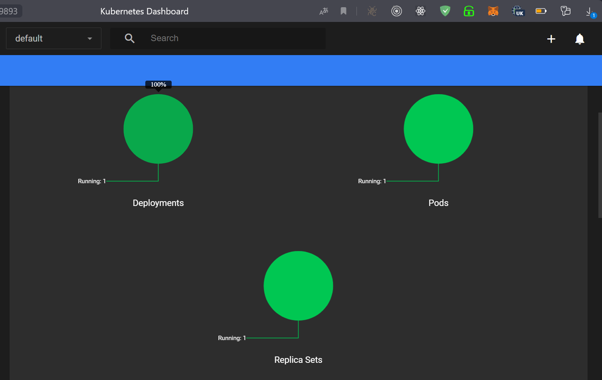

# HELM

## Workloads



## Check app access
```sh
PS C:\Users\Angel\OneDrive\Рабочий стол\repositories\dev-ops-inno\k8s> minikube service app-python  
|-----------|------------|-------------|---------------------------|
| NAMESPACE |    NAME    | TARGET PORT |            URL            |
|-----------|------------|-------------|---------------------------|
| default   | app-python | http/5000   | http://192.168.49.2:31421 |
|-----------|------------|-------------|---------------------------|
🏃  Starting tunnel for service app-python.
|-----------|------------|-------------|------------------------|
| NAMESPACE |    NAME    | TARGET PORT |          URL           |
|-----------|------------|-------------|------------------------|
| default   | app-python |             | http://127.0.0.1:50376 |
|-----------|------------|-------------|------------------------|
🎉  Opening service default/app-python in default browser...
❗  Because you are using a Docker driver on windows, the terminal needs to be open to run it.
```

```sh
PS C:\Users\Angel\OneDrive\Рабочий стол\repositories\dev-ops-inno\k8s> kubectl get pods,svc
NAME                              READY   STATUS    RESTARTS   AGE
pod/app-python-58b7b99dfd-pqrlm   1/1     Running   0          7m54s

NAME                 TYPE           CLUSTER-IP      EXTERNAL-IP   PORT(S)          AGE
service/app-python   LoadBalancer   10.97.218.159   <pending>     5000:31421/TCP   7m54s
service/kubernetes   ClusterIP      10.96.0.1       <none>        443/TCP          6d12h
```

## Hooks

```sh
PS C:\Users\Angel\OneDrive\Рабочий стол\repositories\dev-ops-inno\k8s> kubectl get pods,svc
NAME                              READY   STATUS      RESTARTS   AGE
pod/app-python-58b7b99dfd-qvxqs   1/1     Running     0          6m39s
pod/postinstall-hook              0/1     Completed   0          6m39s
pod/preinstall-hook               0/1     Completed   0          7m2s

NAME                 TYPE           CLUSTER-IP      EXTERNAL-IP   PORT(S)          AGE
service/app-python   LoadBalancer   10.107.171.73   <pending>     5000:30144/TCP   6m39s
service/kubernetes   ClusterIP      10.96.0.1       <none>        443/TCP          6d13h
```

### Troubleshooting

```sh
PS C:\Users\Angel\OneDrive\Рабочий стол\repositories\dev-ops-inno\k8s> helm lint .\app-python\
==> Linting .\app-python\
[INFO] Chart.yaml: icon is recommended

1 chart(s) linted, 0 chart(s) failed
```

```sh
PS C:\Users\Angel\OneDrive\Рабочий стол\repositories\dev-ops-inno\k8s> helm install --dry-run app-python .\app-python\ 
NAME: app-python
LAST DEPLOYED: Wed Nov  8 13:29:41 2023
NAMESPACE: default
STATUS: pending-install
REVISION: 1
HOOKS:
---
# Source: app-python/templates/post-install-hook.yaml
apiVersion: v1
kind: Pod
metadata:
   name: postinstall-hook
   annotations:
       "helm.sh/hook": "post-install"
spec:
  containers:
  - name: post-install-container
    image: busybox
    imagePullPolicy: Always
    command: ['sh', '-c', 'echo The post-install hook is running && sleep 15' ]
  restartPolicy: Never
  terminationGracePeriodSeconds: 0
---
# Source: app-python/templates/pre-install-hook.yaml
apiVersion: v1
kind: Pod
metadata:
   name: preinstall-hook
   annotations:
       "helm.sh/hook": "pre-install"
spec:
  containers:
  - name: pre-install-container
    image: busybox
    imagePullPolicy: IfNotPresent
    command: ['sh', '-c', 'echo The pre-install hook is running && sleep 20' ]
  restartPolicy: Never
  terminationGracePeriodSeconds: 0
---
# Source: app-python/templates/tests/test-connection.yaml
apiVersion: v1
kind: Pod
metadata:
  name: "app-python-test-connection"
  labels:
    helm.sh/chart: app-python-0.1.0
    app.kubernetes.io/name: app-python
    app.kubernetes.io/instance: app-python
    app.kubernetes.io/version: "1.16.0"
    app.kubernetes.io/managed-by: Helm
  annotations:
    "helm.sh/hook": test
spec:
  containers:
    - name: wget
      image: busybox
      command: ['wget']
      args: ['app-python:5000']
  restartPolicy: Never
MANIFEST:
---
# Source: app-python/templates/serviceaccount.yaml
apiVersion: v1
kind: ServiceAccount
metadata:
  name: app-python
  labels:
    helm.sh/chart: app-python-0.1.0
    app.kubernetes.io/name: app-python
    app.kubernetes.io/instance: app-python
    app.kubernetes.io/version: "1.16.0"
    app.kubernetes.io/managed-by: Helm
  automountServiceAccountToken: true
---
# Source: app-python/templates/service.yaml
apiVersion: v1
kind: Service
metadata:
  name: app-python
  labels:
    helm.sh/chart: app-python-0.1.0
    app.kubernetes.io/name: app-python
    app.kubernetes.io/instance: app-python
    app.kubernetes.io/version: "1.16.0"
    app.kubernetes.io/managed-by: Helm
spec:
  type: LoadBalancer
  ports:
    - port: 5000
      targetPort: http
      protocol: TCP
      name: http
  selector:
    app.kubernetes.io/name: app-python
    app.kubernetes.io/instance: app-python
---
# Source: app-python/templates/deployment.yaml
apiVersion: apps/v1
kind: Deployment
metadata:
  name: app-python
  labels:
    helm.sh/chart: app-python-0.1.0
    app.kubernetes.io/name: app-python
    app.kubernetes.io/instance: app-python
    app.kubernetes.io/version: "1.16.0"
    app.kubernetes.io/managed-by: Helm
spec:
  replicas: 1
  selector:
    matchLabels:
      app.kubernetes.io/name: app-python
      app.kubernetes.io/instance: app-python
  template:
    metadata:
      labels:
        helm.sh/chart: app-python-0.1.0
        app.kubernetes.io/name: app-python
        app.kubernetes.io/instance: app-python
        app.kubernetes.io/version: "1.16.0"
        app.kubernetes.io/managed-by: Helm
    spec:
      serviceAccountName: app-python
      securityContext:
        {}
      containers:
        - name: app-python
          securityContext:
            {}
          image: "bellissimo/devops-inno-daniil-okrug:latest"
          imagePullPolicy: IfNotPresent
          ports:
            - name: http
              containerPort: 5000
              protocol: TCP
          livenessProbe:
            httpGet:
              path: /
              port: http
          readinessProbe:
            httpGet:
              path: /
              port: http
            timeoutSeconds: 30
            initialDelaySeconds: 30
          resources:
            {}
---
# Source: app-python/templates/ingress.yaml
apiVersion: networking.k8s.io/v1
kind: Ingress
metadata:
  name: app-python
  labels:
    helm.sh/chart: app-python-0.1.0
    app.kubernetes.io/name: app-python
    app.kubernetes.io/instance: app-python
    app.kubernetes.io/version: "1.16.0"
    app.kubernetes.io/managed-by: Helm
spec:
  rules:
    - host: "python.app"
      http:
        paths:
          - path: /
            pathType: ImplementationSpecific
            backend:
              service:
                name: app-python
                port:
                  number: 5000

NOTES:
1. Get the application URL by running these commands:
  http://python.app/
PS C:\Users\Angel\OneDrive\Рабочий стол\repositories\dev-ops-inno\k8s> helm install app-python .\app-python\          
Error: INSTALLATION FAILED: cannot re-use a name that is still in use
PS C:\Users\Angel\OneDrive\Рабочий стол\repositories\dev-ops-inno\k8s> helm delete app-python               
release "app-python" uninstalled
PS C:\Users\Angel\OneDrive\Рабочий стол\repositories\dev-ops-inno\k8s> helm install app-python .\app-python\
W1108 13:30:37.490261   75860 warnings.go:70] unknown field "metadata.automountServiceAccountToken"
NAME: app-python
LAST DEPLOYED: Wed Nov  8 13:30:13 2023
NAMESPACE: default
STATUS: deployed
REVISION: 1
NOTES:
1. Get the application URL by running these commands:
  http://python.app/
```

```sh
PS C:\Users\Angel\OneDrive\Рабочий стол\repositories\dev-ops-inno\k8s> kubectl get po      
NAME                          READY   STATUS      RESTARTS   AGE
app-python-58b7b99dfd-qvxqs   1/1     Running     0          8m31s
postinstall-hook              0/1     Completed   0          8m31s
preinstall-hook               0/1     Completed   0          8m54s
```

### Preinstall-hook 

```sh
PS C:\Users\Angel\OneDrive\Рабочий стол\repositories\dev-ops-inno\k8s> kubectl get po      
NAME                          READY   STATUS      RESTARTS   AGE
app-python-58b7b99dfd-qvxqs   1/1     Running     0          8m31s
postinstall-hook              0/1     Completed   0          8m31s
preinstall-hook               0/1     Completed   0          8m54s
```

```sh
PS C:\Users\Angel\OneDrive\Рабочий стол\repositories\dev-ops-inno\k8s> kubectl describe po preinstall-hook            
Name:             preinstall-hook
Namespace:        default
Priority:         0
Service Account:  default
Node:             minikube/192.168.49.2
Start Time:       Wed, 08 Nov 2023 13:30:14 +0300
Labels:           <none>
Annotations:      helm.sh/hook: pre-install
Status:           Succeeded
IP:               10.244.0.20
IPs:
  IP:  10.244.0.20
Containers:
  pre-install-container:
    Container ID:  docker://9de3f6a1096ea5ca9149be28fa534be7fe598cd1572638e9d0e9616ae09235e7
    Image:         busybox
    Image ID:      docker-pullable://busybox@sha256:3fbc632167424a6d997e74f52b878d7cc478225cffac6bc977eedfe51c7f4e79
    Port:          <none>
    Host Port:     <none>
    Command:
      sh
      -c
      echo The pre-install hook is running && sleep 20
    State:          Terminated
      Reason:       Completed
      Exit Code:    0
      Started:      Wed, 08 Nov 2023 13:30:15 +0300
      Finished:     Wed, 08 Nov 2023 13:30:35 +0300
    Ready:          False
    Restart Count:  0
    Environment:    <none>
    Mounts:
      /var/run/secrets/kubernetes.io/serviceaccount from kube-api-access-tz9n2 (ro)
Conditions:
  Type              Status
  Initialized       True
  Ready             False
  ContainersReady   False
  PodScheduled      True
Volumes:
  kube-api-access-tz9n2:
    Type:                    Projected (a volume that contains injected data from multiple sources)
    TokenExpirationSeconds:  3607
    ConfigMapName:           kube-root-ca.crt
    ConfigMapOptional:       <nil>
    DownwardAPI:             true
QoS Class:                   BestEffort
Node-Selectors:              <none>
Tolerations:                 node.kubernetes.io/not-ready:NoExecute op=Exists for 300s
                             node.kubernetes.io/unreachable:NoExecute op=Exists for 300s
Events:
  Type    Reason     Age    From               Message
  ----    ------     ----   ----               -------
  Normal  Scheduled  3m26s  default-scheduler  Successfully assigned default/preinstall-hook to minikube
  Normal  Pulled     3m25s  kubelet            Container image "busybox" already present on machine
  Normal  Created    3m25s  kubelet            Created container pre-install-container
  Normal  Started    3m25s  kubelet            Started container pre-install-container
```

### Postinstall-hook 

```sh
PS C:\Users\Angel\OneDrive\Рабочий стол\repositories\dev-ops-inno\k8s> kubectl describe po postinstall-hook
Name:             postinstall-hook
Namespace:        default
Priority:         0
Service Account:  default
Node:             minikube/192.168.49.2
Start Time:       Wed, 08 Nov 2023 13:30:37 +0300
Labels:           <none>
Annotations:      helm.sh/hook: post-install
Status:           Succeeded
IP:               10.244.0.22
IPs:
  IP:  10.244.0.22
Containers:
  post-install-container:
    Container ID:  docker://f894f61d00744c55a60b3999ffd2ff9f7b05eb7f8f38b8d2e81de45912619f5a
    Image:         busybox
    Image ID:      docker-pullable://busybox@sha256:3fbc632167424a6d997e74f52b878d7cc478225cffac6bc977eedfe51c7f4e79
    Port:          <none>
    Host Port:     <none>
    Command:
      sh
      -c
      echo The post-install hook is running && sleep 15
    State:          Terminated
      Reason:       Completed
      Exit Code:    0
      Started:      Wed, 08 Nov 2023 13:31:48 +0300
      Finished:     Wed, 08 Nov 2023 13:32:03 +0300
    Ready:          False
    Restart Count:  0
    Environment:    <none>
    Mounts:
      /var/run/secrets/kubernetes.io/serviceaccount from kube-api-access-ztcs2 (ro)
Conditions:
  Type              Status
  Initialized       True
  Ready             False
  ContainersReady   False
  PodScheduled      True
Volumes:
  kube-api-access-ztcs2:
    Type:                    Projected (a volume that contains injected data from multiple sources)
    TokenExpirationSeconds:  3607
    ConfigMapName:           kube-root-ca.crt
    ConfigMapOptional:       <nil>
    DownwardAPI:             true
QoS Class:                   BestEffort
Node-Selectors:              <none>
Tolerations:                 node.kubernetes.io/not-ready:NoExecute op=Exists for 300s
                             node.kubernetes.io/unreachable:NoExecute op=Exists for 300s
Events:
  Type     Reason     Age                   From               Message
  ----     ------     ----                  ----               -------
  Normal   Scheduled  4m12s                 default-scheduler  Successfully assigned default/postinstall-hook to minikube
  Normal   Pulling    3m4s (x3 over 4m11s)  kubelet            Pulling image "busybox"
  Normal   Pulled     3m1s                  kubelet            Successfully pulled image "busybox" in 2.397094385s (2.397127049s including waiting)  
  Normal   Created    3m1s                  kubelet            Created container post-install-container
  Normal   Started    3m1s                  kubelet            Started container post-install-container
```