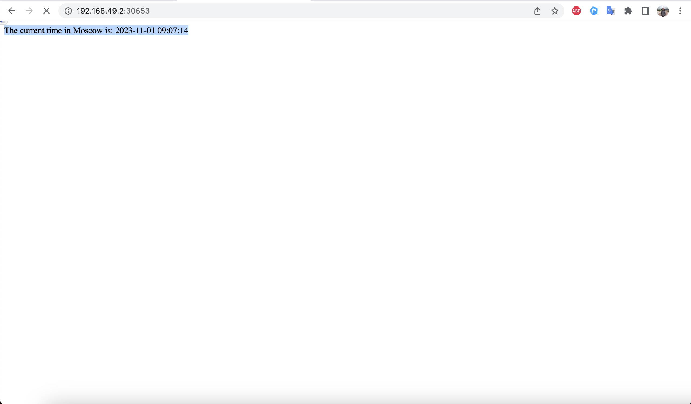

```
helm install py-app ./python-app-helm/
```

```
NAME: py-app
LAST DEPLOYED: Wed Nov  8 20:08:42 2023
NAMESPACE: default
STATUS: deployed
REVISION: 1
NOTES:
1. Get the application URL by running these commands:
     NOTE: It may take a few minutes for the LoadBalancer IP to be available.
           You can watch the status of by running 'kubectl get --namespace default svc -w py-app-python-app'
  export SERVICE_IP=$(kubectl get svc --namespace default py-app-python-app --template "{{ range (index .status.loadBalancer.ingress 0) }}{{.}}{{ end }}")
  echo http://$SERVICE_IP:8080
```


```
helm install cpp-app ./cpp-app-helm/
```

```
NAME: cpp-app
LAST DEPLOYED: Wed Nov  8 20:09:35 2023
NAMESPACE: default
STATUS: deployed
REVISION: 1
NOTES:
1. Get the application URL by running these commands:
     NOTE: It may take a few minutes for the LoadBalancer IP to be available.
           You can watch the status of by running 'kubectl get --namespace default svc -w cpp-app'
  export SERVICE_IP=$(kubectl get svc --namespace default cpp-app --template "{{ range (index .status.loadBalancer.ingress 0) }}{{.}}{{ end }}")
  echo http://$SERVICE_IP:8080
```

```
kubectl get pods,svc
```
```
NAME                                     READY   STATUS    RESTARTS   AGE
pod/cpp-app-77456ff975-bgfcb             1/1     Running   0          8m35s
pod/cpp-app-77456ff975-kdjqs             1/1     Running   0          8m35s
pod/cpp-app-77456ff975-mj2p2             1/1     Running   0          8m36s
pod/py-app-python-app-57c5b9b6fb-5ch4f   1/1     Running   0          9m28s
pod/py-app-python-app-57c5b9b6fb-6n685   1/1     Running   0          9m28s
pod/py-app-python-app-57c5b9b6fb-p6q9g   1/1     Running   0          9m28s

NAME                        TYPE           CLUSTER-IP      EXTERNAL-IP     PORT(S)          AGE
service/cpp-app             LoadBalancer   10.102.99.166   10.102.99.166   8080:30125/TCP   8m36s
service/kubernetes          ClusterIP      10.96.0.1       <none>          443/TCP          12m
service/py-app-python-app   LoadBalancer   10.101.38.176   10.101.38.176   8080:30732/TCP   9m28s
```




```
minikube service --all
```
```
|-----------|---------|-------------|---------------------------|
| NAMESPACE |  NAME   | TARGET PORT |            URL            |
|-----------|---------|-------------|---------------------------|
| default   | cpp-app | http/8080   | http://192.168.49.2:30125 |
|-----------|---------|-------------|---------------------------|
|-----------|------------|-------------|--------------|
| NAMESPACE |    NAME    | TARGET PORT |     URL      |
|-----------|------------|-------------|--------------|
| default   | kubernetes |             | No node port |
|-----------|------------|-------------|--------------|
😿  service default/kubernetes has no node port
|-----------|-------------------|-------------|---------------------------|
| NAMESPACE |       NAME        | TARGET PORT |            URL            |
|-----------|-------------------|-------------|---------------------------|
| default   | py-app-python-app | http/8080   | http://192.168.49.2:30732 |
|-----------|-------------------|-------------|---------------------------|
🎉  Opening service default/cpp-app in default browser...
🎉  Opening service default/py-app-python-app in default browser...
```

```
muurrk@muurrk-PS42-8M:~/core-course-labs/k8s$ helm lint python-app-helm/
==> Linting python-app-helm/
[INFO] Chart.yaml: icon is recommended

1 chart(s) linted, 0 chart(s) failed
muurrk@muurrk-PS42-8M:~/core-course-labs/k8s$ helm lint cpp-app-helm/
==> Linting cpp-app-helm/
[INFO] Chart.yaml: icon is recommended

1 chart(s) linted, 0 chart(s) failed
```

```
muurrk@muurrk-PS42-8M:~/core-course-labs/k8s$ helm install --dry-run python-hook ./python-app-helm/
NAME: python-hook
LAST DEPLOYED: Wed Nov  8 20:56:01 2023
NAMESPACE: default
STATUS: pending-install
REVISION: 1
HOOKS:
---
# Source: python-app/templates/post-install-hook.yaml
apiVersion: v1
kind: Pod
metadata:
   name: postinstall-hook
   annotations:
       "helm.sh/hook": "post-install"
spec:
  containers:
  - name: post-install-container
    image: busybox
    imagePullPolicy: Always
    command: ['sh', '-c', 'echo The post-install hook is running && sleep 15' ]
  restartPolicy: Never
  terminationGracePeriodSeconds: 0
---
# Source: python-app/templates/pre-install-hook.yaml
apiVersion: v1
kind: Pod
metadata:
   name: preinstall-hook
   annotations:
       "helm.sh/hook": "pre-install"
spec:
  containers:
  - name: pre-install-container
    image: busybox
    imagePullPolicy: IfNotPresent
    command: ['sh', '-c', 'echo The pre-install hook is running && sleep 20' ]
  restartPolicy: Never
  terminationGracePeriodSeconds: 0
---
# Source: python-app/templates/tests/test-connection.yaml
apiVersion: v1
kind: Pod
metadata:
  name: "python-hook-python-app-test-connection"
  labels:
    helm.sh/chart: python-app-0.1.0
    app.kubernetes.io/name: python-app
    app.kubernetes.io/instance: python-hook
    app.kubernetes.io/version: "1.16.0"
    app.kubernetes.io/managed-by: Helm
  annotations:
    "helm.sh/hook": test
spec:
  containers:
    - name: wget
      image: busybox
      command: ['wget']
      args: ['python-hook-python-app:8080']
  restartPolicy: Never
MANIFEST:
---
# Source: python-app/templates/serviceaccount.yaml
apiVersion: v1
kind: ServiceAccount
metadata:
  name: python-hook-python-app
  labels:
    helm.sh/chart: python-app-0.1.0
    app.kubernetes.io/name: python-app
    app.kubernetes.io/instance: python-hook
    app.kubernetes.io/version: "1.16.0"
    app.kubernetes.io/managed-by: Helm
automountServiceAccountToken: true
---
# Source: python-app/templates/service.yaml
apiVersion: v1
kind: Service
metadata:
  name: python-hook-python-app
  labels:
    helm.sh/chart: python-app-0.1.0
    app.kubernetes.io/name: python-app
    app.kubernetes.io/instance: python-hook
    app.kubernetes.io/version: "1.16.0"
    app.kubernetes.io/managed-by: Helm
spec:
  type: LoadBalancer
  ports:
    - port: 8080
      targetPort: http
      protocol: TCP
      name: http
  selector:
    app.kubernetes.io/name: python-app
    app.kubernetes.io/instance: python-hook
---
# Source: python-app/templates/deployment.yaml
apiVersion: apps/v1
kind: Deployment
metadata:
  name: python-hook-python-app
  labels:
    helm.sh/chart: python-app-0.1.0
    app.kubernetes.io/name: python-app
    app.kubernetes.io/instance: python-hook
    app.kubernetes.io/version: "1.16.0"
    app.kubernetes.io/managed-by: Helm
spec:
  replicas: 3
  selector:
    matchLabels:
      app.kubernetes.io/name: python-app
      app.kubernetes.io/instance: python-hook
  template:
    metadata:
      labels:
        helm.sh/chart: python-app-0.1.0
        app.kubernetes.io/name: python-app
        app.kubernetes.io/instance: python-hook
        app.kubernetes.io/version: "1.16.0"
        app.kubernetes.io/managed-by: Helm
    spec:
      serviceAccountName: python-hook-python-app
      securityContext:
        {}
      containers:
        - name: python-app
          securityContext:
            {}
          image: "muurrk/myapp:latest"
          imagePullPolicy: IfNotPresent
          ports:
            - name: http
              containerPort: 8080
              protocol: TCP
          # livenessProbe:
          #   httpGet:
          #     path: /
          #     port: http
          # readinessProbe:
          #   httpGet:
          #     path: /
          #     port: http
          resources:
            {}

NOTES:
1. Get the application URL by running these commands:
     NOTE: It may take a few minutes for the LoadBalancer IP to be available.
           You can watch the status of by running 'kubectl get --namespace default svc -w python-hook-python-app'
  export SERVICE_IP=$(kubectl get svc --namespace default python-hook-python-app --template "{{ range (index .status.loadBalancer.ingress 0) }}{{.}}{{ end }}")
  echo http://$SERVICE_IP:8080
```

```
muurrk@muurrk-PS42-8M:~/core-course-labs/k8s$ helm install --dry-run python-hook ./python-app-helm/
NAME: python-hook
LAST DEPLOYED: Wed Nov  8 20:56:01 2023
NAMESPACE: default
STATUS: pending-install
REVISION: 1
HOOKS:
---
# Source: python-app/templates/post-install-hook.yaml
apiVersion: v1
kind: Pod
metadata:
   name: postinstall-hook
   annotations:
       "helm.sh/hook": "post-install"
spec:
  containers:
  - name: post-install-container
    image: busybox
    imagePullPolicy: Always
    command: ['sh', '-c', 'echo The post-install hook is running && sleep 15' ]
  restartPolicy: Never
  terminationGracePeriodSeconds: 0
---
# Source: python-app/templates/pre-install-hook.yaml
apiVersion: v1
kind: Pod
metadata:
   name: preinstall-hook
   annotations:
       "helm.sh/hook": "pre-install"
spec:
  containers:
  - name: pre-install-container
    image: busybox
    imagePullPolicy: IfNotPresent
    command: ['sh', '-c', 'echo The pre-install hook is running && sleep 20' ]
  restartPolicy: Never
  terminationGracePeriodSeconds: 0
---
# Source: python-app/templates/tests/test-connection.yaml
apiVersion: v1
kind: Pod
metadata:
  name: "python-hook-python-app-test-connection"
  labels:
    helm.sh/chart: python-app-0.1.0
    app.kubernetes.io/name: python-app
    app.kubernetes.io/instance: python-hook
    app.kubernetes.io/version: "1.16.0"
    app.kubernetes.io/managed-by: Helm
  annotations:
    "helm.sh/hook": test
spec:
  containers:
    - name: wget
      image: busybox
      command: ['wget']
      args: ['python-hook-python-app:8080']
  restartPolicy: Never
MANIFEST:
---
# Source: python-app/templates/serviceaccount.yaml
apiVersion: v1
kind: ServiceAccount
metadata:
  name: python-hook-python-app
  labels:
    helm.sh/chart: python-app-0.1.0
    app.kubernetes.io/name: python-app
    app.kubernetes.io/instance: python-hook
    app.kubernetes.io/version: "1.16.0"
    app.kubernetes.io/managed-by: Helm
automountServiceAccountToken: true
---
# Source: python-app/templates/service.yaml
apiVersion: v1
kind: Service
metadata:
  name: python-hook-python-app
  labels:
    helm.sh/chart: python-app-0.1.0
    app.kubernetes.io/name: python-app
    app.kubernetes.io/instance: python-hook
    app.kubernetes.io/version: "1.16.0"
    app.kubernetes.io/managed-by: Helm
spec:
  type: LoadBalancer
  ports:
    - port: 8080
      targetPort: http
      protocol: TCP
      name: http
  selector:
    app.kubernetes.io/name: python-app
    app.kubernetes.io/instance: python-hook
---
# Source: python-app/templates/deployment.yaml
apiVersion: apps/v1
kind: Deployment
metadata:
  name: python-hook-python-app
  labels:
    helm.sh/chart: python-app-0.1.0
    app.kubernetes.io/name: python-app
    app.kubernetes.io/instance: python-hook
    app.kubernetes.io/version: "1.16.0"
    app.kubernetes.io/managed-by: Helm
spec:
  replicas: 3
  selector:
    matchLabels:
      app.kubernetes.io/name: python-app
      app.kubernetes.io/instance: python-hook
  template:
    metadata:
      labels:
        helm.sh/chart: python-app-0.1.0
        app.kubernetes.io/name: python-app
        app.kubernetes.io/instance: python-hook
        app.kubernetes.io/version: "1.16.0"
        app.kubernetes.io/managed-by: Helm
    spec:
      serviceAccountName: python-hook-python-app
      securityContext:
        {}
      containers:
        - name: python-app
          securityContext:
            {}
          image: "muurrk/myapp:latest"
          imagePullPolicy: IfNotPresent
          ports:
            - name: http
              containerPort: 8080
              protocol: TCP
          # livenessProbe:
          #   httpGet:
          #     path: /
          #     port: http
          # readinessProbe:
          #   httpGet:
          #     path: /
          #     port: http
          resources:
            {}

NOTES:
1. Get the application URL by running these commands:
     NOTE: It may take a few minutes for the LoadBalancer IP to be available.
           You can watch the status of by running 'kubectl get --namespace default svc -w python-hook-python-app'
  export SERVICE_IP=$(kubectl get svc --namespace default python-hook-python-app --template "{{ range (index .status.loadBalancer.ingress 0) }}{{.}}{{ end }}")
  echo http://$SERVICE_IP:8080
```

```
muurrk@muurrk-PS42-8M:~/core-course-labs/k8s$ helm install cpp-hook ./cpp-app-helm/
NAME: cpp-hook
LAST DEPLOYED: Wed Nov  8 21:00:00 2023
NAMESPACE: default
STATUS: deployed
REVISION: 1
NOTES:
1. Get the application URL by running these commands:
     NOTE: It may take a few minutes for the LoadBalancer IP to be available.
           You can watch the status of by running 'kubectl get --namespace default svc -w cpp-hook-cpp-app'
  export SERVICE_IP=$(kubectl get svc --namespace default cpp-hook-cpp-app --template "{{ range (index .status.loadBalancer.ingress 0) }}{{.}}{{ end }}")
  echo http://$SERVICE_IP:8080
```

```
helm install python-hook ./python-app-helm/
NAME: python-hook
LAST DEPLOYED: Wed Nov  8 21:02:54 2023
NAMESPACE: default
STATUS: deployed
REVISION: 1
NOTES:
1. Get the application URL by running these commands:
     NOTE: It may take a few minutes for the LoadBalancer IP to be available.
           You can watch the status of by running 'kubectl get --namespace default svc -w python-hook-python-app'
  export SERVICE_IP=$(kubectl get svc --namespace default python-hook-python-app --template "{{ range (index .status.loadBalancer.ingress 0) }}{{.}}{{ end }}")
  echo http://$SERVICE_IP:8080
```

```
kubectl get po
NAME                                      READY   STATUS      RESTARTS   AGE
postinstall-hook                          0/1     Completed   0          26s
preinstall-hook                           0/1     Completed   0          49s
python-hook-python-app-74d5f56fc9-2mg9h   1/1     Running     0          26s
python-hook-python-app-74d5f56fc9-pqq76   1/1     Running     0          26s
python-hook-python-app-74d5f56fc9-vnscz   1/1     Running     0          26s
```

```
muurrk@muurrk-PS42-8M:~/core-course-labs/k8s$ kubectl get po
NAME                                      READY   STATUS      RESTARTS   AGE
postinstall-hook                          0/1     Completed   0          26s
preinstall-hook                           0/1     Completed   0          49s
python-hook-python-app-74d5f56fc9-2mg9h   1/1     Running     0          26s
python-hook-python-app-74d5f56fc9-pqq76   1/1     Running     0          26s
python-hook-python-app-74d5f56fc9-vnscz   1/1     Running     0          26s
muurrk@muurrk-PS42-8M:~/core-course-labs/k8s$ kubectl describe po preinstall-hook 
Name:             preinstall-hook
Namespace:        default
Priority:         0
Service Account:  default
Node:             minikube/192.168.49.2
Start Time:       Wed, 08 Nov 2023 22:04:32 +0300
Labels:           <none>
Annotations:      helm.sh/hook: pre-install
Status:           Succeeded
IP:               10.244.0.49
IPs:
  IP:  10.244.0.49
Containers:
  pre-install-container:
    Container ID:  docker://2c38cad7361d3477e503a9617a061e47c991585ee38aa6db6296f95929ba575f
    Image:         busybox
    Image ID:      docker-pullable://busybox@sha256:3fbc632167424a6d997e74f52b878d7cc478225cffac6bc977eedfe51c7f4e79
    Port:          <none>
    Host Port:     <none>
    Command:
      sh
      -c
      echo The pre-install hook is running && sleep 20
    State:          Terminated
      Reason:       Completed
      Exit Code:    0
      Started:      Wed, 08 Nov 2023 22:04:33 +0300
      Finished:     Wed, 08 Nov 2023 22:04:53 +0300
    Ready:          False
    Restart Count:  0
    Environment:    <none>
    Mounts:
      /var/run/secrets/kubernetes.io/serviceaccount from kube-api-access-phvdq (ro)
Conditions:
  Type              Status
  Initialized       True 
  Ready             False 
  ContainersReady   False 
  PodScheduled      True 
Volumes:
  kube-api-access-phvdq:
    Type:                    Projected (a volume that contains injected data from multiple sources)
    TokenExpirationSeconds:  3607
    ConfigMapName:           kube-root-ca.crt
    ConfigMapOptional:       <nil>
    DownwardAPI:             true
QoS Class:                   BestEffort
Node-Selectors:              <none>
Tolerations:                 node.kubernetes.io/not-ready:NoExecute op=Exists for 300s
                             node.kubernetes.io/unreachable:NoExecute op=Exists for 300s
Events:
  Type    Reason     Age   From               Message
  ----    ------     ----  ----               -------
  Normal  Scheduled  99s   default-scheduler  Successfully assigned default/preinstall-hook to minikube
  Normal  Pulled     98s   kubelet            Container image "busybox" already present on machine
  Normal  Created    98s   kubelet            Created container pre-install-container
  Normal  Started    98s   kubelet            Started container pre-install-container
```

```
muurrk@muurrk-PS42-8M:~/core-course-labs/k8s$ kubectl describe po postinstall-hook 
Name:             postinstall-hook
Namespace:        default
Priority:         0
Service Account:  default
Node:             minikube/192.168.49.2
Start Time:       Wed, 08 Nov 2023 22:04:55 +0300
Labels:           <none>
Annotations:      helm.sh/hook: post-install
Status:           Succeeded
IP:               10.244.0.53
IPs:
  IP:  10.244.0.53
Containers:
  post-install-container:
    Container ID:  docker://11983defb61e8733a34a9594c388b94a713f51b5b107ec42b725da27a16c85ee
    Image:         busybox
    Image ID:      docker-pullable://busybox@sha256:3fbc632167424a6d997e74f52b878d7cc478225cffac6bc977eedfe51c7f4e79
    Port:          <none>
    Host Port:     <none>
    Command:
      sh
      -c
      echo The post-install hook is running && sleep 15
    State:          Terminated
      Reason:       Completed
      Exit Code:    0
      Started:      Wed, 08 Nov 2023 22:05:00 +0300
      Finished:     Wed, 08 Nov 2023 22:05:15 +0300
    Ready:          False
    Restart Count:  0
    Environment:    <none>
    Mounts:
      /var/run/secrets/kubernetes.io/serviceaccount from kube-api-access-b5sg6 (ro)
Conditions:
  Type              Status
  Initialized       True 
  Ready             False 
  ContainersReady   False 
  PodScheduled      True 
Volumes:
  kube-api-access-b5sg6:
    Type:                    Projected (a volume that contains injected data from multiple sources)
    TokenExpirationSeconds:  3607
    ConfigMapName:           kube-root-ca.crt
    ConfigMapOptional:       <nil>
    DownwardAPI:             true
QoS Class:                   BestEffort
Node-Selectors:              <none>
Tolerations:                 node.kubernetes.io/not-ready:NoExecute op=Exists for 300s
                             node.kubernetes.io/unreachable:NoExecute op=Exists for 300s
Events:
  Type    Reason     Age   From               Message
  ----    ------     ----  ----               -------
  Normal  Scheduled  103s  default-scheduler  Successfully assigned default/postinstall-hook to minikube
  Normal  Pulling    102s  kubelet            Pulling image "busybox"
  Normal  Pulled     99s   kubelet            Successfully pulled image "busybox" in 3.687247197s (3.687258935s including waiting)
  Normal  Created    99s   kubelet            Created container post-install-container
  Normal  Started    98s   kubelet            Started container post-install-container
```

From guide: delete policy for hooks
```
"helm.sh/hook-delete-policy": hook-succeeded
```

### Extra chart implemented
### Library
```
Name:             cpp-app-5f87b46fd5-586sc
Namespace:        default
Priority:         0
Service Account:  cpp-app
Node:             minikube/192.168.49.2
Start Time:       Wed, 08 Nov 2023 23:12:18 +0300
Labels:           aboba=aboba
                  app.kubernetes.io/instance=cpp-app
                  app.kubernetes.io/managed-by=Helm
                  app.kubernetes.io/name=cpp-app
                  app.kubernetes.io/version=1.16.0
                  helm.sh/chart=cpp-app-0.1.0
                  pod-template-hash=5f87b46fd5
Annotations:      <none>
Status:           Running
IP:               10.244.0.71
IPs:
  IP:           10.244.0.71
Controlled By:  ReplicaSet/cpp-app-5f87b46fd5
Containers:
  cpp-app:
    Container ID:   docker://636275662b25987c0e700ee12af0c8f5c13b1de8629a63a94ed389c139780fd6
    Image:          muurrk/myapp_cpp:latest
    Image ID:       docker-pullable://muurrk/myapp_cpp@sha256:5fb27f4493dcf82eabdcfc1b69b4d5c25b53c1c8dab7c9152da4afdba69d9804
    Port:           8080/TCP
    Host Port:      0/TCP
    State:          Running
      Started:      Wed, 08 Nov 2023 23:12:20 +0300
    Ready:          True
    Restart Count:  0
    Environment:    <none>
    Mounts:
      /var/run/secrets/kubernetes.io/serviceaccount from kube-api-access-6fx5b (ro)
Conditions:
  Type              Status
  Initialized       True 
  Ready             True 
  ContainersReady   True 
  PodScheduled      True 
Volumes:
  kube-api-access-6fx5b:
    Type:                    Projected (a volume that contains injected data from multiple sources)
    TokenExpirationSeconds:  3607
    ConfigMapName:           kube-root-ca.crt
    ConfigMapOptional:       <nil>
    DownwardAPI:             true
QoS Class:                   BestEffort
Node-Selectors:              <none>
Tolerations:                 node.kubernetes.io/not-ready:NoExecute op=Exists for 300s
                             node.kubernetes.io/unreachable:NoExecute op=Exists for 300s
Events:
  Type    Reason     Age   From               Message
  ----    ------     ----  ----               -------
  Normal  Scheduled  85s   default-scheduler  Successfully assigned default/cpp-app-5f87b46fd5-586sc to minikube
  Normal  Pulled     84s   kubelet            Container image "muurrk/myapp_cpp:latest" already present on machine
  Normal  Created    84s   kubelet            Created container cpp-app
  Normal  Started    83s   kubelet            Started container cpp-app


Name:             cpp-app-5f87b46fd5-bkv8r
Namespace:        default
Priority:         0
Service Account:  cpp-app
Node:             minikube/192.168.49.2
Start Time:       Wed, 08 Nov 2023 23:12:18 +0300
Labels:           aboba=aboba
                  app.kubernetes.io/instance=cpp-app
                  app.kubernetes.io/managed-by=Helm
                  app.kubernetes.io/name=cpp-app
                  app.kubernetes.io/version=1.16.0
                  helm.sh/chart=cpp-app-0.1.0
                  pod-template-hash=5f87b46fd5
Annotations:      <none>
Status:           Running
IP:               10.244.0.74
IPs:
  IP:           10.244.0.74
Controlled By:  ReplicaSet/cpp-app-5f87b46fd5
Containers:
  cpp-app:
    Container ID:   docker://7d1b2dded3ad29fddeda72e95d2ca2181ac5d0015633cf843f64c4930d757cd2
    Image:          muurrk/myapp_cpp:latest
    Image ID:       docker-pullable://muurrk/myapp_cpp@sha256:5fb27f4493dcf82eabdcfc1b69b4d5c25b53c1c8dab7c9152da4afdba69d9804
    Port:           8080/TCP
    Host Port:      0/TCP
    State:          Running
      Started:      Wed, 08 Nov 2023 23:12:20 +0300
    Ready:          True
    Restart Count:  0
    Environment:    <none>
    Mounts:
      /var/run/secrets/kubernetes.io/serviceaccount from kube-api-access-tbw5d (ro)
Conditions:
  Type              Status
  Initialized       True 
  Ready             True 
  ContainersReady   True 
  PodScheduled      True 
Volumes:
  kube-api-access-tbw5d:
    Type:                    Projected (a volume that contains injected data from multiple sources)
    TokenExpirationSeconds:  3607
    ConfigMapName:           kube-root-ca.crt
    ConfigMapOptional:       <nil>
    DownwardAPI:             true
QoS Class:                   BestEffort
Node-Selectors:              <none>
Tolerations:                 node.kubernetes.io/not-ready:NoExecute op=Exists for 300s
                             node.kubernetes.io/unreachable:NoExecute op=Exists for 300s
Events:
  Type    Reason     Age   From               Message
  ----    ------     ----  ----               -------
  Normal  Scheduled  85s   default-scheduler  Successfully assigned default/cpp-app-5f87b46fd5-bkv8r to minikube
  Normal  Pulled     83s   kubelet            Container image "muurrk/myapp_cpp:latest" already present on machine
  Normal  Created    83s   kubelet            Created container cpp-app
  Normal  Started    83s   kubelet            Started container cpp-app


Name:             cpp-app-5f87b46fd5-n72xq
Namespace:        default
Priority:         0
Service Account:  cpp-app
Node:             minikube/192.168.49.2
Start Time:       Wed, 08 Nov 2023 23:12:18 +0300
Labels:           aboba=aboba
                  app.kubernetes.io/instance=cpp-app
                  app.kubernetes.io/managed-by=Helm
                  app.kubernetes.io/name=cpp-app
                  app.kubernetes.io/version=1.16.0
                  helm.sh/chart=cpp-app-0.1.0
                  pod-template-hash=5f87b46fd5
Annotations:      <none>
Status:           Running
IP:               10.244.0.72
IPs:
  IP:           10.244.0.72
Controlled By:  ReplicaSet/cpp-app-5f87b46fd5
Containers:
  cpp-app:
    Container ID:   docker://3365639f29a06bf036f6be04bff140a93e09f8ae591be2dac8dcd7da54d81dbf
    Image:          muurrk/myapp_cpp:latest
    Image ID:       docker-pullable://muurrk/myapp_cpp@sha256:5fb27f4493dcf82eabdcfc1b69b4d5c25b53c1c8dab7c9152da4afdba69d9804
    Port:           8080/TCP
    Host Port:      0/TCP
    State:          Running
      Started:      Wed, 08 Nov 2023 23:12:20 +0300
    Ready:          True
    Restart Count:  0
    Environment:    <none>
    Mounts:
      /var/run/secrets/kubernetes.io/serviceaccount from kube-api-access-47zk5 (ro)
Conditions:
  Type              Status
  Initialized       True 
  Ready             True 
  ContainersReady   True 
  PodScheduled      True 
Volumes:
  kube-api-access-47zk5:
    Type:                    Projected (a volume that contains injected data from multiple sources)
    TokenExpirationSeconds:  3607
    ConfigMapName:           kube-root-ca.crt
    ConfigMapOptional:       <nil>
    DownwardAPI:             true
QoS Class:                   BestEffort
Node-Selectors:              <none>
Tolerations:                 node.kubernetes.io/not-ready:NoExecute op=Exists for 300s
                             node.kubernetes.io/unreachable:NoExecute op=Exists for 300s
Events:
  Type    Reason     Age   From               Message
  ----    ------     ----  ----               -------
  Normal  Scheduled  85s   default-scheduler  Successfully assigned default/cpp-app-5f87b46fd5-n72xq to minikube
  Normal  Pulled     84s   kubelet            Container image "muurrk/myapp_cpp:latest" already present on machine
  Normal  Created    84s   kubelet            Created container cpp-app
  Normal  Started    83s   kubelet            Started container cpp-app


Name:             py-app-python-app-868db49b6b-25kw8
Namespace:        default
Priority:         0
Service Account:  py-app-python-app
Node:             minikube/192.168.49.2
Start Time:       Wed, 08 Nov 2023 23:11:08 +0300
Labels:           aboba=aboba
                  app.kubernetes.io/instance=py-app
                  app.kubernetes.io/managed-by=Helm
                  app.kubernetes.io/name=python-app
                  app.kubernetes.io/version=1.16.0
                  helm.sh/chart=python-app-0.1.0
                  pod-template-hash=868db49b6b
Annotations:      <none>
Status:           Running
IP:               10.244.0.68
IPs:
  IP:           10.244.0.68
Controlled By:  ReplicaSet/py-app-python-app-868db49b6b
Containers:
  python-app:
    Container ID:   docker://4ed88950ed5d538647c2f617fca0124b1c702eef8b6543e3b64ab748023e5572
    Image:          muurrk/myapp:latest
    Image ID:       docker-pullable://muurrk/myapp@sha256:f48be7bcbcdfd1ae9c1b3585d7fc8e4cd5ddafde7ed58b44d6aca543acc3c031
    Port:           8080/TCP
    Host Port:      0/TCP
    State:          Running
      Started:      Wed, 08 Nov 2023 23:11:09 +0300
    Ready:          True
    Restart Count:  0
    Environment:    <none>
    Mounts:
      /var/run/secrets/kubernetes.io/serviceaccount from kube-api-access-5cr4x (ro)
Conditions:
  Type              Status
  Initialized       True 
  Ready             True 
  ContainersReady   True 
  PodScheduled      True 
Volumes:
  kube-api-access-5cr4x:
    Type:                    Projected (a volume that contains injected data from multiple sources)
    TokenExpirationSeconds:  3607
    ConfigMapName:           kube-root-ca.crt
    ConfigMapOptional:       <nil>
    DownwardAPI:             true
QoS Class:                   BestEffort
Node-Selectors:              <none>
Tolerations:                 node.kubernetes.io/not-ready:NoExecute op=Exists for 300s
                             node.kubernetes.io/unreachable:NoExecute op=Exists for 300s
Events:
  Type    Reason     Age    From               Message
  ----    ------     ----   ----               -------
  Normal  Scheduled  2m35s  default-scheduler  Successfully assigned default/py-app-python-app-868db49b6b-25kw8 to minikube
  Normal  Pulled     2m34s  kubelet            Container image "muurrk/myapp:latest" already present on machine
  Normal  Created    2m34s  kubelet            Created container python-app
  Normal  Started    2m34s  kubelet            Started container python-app


Name:             py-app-python-app-868db49b6b-75srf
Namespace:        default
Priority:         0
Service Account:  py-app-python-app
Node:             minikube/192.168.49.2
Start Time:       Wed, 08 Nov 2023 23:11:08 +0300
Labels:           aboba=aboba
                  app.kubernetes.io/instance=py-app
                  app.kubernetes.io/managed-by=Helm
                  app.kubernetes.io/name=python-app
                  app.kubernetes.io/version=1.16.0
                  helm.sh/chart=python-app-0.1.0
                  pod-template-hash=868db49b6b
Annotations:      <none>
Status:           Running
IP:               10.244.0.69
IPs:
  IP:           10.244.0.69
Controlled By:  ReplicaSet/py-app-python-app-868db49b6b
Containers:
  python-app:
    Container ID:   docker://823c203e2e0572fe4f4cab28a534cd10c9df285226deeee6de09988b7ae20aba
    Image:          muurrk/myapp:latest
    Image ID:       docker-pullable://muurrk/myapp@sha256:f48be7bcbcdfd1ae9c1b3585d7fc8e4cd5ddafde7ed58b44d6aca543acc3c031
    Port:           8080/TCP
    Host Port:      0/TCP
    State:          Running
      Started:      Wed, 08 Nov 2023 23:11:09 +0300
    Ready:          True
    Restart Count:  0
    Environment:    <none>
    Mounts:
      /var/run/secrets/kubernetes.io/serviceaccount from kube-api-access-dqhld (ro)
Conditions:
  Type              Status
  Initialized       True 
  Ready             True 
  ContainersReady   True 
  PodScheduled      True 
Volumes:
  kube-api-access-dqhld:
    Type:                    Projected (a volume that contains injected data from multiple sources)
    TokenExpirationSeconds:  3607
    ConfigMapName:           kube-root-ca.crt
    ConfigMapOptional:       <nil>
    DownwardAPI:             true
QoS Class:                   BestEffort
Node-Selectors:              <none>
Tolerations:                 node.kubernetes.io/not-ready:NoExecute op=Exists for 300s
                             node.kubernetes.io/unreachable:NoExecute op=Exists for 300s
Events:
  Type    Reason     Age    From               Message
  ----    ------     ----   ----               -------
  Normal  Scheduled  2m35s  default-scheduler  Successfully assigned default/py-app-python-app-868db49b6b-75srf to minikube
  Normal  Pulled     2m34s  kubelet            Container image "muurrk/myapp:latest" already present on machine
  Normal  Created    2m34s  kubelet            Created container python-app
  Normal  Started    2m34s  kubelet            Started container python-app


Name:             py-app-python-app-868db49b6b-cvst6
Namespace:        default
Priority:         0
Service Account:  py-app-python-app
Node:             minikube/192.168.49.2
Start Time:       Wed, 08 Nov 2023 23:11:08 +0300
Labels:           aboba=aboba
                  app.kubernetes.io/instance=py-app
                  app.kubernetes.io/managed-by=Helm
                  app.kubernetes.io/name=python-app
                  app.kubernetes.io/version=1.16.0
                  helm.sh/chart=python-app-0.1.0
                  pod-template-hash=868db49b6b
Annotations:      <none>
Status:           Running
IP:               10.244.0.67
IPs:
  IP:           10.244.0.67
Controlled By:  ReplicaSet/py-app-python-app-868db49b6b
Containers:
  python-app:
    Container ID:   docker://06580d10d932eb5eacce2d08b689d5ee90f9c0c6f450d6a578905e308af502da
    Image:          muurrk/myapp:latest
    Image ID:       docker-pullable://muurrk/myapp@sha256:f48be7bcbcdfd1ae9c1b3585d7fc8e4cd5ddafde7ed58b44d6aca543acc3c031
    Port:           8080/TCP
    Host Port:      0/TCP
    State:          Running
      Started:      Wed, 08 Nov 2023 23:11:09 +0300
    Ready:          True
    Restart Count:  0
    Environment:    <none>
    Mounts:
      /var/run/secrets/kubernetes.io/serviceaccount from kube-api-access-c7rq6 (ro)
Conditions:
  Type              Status
  Initialized       True 
  Ready             True 
  ContainersReady   True 
  PodScheduled      True 
Volumes:
  kube-api-access-c7rq6:
    Type:                    Projected (a volume that contains injected data from multiple sources)
    TokenExpirationSeconds:  3607
    ConfigMapName:           kube-root-ca.crt
    ConfigMapOptional:       <nil>
    DownwardAPI:             true
QoS Class:                   BestEffort
Node-Selectors:              <none>
Tolerations:                 node.kubernetes.io/not-ready:NoExecute op=Exists for 300s
                             node.kubernetes.io/unreachable:NoExecute op=Exists for 300s
Events:
  Type    Reason     Age    From               Message
  ----    ------     ----   ----               -------
  Normal  Scheduled  2m35s  default-scheduler  Successfully assigned default/py-app-python-app-868db49b6b-cvst6 to minikube
  Normal  Pulled     2m34s  kubelet            Container image "muurrk/myapp:latest" already present on machine
  Normal  Created    2m34s  kubelet            Created container python-app
  Normal  Started    2m34s  kubelet            Started container python-app
```