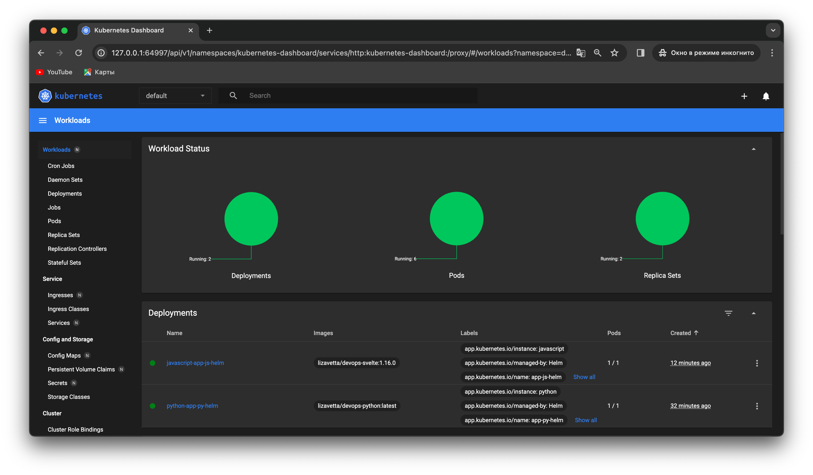

# Helm 
## Chart creation 
### Create helm charts
Python app
```
helm create app-python
```
Go app
```
helm create app-go
```
### Install Helm charts
I've changed default `values.yaml` and `templates/deployment.yaml` files.

Python app:
```
helm install app-python app-python/
```
Output:
```
NAME: app-python
LAST DEPLOYED: Tue Nov  7 19:39:34 2023
NAMESPACE: default
STATUS: deployed
REVISION: 1
NOTES:
1. Get the application URL by running these commands:
  http://python.app/
```
Go app:
``` 
helm install app-go app-go/
```
Output:
```
NAME: app-go
LAST DEPLOYED: Tue Nov  7 20:02:56 2023
NAMESPACE: default
STATUS: deployed
REVISION: 1
NOTES:
1. Get the application URL by running these commands:
  http://go.app/
```
### Checking
````
kubectl get pods,svc     
````
Output:
````

NAME                              READY   STATUS    RESTARTS   AGE
pod/app-go-7848c5bcf9-kbrn5       1/1     Running   0          16s
pod/app-go-7848c5bcf9-tnnnj       1/1     Running   0          16s
pod/app-go-7848c5bcf9-twbtb       1/1     Running   0          16s
pod/app-python-76b869565d-bqd6b   1/1     Running   0          23m
pod/app-python-76b869565d-pfh8z   1/1     Running   0          23m
pod/app-python-76b869565d-txwm6   1/1     Running   0          23m

NAME                 TYPE           CLUSTER-IP      EXTERNAL-IP   PORT(S)          AGE
service/app-go       LoadBalancer   10.96.102.14    <pending>     8081:32199/TCP   16s
service/app-python   LoadBalancer   10.109.206.17   <pending>     8080:30113/TCP   23m
service/kubernetes   ClusterIP      10.96.0.1       <none>        443/TCP          24m
````
### Starting services
````
minikube service --all
````
Output:
````
|-----------|--------|-------------|---------------------------|
| NAMESPACE |  NAME  | TARGET PORT |            URL            |
|-----------|--------|-------------|---------------------------|
| default   | app-go | http/8081   | http://192.168.49.2:32199 |
|-----------|--------|-------------|---------------------------|
|-----------|------------|-------------|---------------------------|
| NAMESPACE |    NAME    | TARGET PORT |            URL            |
|-----------|------------|-------------|---------------------------|
| default   | app-python | http/8080   | http://192.168.49.2:30113 |
|-----------|------------|-------------|---------------------------|
|-----------|------------|-------------|--------------|
| NAMESPACE |    NAME    | TARGET PORT |     URL      |
|-----------|------------|-------------|--------------|
| default   | kubernetes |             | No node port |
|-----------|------------|-------------|--------------|
😿  service default/kubernetes has no node port
🏃  Starting tunnel for service app-go.
🏃  Starting tunnel for service app-python.
🏃  Starting tunnel for service kubernetes.
|-----------|------------|-------------|------------------------|
| NAMESPACE |    NAME    | TARGET PORT |          URL           |
|-----------|------------|-------------|------------------------|
| default   | app-go     |             | http://127.0.0.1:49910 |
| default   | app-python |             | http://127.0.0.1:49916 |
| default   | kubernetes |             | http://127.0.0.1:49922 |
|-----------|------------|-------------|------------------------|
🎉  Opening service default/app-go in default browser...
🎉  Opening service default/app-python in default browser...
🎉  Opening service default/kubernetes in default browser...
❗  Because you are using a Docker driver on darwin, the terminal needs to be open to run it.
````
### Dashboard 


## Chart Hooks 
### Linting 
Python:
````
helm lint app-python/ 
````
Output:
````
==> Linting app-python/
[INFO] Chart.yaml: icon is recommended

1 chart(s) linted, 0 chart(s) failed
````
Go:
````
helm lint app-go/    
````
Output:
````
==> Linting app-go/
[INFO] Chart.yaml: icon is recommended

1 chart(s) linted, 0 chart(s) failed
````
### Pre-install and post-install hooks
I've added `pre-install-hook.yaml` and `post-install-hook.yaml` files to `templates` directory. After reinstalling charts hooks can be verified:
```` 
kubectl get po  
````
Output:
````
NAME                          READY   STATUS      RESTARTS   AGE
app-go-7848c5bcf9-24j7b       1/1     Running     0          2m16s
app-go-7848c5bcf9-6jmb2       1/1     Running     0          2m16s
app-go-7848c5bcf9-q2bm7       1/1     Running     0          2m16s
app-python-76b869565d-2wlxw   1/1     Running     0          77s
app-python-76b869565d-j66m9   1/1     Running     0          77s
app-python-76b869565d-n29hm   1/1     Running     0          77s
go-postinstall-hook           0/1     Completed   0          2m16s
go-preinstall-hook            0/1     Completed   0          2m39s
python-postinstall-hook       0/1     Completed   0          77s
python-preinstall-hook        0/1     Completed   0          99s
````
### Describe pre-install hooks 
Python:
````
kubectl describe po python-preinstall-hook 
````
Output:
````
Name:         python-preinstall-hook
Namespace:    default
Priority:     0
Node:         minikube/192.168.49.2
Start Time:   Tue, 07 Nov 2023 20:48:14 +0300
Labels:       <none>
Annotations:  helm.sh/hook: pre-install
Status:       Succeeded
IP:           10.244.0.132
IPs:
  IP:  10.244.0.132
Containers:
  pre-install-container:
    Container ID:  docker://ba42f1b200a9666df2a7e1708e2ce70c6e21eca1b07418b3aee661e41563551d
    Image:         busybox
    Image ID:      docker-pullable://busybox@sha256:3fbc632167424a6d997e74f52b878d7cc478225cffac6bc977eedfe51c7f4e79
    Port:          <none>
    Host Port:     <none>
    Command:
      sh
      -c
      echo The pre-install hook is running && sleep 20
    State:          Terminated
      Reason:       Completed
      Exit Code:    0
      Started:      Tue, 07 Nov 2023 20:48:14 +0300
      Finished:     Tue, 07 Nov 2023 20:48:34 +0300
    Ready:          False
    Restart Count:  0
    Environment:    <none>
    Mounts:
      /var/run/secrets/kubernetes.io/serviceaccount from kube-api-access-f56b5 (ro)
Conditions:
  Type              Status
  Initialized       True 
  Ready             False 
  ContainersReady   False 
  PodScheduled      True 
Volumes:
  kube-api-access-f56b5:
    Type:                    Projected (a volume that contains injected data from multiple sources)
    TokenExpirationSeconds:  3607
    ConfigMapName:           kube-root-ca.crt
    ConfigMapOptional:       <nil>
    DownwardAPI:             true
QoS Class:                   BestEffort
Node-Selectors:              <none>
Tolerations:                 node.kubernetes.io/not-ready:NoExecute op=Exists for 300s
                             node.kubernetes.io/unreachable:NoExecute op=Exists for 300s
Events:
  Type    Reason     Age    From               Message
  ----    ------     ----   ----               -------
  Normal  Scheduled  2m47s  default-scheduler  Successfully assigned default/python-preinstall-hook to minikube
  Normal  Pulled     2m47s  kubelet            Container image "busybox" already present on machine
  Normal  Created    2m47s  kubelet            Created container pre-install-container
  Normal  Started    2m47s  kubelet            Started container pre-install-container
````

Go:
````
 kubectl describe po go-preinstall-hook
````
Output:
````
Name:         go-preinstall-hook
Namespace:    default
Priority:     0
Node:         minikube/192.168.49.2
Start Time:   Tue, 07 Nov 2023 20:47:14 +0300
Labels:       <none>
Annotations:  helm.sh/hook: pre-install
Status:       Succeeded
IP:           10.244.0.127
IPs:
  IP:  10.244.0.127
Containers:
  pre-install-container:
    Container ID:  docker://93713ebe83f1cb0006782e1b7040927164334674e7d5f563b47ee204b64932b1
    Image:         busybox
    Image ID:      docker-pullable://busybox@sha256:3fbc632167424a6d997e74f52b878d7cc478225cffac6bc977eedfe51c7f4e79
    Port:          <none>
    Host Port:     <none>
    Command:
      sh
      -c
      echo The pre-install hook is running && sleep 20
    State:          Terminated
      Reason:       Completed
      Exit Code:    0
      Started:      Tue, 07 Nov 2023 20:47:15 +0300
      Finished:     Tue, 07 Nov 2023 20:47:35 +0300
    Ready:          False
    Restart Count:  0
    Environment:    <none>
    Mounts:
      /var/run/secrets/kubernetes.io/serviceaccount from kube-api-access-h65xj (ro)
Conditions:
  Type              Status
  Initialized       True 
  Ready             False 
  ContainersReady   False 
  PodScheduled      True 
Volumes:
  kube-api-access-h65xj:
    Type:                    Projected (a volume that contains injected data from multiple sources)
    TokenExpirationSeconds:  3607
    ConfigMapName:           kube-root-ca.crt
    ConfigMapOptional:       <nil>
    DownwardAPI:             true
QoS Class:                   BestEffort
Node-Selectors:              <none>
Tolerations:                 node.kubernetes.io/not-ready:NoExecute op=Exists for 300s
                             node.kubernetes.io/unreachable:NoExecute op=Exists for 300s
Events:
  Type    Reason     Age    From               Message
  ----    ------     ----   ----               -------
  Normal  Scheduled  5m16s  default-scheduler  Successfully assigned default/go-preinstall-hook to minikube
  Normal  Pulled     5m16s  kubelet            Container image "busybox" already present on machine
  Normal  Created    5m16s  kubelet            Created container pre-install-container
  Normal  Started    5m16s  kubelet            Started container pre-install-container
````

### Describe post-install hooks
Python
````
kubectl describe po python-postinstall-hook
````
Output:
````
Name:         python-postinstall-hook
Namespace:    default
Priority:     0
Node:         minikube/192.168.49.2
Start Time:   Tue, 07 Nov 2023 20:48:36 +0300
Labels:       <none>
Annotations:  helm.sh/hook: post-install
Status:       Succeeded
IP:           10.244.0.136
IPs:
  IP:  10.244.0.136
Containers:
  post-install-container:
    Container ID:  docker://745eabd08444d33ad6500cc75f2402b9b682bc806cd87affd2b79cc228a949f4
    Image:         busybox
    Image ID:      docker-pullable://busybox@sha256:3fbc632167424a6d997e74f52b878d7cc478225cffac6bc977eedfe51c7f4e79
    Port:          <none>
    Host Port:     <none>
    Command:
      sh
      -c
      echo The post-install hook is running && sleep 15
    State:          Terminated
      Reason:       Completed
      Exit Code:    0
      Started:      Tue, 07 Nov 2023 20:48:40 +0300
      Finished:     Tue, 07 Nov 2023 20:48:55 +0300
    Ready:          False
    Restart Count:  0
    Environment:    <none>
    Mounts:
      /var/run/secrets/kubernetes.io/serviceaccount from kube-api-access-mzr5q (ro)
Conditions:
  Type              Status
  Initialized       True 
  Ready             False 
  ContainersReady   False 
  PodScheduled      True 
Volumes:
  kube-api-access-mzr5q:
    Type:                    Projected (a volume that contains injected data from multiple sources)
    TokenExpirationSeconds:  3607
    ConfigMapName:           kube-root-ca.crt
    ConfigMapOptional:       <nil>
    DownwardAPI:             true
QoS Class:                   BestEffort
Node-Selectors:              <none>
Tolerations:                 node.kubernetes.io/not-ready:NoExecute op=Exists for 300s
                             node.kubernetes.io/unreachable:NoExecute op=Exists for 300s
Events:
  Type    Reason     Age    From               Message
  ----    ------     ----   ----               -------
  Normal  Scheduled  5m26s  default-scheduler  Successfully assigned default/python-postinstall-hook to minikube
  Normal  Pulling    5m25s  kubelet            Pulling image "busybox"
  Normal  Pulled     5m23s  kubelet            Successfully pulled image "busybox" in 2.096710646s (2.096723965s including waiting)
  Normal  Created    5m22s  kubelet            Created container post-install-container
  Normal  Started    5m22s  kubelet            Started container post-install-container
````

Go:
````
kubectl describe po go-postinstall-hook
````
Output:
````
Name:         go-postinstall-hook
Namespace:    default
Priority:     0
Node:         minikube/192.168.49.2
Start Time:   Tue, 07 Nov 2023 20:47:37 +0300
Labels:       <none>
Annotations:  helm.sh/hook: post-install
Status:       Succeeded
IP:           10.244.0.131
IPs:
  IP:  10.244.0.131
Containers:
  post-install-container:
    Container ID:  docker://6ae6fb55cae47a40626c60aa38313be46dc836b0602b37531f22be10507d9526
    Image:         busybox
    Image ID:      docker-pullable://busybox@sha256:3fbc632167424a6d997e74f52b878d7cc478225cffac6bc977eedfe51c7f4e79
    Port:          <none>
    Host Port:     <none>
    Command:
      sh
      -c
      echo The post-install hook is running && sleep 15
    State:          Terminated
      Reason:       Completed
      Exit Code:    0
      Started:      Tue, 07 Nov 2023 20:47:40 +0300
      Finished:     Tue, 07 Nov 2023 20:47:55 +0300
    Ready:          False
    Restart Count:  0
    Environment:    <none>
    Mounts:
      /var/run/secrets/kubernetes.io/serviceaccount from kube-api-access-h5xvk (ro)
Conditions:
  Type              Status
  Initialized       True 
  Ready             False 
  ContainersReady   False 
  PodScheduled      True 
Volumes:
  kube-api-access-h5xvk:
    Type:                    Projected (a volume that contains injected data from multiple sources)
    TokenExpirationSeconds:  3607
    ConfigMapName:           kube-root-ca.crt
    ConfigMapOptional:       <nil>
    DownwardAPI:             true
QoS Class:                   BestEffort
Node-Selectors:              <none>
Tolerations:                 node.kubernetes.io/not-ready:NoExecute op=Exists for 300s
                             node.kubernetes.io/unreachable:NoExecute op=Exists for 300s
Events:
  Type    Reason     Age    From               Message
  ----    ------     ----   ----               -------
  Normal  Scheduled  7m32s  default-scheduler  Successfully assigned default/go-postinstall-hook to minikube
  Normal  Pulling    7m32s  kubelet            Pulling image "busybox"
  Normal  Pulled     7m30s  kubelet            Successfully pulled image "busybox" in 1.509082646s (1.509091455s including waiting)
  Normal  Created    7m30s  kubelet            Created container post-install-container
  Normal  Started    7m30s  kubelet            Started container post-install-container
````
## Delete hooks policy 
I've added `"helm.sh/hook-delete-policy": hook-succeeded` annotation to `pre-install-hook.yaml` and `post-install-hook.yaml` files.
After reinstalling charts:
````
kubectl get po            
````
Output:
````
NAME                          READY   STATUS    RESTARTS   AGE
app-go-7848c5bcf9-2qjnf       1/1     Running   0          5m14s
app-go-7848c5bcf9-9rmvl       1/1     Running   0          5m14s
app-go-7848c5bcf9-lbldx       1/1     Running   0          5m14s
app-python-76b869565d-2q9tl   1/1     Running   0          8m12s
app-python-76b869565d-7w64n   1/1     Running   0          8m12s
app-python-76b869565d-flp5r   1/1     Running   0          8m12s
````
Pods:
````
kubectl get pods,svc
````
Output:
````
NAME                              READY   STATUS    RESTARTS   AGE
pod/app-go-7848c5bcf9-2qjnf       1/1     Running   0          5m58s
pod/app-go-7848c5bcf9-9rmvl       1/1     Running   0          5m58s
pod/app-go-7848c5bcf9-lbldx       1/1     Running   0          5m58s
pod/app-python-76b869565d-2q9tl   1/1     Running   0          8m56s
pod/app-python-76b869565d-7w64n   1/1     Running   0          8m56s
pod/app-python-76b869565d-flp5r   1/1     Running   0          8m56s

NAME                 TYPE           CLUSTER-IP      EXTERNAL-IP   PORT(S)          AGE
service/app-go       LoadBalancer   10.96.148.5     <pending>     8081:30656/TCP   5m58s
service/app-python   LoadBalancer   10.106.158.28   <pending>     8080:30377/TCP   8m56s
service/kubernetes   ClusterIP      10.96.0.1       <none>        443/TCP          95m
````

## Library chart
* I've created simple library chart for both applications in `library-chart` directory.
* After i've added dependencies to `Chart.yaml` file for both applications:
    ````
    dependencies:
      - name: library-chart
        version: 1.0.0
        repository: file://../library-chart
    ````
* Updating dependencies:
  * Python:
      ```
      helm dependency update app-python/
      ```
    Output:
    ````
    Hang tight while we grab the latest from your chart repositories...
    ...Successfully got an update from the "bitnami" chart repository
    Update Complete. ⎈Happy Helming!⎈
    Saving 1 charts
    Deleting outdated charts
    ````
  * Go:
    ```
    helm dependency update app-go/  
    ```  
    Output:
    ````
    Hang tight while we grab the latest from your chart repositories...
    ...Successfully got an update from the "bitnami" chart repository
    Update Complete. ⎈Happy Helming!⎈
    Saving 1 charts
    Deleting outdated charts
    ````
* Updating labels in `templates/deployment.yaml` for both applications:
  ````
  {{- include "library-chart.labels" . | indent 4 }}
  ````
