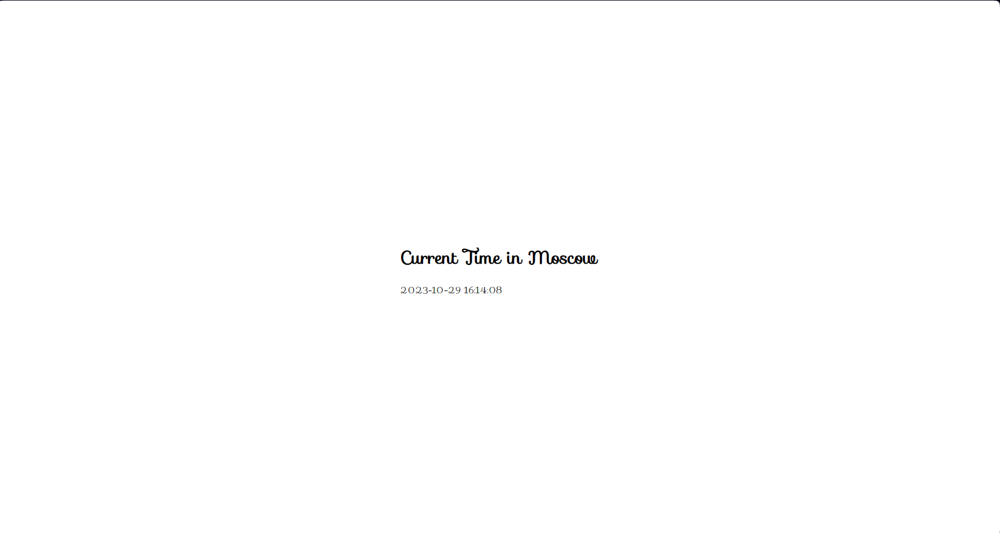

# Kubernetes

## Manual deployment

- ### Deploying applications:
  ```
    >>> kubectl create deployment python-app --image=nikolina2k/ma-repo:latest
    deployment.apps/python-app created

    >>> kubectl create deployment typescript-app --image=nikolina2k/cat-pics:latest
    deployment.apps/typescript-app created
  ```
  ```
    >>> kubectl get deployments
    NAME             READY   UP-TO-DATE   AVAILABLE   AGE
    python-app       1/1     1            1           34s
    typescript-app   0/1     1            0           12s

  ```

- ### Exposing pods using `kubectl expose`
    ```
    >>> kubectl expose deployment python-app --type=LoadBalancer --port 8000
    service/python-app exposed

    >>> kubectl expose deployment typescript-app --type=LoadBalancer --port 8080
    service/typescript-app exposed
    
    >>> kubectl get pods,svc
    NAME                                  READY   STATUS    RESTARTS   AGE
    pod/python-app-55f64f8587-jczx2       1/1     Running   0          8m3s
    pod/typescript-app-6545f6c886-2lxgn   1/1     Running   0          7m41s

    NAME                     TYPE           CLUSTER-IP       EXTERNAL-IP   PORT(S)          AGE
    service/kubernetes       ClusterIP      10.96.0.1        <none>        443/TCP          16m
    service/python-app       LoadBalancer   10.97.160.102    <pending>     8000:31342/TCP   25s
    service/typescript-app   LoadBalancer   10.110.207.243   <pending>     8080:30264/TCP   5s
    ```

    ```
    >>> minikube service --all

    |-----------|------------|-------------|--------------|
    | NAMESPACE |    NAME    | TARGET PORT |     URL      |
    |-----------|------------|-------------|--------------|
    | default   | kubernetes |             | No node port |
    |-----------|------------|-------------|--------------|
    😿  service default/kubernetes has no node port
    |-----------|------------|-------------|---------------------------|
    | NAMESPACE |    NAME    | TARGET PORT |            URL            |
    |-----------|------------|-------------|---------------------------|
    | default   | python-app |        8000 | http://192.168.49.2:31342 |
    |-----------|------------|-------------|---------------------------|
    |-----------|----------------|-------------|---------------------------|
    | NAMESPACE |      NAME      | TARGET PORT |            URL            |
    |-----------|----------------|-------------|---------------------------|
    | default   | typescript-app |        8080 | http://192.168.49.2:30264 |
    |-----------|----------------|-------------|---------------------------|
    🏃  Starting tunnel for service kubernetes.
    🏃  Starting tunnel for service python-app.
    🏃  Starting tunnel for service typescript-app.
    |-----------|----------------|-------------|------------------------|
    | NAMESPACE |      NAME      | TARGET PORT |          URL           |
    |-----------|----------------|-------------|------------------------|
    | default   | kubernetes     |             | http://127.0.0.1:44523 |
    | default   | python-app     |             | http://127.0.0.1:40699 |
    | default   | typescript-app |             | http://127.0.0.1:39739 |
    |-----------|----------------|-------------|------------------------|
    ```

### python app running:



### typescript app running:


- ### Cleanup:
  ```
  >>> kubectl delete svc python-app typescript-app
  service "python-app" deleted
  service "typescript-app" deleted

  >>> kubectl delete deployment --all
  deployment.apps "python-app" deleted
  deployment.apps "typescript-app" deleted
  ```


## Task 2 - declarative kubernetes manifests

- ### Apply manifest to both apps:
  ```
  >>> kubectl apply -f python/deployment.yaml
  deployment.apps/python-app created

  >>> kubectl apply -f python/service.yaml
  service/python-app-service created


  >>> kubectl apply -f typescript/deployment.yaml
  deployment.apps/typescript-app created

  >>> kubectl apply -f typescript/service.yaml
  service/typescript-app-service created
  ```

- ### Running pods and services:
  ```
  >>> kubectl get pods,svc
    NAME                                  READY   STATUS    RESTARTS   AGE
    pod/python-app-fc4cb86cf-592sd        1/1     Running   0          3m4s
    pod/python-app-fc4cb86cf-fvwlm        1/1     Running   0          3m4s
    pod/python-app-fc4cb86cf-z2rbc        1/1     Running   0          3m4s
    pod/typescript-app-7cfd496848-d2829   1/1     Running   0          2m
    pod/typescript-app-7cfd496848-d6cbl   1/1     Running   0          2m
    pod/typescript-app-7cfd496848-rmrpc   1/1     Running   0          2m

    NAME                             TYPE           CLUSTER-IP      EXTERNAL-IP   PORT(S)          AGE
    service/kubernetes               ClusterIP      10.96.0.1       <none>        443/TCP          42m
    service/python-app-service       LoadBalancer   10.110.13.9     <pending>     8000:32469/TCP   2m37s
    service/typescript-app-service   LoadBalancer   10.105.107.29   <pending>     8080:31446/TCP   19s
  ```

- ### Availability:
    ```
    >>> minikube service --all
    |-----------|------------|-------------|--------------|
    | NAMESPACE |    NAME    | TARGET PORT |     URL      |
    |-----------|------------|-------------|--------------|
    | default   | kubernetes |             | No node port |
    |-----------|------------|-------------|--------------|
    😿  service default/kubernetes has no node port
    |-----------|--------------------|-------------|---------------------------|
    | NAMESPACE |        NAME        | TARGET PORT |            URL            |
    |-----------|--------------------|-------------|---------------------------|
    | default   | python-app-service |        8000 | http://192.168.49.2:32469 |
    |-----------|--------------------|-------------|---------------------------|
    |-----------|------------------------|-------------|---------------------------|
    | NAMESPACE |          NAME          | TARGET PORT |            URL            |
    |-----------|------------------------|-------------|---------------------------|
    | default   | typescript-app-service |        8080 | http://192.168.49.2:31446 |
    |-----------|------------------------|-------------|---------------------------|
    🏃  Starting tunnel for service kubernetes.
    🏃  Starting tunnel for service python-app-service.
    🏃  Starting tunnel for service typescript-app-service.
    |-----------|------------------------|-------------|------------------------|
    | NAMESPACE |          NAME          | TARGET PORT |          URL           |
    |-----------|------------------------|-------------|------------------------|
    | default   | kubernetes             |             | http://127.0.0.1:39899 |
    | default   | python-app-service     |             | http://127.0.0.1:35237 |
    | default   | typescript-app-service |             | http://127.0.0.1:40161 |
    |-----------|------------------------|-------------|------------------------|
    ```

## Ingress

- ### Ingress initialization
    ```
    >>> minikube addons enable ingress
    The 'ingress' addon is enabled

    >>> kubectl apply -f python_app/ingress.yaml
    ingress.networking.k8s.io/python-ingress created

    >>> kubectl apply -f typescript_app/ingress.yaml
    ingress.networking.k8s.io/typescript-ingress created
    ```
- ### Show ingress
    ```
    >>> kubectl get ingress
    NAME                 CLASS   HOSTS            ADDRESS   PORTS   AGE
    python-ingress       nginx   python.app                 80      27s
    typescript-ingress   nginx   typescript.app             80      11s
    ```

- ### Check applications:
    Python app
    ```
    >>> curl -i http://python.app
    HTTP/1.1 200 OK
    Date: Sun, 29 Oct 2023 13:53:33 GMT
    Transfer-Encoding: chunked
    Connection: keep-alive
    Cache-Control: max-age=3600
    Expires: Sun, 29 Oct 2023 14:53:33 GMT
    Location: https://python.app/
    Report-To: {"endpoints":[{"url":"https:\/\/a.nel.cloudflare.com\/report\/v3?s=%2BBI%2BbJhzFmuOSPlxqu7aL2RHSYvyDW2v5axysd%2BfFriAFkYW2h2xWVXATykt4PtsYOWJWv2cdkEqIA80FycVP%2BozdYJ2VJ1Mog3zkfoReapHqWMgLbKtRVvwdycp"}],"group":"cf-nel","max_age":604800}     
    NEL: {"success_fraction":0,"report_to":"cf-nel","max_age":604800}
    Server: cloudflare
    CF-RAY: 81dbe7c9b86ebf44-WAW
    alt-svc: h3=":443"; ma=86400
    ```

    Typescript app
    ```
    >>> curl -I http://typescript.app
    HTTP/1.1 200 OK
    Content-Type: text/html; charset=utf-8
    Location: https://typescript.app/
    Date: Sun, 29 Oct 2023 13:55:17 GMT
    Via: 1.1 google
    Transfer-Encoding: chunked
    ```